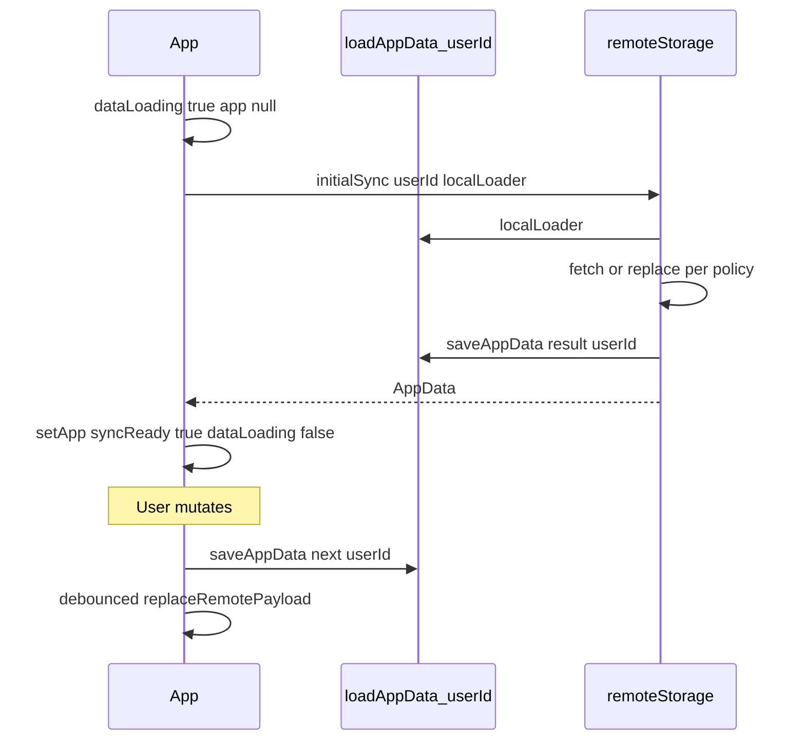

# Phase 4 todo #5: App initial sync and debounced remote persist

## Prerequisites (already done)

- [AuthGate.tsx](src/auth/AuthGate.tsx) passes `userId={session.user.id}`
- [storage.ts](src/core/storage.ts): `loadAppData(userId?)`, `saveAppData(data, userId?)`
- [remoteStorage.ts](src/core/remoteStorage.ts): `isRemoteSyncEnabled`, `fetchRemotePayload`, `replaceRemotePayload`
- [App.tsx](src/App.tsx): still sync `loadAppData()` / `saveAppData()` without `userId`; `void userId`

## Small addition outside App (recommended)

Add **`initialSync`** to [remoteStorage.ts](src/core/remoteStorage.ts) so sync policy lives in one module (matches [phase 4 plan](.cursor/plans/phase_4_supabase_sync_5d537855.plan.md) and keeps [App.tsx](src/App.tsx) thin). Import `AppData`, `saveAppData`, `nowIso` from [storage.ts](src/core/storage.ts) and `defaultPayload` from [state.ts](src/core/state.ts). No circular imports (`storage` does not import `remoteStorage`).

```typescript
function payloadHasData(payload: AppPayload): boolean {
  return (
    payload.skills.length > 0 ||
    payload.sessions.length > 0 ||
    payload.overrides.length > 0
  );
}

export async function initialSync(
  userId: string,
  localLoader: () => AppData
): Promise<AppData> {
  if (!isRemoteSyncEnabled()) {
    return saveAppData(localLoader(), userId);
  }

  const remote = await fetchRemotePayload(userId);
  if (payloadHasData(remote)) {
    return saveAppData(
      { version: 1, updatedAtIso: nowIso(), payload: remote },
      userId
    );
  }

  const local = localLoader();
  if (payloadHasData(local.payload)) {
    await replaceRemotePayload(userId, local.payload);
    return saveAppData(local, userId);
  }

  return saveAppData(
    { version: 1, updatedAtIso: nowIso(), payload: defaultPayload() },
    userId
  );
}
```

**Policy (unchanged from plan):** remote wins if any rows; else upload local if non-empty; else empty default. Always persist result to namespaced cache via `saveAppData(..., userId)`.

---

## Data flow



---

## Exact [App.tsx](src/App.tsx) changes

### 1. Imports

Add `useEffect`, `useRef`, `useCallback` from React.

From `./core/remoteStorage`: `initialSync`, `isRemoteSyncEnabled`, `replaceRemotePayload`, `RemoteStorageError`.

From `./core/dbMappers`: `MapperError` (optional, for safe error text).

Remove `void userId`.

### 2. State and refs

Replace synchronous initializer:

```typescript
// Before
const [app, setApp] = useState<AppData>(() => loadAppData());

// After
const [app, setApp] = useState<AppData | null>(null);
const [dataLoading, setDataLoading] = useState(true);
const [dataError, setDataError] = useState<string | null>(null);
const [syncError, setSyncError] = useState<string | null>(null);
const [syncPending, setSyncPending] = useState(false);

const syncReadyRef = useRef(false);
const debounceTimerRef = useRef<ReturnType<typeof setTimeout> | null>(null);
```

- **`syncReadyRef`**: set `false` before sync; `true` only after `initialSync` succeeds. Prevents debounced/flush remote writes during load or after load failure.
- **`debounceTimerRef`**: holds pending timeout id for cleanup.

Keep existing **`error`** state for **import** failures only (do not overload for cloud errors).

### 3. Initial sync `useEffect`

```typescript
const runInitialSync = useCallback(async () => {
  setDataLoading(true);
  setDataError(null);
  syncReadyRef.current = false;

  try {
    const data = await initialSync(userId, () => loadAppData(userId));
    setApp(data);
    setSyncError(null);
    syncReadyRef.current = true;
  } catch (err) {
    setDataError(cloudSafeMessage(err)); // generic, no userId/payload logging
    setApp(null);
    syncReadyRef.current = false;
  } finally {
    setDataLoading(false);
  }
}, [userId]);

useEffect(() => {
  void runInitialSync();
  return () => {
    syncReadyRef.current = false;
    if (debounceTimerRef.current) clearTimeout(debounceTimerRef.current);
  };
}, [runInitialSync]);
```

On **`userId` change** (account switch): effect re-runs, resets to loading, avoids writing to cloud with stale readiness.

### 4. Debounce without new dependency

Inline debounce via `setTimeout` + ref (no lodash):

```typescript
function scheduleRemotePersist(payload: AppPayload) {
  if (!syncReadyRef.current || !isRemoteSyncEnabled()) return;

  if (debounceTimerRef.current) clearTimeout(debounceTimerRef.current);

  debounceTimerRef.current = setTimeout(() => {
    debounceTimerRef.current = null;
    void persistRemote(payload);
  }, 400);
}

async function persistRemote(payload: AppPayload) {
  setSyncPending(true);
  try {
    await replaceRemotePayload(userId, payload);
    setSyncError(null);
  } catch (err) {
    setSyncError(cloudSafeMessage(err));
  } finally {
    setSyncPending(false);
  }
}
```

`cloudSafeMessage(err)`: return `RemoteStorageError` / `MapperError` `.message`; else fixed string *"Could not save to cloud. Your changes are saved locally."* Never log `err`, `userId`, or payload.

### 5. Avoid saving before initial sync completes

| Guard | Mechanism |
|-------|-----------|
| No `commit` during load | Main shell (header, nav, dashboard, skills) not rendered while `dataLoading` or `dataError` or `app === null` |
| No debounced remote | `scheduleRemotePersist` returns early if `!syncReadyRef.current` |
| No stale `app` in CRUD | Handlers only exist in branch where `app` is non-null; use `const data = app` after guard |

Do **not** call `commit` from anywhere until `syncReadyRef.current === true`.

### 6. `commit` (single mutation path)

```typescript
function commit(next: AppData) {
  if (!syncReadyRef.current) return;

  const saved = saveAppData(next, userId);
  setApp(saved);
  setSyncError(null);
  scheduleRemotePersist(saved.payload);
}
```

All skill/session mutations keep calling `commit(...)` unchanged.

### 7. Save Now

```typescript
async function onSaveNow() {
  if (!app || !syncReadyRef.current) return;
  setError(null);

  const saved = saveAppData(app, userId);
  setApp(saved);
  setSyncError(null);

  if (debounceTimerRef.current) {
    clearTimeout(debounceTimerRef.current);
    debounceTimerRef.current = null;
  }

  if (isRemoteSyncEnabled()) {
    await persistRemote(saved.payload); // immediate flush, not debounced
  }
}
```

- Refreshes local timestamp (same as today).
- **Flushes** cloud save immediately (clears pending debounce) so explicit Save matches user expectation.
- Does not use `commit(app)` to avoid double-scheduling; mirrors commit’s local + remote steps.

### 8. Export Backup

```typescript
function onExport() {
  if (!app) return;
  setError(null);
  const saved = saveAppData(app, userId);
  setApp(saved);
  exportBackup(saved);
}
```

- No remote call (export is local file only).
- Use `userId` on save so cache matches account.
- Do not trigger debounced remote (export is not a mutation of domain data).

### 9. Import Backup

```typescript
async function onPickImportFile(...) {
  if (!syncReadyRef.current) return;
  // existing importBackup + commit(imported)
}
```

- `commit(imported)` → namespaced `saveAppData` + debounced `replaceRemotePayload` (full-state replace).
- Import **blocking** errors stay in `error` banner (invalid JSON/format).
- Cloud failures after import surface via **`syncError`** (non-blocking).

### 10. Loading / error UI (early returns)

Match [AuthGate.tsx](src/auth/AuthGate.tsx) full-viewport centered pattern:

| Condition | UI |
|-----------|-----|
| `dataLoading` | `"Loading your data…"` (blocks entire app) |
| `dataError` | Message + **Retry** button calling `runInitialSync()` |
| `app` ready | Existing shell |

Place early returns **before** the main `return (` with header/nav/main.

### 11. Sync status in header (minimal)

Inside main shell only:

- Subtitle under “Last saved”: when `syncPending`, show *"Saving to cloud…"*
- When `syncError`, show non-blocking banner (reuse `styles.errorBox` or a warning variant): message + **Retry cloud save** button that calls `persistRemote(app.payload)` if `app` is set
- Do not disable dashboard/skills controls on `syncError` (local data is authoritative)

### 12. TypeScript / render guard

After loading gate:

```typescript
if (!app) return null; // defensive

const lastSavedLabel = useMemo(() => formatLocal(app.updatedAtIso), [app.updatedAtIso]);
```

Move `lastSavedLabel` `useMemo` below the guard, or use `app!.updatedAtIso` only after guard (hooks rule: all hooks before early returns—**reorder hooks** so `useMemo` for `lastSavedLabel` runs only when `app` is non-null, or compute label inline in JSX after guard).

**Hook order fix:** keep all `useState`/`useRef`/`useEffect`/`useCallback` at top; for `lastSavedLabel`, either:

- `useMemo(() => (app ? formatLocal(app.updatedAtIso) : ""), [app?.updatedAtIso])`, or
- split inner `AppContent({ app, ... })` child component that receives non-null `app` (optional; only if hook ordering gets messy—prefer simple optional chaining in `useMemo`).

### 13. What NOT to change

- Dashboard / SkillsPage components and props (still `app.payload.*`)
- `exportBackup` / `importBackup` implementations
- AuthGate, storage.ts (unless adding `initialSync` to remoteStorage only)
- No new npm packages

---

## New helpers: file placement

| Helper | Location | Reason |
|--------|----------|--------|
| `initialSync`, `payloadHasData` | [remoteStorage.ts](src/core/remoteStorage.ts) | Sync policy + Supabase |
| `cloudSafeMessage` | Bottom of [App.tsx](src/App.tsx) or `src/core/syncErrors.ts` | Tiny; keep in App unless reused |
| `scheduleRemotePersist` / `persistRemote` | Inside `App` component | Needs state setters + refs |
| Custom hook `useAppSync` | **Skip for v1** | Avoid extra abstraction per PROJECT_RULES |

---

## Validation checklist

**Initial load**

- [ ] Logged-in user sees loading screen, then data (not empty flash of wrong account data)
- [ ] Remote has data → UI matches Supabase; namespaced localStorage updated
- [ ] Remote empty + local (namespaced or legacy) has data → uploads to Supabase; UI shows local data
- [ ] Both empty → empty app
- [ ] `VITE_ENABLE_REMOTE_SYNC=false` → local-only path, namespaced save still works
- [ ] Simulated fetch failure → error screen + Retry; no dashboard until success
- [ ] Refresh while logged in → sync runs again, data restored

**Mutations**

- [ ] Add/edit/delete skill or session saves to `pa.appData.v1.<userId>` immediately
- [ ] Cloud updated after ~400ms debounce when sync enabled
- [ ] Rapid edits coalesce to one remote write
- [ ] No remote calls before initial sync completes

**Save / backup**

- [ ] Save Now updates “Last saved” and pushes cloud immediately (when enabled)
- [ ] Export downloads current in-memory JSON
- [ ] Import replaces UI + local cache + debounced cloud replace
- [ ] Import format error still uses `error` banner only

**Errors**

- [ ] Cloud failure shows `syncError`, local edits retained, Retry cloud save works
- [ ] No `userId`, tokens, or payloads in `console.log`

**Build**

- [ ] `npm test` and `npm run build` pass

---

## Files to touch (implementation)

| File | Change |
|------|--------|
| [src/core/remoteStorage.ts](src/core/remoteStorage.ts) | Add `payloadHasData`, `initialSync` |
| [src/App.tsx](src/App.tsx) | All wiring above (~80–120 lines net) |

Optional follow-up (out of scope): unit tests for `initialSync` with mocked `fetch`/`replace` in `remoteStorage.test.ts`.
