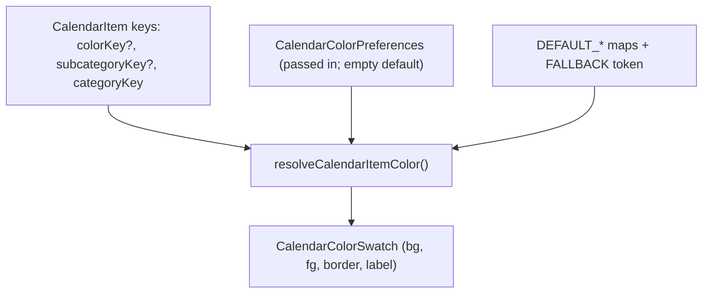

# Phase 19 — Calendar Color and Category Preferences

Pure foundation only (per scope decision). Build [`src/core/calendarColors.ts`](src/core/calendarColors.ts) as a side-effect-free module mirroring the conventions of [`calendar.ts`](src/core/calendar.ts) and [`focusFeedback.ts`](src/core/focusFeedback.ts): no React, no storage, no Supabase, no new dependencies. Document (do not build) the persisted singleton model + schema/migration/sync and the future settings page.

`CalendarItem` is NOT changed — its existing `categoryKey` / `subcategoryKey` / `colorKey` / `iconKey` hooks (from the Phase 18 design in [`docs/architecture.md`](docs/architecture.md)) are sufficient. `colorKey` already serves as the per-item override hook.



## 1. Data model (types, defined in calendarColors.ts)

These types define the shape the future persisted singleton will use; this phase only consumes them in pure functions.

- `CalendarCategoryKey = "skill" | "event" | "people" | "fitness" | "career"` (matches the `CalendarSourceType`/`categoryKey` set).
- Palette identity:
  - `CalendarPaletteHue` (~12 hues: `red`, `orange`, `amber`, `yellow`, `lime`, `green`, `teal`, `cyan`, `blue`, `indigo`, `violet`, `pink`, plus `slate` neutral).
  - `CalendarHueVariant = "soft" | "base" | "strong"` (the "hue variants", not a full picker).
  - `CalendarColorToken = \`${CalendarPaletteHue}.${CalendarHueVariant}\`` (e.g. `"red.base"`).
- `CalendarColorSwatch = { token, hue, variant, label, background, foreground, border }` — `foreground` is an accessible on-color text value chosen per swatch (a11y per PROJECT_RULES).
- Preferences (the future singleton, kept minimal and JSON-serializable):

```typescript
export type CalendarColorPreferences = {
  categories?: Partial<Record<CalendarCategoryKey, CalendarColorToken>>;
  subcategories?: Record<string, CalendarColorToken>; // key = "category:subcategory", e.g. "event:birthday"
  aliases?: Partial<Record<CalendarCategoryKey, string>>; // display label only
  // reserved for the future icon phase (documented, not resolved this phase):
  // categoryIcons?, subcategoryIcons?
};
```

- Resolution input is a structural subset (so the module stays decoupled from `calendar.ts`; `CalendarItem` is assignable to it):

```typescript
export type CalendarColorResolutionInput = {
  categoryKey: string;
  subcategoryKey?: string;
  colorKey?: string;
};
```

## 2. Default palette

- Export `CALENDAR_PALETTE: readonly CalendarColorSwatch[]` and `CALENDAR_PALETTE_BY_TOKEN: ReadonlyMap<CalendarColorToken, CalendarColorSwatch>` (frozen).
- Each hue gets `soft` / `base` / `strong` variants with hand-picked `background` + accessible `foreground` + `border` hex values.
- `FALLBACK_COLOR_TOKEN = "slate.base"` for unknown/unset keys.

## 3. Category / subcategory hierarchy + defaults

- `DEFAULT_CATEGORY_COLOR_TOKENS: Record<CalendarCategoryKey, CalendarColorToken>` — distinct, legible defaults, e.g. `skill → indigo.base`, `event → red.base`, `people → rose? (pink.base)`, `fitness → green.base`, `career → violet.base`.
- `DEFAULT_SUBCATEGORY_COLOR_TOKENS: Record<string, CalendarColorToken>` — sparse; honor the brief with `"event:birthday" → amber.base` (yellow family). Supported keys cover the listed ones (`event:birthday`, `event:hangout`, `event:deadline`, `fitness:push`, `fitness:pull`, `skill:scheduleBlock`); unset subcategories intentionally inherit their category color.
- Subcategory preference/default keys are always composed as `\`${categoryKey}:${subcategoryKey}\`` (since `CalendarItem.subcategoryKey` stores only the suffix per Phase 18).
- The brief's "Red: Skills, Events / Yellow: Birthdays" is exercised as a user-config test fixture for the reuse-labeling feature (section 6), not forced as defaults (distinct defaults are better UX).

## 4. Color resolution algorithm (precedence)

`resolveCalendarItemColorToken(input, prefs?): CalendarColorToken` then `resolveCalendarItemColor(input, prefs?): CalendarColorSwatch` (looks the token up in the palette).

Precedence, each step validated (unknown tokens are ignored and fall through, defensively):

1. **Item override** — `input.colorKey` if it is a valid `CalendarColorToken`.
2. **Subcategory** — `prefs.subcategories["${categoryKey}:${subcategoryKey}"]`, else `DEFAULT_SUBCATEGORY_COLOR_TOKENS[...]`.
3. **Category** — `prefs.categories[categoryKey]`, else `DEFAULT_CATEGORY_COLOR_TOKENS[categoryKey]`.
4. **Fallback** — `FALLBACK_COLOR_TOKEN`.

Pure and total: always returns a swatch; never throws; never mutates `prefs`.

## 5. Display alias strategy

- `resolveCategoryLabel(categoryKey, prefs?): string` → sanitized `prefs.aliases[categoryKey]` if valid, else built-in default label (`DEFAULT_CATEGORY_LABELS`, e.g. `"skill" → "Skills"`).
- `sanitizeCategoryAlias(raw): string | undefined` — trim, collapse whitespace, strip control chars, cap length (~40), return `undefined` when empty (SECURITY_RULES: validate untrusted free-text input; React escapes on render).
- Aliases affect calendar display only and never touch `Page` tab names in [`src/pages/types.ts`](src/pages/types.ts) / [`AppShell`](src/components/layout/AppShell.tsx) — `categoryKey` stays `"skill"`.

## 6. "Color already used by" strategy

- `buildColorUsageIndex(prefs?): Map<CalendarColorToken, CalendarColorUsage[]>` where `CalendarColorUsage = { scope: "category" | "subcategory"; key: string; label: string }`, merging defaults + overrides.
- `describeColorUsage(token, prefs?): string` → e.g. `"Skills, Events"` for a reused token.
- Reuse is allowed (never blocked/deduped); the index simply surfaces every assignment so a future UI can label shared colors.

## 7. Where users configure it later (documented, not built)

Future "Calendar settings" phase:
- Extend `Page` in [`src/pages/types.ts`](src/pages/types.ts) with `"settings"` (or `"calendar"`); add a nav button in [`AppShell`](src/components/layout/AppShell.tsx).
- New presentational `CalendarPreferencesPage` under `src/pages` (palette swatch picker per category/subcategory, alias text inputs, live "used by" labels), props-in/callbacks-out like existing pages.
- `App.tsx` adds a `setCalendarPreferences` handler committing through `commit` (the standard `saveAppData` + debounced remote path).

## 8. Future persistence model (documented now, wired in the next phase)

Singleton object, mirroring the `careerTarget` pattern:
- Add `calendarPreferences?: CalendarColorPreferences` to `AppPayload` in [`model.ts`](src/core/model.ts) (move the type from `calendarColors.ts` to `model.ts` then).
- Supabase: dedicated `calendar_preferences` table, one row per user (`user_id` PK/unique, jsonb `preferences`, `updated_at` trigger), full RLS owner policies — copy the structure of [`20260527500000_focus_feedback.sql`](supabase/migrations/20260527500000_focus_feedback.sql).
- `dbMappers.ts`: add `CalendarPreferencesRow`, `calendarPreferencesToRow` / `fromRow`, deep validation (token allowlist, alias sanitization, key allowlist), and include it in `payloadFromRows` / `validatePayloadForUpload`.
- `remoteStorage.ts`: add `"calendar_preferences"` to `AppTable`, the `fetchRemotePayload` Promise.all, the `replaceRemotePayload` upsert (+ singleton delete), and `payloadHasData`.
- `state.ts` `defaultPayload()` leaves it `undefined`.

## 9. Files to create / change (this phase)

- **Create** [`src/core/calendarColors.ts`](src/core/calendarColors.ts) — types, palette, defaults, resolution, alias + usage helpers.
- **Create** [`src/core/calendarColors.test.ts`](src/core/calendarColors.test.ts).
- **Update** [`docs/architecture.md`](docs/architecture.md) — add a "Calendar color preferences" subsection (pure resolution layer, palette/precedence, deferred persistence singleton + settings page), and add `calendarColors.ts` to the core folder list.
- **No change**: `calendar.ts`, `model.ts`, `dbMappers.ts`, `remoteStorage.ts`, `storage.ts`, `App.tsx`, `state.ts`, `supabase/migrations/*`.

## 10. Future icon support

- `CalendarItem.iconKey` is the per-item icon override hook (already present).
- Reserve `categoryIcons` / `subcategoryIcons` maps in `CalendarColorPreferences` (commented/optional) and document a symmetric `resolveCalendarIconKey(input, prefs)` with identical precedence (item > subcategory > category > none) to be implemented in the icon phase. Not resolved this phase to avoid a speculative icon registry.

## 11. Tests ([`calendarColors.test.ts`](src/core/calendarColors.test.ts))

Vitest, following [`focusFeedback.test.ts`](src/core/focusFeedback.test.ts):
- Precedence: item override wins; subcategory beats category; category beats fallback; empty prefs → defaults; unknown category → fallback.
- Invalid `colorKey` / invalid pref token → ignored, falls through.
- Defaults: `event:birthday → amber.base`; unset subcategory inherits category.
- Alias: valid alias returned; sanitization (trim/whitespace/control-char/length); empty → default label; `categoryKey` never altered.
- Usage index + `describeColorUsage`: red reused by Skills+Events and yellow→Birthdays fixture yields the expected "used by" strings; reuse not blocked.
- Palette integrity: every default/fallback token exists in `CALENDAR_PALETTE_BY_TOKEN`; each swatch has bg+fg+border.
- Purity/immutability: `prefs` object not mutated; functions total (never throw).

## 12. Validation checklist

- [ ] `calendarColors.ts` pure: no React, storage, Supabase, side effects.
- [ ] No new npm dependencies; no migrations this phase.
- [ ] `CalendarItem` shape unchanged; module decoupled via structural input type.
- [ ] All resolvers total (never throw) and return palette-backed swatches.
- [ ] Color tokens allowlisted; aliases sanitized; `prefs` never mutated.
- [ ] Precedence + alias + usage covered by tests.
- [ ] `npm test`, `npm run lint`, `npm run build` pass.
- [ ] [`docs/architecture.md`](docs/architecture.md) updated; persistence + settings page captured as deferred next phase.