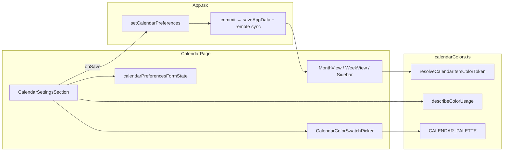

# Phase 31 — Calendar Color Settings UI

## Architecture



**Boundary rules (unchanged):** [`CalendarPage`](src/pages/CalendarPage.tsx) stays presentational—receives `calendarPreferences` + `onSaveCalendarPreferences` callback; no direct `saveAppData` / Supabase calls. Pure resolution stays in [`calendarColors.ts`](src/core/calendarColors.ts).

## 1. Wire persistence in App

Add handler in [`src/App.tsx`](src/App.tsx) mirroring `clearCareerTarget`:

```typescript
function setCalendarPreferences(prefs: CalendarColorPreferences | undefined) {
  if (!app) return;
  const nextPayload = { ...app.payload };
  if (!prefs || isCalendarPreferencesEmpty(prefs)) {
    delete nextPayload.calendarPreferences;
  } else {
    nextPayload.calendarPreferences = parseCalendarColorPreferences(prefs);
  }
  commit({ ...app, payload: nextPayload });
}
```

- Import `parseCalendarColorPreferences` from [`dbMappers.ts`](src/core/dbMappers.ts) (already validates tokens, keys, aliases).
- Pass `onSaveCalendarPreferences={setCalendarPreferences}` to `CalendarPage` only (dashboard preview stays read-only).

`isCalendarPreferencesEmpty` lives in the form-state module: true when all of `categories`, `subcategories`, and `aliases` are absent or empty after normalization.

## 2. Form state module (tested)

**Create** [`src/components/calendar/calendarPreferencesFormState.ts`](src/components/calendar/calendarPreferencesFormState.ts)

| Export | Purpose |
|--------|---------|
| `CALENDAR_SETTINGS_EVENT_SUBCATEGORIES` | `birthday`, `meeting`, `social`, `travel`, `medical`, plus legacy: `hangout`, `trip`, `holiday`, `deadline`, `other` |
| `CALENDAR_SETTINGS_FITNESS_SUBCATEGORIES` | `push`, `pull`, `legs`, `cardio`, `mobility`, `full_body` |
| `CalendarPreferencesFormState` | Per-category `{ colorToken, alias }`; per-subcategory `{ colorToken }` keyed by `"category:suffix"` |
| `calendarPreferencesFormFromPrefs(prefs?)` | Seed form with **effective** values via `resolveCalendarItemColorToken` + `resolveCategoryLabel` / `DEFAULT_SUBCATEGORY_LABELS` |
| `calendarPreferencesPayloadFromForm(form)` | **Sparse** output: omit keys matching built-in defaults; omit aliases matching `DEFAULT_CATEGORY_LABELS`; return `undefined` when nothing overridden |
| `validateCalendarPreferencesForm(form)` | Alias length / empty-after-sanitize checks; tokens validated via `isCalendarColorToken` |
| `isCalendarPreferencesEmpty(prefs)` | Used by App handler on save |

**Create** [`src/components/calendar/calendarPreferencesFormState.test.ts`](src/components/calendar/calendarPreferencesFormState.test.ts) following [`skillScheduleFormState.test.ts`](src/components/skills/skillScheduleFormState.test.ts):
- Round-trip prefs → form → sparse payload
- Default-only form → `undefined`
- Invalid alias → validation error
- Subcategory override preserved for `event:birthday`, `fitness:push`

## 3. UI components

### `CalendarColorSwatchPicker`

**Create** [`src/components/calendar/CalendarColorSwatchPicker.tsx`](src/components/calendar/CalendarColorSwatchPicker.tsx)

- Props: `value: CalendarColorToken`, `onChange`, `usageLabel?: string` (from `describeColorUsage`), `disabled?`
- **Preview swatch** (requirement #8): shows current `getCalendarColorSwatch(value)` with border/foreground sample
- **Usage info** (requirement #7): `"Used by: Skills, Events"` when `describeColorUsage` is non-empty
- Palette: `<fieldset>` of hue groups; each swatch is a `<button type="button">` with `aria-label={swatch.label}`, `aria-pressed` for selection, colors from `CALENDAR_PALETTE` (no free-form hex input)
- Keyboard: native button focus ring via existing styles

### `CalendarSettingsSection`

**Create** [`src/components/calendar/CalendarSettingsSection.tsx`](src/components/calendar/CalendarSettingsSection.tsx)

- Wrapped in `<details>` default **collapsed** so the calendar grid is unchanged at first glance (requirement #10)
- `<summary>` / heading: **Calendar settings**
- **Categories** (`CALENDAR_CATEGORY_KEYS`): one row each with color picker + alias `<input>` (placeholder = default label, e.g. `"Skills"`)
- **Subcategories** grouped under **Events** and **Fitness** only (per requirements #4 + user choice to include legacy event types)
- Live draft prefs: recompute `CalendarColorPreferences` from form on each change so pickers show up-to-date **Used by** labels
- Actions: **Save** (validates → `onSave(payload)`) and **Reset all** (confirm → `onSave(undefined)`)
- Per-row **Reset to default** clears that override in local form state (does not persist until Save)
- Error banner for validation failures; disable Save while invalid

### Styles

Add minimal tokens to [`src/ui/appStyles.ts`](src/ui/appStyles.ts):
- `calendarSettingsSection`, `calendarSettingsRow`, `calendarPaletteGrid`, `calendarPaletteSwatch`, `calendarPaletteSwatchSelected`, `calendarColorPreview` — reuse existing `calendarCategorySwatch` sizing where possible

## 4. Integrate into CalendarPage

**Update** [`src/pages/CalendarPage.tsx`](src/pages/CalendarPage.tsx):

- Extend props: `onSaveCalendarPreferences: (prefs: CalendarColorPreferences | undefined) => void`
- Keep existing local state (`viewMode`, `hiddenCategories`, etc.) untouched
- After the existing calendar card (`styles.card`), add a stacked section:

```tsx
<CalendarSettingsSection
  preferences={calendarPreferences}
  onSave={onSaveCalendarPreferences}
/>
```

- Saved preferences flow immediately to MonthView / WeekView / CalendarCategorySidebar via existing `calendarPreferences` prop (no extra state)

## 5. Extend calendarColors labels (small core change)

**Update** [`src/core/calendarColors.ts`](src/core/calendarColors.ts):

- Expand `DEFAULT_SUBCATEGORY_LABELS` and `SUBCATEGORY_USAGE_ORDER` for all settings keys (requested + legacy event types + fitness variants)
- Fix stale file header comment (“NOT persisted”) — persistence shipped in Phase 20
- Add 1–2 tests in [`calendarColors.test.ts`](src/core/calendarColors.test.ts) for new labels appearing in `describeColorUsage` when subcategory overrides are set

**No changes** to resolution precedence, `CalendarItem`, or `calendar.ts` emission logic.

### Event subcategory note (manual testing)

| Settings key | Applies today? |
|--------------|----------------|
| `event:birthday` | Yes (life events + people birthdays) |
| `event:hangout`, `trip`, `holiday`, `deadline`, `other` | Yes (`subcategoryKey = event.type`) |
| `event:meeting`, `social`, `travel`, `medical` | UI-ready; no `EventType` yet—colors apply when those types are added later |
| `fitness:push/pull/legs/cardio/mobility/full_body` | Yes on completed sessions with `focus` set |
| Category colors | Always apply as fallback |

## 6. Documentation

**Update** [`docs/architecture.md`](docs/architecture.md) Calendar color preferences subsection:
- Settings UI lives inside `CalendarPage` (not a separate nav page)
- `setCalendarPreferences` commit path
- Remove “deferred settings UI” wording

## Files summary

| Action | File |
|--------|------|
| Create | `src/components/calendar/calendarPreferencesFormState.ts` |
| Create | `src/components/calendar/calendarPreferencesFormState.test.ts` |
| Create | `src/components/calendar/CalendarColorSwatchPicker.tsx` |
| Create | `src/components/calendar/CalendarSettingsSection.tsx` |
| Edit | `src/pages/CalendarPage.tsx` |
| Edit | `src/App.tsx` |
| Edit | `src/core/calendarColors.ts` (+ tests) |
| Edit | `src/ui/appStyles.ts` |
| Edit | `docs/architecture.md` |

## Verification

Run in order:
```bash
npm test
npm run lint
npm run build
```

## Manual testing instructions

1. Open **Calendar** tab; expand **Calendar settings** at the bottom.
2. Change **Skills** category color → Save → confirm month/week pills and sidebar swatch update immediately.
3. Set alias **Skills → "Growth"** → Save → sidebar label shows "Growth"; nav tab still says "Skills".
4. Set **Events → Birthdays** subcategory to amber variant → Save → birthday events use new color; category events without birthday type keep event category color.
5. Set **Fitness → Push** color → Save → completed push sessions on calendar reflect color.
6. Pick a color already used elsewhere → picker shows **Used by: …** (e.g. shared red on Skills + Events).
7. **Reset all** → colors/aliases revert to defaults; sidebar returns to built-in labels.
8. Refresh page → preferences persist (localStorage + cloud if sync enabled).
9. Export/import backup → `calendarPreferences` round-trips.
