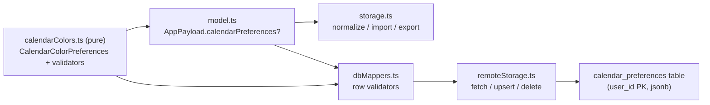

## Phase 20 — Calendar Preferences Persistence

Wire the already-defined `CalendarColorPreferences` shape into persistence, mirroring the `careerTarget` singleton. No UI, no new dependencies, no auth changes, no behavior changes to existing pages. `calendarColors.ts` stays pure.

### Architecture



### 1. Data model ([src/core/model.ts](src/core/model.ts), [src/core/calendarColors.ts](src/core/calendarColors.ts))
- Keep `CalendarColorPreferences` defined in `calendarColors.ts` (its deps `CalendarCategoryKey` / `CalendarColorToken` live there and the module must stay pure). Re-export from `model.ts` so `AppPayload` references it cleanly without creating a logic dependency:

```typescript
export type { CalendarColorPreferences } from "./calendarColors";
```

- Add `calendarPreferences?: CalendarColorPreferences;` to `AppPayload`.

### 2. Local storage ([src/core/storage.ts](src/core/storage.ts), [src/core/state.ts](src/core/state.ts))
- `defaultPayload()` unchanged — leaves `calendarPreferences` undefined.
- In `normalizePayload`, preserve a valid object or drop to undefined (mirror `careerTarget`):

```typescript
calendarPreferences:
  p.calendarPreferences &&
  typeof p.calendarPreferences === "object" &&
  !Array.isArray(p.calendarPreferences)
    ? (p.calendarPreferences as AppPayload["calendarPreferences"])
    : undefined,
```

- The `{ ...base, ...p }` spread + `normalizePayload` in `saveAppData`/`exportBackup`/`importBackup` already make old backups (without the field) load fine (preserves backward compatibility).
- Export `normalizePayload` (currently private) so backward-compat can be unit-tested in the `node` test environment (storage's other fns use browser APIs and are not unit-tested today).

### 3. Supabase migration (new `supabase/migrations/20260527700000_calendar_preferences.sql`)
True singleton keyed by `user_id` (the type has no `id`), following `career_targets` RLS/trigger structure:
- `user_id uuid PRIMARY KEY REFERENCES auth.users (id) ON DELETE CASCADE`
- `preferences jsonb NOT NULL` with `CHECK (jsonb_typeof(preferences) = 'object')`
- `updated_at timestamptz NOT NULL DEFAULT now()` + `set_calendar_preferences_updated_at` trigger
- `ENABLE ROW LEVEL SECURITY`; four owner policies (select/insert/update/delete) `TO authenticated` using `user_id = auth.uid()`
- `REVOKE ALL ... FROM PUBLIC` and `FROM anon`; `GRANT SELECT, INSERT, UPDATE, DELETE ... TO authenticated`

### 4. Mappers ([src/core/dbMappers.ts](src/core/dbMappers.ts))
- Add `CalendarPreferencesRow = { user_id: string; preferences: unknown; updated_at: string }`.
- Import `CALENDAR_CATEGORY_KEYS`, `isCalendarColorToken`, `isCalendarCategoryKey`, `sanitizeCategoryAlias` from `calendarColors.ts`.
- Add `parseCalendarColorPreferences(raw, field)` that validates + returns a canonical object (recommended behaviors below), used by both `fromRow` and `assertValidCalendarPreferences`.
- Add `calendarPreferencesToRow(prefs, userId)` (assert valid, store canonical object) and `calendarPreferencesFromRow(row)` (assert `user_id` UUID + ISO `updated_at`, parse `preferences`).
- Wire into `payloadFromRows` (new trailing `calendarPreferencesRows: CalendarPreferencesRow[] = []` param; build the singleton, take latest by `updated_at` if more than one).
- Wire into `validatePayloadForUpload` (if `payload.calendarPreferences !== undefined`, assert valid).

Recommended validation rules (SECURITY_RULES allowlist + size constraints; reject early):
- `categories`: keys must be in `CALENDAR_CATEGORY_KEYS`; values must satisfy `isCalendarColorToken` — else `MapperError`.
- `subcategories`: keys must be non-empty safe strings of form `"<allowlistedCategory>:<suffix>"` (allowlisted prefix, suffix non-empty, no control chars, length-capped); values must be valid tokens — else `MapperError`.
- `aliases`: keys in `CALENDAR_CATEGORY_KEYS`; non-string value → `MapperError`; string → `sanitizeCategoryAlias`, omit key when result is empty (matches the pure module's "empty = no alias").
- Reject invalid color tokens (do not silently drop) so corruption surfaces.
- Reject unknown top-level fields (anything besides `categories` / `subcategories` / `aliases`) — this rejects the reserved `categoryIcons` / `subcategoryIcons` until the icon phase, per the brief's recommendation.
- Drop empty sub-objects so `toRow`→`fromRow` is canonical/round-trippable.

### 5. Remote storage ([src/core/remoteStorage.ts](src/core/remoteStorage.ts))
- Add `"calendar_preferences"` to the `AppTable` union and imports (`CalendarPreferencesRow`, `calendarPreferencesToRow`).
- `fetchRemotePayload`: add to the `Promise.all` select, `throwOnSupabaseError`, and pass `asRows<CalendarPreferencesRow>(...)` to `payloadFromRows`.
- `replaceRemotePayload`: singleton semantics keyed by `user_id` (diverges from the id-based `upsertRows`/`deleteRowsNotIn` because this table has no `id`):
  - if `payload.calendarPreferences` defined → `upsert([row], { onConflict: "user_id" })`
  - if undefined → `delete().eq("user_id", userId)`
- `payloadHasData`: add `|| payload.calendarPreferences !== undefined`.

### 6. Docs ([docs/architecture.md](docs/architecture.md))
- Update the existing "Calendar color preferences" section: change the "Deferred persistence (next phase)" bullet to "Persisted" — describe the `calendar_preferences` singleton (one row per user, `user_id` PK, jsonb, RLS owner policies, `updated_at` trigger), the mapper validators (token allowlist, key allowlist, alias sanitization, unknown-field rejection), and remote upsert/delete singleton semantics.
- Explicitly state `calendarColors.ts` remains pure (resolution unchanged) and that the calendar/settings UI is still deferred.

### 7. Tests
- [src/core/dbMappers.test.ts](src/core/dbMappers.test.ts): round-trip `calendarPreferencesToRow`→`fromRow`; invalid color token rejected; unknown category key rejected; unknown top-level field rejected; alias sanitized (whitespace/control/length) and empty-alias dropped; `payloadFromRows` builds the singleton; `validatePayloadForUpload` rejects an invalid `calendarPreferences`.
- New `src/core/storage.test.ts` (node env, pure): `normalizePayload` preserves a valid `calendarPreferences`, drops a malformed one to undefined, and loads a legacy payload missing the field (backward compatibility).
- `remoteStorage.ts` is covered by compile/type-check + build (no live Supabase in tests, matching existing approach).

### 8. Singleton semantics summary
- Local: optional field on `AppPayload`; undefined by default; round-trips through `normalizePayload` and backups.
- Remote: at most one row per user (`user_id` PK); defined → upsert, undefined → delete; remote-wins on initial sync via existing `payloadHasData` gate.

### Validation checklist
- [ ] `calendarColors.ts` unchanged behavior and still pure (no storage/Supabase/React imports added).
- [ ] No new npm dependencies; no auth changes; no existing-page behavior changes; no UI/settings page added.
- [ ] `defaultPayload()` leaves `calendarPreferences` undefined; old localStorage/backups still load.
- [ ] Migration: `user_id` PK, `preferences jsonb NOT NULL`, object CHECK, `updated_at` trigger, RLS owner policies, revoke public/anon, grant authenticated.
- [ ] Mapper validators: tokens allowlisted, category/subcategory keys allowlisted, aliases sanitized, unknown fields rejected, invalid tokens rejected.
- [ ] `payloadFromRows` + `validatePayloadForUpload` + `remoteStorage` fetch/upsert/delete/`payloadHasData` wired.
- [ ] `npm test`, `npm run lint`, `npm run build` all pass.
- [ ] `docs/architecture.md` updated (persisted singleton, calendarColors stays pure, UI deferred).