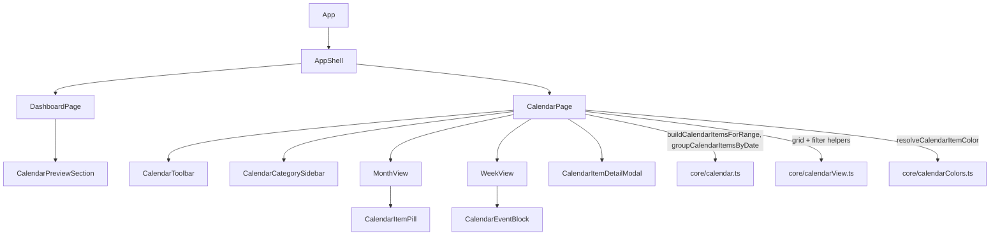

# Phase 21 — Calendar UI Foundation (Read-Only)

## Critical context discovered
- `src/core/calendar.ts` (Phase 18) **does not exist** despite being listed as a foundation. We will recreate it first (per the existing [Phase 18 plan](.cursor/plans/phase_18_calendar_foundation_8ca43661.plan.md)) — pure derivation, no schema/deps.
- `src/core/calendarColors.ts` (`resolveCalendarItemColor`) and `AppPayload.calendarPreferences` already exist; we only **read** prefs (no persistence/schema changes).
- No React Testing Library/jsdom exists. All required tests target **pure helpers** via vitest, matching the repo pattern.
- App is light-theme only (hardcoded colors in [`ui/appStyles.ts`](src/ui/appStyles.ts)). "Dark/light compatible" will be approximated by using palette swatches (which carry WCAG-aware `foreground`) and existing neutral surfaces; a true theme system is out of scope.
- Shell is `maxWidth: 980` ([`ui/appStyles.ts`](src/ui/appStyles.ts)). Calendar page will live inside it, desktop-first, with the sidebar wrapping under the grid on narrow widths.

## Part A — Recreate the calendar foundation (prerequisite)
Create [`src/core/calendar.ts`](src/core/calendar.ts) exactly per the Phase 18 plan: `CalendarItem`, `CalendarSourceType`, `CalendarItemSourceMeta`, `buildCalendarItemsForRange(input, options)`, `groupCalendarItemsByDate`, `sortCalendarItems`, `compareCalendarItems`, `calendarTimeSortTier`, `buildStableCalendarItemId`.
- Collectors: skills (expand `schedule[weekday]` blocks across range), life events (timed-range / start-only / all-day tiers), people birthdays (with leap-year handling + birthday-event dedupe), opt-in fitness history (`includeFitnessHistory` default false, requires `completedAtIso`). Career reserved, emits nothing.
- Reuse only existing exports: `iterateDateRange` / `weekdayFromDateString` / `formatLocalDateKey` ([`timeline.ts`](src/core/timeline.ts)), `parseHHMMToMinutes` / `addMinutesToHHMM` ([`schedule.ts`](src/core/schedule.ts)), `buildPeopleById` / `resolveEventPersonLabel` ([`people.ts`](src/core/people.ts)), `formatWorkoutFocus` / `formatSessionHeadline` ([`fitness.ts`](src/core/fitness.ts)).
- `categoryKey` mirrors `sourceType` so it's assignable to `CalendarColorResolutionInput`; set `subcategoryKey` (event type, workout focus, `"scheduleBlock"`, `"birthday"`).
- Add [`src/core/calendar.test.ts`](src/core/calendar.test.ts) covering the Phase 18 checklist (range, sources, dedupe, sorting, immutability, stable IDs).

## Part B — Pure view + filter helpers (the tested UI logic)
Create [`src/core/calendarView.ts`](src/core/calendarView.ts) (no React) so all view math is unit-testable:
- `type CalendarViewMode = "month" | "week"`.
- `computeMonthVisibleRange(monthAnchorKey)` → `{ startDate, endDate }` from the Sunday before the 1st to the Saturday after month end (6 rows × 7).
- `buildMonthGrid(monthAnchorKey, todayKey)` → `MonthWeek[]` of `MonthDayCell { dateKey, dayNumber, inCurrentMonth, isToday }` (Sunday→Saturday).
- `computeWeekRange(anchorKey)` / `buildWeekGrid(anchorKey, todayKey)` → 7 `WeekDayColumn { dateKey, weekday, label, isToday }` (Sunday→Saturday).
- `filterItemsByHiddenCategories(items, hidden: ReadonlySet<CalendarCategoryKey>)` — render-only filter.
- `splitDayItems(items)` → `{ allDay, timed }`; `computeTimedItemLayout(item)` → `{ topMinutes, durationMinutes }` for week positioning (start-only items get a minimum block height).
- `limitDayItems(items, max)` → `{ visible, overflowCount }` for the month "+N more".
- Navigation: `shiftMonth(monthAnchorKey, delta)`, `shiftWeek(anchorKey, deltaWeeks)`, `monthAnchorFromKey`, label formatters (`formatMonthTitle`, `formatWeekRangeTitle`, `formatHourLabel` for 1am→12am).
Add [`src/core/calendarView.test.ts`](src/core/calendarView.test.ts) covering: month generation (6×7 shape, leading/trailing `inCurrentMonth`, `isToday`), week generation (7 columns, today highlight), filter behavior, item grouping order (via `groupCalendarItemsByDate`), color-resolution integration (`resolveCalendarItemColor` on representative items), and today flagging.

## Part C — Calendar UI components
New folder `src/components/calendar/`:
- `CalendarToolbar.tsx` — Prev/Next/Today buttons, month↔week segmented toggle, current range title.
- `CalendarCategorySidebar.tsx` — toggles for the 5 `CALENDAR_CATEGORY_KEYS` (Skills/Events/People/Fitness/Career) using `resolveCategoryLabel` + swatch color; hidden categories rendered dimmed (`opacity`), toggle only affects rendering.
- `MonthView.tsx` — 7-col CSS grid header (Sun→Sat) + week rows; each cell shows day number, today highlight, compact pills (`CalendarItemPill`), and `+N more`.
- `WeekView.tsx` — all-day row across 7 columns + a 24-row hour timeline (1am→12am), absolutely-positioned timed blocks via `computeTimedItemLayout`, current-time indicator line, current-day column highlight.
- `CalendarItemPill.tsx` (month) and `CalendarEventBlock.tsx` (week) — show title, optional time, palette color (`resolveCalendarItemColor`), `onClick` to open detail.
- `CalendarItemDetailModal.tsx` — lightweight read-only overlay (title, source type label, date, time, description), Escape/overlay-click close, focus-trap-lite, `role="dialog"` + `aria-modal`.

New page [`src/pages/CalendarPage.tsx`](src/pages/CalendarPage.tsx):
- Props: `skills`, `events`, `people`, `workoutSessions`, `workoutPlans`, `calendarPreferences?`.
- Local state only (no persistence): `viewMode` (default `"month"`), current anchor date, `hiddenCategories: Set`, selected item for modal.
- `useMemo` → `buildCalendarItemsForRange` for the active range, then `filterItemsByHiddenCategories`, then `groupCalendarItemsByDate`; pass prefs into color resolution.

## Part D — Navigation + dashboard wiring
- [`src/pages/types.ts`](src/pages/types.ts): add `"calendar"` to `Page`.
- [`AppShell.tsx`](src/components/layout/AppShell.tsx): add a Calendar `NavButton` (placed after Dashboard).
- [`App.tsx`](src/App.tsx): render `<CalendarPage … />` when `page === "calendar"`, passing payload slices + `app.payload.calendarPreferences`; pass `onOpenCalendar={() => setPage("calendar")}` into `DashboardPage`.
- New [`src/components/dashboard/CalendarPreviewSection.tsx`](src/components/dashboard/CalendarPreviewSection.tsx): next-7-days compact grouped preview (built from `buildCalendarItemsForRange` over today→+6) + "Open Calendar" button. Add to [`DashboardPage.tsx`](src/pages/DashboardPage.tsx) without replacing existing sections, with a new optional `onOpenCalendar` prop.
- Add a small set of calendar layout styles to [`ui/appStyles.ts`](src/ui/appStyles.ts) (grid, day cell, hour row, all-day row, modal overlay) — reusing existing tokens/spacing.

## Component hierarchy

## Future extension points (documented, not built)
- **Recurrence**: `calendar.ts` gains a pure `expandRecurrenceInstances(range)` step before sorting; views need no change since they consume `CalendarItem[]`.
- **Editing/DnD**: views currently take no mutation callbacks; add `onCreate`/`onMove`/`onResize` + drag handlers later; `App.tsx` would add CRUD via the standard `commit` path.
- **Preferences UI**: the deferred `CalendarPreferencesPage` would write `calendarPreferences`; this phase only reads it.
- **Persisted view mode**: currently local-only; later store in `calendarPreferences` or local UI state.

## Constraints honored
No recurrence engine, no DnD, no editing, no settings page, no persistence/schema changes, no new dependencies. `timeline.ts` and existing pages remain unchanged except the additive nav/dashboard wiring.

## Validation
Run `npm test`, `npm run lint`, `npm run build`. Update [`docs/architecture.md`](docs/architecture.md): mark `calendar.ts` as actually present, add `calendarView.ts`, the Calendar page/nav, and `CalendarPreviewSection`.