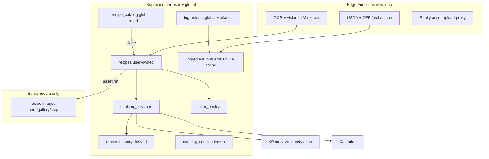

# Cooking System: Architecture, Vision & Phased Roadmap

This is a planning-only deliverable. On approval I will create the document set under `docs/cooking/` (listed at the end). No application code, migrations, or Sanity wiring will be written during planning. The roadmap is written so future Cursor sessions can execute phase-by-phase without losing the original vision.

## 1. How Cooking fits the existing architecture

The app is a React 19 + Vite SPA with centralized state in [src/App.tsx](src/App.tsx), no router (a `Page` union in [src/pages/types.ts](src/pages/types.ts) + nav in [src/components/layout/AppShell.tsx](src/components/layout/AppShell.tsx)), inline styles in [src/ui/appStyles.ts](src/ui/appStyles.ts), Supabase-only persistence via [src/core/remoteStorage.ts](src/core/remoteStorage.ts) + [src/core/dbMappers.ts](src/core/dbMappers.ts), and Vitest tests co-located as `src/**/*.test.ts`. Gamification is derived (never persisted) in [src/core/progressionSnapshot.ts](src/core/progressionSnapshot.ts).

Cooking will mirror the Fitness domain (plan/template + logged session) end to end: domain types in [src/core/model.ts](src/core/model.ts), pure logic in `src/core/cooking*.ts`, Supabase tables + RLS, mappers, CRUD in `App.tsx`, a `CookingPage`, a dashboard section, calendar collector, and progression hooks.

## 2. Key recommendations / decisions to lock in

- Progression axis (your A vs B question): Recommend B+ — do NOT add a 6th RPG axis. Route Cooking XP primarily to the existing-but-unused `creative` axis (it has zero XP sources today, per [src/core/rewardCalculation.ts](src/core/rewardCalculation.ts)), with a smaller secondary grant to `body` for home-cooked meals (rewards cooking-at-home vs eating out and ties to nutrition/health). Rationale: the `ProgressionAxis` union is consumed across ~10 files + a 5-axis UI grid; a 6th axis is high blast-radius for little benefit, and `creative`+`body` is semantically honest.
- Recipe-level mastery: Add a new progression track namespace `recipe:{id}` (alongside existing `skill:{id}`) so each recipe has its own XP/level, plus a separate count-based mastery tier for the badge.
- XP rules (hard constraints): Creating/adding a recipe grants 0 XP. Only a completed `cooking_session` grants XP. First-ever completion of a recipe = large "first cook" bonus; repeats grant diminishing-but-never-zero XP (floor enforced). Crossing a mastery tier grants a one-time bonus.
- Mastery tiers (refine your proposal): keep count-based (mastery = familiarity through repetition) with named badges. Recommend 6 tiers so the first cook feels meaningful: Novice (1-2), Practiced (3-9), Proficient (10-24), Skilled (25-49), Expert (50-99), Master (100+). Display mastery badge + completion count + recent-cook streak (consecutive distinct cook-days/weeks).
- Calendar: Add a new `CalendarCategoryKey` value `"cooking"` (not just a new `EventType`), following the Fitness/Career pattern in [src/core/calendar.ts](src/core/calendar.ts) and [src/core/calendarColors.ts](src/core/calendarColors.ts). Planned cooks and completed sessions become calendar items via a new collector.
- Sanity vs Supabase (reconciling your two answers): Sanity stores media assets only (hero/gallery/step images) for both curated and user recipes, acting as the image CDN/transform layer. All recipe text/ingredients/steps/logs/nutrition live in Supabase. The curated global catalog's text content lives in a global Supabase table `recipe_catalog` (no `user_id`, RLS = read-all-authenticated, writes via seed/admin), with image fields holding Sanity asset references. Users clone catalog recipes into their private `recipes`.
- New backend infra required: OCR/vision extraction, USDA fetching, and Sanity asset uploads all need server-side secrets. Recommend Supabase Edge Functions (Supabase is already in use). This is a real new dependency, isolated to Phases 8-10.
- Notifications: start with the existing in-app pattern (Daily Focus items in [src/core/focus.ts](src/core/focus.ts) + toasts). Real push / Web Notifications (timer-done while backgrounded) is a later phase requiring a service worker (none exists today).

## 3. Workflow & timer models (summaries; full detail in docs)

- Step workflow model: each recipe step has `kind` = `blocking | parallel | wait | timer`, a `blocksProgress` flag, and an optional `timer {durationMs, label}`. Guided mode lets a `wait`/`parallel` step's timer run while the user advances. Recommend ordered steps + per-step timer + `canRunInBackground` flag for v1 (avoid a full DAG as over-engineering).
- Timer persistence (survives refresh + device change): store timers as absolute timestamps (`endsAt` ISO), never countdown counters; remaining = `endsAt - now`. Pause stores `remainingMs`. Active `cooking_session` (status `in_progress`, current step index, timers array) is persisted to Supabase (cross-device source of truth) + localStorage (instant/offline), rehydrated on load. Pure reducers in `src/core/cookingSession.ts` for testability.

## 4. Ingredient + nutrition architecture (summaries)

- Normalized ingredients: global `ingredients` (canonical name, category, default unit, density g/ml, `fdc_id`) + `ingredient_aliases` (alias/misspelling -> ingredient). Matching: normalize text -> exact alias -> fuzzy via Postgres `pg_trgm` -> confidence score. Recipe lines store raw text + resolved `ingredient_id` + confidence. Handles "tortilla"/"flour tortilla", "bell pepper"/"green bell pepper", misspellings, aliases.
- Pantry / can-make-now: `user_pantry (ingredient_id, available/quantity)`; recipe availability computed = can make now / partial / missing.
- Nutrition: USDA FoodData Central authoritative; store `fdc_id`; cache per-ingredient per-100g values in `ingredient_nutrients` (never import whole DB). Gram conversion via unit + density. Compute per-recipe and per-serving; apply USDA retention factors per cooking method; aggregate confidence score. `custom_ingredients` (per-user) and Open Food Facts as optional secondary `source`.

## 5. Assisted import (OCR) architecture (summary)

Capture image or pasted text -> (OCR only if image) -> multimodal LLM structured extraction (OpenAI vision + JSON schema/structured outputs) returning `{title, ingredients[], steps[], cookTime, servings, equipment, notes}` -> per-line ingredient matching with confidence -> draft recipe with per-field confidence flags -> mandatory user review/edit -> save. API keys live only in an Edge Function. Import only ever drafts; the user must confirm.

## 6. Phased roadmap (small, independently shippable, dependency-ordered)

Each phase has Goal / Acceptance / Tests / Depends-on. Phases 1-6 deliver a fully usable cooking domain; 7+ layer on intelligence.

- Phase 1 — Recipe data model + manual recipes + Cooking page shell
  - Goal: `Recipe` type + per-user `recipes` table (RLS), manual create/edit, recipe gallery list, recipe detail view (no images, no XP), `cooking` nav page.
  - Acceptance: user can create/edit/delete a recipe with title, category, difficulty, experience level, cook time, servings, ingredients (raw text), steps, equipment, notes; data round-trips through Supabase; gallery + detail render.
  - Tests: `cooking.test.ts` (helpers/filters), dbMappers round-trip, recipe form-state test.
  - Depends on: none.

- Phase 2 — Cooking sessions, completion flow, XP + mastery
  - Goal: `CookingSession` log + completion prompt ("Did you cook this? start/finish times" defaulting to estimated duration), XP grants to `creative` (+ secondary `body`), `recipe:{id}` track, count-based mastery tiers + badges, basic dashboard `CookingSummarySection`.
  - Acceptance: completing a session grants XP (first-cook bonus vs diminishing repeats vs tier-up bonus), mastery badge/count/streak display correctly; adding a recipe grants 0 XP; dashboard shows recent cooks.
  - Tests: reward calculation (first vs repeat vs floor vs tier-up), mastery tier derivation, progression snapshot integration.
  - Depends on: Phase 1.

- Phase 3 — Sanity media infrastructure + recipe images
  - Goal: introduce Sanity (client, image-url, env vars, asset-upload Edge Function), hero image + gallery on recipes, thumbnails in gallery.
  - Acceptance: user uploads image; stored in Sanity; referenced from Supabase recipe; thumbnail + hero render with transforms; works with `VITE_*` env absent (graceful no-image fallback).
  - Tests: asset-reference mapper, image-url builder unit tests, upload function contract test (mocked).
  - Depends on: Phase 1.

- Phase 4 — Calendar integration
  - Goal: new `cooking` `CalendarCategoryKey`, planned cooking events (reference recipe, est. duration, ingredients) + completed sessions as historical items, color default + sidebar filter.
  - Acceptance: planned and completed cooks appear on calendar/timeline with correct color and filter toggle; completion creates a historical item.
  - Tests: calendar collector unit tests (planned vs historical), color resolution.
  - Depends on: Phases 1-2.

- Phase 5 — Recipe gallery polish (filter/sort/categories)
  - Goal: filtering + sorting by category (Breakfast/Lunch/Dinner/Dessert/Snack/Beverage/Meal Prep), difficulty, experience level, cook time, mastery; richer cards.
  - Acceptance: filters/sorts compose correctly and are covered by pure-function tests.
  - Tests: filter/sort pure functions.
  - Depends on: Phases 1-3.

- Phase 6 — Guided cooking mode + multi-timer engine
  - Goal: step-by-step execution (next/back, progress bar), step workflow model (blocking/parallel/wait/timer), multiple concurrent timers with pause/resume/restart, persistence across refresh + device via absolute timestamps + Supabase active session.
  - Acceptance: timers survive refresh and resume on another device; parallel/wait steps don't block advancing; timer-done raises an in-app alert.
  - Tests: cookingSession reducer tests (start/advance/pause/resume/restart, rehydrate, cross-device merge), timer remaining-time math.
  - Depends on: Phases 1-2.

- Phase 7 — Ingredient normalization + pantry ("can make now")
  - Goal: global `ingredients` + `ingredient_aliases`, `pg_trgm` matching with confidence, `user_pantry`, availability badges (can make / partial / missing).
  - Acceptance: known aliases/misspellings resolve with sensible confidence; recipe availability computed against pantry.
  - Tests: normalization + matching + confidence tests; availability computation tests.
  - Depends on: Phase 1.

- Phase 8 — Nutrition system (USDA)
  - Goal: `fdc_id` on ingredients, `ingredient_nutrients` cache, gram conversion + density, per-recipe + per-serving nutrition, retention factors, confidence scoring, `custom_ingredients`, optional Open Food Facts source; USDA fetch via Edge Function.
  - Acceptance: a recipe with resolved ingredients shows per-serving macros with a confidence indicator; custom ingredients supported; USDA results cached (no full-DB import).
  - Tests: gram conversion, nutrient aggregation, retention application, confidence scoring; cache function contract (mocked).
  - Depends on: Phase 7.

- Phase 9 — Assisted import (OCR / paste / vision extraction)
  - Goal: camera/upload OCR + paste-text -> LLM structured extraction -> ingredient matching -> draft with confidence -> mandatory review/edit; OpenAI via Edge Function.
  - Acceptance: importing a photo/text drafts a structured recipe; low-confidence fields flagged; nothing saves without user confirmation.
  - Tests: extraction-output validation/parsing, draft mapping, confidence flagging (LLM call mocked).
  - Depends on: Phases 1, 7 (matching), 3 (image handling).

- Phase 10 — Curated global catalog
  - Goal: global `recipe_catalog` (read-all-authenticated) seeded with starter recipes (images in Sanity), browse + clone-to-personal.
  - Acceptance: users browse curated recipes and clone into their private library; cloning copies content + image refs.
  - Tests: clone mapper, catalog read access (RLS) test.
  - Depends on: Phases 1, 3.

- Phase 11 — Real notifications (timers + scheduled cooks)
  - Goal: service worker + Web Notifications for timer-done and "time to start cooking"; permission flow; falls back to in-app focus items.
  - Acceptance: a finished timer notifies even when tab is backgrounded (where supported); graceful fallback otherwise.
  - Tests: scheduling logic unit tests; permission-state handling.
  - Depends on: Phase 6.

- Phase 12 — Analytics, weekly review, AI opportunities
  - Goal: `CookingWeekSection` in [src/core/review.ts](src/core/review.ts), cooking achievements/quests, and AI roadmap (meal suggestions from pantry, auto meal-planning, smart substitutions, nutrition coaching).
  - Acceptance: weekly review surfaces cooking wins/risks; cooking achievements unlock; AI doc enumerates concrete, dependency-mapped opportunities.
  - Tests: week-section builder, achievement condition evaluation.
  - Depends on: Phases 2, 7, 8.

## 7. Schema highlights (full DDL in the Supabase doc)

Following repo conventions (snake_case, uuid PK via `extensions.gen_random_uuid()`, `user_id` FK to `auth.users` + 4-policy RLS, CHECK constraints not enums, jsonb for nested, `updated_at` triggers):
- Per-user: `recipes`, `cooking_sessions`, `user_pantry`, `custom_ingredients`, `cooking_preferences` (singleton).
- Global (no user_id, read-all-authenticated): `recipe_catalog`, `ingredients`, `ingredient_aliases`, `ingredient_nutrients`, `retention_factors`.
- jsonb sub-structures: recipe `ingredients[]` (raw + resolved ref + confidence), `steps[]` (kind/timer/blocks), `equipment[]`, session `timers[]`.
- New extension: `pg_trgm` for fuzzy ingredient matching.
- `AppPayload` extended with cooking arrays; `remoteStorage.ts` fetch/replace + `AppTable` union updated.

## 8. Risks & dependencies (full detail in risks doc)

- Backend secrets: OCR/USDA/Sanity-upload need Edge Functions (new infra, new failure modes). Isolated to Phases 8-10.
- Sanity is greenfield (only referenced in [docs/decisions.md](docs/decisions.md), not wired). Adds deps + env + studio.
- Progression blast radius: prefer reusing `creative`+`body` over a 6th axis to avoid touching the 5-axis UI grid and many type maps.
- LLM extraction accuracy/cost: mitigate with mandatory review, confidence scoring, validation.
- USDA/OFF licensing + rate limits: cache aggressively, store only used records.
- Cross-device timer correctness: absolute timestamps + Supabase as source of truth; reconcile on rehydrate.

## 9. Deliverable documents to create on approval (under docs/cooking/)

These are the only artifacts this work produces (no implementation):
- `docs/cooking/README.md` — index + how to use the roadmap
- `docs/cooking/00-vision.md` — Cooking Vision Document
- `docs/cooking/01-architecture.md` — Cooking Architecture Document
- `docs/cooking/02-roadmap.md` — phases, milestones, acceptance criteria, dependencies
- `docs/cooking/03-progression-design.md` — axis decision, mastery, XP curves
- `docs/cooking/04-supabase-schema.md` — full table/RLS proposal
- `docs/cooking/05-sanity-schema.md` — media/asset model + integration
- `docs/cooking/06-calendar-integration.md`
- `docs/cooking/07-nutrition-architecture.md` — USDA/OFF, conversions, retention, confidence
- `docs/cooking/08-ocr-import-architecture.md`
- `docs/cooking/09-guided-cooking-architecture.md` — workflow + timer persistence
- `docs/cooking/10-data-models.md` — TypeScript domain types
- `docs/cooking/11-integration-points.md` — exact files/functions per existing system
- `docs/cooking/12-risks-dependencies.md`
- `docs/cooking/13-future-ai.md`