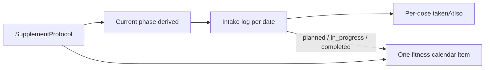

# Fitness Supplement Tracker (Phases 47–51)

A **fitness track** that can run in parallel with Aether 37E / Notifications 38. Number it **47–51** so it does not collide with live-workout 42–46, cooking, or AI 40–41.

Follow [PROJECT_RULES.md](PROJECT_RULES.md) and [docs/plans/roadmap.md](docs/plans/roadmap.md) §6: **pure helpers + tests first**, presentational UI, [`App.tsx`](src/App.tsx) orchestration-only, **no new npm dependencies**, backward-compatible optional fields, Aether tokens for new UI. Update [`docs/architecture.md`](docs/architecture.md) + [`docs/plans/roadmap.md`](docs/plans/roadmap.md) when a phase ships.

This is an **implementation plan**, not a docs-only pass. Do not add a nav tab, a new `CalendarCategoryKey`, or a new `EventType`.

## Locked decisions

- **Home:** Fitness page section + existing `fitness` calendar category. Mirror Event types with a new `FitnessType` filter axis (`workout | supplement | nutrition`). Reserve `nutrition`; do not emit calorie items. Cooking stays a separate future domain; a calorie surface later should *read* cooking + supplements, not start a third food log.
- **Entities:** New `SupplementProtocol` (template) + `SupplementIntakeLog` (one row per protocol per local date). **Do not reuse** [`WorkoutPlan`](src/core/model.ts) / [`WorkoutSession`](src/core/model.ts).
- **Phases:** Loading vs maintenance are date-bounded protocol phases. **Current phase is derived** from `today` — do not persist `status: "loading"`.
- **Taps:** Same live-workout rule — first dose tap **upserts** the day log; opening Fitness does not persist. Toggle `takenAtIso` on a dose slot.
- **Calendar v1:** **One item per protocol per due day** (not per dose), all-day unless we later add timed dose blocks. Reuse `completionVisual` + `progressLabel` (`"2/4"`).
- **XP:** Creating a protocol = 0. Full adherence day = small `body` grant. **Not per dose** (4× creatine must not out-grind a workout). Partial day = 0.
- **Out of scope for all five phases:** supplement catalog, barcodes, medical claims, inventory, push notifications, nutrient totals, timed-per-dose calendar blocks, skip-remaining-today.



## Phase 47 — Model + persistence

**Goal:** Types, pure helpers, Supabase, mappers. No Fitness UI yet.

### Domain ([`src/core/model.ts`](src/core/model.ts))

```ts
export type FitnessType = "workout" | "supplement" | "nutrition";

export type SupplementForm = "powder" | "capsule" | "liquid" | "other";
export type SupplementUnit = "g" | "mg" | "mcg" | "iu" | "scoop" | "capsule" | "drop";
export type SupplementPhaseKind = "loading" | "maintenance" | "custom";

export type SupplementPhase = {
  id: string;
  name?: string;
  kind: SupplementPhaseKind;
  startDate: string;       // YYYY-MM-DD
  endDate?: string;        // omit = open-ended
  dosesPerDay: number;     // 1–6
  amountPerDose: number;
  times?: string[];        // HH:MM, length === dosesPerDay when set
  weekdays?: Weekday[];    // omit = every day
};

export type SupplementProtocol = {
  id: string;
  name: string;
  form?: SupplementForm;
  unit: SupplementUnit;
  notes?: string;
  active: boolean;
  phases: SupplementPhase[];
  createdAtIso: string;
  updatedAtIso: string;
};

export type SupplementDoseSlot = {
  id: string;
  slotIndex: number;
  amount: number;
  plannedTime?: string;
  takenAtIso?: string;
};

export type SupplementIntakeLog = {
  id: string;
  protocolId: string;
  date: string;
  doses: SupplementDoseSlot[];
  notes?: string;
  createdAtIso: string;
  updatedAtIso: string;
};
```

Add `supplementProtocols` and `supplementIntakeLogs` to `AppPayload`. Default to `[]` in [`state.ts`](src/core/state.ts) and [`storage.ts`](src/core/storage.ts) `normalizePayload` (missing = empty, like workouts).

Creatine v1 is **two phases on one protocol**, not two protocols: loading `5g × 4` with `startDate` + `endDate` (or `durationDays` resolved to dates at save time), then open-ended maintenance `5g × 1`. Simple default form: one `maintenance` phase, 1 dose/day, no times, no loading.

### Pure module [`src/core/supplements.ts`](src/core/supplements.ts) + [`src/core/supplements.test.ts`](src/core/supplements.test.ts)

- `resolvePhaseForDate(protocol, dateKey)`
- `isProtocolDueOnDate` (active + phase exists + weekday filter)
- `buildDoseSlotsFromPhase(phase)` — template slots for a new day log
- `createIntakeDraft` / `upsertToggleDose(log, slotId, takenAtIso | null)`
- `intakeProgress(log)` → `{ taken, planned, complete }`
- `adherenceForRange` for later review/XP
- Unique day key: `(protocolId, date)` — tests cover loading→maintenance flip on `endDate + 1`

### Persistence

New migration (follow [`supabase/migrations/20260527400000_fitness.sql`](supabase/migrations/20260527400000_fitness.sql)):

- `supplement_protocols`: `name`, `form`, `unit`, `notes`, `active`, `phases jsonb`, timestamps, 4-policy RLS, CHECKs for unit/form allowlists and `jsonb_typeof(phases) = 'array'`
- `supplement_intake_logs`: `protocol_id`, `intake_date`, `doses jsonb`, `UNIQUE (user_id, protocol_id, intake_date)`

[`dbMappers.ts`](src/core/dbMappers.ts): strict parsers for phases/doses (same style as `workoutPlanToRow` / exercise jsonb). [`remoteStorage.ts`](src/core/remoteStorage.ts): add both tables to `AppTable`, fetch, upsert, `deleteRowsNotIn`.

Empty-array tests in `dbMappers.test.ts` / `storage.test.ts` fixtures that construct full `AppPayload`.

## Phase 48 — Fitness UI + quick taps

**Goal:** Usable tracker on Fitness + dashboard. No calendar yet.

- [`FitnessPage.tsx`](src/pages/FitnessPage.tsx): section switcher **Workouts | Supplements**. Workouts unchanged.
- Protocol form (new files under [`src/components/fitness/`](src/components/fitness/)): name, unit, amount, doses/day, optional loading block (days + amount × doses) then maintenance. Save resolves loading `endDate` and maintenance `startDate`.
- **Today’s supplements** rail: one row per due protocol; phase chip (`Loading · day 3/7`); N tap buttons (`aria-pressed`); amount label `5 g × 4`. First tap calls `onUpsertIntake`.
- [`FitnessSummarySection.tsx`](src/components/dashboard/FitnessSummarySection.tsx): same taps for today’s due protocols.
- [`App.tsx`](src/App.tsx): `add/update/delete` protocol; `upsertSupplementIntake` mirroring [`upsertWorkoutSession`](src/App.tsx) (create vs replace by id; unique day enforced in the helper). Deleting a protocol should drop or detach its logs (prefer delete logs — simpler).
- Extend [`FitnessFocus`](src/core/fitness.ts) to a discriminated union so dashboard **Open in Fitness** can target a supplement row:

```ts
export type FitnessFocus =
  | { kind: "workout"; date: string; planId: string }
  | { kind: "supplement"; date: string; protocolId: string };
```

Keep backward compat at the `openFitness` call site: existing `{ date, planId }` becomes `{ kind: "workout", ... }`.

New UI uses `--aether-*` via [`appStyles.ts`](src/ui/appStyles.ts). Form-state helpers + validation tests, same pattern as [`workoutPlanFormState.ts`](src/components/fitness/workoutPlanFormState.ts).

**Acceptance:** Add creatine with 7-day 4× loading then 1× maintenance; after day 7 the rail shows one button; taps survive refresh/sync.

## Phase 49 — Calendar + Fitness type filters

**Goal:** Supplements appear under Fitness; sidebar can hide workouts vs supplements independently.

Today fitness `subcategoryKey` is `WorkoutFocus` on completed sessions and `"scheduled"` on planned blocks ([`collectFitnessItems`](src/core/calendar.ts) / [`collectWorkoutScheduleItems`](src/core/calendar.ts)). Sidebar only filters **event** types ([`CalendarCategorySidebar.tsx`](src/components/calendar/CalendarCategorySidebar.tsx), [`filterCalendarItems`](src/core/calendarView.ts)).

Changes:

- Workout schedule + session items: `subcategoryKey: "workout"` (keep `focus` on `sourceMeta` for labels).
- New collector `collectSupplementItems(protocols, logs, range)` → `categoryKey: "fitness"`, `subcategoryKey: "supplement"`, `sourceMeta.kind: "supplementIntake"`, all-day, `completionVisual` + `progressLabel`. Gate with `includeSupplementSchedule` (default true, like workout schedules). Paused (`active: false`) and non-due weekdays omitted.
- [`calendarView.ts`](src/core/calendarView.ts): `CALENDAR_FITNESS_TYPE_FILTERS = ["workout", "supplement"]` (omit `nutrition` until it emits items). Extend `filterCalendarItems` with `hiddenFitnessTypes`. Mirror in [`useCalendarController.ts`](src/components/calendar/useCalendarController.ts) as `hiddenFitnessTypes` / `toggleFitnessType`.
- Sidebar: **Fitness types** row next to Event types.
- Colors: replace [`CALENDAR_SETTINGS_FITNESS_SUBCATEGORIES`](src/components/calendar/calendarPreferencesFormState.ts) (`push`/`pull`/…) with `workout` / `supplement`. Update [`DEFAULT_SUBCATEGORY_LABELS`](src/core/calendarColors.ts). Leave stale `fitness:push` prefs in stored JSON (resolution already ignores unknown keys).
- [`CalendarItemDetailModal`](src/components/calendar/CalendarItemDetailModal.tsx): read-only progress for supplement items (taps stay on Fitness/dashboard in this phase).

Tests: due days, loading flip, paused omitted, hide-supplements filter, workout items still show when supplements hidden.

## Phase 50 — Focus, briefing, review

**Goal:** Nudges without notifications.

- [`focus.ts`](src/core/focus.ts): signal when any due protocol has remaining doses today (`suggestedActionType: "open_fitness"`, `actionTargetId` = protocol id). Do **not** nag when there are zero protocols (same as workouts for new users).
- [`briefing.ts`](src/core/briefing.ts) / [`review.ts`](src/core/review.ts): mention incomplete supplement days; weekly adherence % in the existing Fitness week section (or a small subsection still under Fitness — do not add a sixth review domain).
- Wire `fitnessFocus` so a focus CTA opens Fitness on the Supplements section and scrolls to the protocol row (same `useEffect` + element id pattern as `live-workout-${planId}`).

## Phase 51 — XP + polish

**Goal:** Body XP for full days only; light streak chrome.

- [`rewardCalculation.ts`](src/core/rewardCalculation.ts) / [`progressionContext.ts`](src/core/progressionContext.ts): grant small `body` XP (`supplement_adherence_day:{protocolId}:{date}`) when `intakeProgress.complete` for that date. Must pass through existing `MAX_BONUS_XP_PER_DAY`. Creating/editing protocols grants 0. In-progress days grant 0.
- Optional streak count on the protocol card (consecutive complete due days). New achievement/quest only if the catalog condition is a one-liner (`supplement_adherence_days_gte`); otherwise skip catalog churn.
- Docs: architecture Fitness bullet + roadmap row for 47–51.

## Integration map (by layer)

- **Model / storage:** [`model.ts`](src/core/model.ts), [`state.ts`](src/core/state.ts), [`storage.ts`](src/core/storage.ts)
- **Pure:** new `supplements.ts`; calendar/focus/review/reward as above
- **Sync:** [`dbMappers.ts`](src/core/dbMappers.ts), [`remoteStorage.ts`](src/core/remoteStorage.ts), new SQL migration
- **UI:** [`FitnessPage.tsx`](src/pages/FitnessPage.tsx), new fitness components, [`FitnessSummarySection.tsx`](src/components/dashboard/FitnessSummarySection.tsx), calendar sidebar/controller/settings
- **Orchestration:** [`App.tsx`](src/App.tsx) CRUD + `openFitness` union

## Explicit non-goals

No new `AppShell` nav item. No `CalendarCategoryKey: "supplement"`. No stuffing doses into `ExerciseEntry`. No USDA/calorie math. No service-worker reminders (Phase 38).
