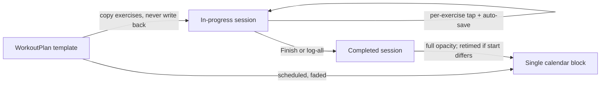
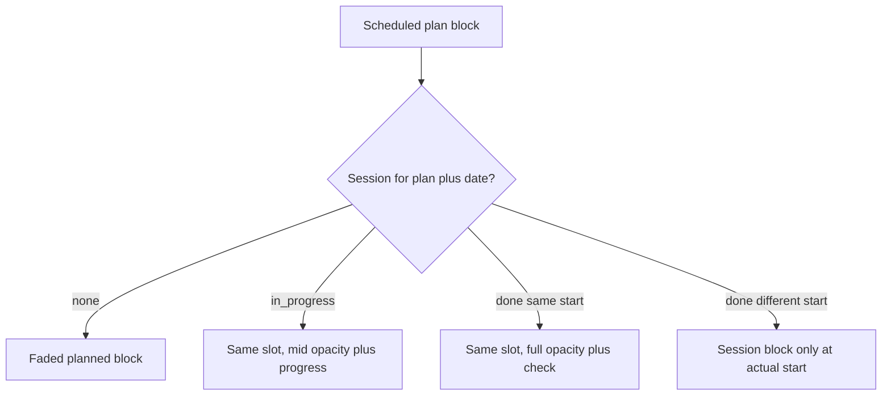

# Live workout logging roadmap (Phases 42–46)

This is a **fitness track** that can run in parallel with Aether Phase 37E. It does not replace 37E/38/39 on the main roadmap; number it **42–46** so it does not collide with Notifications (38), Analytics (39), or AI (40–41).

Follow [PROJECT_RULES.md](PROJECT_RULES.md) and [docs/plans/roadmap.md](docs/plans/roadmap.md) §6: **pure helpers + tests first**, presentational UI, `App.tsx` orchestration-only, **no new npm dependencies**, backward-compatible optional fields, Aether tokens for any new UI, update `architecture.md` + roadmap when a phase ships.

## Current behavior (why this work exists)

- **Plans** are templates ([`WorkoutPlan`](src/core/model.ts)); **sessions** are dated logs ([`WorkoutSession`](src/core/model.ts)). [`copyExercisesFromPlan`](src/core/fitness.ts) already copies exercises into a new session without writing back to the plan — keep that.
- Logging is all-or-nothing: [`FitnessPage`](src/pages/FitnessPage.tsx) opens a form; [`addWorkoutSession`](src/App.tsx) always stamps `completedAtIso: now`. Nothing is saved until **Log session**.
- Calendar emits **two** items when both flags are on: scheduled block (`subcategoryKey: "scheduled"`) from the plan, plus a session block whose start is `localTimeFromIso(completedAtIso)` in [`collectFitnessItems`](src/core/calendar.ts) — that is why the block sits at “when I edited,” not when the workout started. There is no start-time field on [`WorkoutSessionForm`](src/components/fitness/WorkoutSessionForm.tsx).
- [`ExerciseEntryEditor`](src/components/fitness/ExerciseEntryEditor.tsx) is a full-width stacked card per exercise.
- Dashboard [`FitnessSummarySection`](src/components/dashboard/FitnessSummarySection.tsx) is read-only (week count + “View fitness”).
- [`isWorkoutOccurrenceComplete`](src/core/fitness.ts) treats any matching `planId` + date session as done. After in-progress sessions exist, that must require a **finished** session (`completedAtIso` present). That helper is the choke point for focus, briefing, review, and dashboard “scheduled today” pending — not calendar (calendar currently ignores it).
- Calendar/Dashboard already opt in both `includeFitnessHistory` and `includeWorkoutSchedules` in [`useCalendarController`](src/components/calendar/useCalendarController.ts). Week view lanes overlapping items; month view shows two pills. No planned/completed calendar styling today (`WorkoutDayStatus` is domain-only).
- Session **date** (`YYYY-MM-DD`) and start time from `completedAtIso` can disagree across midnight. New start time must be **date + HH:MM**, not the raw ISO clock date.
- The session form **From plan** select only sets `planId`; it does **not** copy exercises. Live logging must keep using [`createSessionDraftFromPlan`](src/core/fitness.ts) / plan-card **Log session**.
- [`collectRecentExerciseNames`](src/core/fitness.ts) already exists and is unused — reuse for Phase 46 instead of a new catalog table.
- Gamification ([`rewardCalculation.ts`](src/core/rewardCalculation.ts), [`progressionContext.ts`](src/core/progressionContext.ts)): `+20` completed session / `+10` scheduled-slot bonus. In-progress sessions must not grant XP.

## Design decisions (all phases)

- **One session = one time block.** Never emit per-exercise calendar items.
- **In-progress vs completed** is inferred: omit `completedAtIso` → in progress; present → completed. Legacy rows stay completed. No `status` column.
- **Session edits are session-only.** Add/remove/change weight or skip an exercise on a session (or dashboard) must not `updateWorkoutPlan`.
- **Do not persist a session merely by opening Fitness.** Create/upsert the in-progress row on first real mutation (complete tap, weight edit, start time, add/remove exercise).
- **Retro log-all stays.** Keep plan **Log session** / a **Mark all complete** path that writes a finished session in one commit (forgotten-workout case).
- **Exercise identity for charts:** group by normalized name across completed session entries. No new `exercises` catalog table unless rename/merge is needed later (schema only when needed).
- **Charts:** custom SVG using `--aether-*` tokens. Do not add Recharts/D3.
- **Theme:** new UI uses Aether tokens via [`appStyles.ts`](src/ui/appStyles.ts); keyboard + `aria-pressed` on complete toggles.

---

## Phase 42 — Live session model (pure + persistence)

**Goal:** Persist an in-progress session with per-exercise completion and a manual start time, without new Fitness UI yet (except start time on the existing session form).

### Model ([`src/core/model.ts`](src/core/model.ts))

- `WorkoutSession.startedAtIso?: string` — clock time the session started (calendar start).
- `ExerciseEntry.completedAtIso?: string` — set when that exercise is checked off (session entries only).
- `ExerciseEntry.sourceExerciseId?: string` — plan exercise id when copied, so dashboard/Fitness can toggle the same row after copy ([`copyExercisesFromPlan`](src/core/fitness.ts) currently mints new UUIDs).

Keep `durationMinutes` and `completedAtIso` on the session.

### Schema

Add nullable `started_at timestamptz` on `workout_sessions` (same pattern as [`20260527410000_fitness_session_metadata.sql`](supabase/migrations/20260527410000_fitness_session_metadata.sql)). Exercise flags live in existing `exercises` jsonb — no new table.

### Mappers / CRUD

- Extend [`parseExerciseEntries`](src/core/dbMappers.ts) / `assertValidExerciseEntry` for optional ISO `completedAtIso` and UUID `sourceExerciseId`.
- Map `started_at` ↔ `startedAtIso`. Strip completion fields when saving **plans**.
- [`addWorkoutSession`](src/App.tsx): **stop always stamping `completedAtIso`**. Honor `input.completedAtIso` / `input.startedAtIso` when provided. Retro log still passes `completedAtIso`.
- `normalizePayload` / storage: optional fields omitted on old data.

### Pure helpers ([`src/core/fitness.ts`](src/core/fitness.ts) + tests)

- `isWorkoutSessionComplete` / `isWorkoutSessionInProgress`
- `findSessionForPlanDate`
- `toggleExerciseCompleted(session, exerciseId, nowIso)`
- `setExerciseWeight(session, exerciseId, weight)` (session clone only)
- `markAllExercisesCompleted`
- `resolveSessionStartHHMM(session)` → `startedAtIso` else legacy `completedAtIso`
- Change `isWorkoutOccurrenceComplete` / week summaries to **completed sessions only**. Same filter in [`questEngine.ts`](src/core/questEngine.ts), [`rewardCalculation.ts`](src/core/rewardCalculation.ts), and [`progressionContext.ts`](src/core/progressionContext.ts) so in-progress taps do not grant `workout_completed` / scheduled-slot XP or complete quests.
- `copyExercisesFromPlan`: keep minting new row UUIDs, but set `sourceExerciseId` to the plan exercise id.

### Small UI in this phase

Add **Start time** (`type="time"`) on [`WorkoutSessionForm`](src/components/fitness/WorkoutSessionForm.tsx) + form state. Keep duration. Retro **Log session** still allowed.

**Out of scope here:** live tap grid, calendar merge, dashboard complete buttons, charts.

---

## Phase 43 — Today rail, live logger, compact exercise cells

**Goal:** Open Fitness and immediately see today’s scheduled workout as a live, auto-saving logger. Compact exercise cells so several fit per row.

### Compact editor

Refactor [`ExerciseEntryEditor`](src/components/fitness/ExerciseEntryEditor.tsx) to `display: grid; grid-template-columns: repeat(auto-fill, minmax(220px, 1fr))`. Each exercise is a compact cell (name, sets/reps/weight, notes, remove). **Add exercise** is the next cell in the same grid (wraps to the next row). Used by both plan and session forms.

### Live logger (new presentational component)

e.g. `TodayWorkoutRail` / `LiveWorkoutLogger` in `src/components/fitness/`:

- One cell per session exercise with a large **Complete** control (`aria-pressed`) and a clear done state (accent border / check). Incomplete stays muted.
- Weight (and sets/reps) editable on the cell; changes call `onUpdateSession` immediately.
- Add/remove exercise on **this session only**.
- Start time + duration at the top.
- **Finish workout** stamps `completedAtIso` (partial plans allowed).
- **Mark all complete** = today’s retro path.
- Secondary: **Log a different session** keeps the existing manual form.

### Today rail behavior ([`FitnessPage`](src/pages/FitnessPage.tsx))

On a day with a scheduled plan and no **completed** session: pin the logger at the top from `createSessionDraftFromPlan` (or the existing in-progress row). Multiple scheduled plans → one rail each. Not mandatory; user can ignore it and log something else.

First mutation → `onAddSession` (in progress) or `onUpdateSession`. Closing the app is safe because each tap `commit`s (localStorage now, debounced Supabase as today).

Optional `fitnessFocus?: { date, planId }` from dashboard navigation so the matching rail is shown.

**Tests:** form/state helpers; Fitness page stays presentational. Manual: tap 2/5, reload, 2 stay complete.

---

## Phase 44 — Calendar: one block, planned vs completed

**Goal:** Stop overlapping scheduled + session blocks. One fitness block per plan occurrence per day.

Pure merge in [`src/core/calendar.ts`](src/core/calendar.ts) (before concatenating schedule + history):

1. **No completed/in-progress session** for `planId` + date → keep schedule block, visual **planned** (reduced opacity, dashed/softer border).
2. **In-progress** → still the **scheduled** time (do not add a second block); visual **in progress** (medium opacity, `2/5` or similar from completed exercise count).
3. **Completed**, start HH:MM **equals** scheduled start (or no resolvable start) → keep scheduled slot, visual **completed** (full opacity + check).
4. **Completed**, start **differs** from scheduled start → **suppress** that day’s schedule block; emit only the session timed block (`startedAtIso` + `durationMinutes`, fallback duration from start→`completedAtIso` or planned minutes). Full opacity + check.
5. Manual session with no plan → session block only, as today, but start from `startedAtIso`.

In-progress sessions must **not** go through today’s `collectFitnessItems` (`completedAtIso` required) so they cannot double-render.

Add `completionVisual?: "planned" | "in_progress" | "completed"` on [`CalendarItem`](src/core/calendar.ts) (or equivalent sourceMeta). Render opacity/checkmark in [`CalendarEventBlock`](src/components/calendar/CalendarEventBlock.tsx) and [`CalendarItemPill`](src/components/calendar/CalendarItemPill.tsx) via Aether tokens — do not reuse drag `isDimmed`. Fitness items are not draggable (leave 36.2 alone).

`fitness:scheduled` has **no** color-settings entry today (session items can use `fitness:push` etc.). Keep planned styling as opacity/dash/check, not a new palette subcategory, unless a later settings slice adds `fitness:scheduled`.

Compose session start as **`session.date` + start HH:MM** (from `startedAtIso` or a time field), not `localTimeFromIso(completedAtIso)` alone, so a late log on the correct workout date does not shift the block to the next calendar day. [`CalendarItemDetailModal`](src/components/calendar/CalendarItemDetailModal.tsx) currently labels both kinds **Workout** — show planned / in progress / completed there.

**Tests in** [`calendar.test.ts`](src/core/calendar.test.ts): overlap suppressed; retimed override; in-progress does not emit a second item; legacy `completedAtIso`-only sessions still render.

---

## Phase 45 — Dashboard quick-complete

**Goal:** On a day with a scheduled plan, complete (and adjust weight for) each exercise from the dashboard without opening Fitness for the common path.

Extend [`FitnessSummarySection`](src/components/dashboard/FitnessSummarySection.tsx):

- List today’s scheduled plan exercises (from in-progress session if present, else the plan copy).
- Per row: **Complete** + compact **weight** input. Callbacks into `App.tsx` reuse Phase 42/43 upsert + `toggleExerciseCompleted` / `setExerciseWeight`.
- **Open in Fitness** uses existing `onOpenFitness` plus `fitnessFocus` so the today rail is ready for add/remove/notes/start time.
- Keep week summary + last workout.

Dashboard stays presentational: no `saveAppData` / Supabase. Skill `onAddSession` pattern already exists on [`DashboardPage`](src/pages/DashboardPage.tsx).

Partial completes must not mark the calendar occurrence complete until **Finish** (or mark-all) on Fitness — same `completedAtIso` rule.

---

## Phase 46 — Weight progression chart

**Goal:** Motivating **visual** progress (not slogans). Default = weight over time per exercise.

Pure [`src/core/exerciseProgression.ts`](src/core/exerciseProgression.ts) (or helpers in `fitness.ts`):

- Catalog = unique normalized names; start from unused [`collectRecentExerciseNames`](src/core/fitness.ts), filtered to **completed** session entries (plans only as known-name fallback).
- Per exercise: `{ date, weight }[]`, first logged date, completion count, last logged, simple PR (max weight).

UI on Fitness (below today rail / above history):

- Exercise switcher.
- Default chart: SVG line + soft accent fill, PR dots, start→latest implied by the line shape. `prefers-reduced-motion`: static, no animation.
- Buttons on the chart: **Weight** (default), **Frequency**, **Stats** (first logged, times completed, last logged, PR). Frequency = small SVG bars by week, not a new library.

Empty state: log a completed exercise with weight to see the chart.

This is a **fitness slice**, not full Phase 39 Analytics. Phase 39 can later reuse the aggregators.

---

## Cross-cutting constraints

- Validate new ISO/UUID fields in `dbMappers`; treat JSON as untrusted.
- Debounced `commit` is enough for gym-tap latency; do not add a second persistence path.
- Do not mix Aether/theme refactors into these diffs.
- After each phase: targeted tests, then lint/typecheck; update [docs/architecture.md](docs/architecture.md) and [docs/plans/roadmap.md](docs/plans/roadmap.md).

## Suggested ship order

42 (data) → 43 (logger + grid) → 44 (calendar) → 45 (dashboard) → 46 (chart).

43 before 44 so live logging is usable even while overlap still exists; 44 before 45 so dashboard completes do not create a second calendar block.
