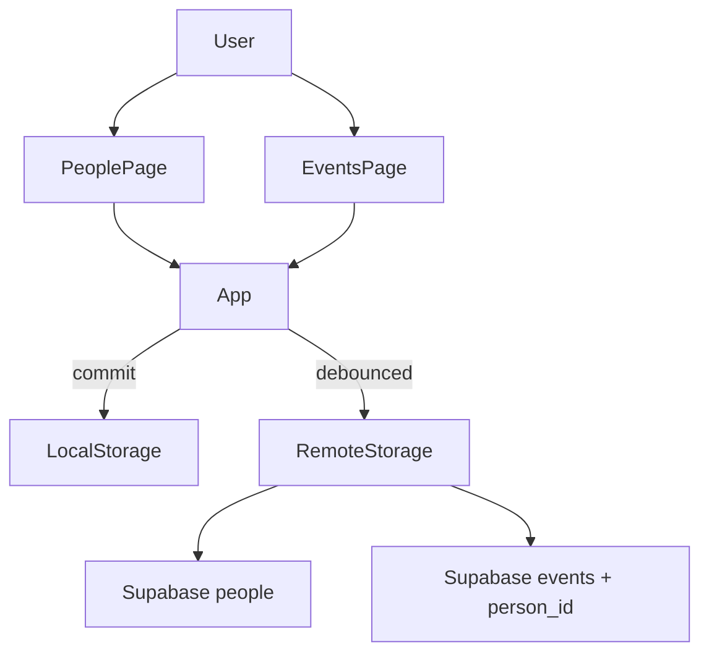

# Phase 11: Friends and People System

## Goals and constraints

- **Goal**: Track important people (birthdays, gifts, likes/dislikes, notes, relationship maintenance) and connect them to life events where useful.
- **Hard constraints** (from PROJECT_RULES, SECURITY_RULES, [docs/architecture.md](docs/architecture.md)):
  - Same auth/sync/storage pipeline: `commit` → `saveAppData` → debounced `replaceRemotePayload`; RLS-scoped Supabase tables; no custom backend.
  - No new npm dependencies.
  - No SMS/Instagram ingestion; no AI message generation in this phase.
  - Small, testable increments; pure logic in `src/core`, presentational pages/components.
  - **Backward compatible**: existing events with only `personName` keep working unchanged.

## Architecture (unchanged pipeline)



Follow the [Phase 8 events blueprint](.cursor/plans/phase_8_calendar_events_058ae45a.plan.md): model → migration → mappers → remote sync → App CRUD → page → nav → optional dashboard widget.

---

## Data model proposal

### New domain type — `Person` in [src/core/model.ts](src/core/model.ts)

Single entity (no separate Gift/Note tables in v1). Free-text fields keep the schema small; structured gift tracking can come later.

```typescript
export type Person = {
  id: string;                    // UUID
  name: string;                  // required display name
  nickname?: string;
  birthdayMonthDay?: string;     // "MM-DD" (year-less recurring birthday)
  relationship?: string;         // free text, e.g. "friend", "family"
  likes?: string;                // free-text preferences
  dislikes?: string;
  giftIdeas?: string;            // free-text gift notes
  notes?: string;                // general notes
  lastContactDate?: string;      // ISO date "YYYY-MM-DD"
  contactCadenceDays?: number;   // positive integer; days between check-ins
  createdAtIso: string;
  updatedAtIso: string;
};
```

Extend `AppPayload`:

```typescript
export type AppPayload = {
  skills: Skill[];
  sessions: Session[];
  overrides: Array<unknown>;
  events: LifeEvent[];
  people: Person[];              // new; default []
};
```

### Extend `LifeEvent` — optional link only

```typescript
export type LifeEvent = {
  // ...existing fields unchanged...
  personName?: string;           // keep for legacy + denormalized backup readability
  personId?: string;             // optional FK to Person.id
};
```

**Do not remove `personName`.** Do not auto-migrate legacy strings into Person records.

### Display resolution (pure helper in new [src/core/people.ts](src/core/people.ts))

```typescript
resolveEventPersonLabel(event, peopleById): string | undefined
```

Priority: `personId` → linked `Person.name` → fallback `personName` → `undefined`.

Use this helper everywhere “With {name}” is rendered today:
- [src/pages/EventsPage.tsx](src/pages/EventsPage.tsx)
- [src/components/dashboard/UpcomingEventsSection.tsx](src/components/dashboard/UpcomingEventsSection.tsx)
- [src/components/dashboard/UnifiedTimelineRow.tsx](src/components/dashboard/UnifiedTimelineRow.tsx)
- [src/core/timeline.ts](src/core/timeline.ts) when building `LifeEventTimelineItem`

**Denormalization on save (recommended):** when `personId` is set in App event handlers, also set `personName` to the linked person’s name so JSON backups remain human-readable for older exports and debugging.

---

## Events relationship strategy

| Use case | Approach | Rationale |
|----------|----------|-----------|
| **Birthdays** | Store recurring date on `Person.birthdayMonthDay`; dashboard computes next occurrence via pure helper. User can manually create a `birthday` event linked with `personId`. | Avoids auto-sync complexity; birthdays appear on dashboard even without a calendar event. |
| **Hangouts** | User creates `hangout` event; optionally picks a Person (`personId`). Title/time/notes stay on the event. | Reuses existing event types and timeline/upcoming widgets. |
| **Gift reminders** | User creates a `deadline` or `other` event with `personId`, `reminder: true`, title like “Buy gift for Alex”. Gift ideas live on `Person.giftIdeas`. Optional “Add gift reminder” quick action pre-fills event form. | No new `EventType` or CHECK migration on `events.type`. |
| **Legacy events** | Events with only `personName` display unchanged; no `personId` required. | Full backward compatibility. |

**Explicitly out of scope for Phase 11:**
- Auto-generating/syncing birthday events from Person records
- New `gift` event type
- Deleting Person does not delete linked events (DB `ON DELETE SET NULL`; App `deletePerson` also clears `personId` on local events in the same `commit`)

### Pure helpers in `src/core/people.ts` (all unit-tested)

| Helper | Purpose |
|--------|---------|
| `getNextBirthdayDateKey(person, todayKey)` | Next `YYYY-MM-DD` for `birthdayMonthDay` (handle Feb 29 → Feb 28 on non-leap years) |
| `buildUpcomingBirthdayItems(people, todayKey, windowDays, maxItems)` | Dashboard DTO: person + next date + urgency label (reuse date math from [src/core/events.ts](src/core/events.ts)) |
| `buildPeopleNeedingFollowUp(people, todayKey, maxItems)` | People where `lastContactDate + contactCadenceDays <= today` |
| `eventsForPerson(events, personId)` | Filter linked events for People detail panel |
| `resolveEventPersonLabel(event, peopleById)` | Display name resolution |

---

## Supabase schema / migration plan

**New file:** `supabase/migrations/20260527200000_people.sql`

### 1. `public.people` table

| Column | Type | Notes |
|--------|------|-------|
| `id` | `uuid` PK | default `gen_random_uuid()` |
| `user_id` | `uuid` NOT NULL | FK → `auth.users`, `ON DELETE CASCADE` |
| `name` | `text` NOT NULL | `char_length(name) > 0` |
| `nickname` | `text` NULL | |
| `birthday_month_day` | `text` NULL | CHECK `^((0[1-9]|1[0-2])-(0[1-9]|[12][0-9]|3[01]))$` |
| `relationship` | `text` NULL | |
| `likes` | `text` NULL | |
| `dislikes` | `text` NULL | |
| `gift_ideas` | `text` NULL | |
| `notes` | `text` NULL | |
| `last_contact_date` | `date` NULL | |
| `contact_cadence_days` | `integer` NULL | CHECK `> 0` |
| `created_at` / `updated_at` | `timestamptz` | trigger pattern from [20260527000000_events.sql](supabase/migrations/20260527000000_events.sql) |

Index: `(user_id, name)`. RLS: standard 4-policy template (select/insert/update/delete own rows) matching [20260527000000_events.sql](supabase/migrations/20260527000000_events.sql).

### 2. Extend `public.events`

```sql
ALTER TABLE public.events
  ADD COLUMN person_id uuid NULL
  REFERENCES public.people (id) ON DELETE SET NULL;

CREATE INDEX events_user_id_person_id_idx ON public.events (user_id, person_id);
```

**Tighten RLS** on `events` insert/update policies (mirror sessions → skills pattern in [20260430190000_core_schema_rls.sql](supabase/migrations/20260430190000_core_schema_rls.sql)):

```sql
(person_id IS NULL OR EXISTS (
  SELECT 1 FROM public.people p
  WHERE p.id = person_id AND p.user_id = auth.uid()
))
```

---

## Mapper / storage / sync changes

### [src/core/dbMappers.ts](src/core/dbMappers.ts)

- Add `PersonRow`, `personToRow`, `personFromRow`, `assertValidPerson`
- Extend `EventRow` + `eventToRow` / `eventFromRow` with `person_id` ↔ `personId`
- Extend `payloadFromRows(..., peopleRows)` and `validatePayloadForUpload`:
  - Unique person ids
  - Each `event.personId` must reference an id in `payload.people`
- Extend [src/core/dbMappers.test.ts](src/core/dbMappers.test.ts): person round-trip, optional fields → null, invalid birthday format, event with/without `personId`, orphan `personId` rejected

### [src/core/state.ts](src/core/state.ts)

- `defaultPayload()`: add `people: []`

### [src/core/storage.ts](src/core/storage.ts)

- `normalizePayload()`: ensure `people: Array.isArray(p.people) ? p.people : []`

### [src/core/remoteStorage.ts](src/core/remoteStorage.ts)

- Add `"people"` to `AppTable`
- `fetchRemotePayload`: parallel `select *` from `people`
- `replaceRemotePayload` order:
  1. Upsert `skills`, `sessions`, `overrides`, **`people`**
  2. Upsert `events` (FK-safe)
  3. Delete orphans: sessions → skills → overrides → **events** → **people**
- `payloadHasData`: include `people.length > 0`

Backup export/import automatically includes `people` once in `AppPayload` (no separate change needed beyond normalize).

---

## UI page structure

### Navigation

- Extend [src/pages/types.ts](src/pages/types.ts): `Page = "dashboard" | "skills" | "events" | "people"`
- Add **People** `NavButton` in [src/components/layout/AppShell.tsx](src/components/layout/AppShell.tsx)
- Wire in [src/App.tsx](src/App.tsx): `addPerson`, `updatePerson`, `deletePerson` + render `PeoplePage`

### New [src/pages/PeoplePage.tsx](src/pages/PeoplePage.tsx) (presentational; mirror EventsPage)

**Layout:**

1. **Header card** — “People”, short description, “Add person” button
2. **Form card** (toggle) — create/edit fields:
   - Name (required)
   - Nickname, Relationship
   - Birthday (month + day inputs → `birthdayMonthDay`)
   - Likes, Dislikes, Gift ideas, Notes (textareas)
   - Last contact date, Contact cadence (days)
3. **List section** — sorted by name (default) or upcoming birthday (client toggle via `useMemo` + core helper)
4. **Person row** — name, relationship pill, next birthday label, follow-up status, Edit/Delete
5. **Expanded detail** (inline, no router) — show preference fields + **linked events** (`eventsForPerson`) with read-only summary

Optional small components under `src/components/people/` only if `PeoplePage.tsx` grows past ~250 lines (e.g. `PersonForm`, `PersonRow`).

### Events page enhancement (minimal)

Update [src/pages/EventsPage.tsx](src/pages/EventsPage.tsx):

- Accept `people: Person[]` prop
- Replace free-text-only “Person / friend” with:
  - **Select** dropdown: “None” + people list → sets `personId` (and display name)
  - **Or** “Custom name” text input → sets `personName` only (legacy path; clears `personId`)
- List rows use `resolveEventPersonLabel`

Pass `people` from `App.tsx` into `EventsPage` and `DashboardPage`.

---

## Dashboard integration

**Recommendation:** one new widget, separate from Upcoming Events (which stays event-centric).

### New [src/components/dashboard/PeopleRemindersSection.tsx](src/components/dashboard/PeopleRemindersSection.tsx)

Two sublists (cap 5 each):

1. **Upcoming birthdays** — from `buildUpcomingBirthdayItems(people, todayKey, 30, 5)`; show name + urgency + date
2. **Needs follow-up** — from `buildPeopleNeedingFollowUp(people, todayKey, 5)`; show name + “Last contact X days ago” / cadence

**Placement** in [src/pages/DashboardPage.tsx](src/pages/DashboardPage.tsx): after `UpcomingEventsSection`, before `UnifiedTimelineSection` — groups “what’s coming up” context together.

**Empty state:** hide section entirely when both sublists empty (keeps dashboard clean for users with no people).

### Options considered (documented, not built in v1)

| Option | Pros | Cons |
|--------|------|------|
| Merge into Upcoming Events | Single widget | Mixes calendar events with contact metadata; duplicate birthday signals |
| People-only page, no dashboard | Smallest diff | Less visible reminders |
| **Separate PeopleRemindersSection (chosen)** | Clear semantics; uses Person fields events don’t have | One extra dashboard block |

---

## Future AI extension points (design-only)

Document in `src/core/people.ts` header comment and [docs/architecture.md](docs/architecture.md):

- **`PersonContext` bundle** (future): `{ name, relationship, likes, dislikes, giftIdeas, notes, recentEvents }` — pure function to assemble from Person + linked events for prompt injection
- **Message drafting** (future): server-side or opt-in AI using PersonContext; not stored in DB in v1
- **Gift suggestions** (future): AI reads `likes` + `giftIdeas` + past events; no Instagram/SMS
- **Proactive nudges** (future): extend `buildPeopleNeedingFollowUp` with notification delivery (push/email) — reminder flag on events already exists as precedent
- **Import hooks** (future): optional CSV/vCard import → maps to `Person` rows; no message scraping

Keep all AI behind explicit user action and server-side keys (per SECURITY_RULES).

---

## Validation checklist

### Unit tests

- [ ] `src/core/people.test.ts` — birthday next-date math (incl. year boundary, Feb 29), upcoming window, follow-up detection, label resolution
- [ ] `src/core/dbMappers.test.ts` — Person + Event personId round-trip, validation failures
- [ ] Existing `events.test.ts` / `timeline` tests still pass after label helper adoption

### Integration / manual

- [ ] Add/edit/delete person persists locally and syncs to Supabase
- [ ] Event with `personId` displays linked name; legacy `personName`-only events unchanged
- [ ] Deleting person clears `personId` on linked events (local + remote SET NULL)
- [ ] Invalid `personId` on event rejected by `validatePayloadForUpload`
- [ ] Export/import backup round-trips `people` array
- [ ] RLS: user A cannot reference user B’s person on an event
- [ ] Dashboard widget shows birthdays/follow-ups; hidden when empty
- [ ] Mobile: People list and form wrap cleanly (`minWidth: 0`, existing `styles.card` / `listRow`)

### Repo checks

- [ ] `npm test`, `npm run lint`, `npm run build`
- [ ] Apply migration locally: `supabase db push` or project workflow
- [ ] Update [docs/architecture.md](docs/architecture.md): folder map, payload fields, nav pages, dashboard section order

---

## Step-by-step implementation order

1. **Migration** — `20260527200000_people.sql` (people table + events.person_id + RLS)
2. **Types** — `Person`, `AppPayload.people`, `LifeEvent.personId` in [model.ts](src/core/model.ts)
3. **Defaults / normalize** — [state.ts](src/core/state.ts), [storage.ts](src/core/storage.ts)
4. **Mappers + tests** — [dbMappers.ts](src/core/dbMappers.ts), [dbMappers.test.ts](src/core/dbMappers.test.ts)
5. **Pure people helpers + tests** — new [people.ts](src/core/people.ts), [people.test.ts](src/core/people.test.ts)
6. **Remote sync** — [remoteStorage.ts](src/core/remoteStorage.ts) (fetch, upsert order, delete order, `payloadHasData`)
7. **App CRUD** — [App.tsx](src/App.tsx): `addPerson`, `updatePerson`, `deletePerson` (unlink events on delete); extend event handlers for `personId` + denormalized `personName`
8. **Display resolution** — wire `resolveEventPersonLabel` into Events page, timeline, upcoming events, unified timeline row
9. **PeoplePage + nav** — [PeoplePage.tsx](src/pages/PeoplePage.tsx), [types.ts](src/pages/types.ts), [AppShell.tsx](src/components/layout/AppShell.tsx)
10. **Events person picker** — pass `people` into EventsPage; dropdown + legacy custom name
11. **Dashboard widget** — [PeopleRemindersSection.tsx](src/components/dashboard/PeopleRemindersSection.tsx) + [DashboardPage.tsx](src/pages/DashboardPage.tsx) wiring
12. **Docs + validate** — architecture.md, run test/lint/build, manual sync check

Each step is independently reviewable; steps 1–7 can ship a syncable People CRUD with no UI beyond a stub if needed, but the intended delivery is the full order above.
