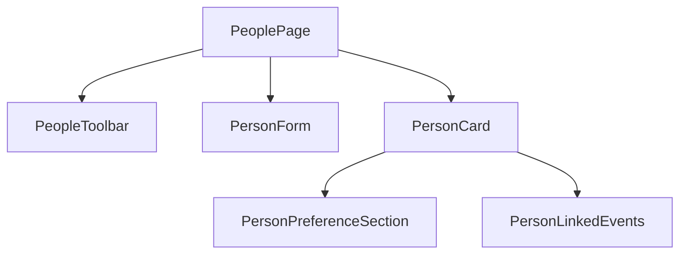

# Phase 11.1: People UX Polish

## Goals and constraints

- **Goal**: Make [`src/pages/PeoplePage.tsx`](src/pages/PeoplePage.tsx) easier to scan, filter, and act on before adding more people features.
- **Hard constraints** (unchanged from Phase 11):
  - No changes to auth, Supabase schema, `remoteStorage`, `storage`, or the `commit` → `saveAppData` → debounced sync pipeline.
  - No new npm dependencies.
  - [`PeoplePage`](src/pages/PeoplePage.tsx) stays **presentational** (props in, callbacks out).
  - New list/filter/sort/badge logic lives in [`src/core/people.ts`](src/core/people.ts) with unit tests.
  - No AI, notifications, or message scraping.

**Allowed small wiring outside PeoplePage** (not the commit pipeline): pass one navigation callback from [`App.tsx`](src/App.tsx) so “Add event” can jump to Events with a prefilled draft.

---

## Current baseline

[`PeoplePage.tsx`](src/pages/PeoplePage.tsx) today (~520 lines):

- Inline `PersonRow` + full add/edit form in one file
- Sort: **name** | **upcoming birthday** only
- No search/filter
- Collapsed row shows plain text lines; expanded block is `<b>Label:</b> text` paragraphs
- Actions: Details / Edit / Delete only
- Empty state: single line when `people.length === 0`
- “Contacted today” and “Add event” are not exposed despite `onUpdate` already supporting date updates

Existing core helpers to reuse: [`sortPeopleByName`](src/core/people.ts), [`sortPeopleByUpcomingBirthday`](src/core/people.ts), [`buildPeopleNeedingFollowUp`](src/core/people.ts), [`getNextBirthdayDateKey`](src/core/people.ts), [`formatUpcomingEventUrgencyLabel`](src/core/events.ts).

Existing UI tokens to reuse: [`styles.statusPill`](src/ui/appStyles.ts), `statusIdle`, `statusOverdue`, `streakPill`, `helpText`, `listRow`, `dashboardSection`.

---

## Recommended UX improvements

### Include in Phase 11.1 (ship now)

| Improvement | Why now |
|-------------|---------|
| **Search bar** (name, nickname, relationship, likes, dislikes, gift ideas, notes) | High value as list grows; pure helper + local state only |
| **Sort: needs follow-up** | Reuses `buildPeopleNeedingFollowUp` ordering; surfaces overdue contacts first |
| **Sort: recently contacted** | `lastContactDate` desc; people without date sink to bottom |
| **Split PeoplePage into components** | File is already large; cleaner mobile layout and review |
| **Richer collapsed cards** | Name row + badge row + one-line summary; fewer taps to understand status |
| **Birthday / follow-up badges** | Reuse dashboard urgency copy (`Today`, `Tomorrow`, `In N days`; `Needs follow-up`, `Due in N days`) |
| **Structured expanded sections** | Likes / Dislikes / Gift ideas / Notes as labeled blocks; linked events as compact list |
| **Quick action: Contacted today** | One tap → `onUpdate({ ...person, lastContactDate: todayKey })`; no App change |
| **Quick action: Add event** | Navigate to Events with `personId` + sensible defaults (hangout or birthday) |
| **Empty / no-results states** | Helper copy when list empty vs search returns nothing |
| **List toolbar** | Search input + sort select + result count (“3 of 12 people”) |

### Defer to Phase 11.2+ (out of scope)

| Idea | Reason to defer |
|------|-----------------|
| Gift-reminder-specific quick action (deadline + reminder prefill) | Overlaps Events form work; can follow once “Add event” draft flow exists |
| Relationship filter chips / facet filters beyond search | Extra UI state; search covers most cases for now |
| Dashboard deep-links from People badges | Cross-page polish; not required for People page usability |
| Delete confirmation modal | Nice-to-have; not in requirements |
| Expand all / collapse all | Low priority until lists are much longer |
| Inline event creation on People page | Duplicates Events form; navigation draft is smaller |
| Form wizard / progressive disclosure in edit form | Form works; card/list polish matters more first |
| Shared date formatting module | Optional refactor; keep local format helpers in components for now |

---

## Pure helper changes ([`src/core/people.ts`](src/core/people.ts))

Add tested helpers (no model/schema changes):

```typescript
// Search
personMatchesQuery(person: Person, query: string): boolean
filterPeopleByQuery(people: Person[], query: string): Person[]

// Sort (return new arrays; do not mutate)
sortPeopleByFollowUpPriority(people: Person[], todayKey: string): Person[]
sortPeopleByRecentContact(people: Person[]): Person[]

// Badge / summary DTOs for UI
export type PersonBirthdayStatus = {
  nextDateKey: string;
  daysUntil: number;
  urgencyLabel: UpcomingEventUrgencyLabel;
} | null;

export type PersonFollowUpStatus = {
  daysSinceContact: number;
  cadenceDays: number;
  daysOverdue: number; // max(0, daysSinceContact - cadenceDays)
  needsFollowUp: boolean;
} | null;

getPersonBirthdayStatus(person: Person, todayKey: string): PersonBirthdayStatus
getPersonFollowUpStatus(person: Person, todayKey: string): PersonFollowUpStatus

// Optional: unify list pipeline
export type PeopleSortMode = "name" | "birthday" | "followUp" | "recentContact";

filterAndSortPeople(
  people: Person[],
  opts: { query?: string; sortMode: PeopleSortMode; todayKey: string }
): Person[]
```

**Sort rules**

- **followUp**: overdue first (`daysOverdue` desc), then people with cadence but not yet due (soonest due first), then people without follow-up metadata (name asc).
- **recentContact**: `lastContactDate` desc; missing dates last (name asc tie-break).

Extend [`src/core/people.test.ts`](src/core/people.test.ts) with cases for search (case-insensitive, multi-field), both new sorts, and badge status edge cases (no birthday, no cadence, exactly on cadence day).

---

## Component structure

Split presentational pieces under `src/components/people/` (PeoplePage stays orchestrator):



| File | Responsibility |
|------|----------------|
| [`src/pages/PeoplePage.tsx`](src/pages/PeoplePage.tsx) | Page shell, header, empty states, wires search/sort state + callbacks |
| [`src/components/people/PeopleToolbar.tsx`](src/components/people/PeopleToolbar.tsx) | Search input, sort `<select>`, result count |
| [`src/components/people/PersonForm.tsx`](src/components/people/PersonForm.tsx) | Add/edit form (move existing fields + validation messages unchanged) |
| [`src/components/people/PersonCard.tsx`](src/components/people/PersonCard.tsx) | Collapsed summary, badges, action row, expanded detail |
| [`src/components/people/PersonPreferenceSection.tsx`](src/components/people/PersonPreferenceSection.tsx) | Reusable labeled block for likes/dislikes/gift ideas/notes |
| [`src/components/people/PersonLinkedEvents.tsx`](src/components/people/PersonLinkedEvents.tsx) | Read-only linked events list (uses `eventsForPerson` output) |

**PersonCard layout (mobile-first)**

1. **Header row**: name + nickname + relationship pill (`minWidth: 0`, flex-wrap)
2. **Badge row**: birthday urgency pill (if set); follow-up pill (overdue uses `statusOverdue`, upcoming due uses `statusIdle`)
3. **Summary line**: e.g. “Last contact May 1 · every 14 days” or “No contact tracking yet”
4. **Actions** (wrap on narrow screens): Details | Contacted today | Add event | Edit | Delete
5. **Expanded panel**: 2-column-ish grid of preference sections on wide screens; single column on mobile; linked events at bottom

---

## Quick actions

### Contacted today (PeoplePage only)

- Button on each card calls existing `onUpdate` with `lastContactDate: formatLocalDateKey(new Date())`.
- Disable or show “Contacted today” as muted label when `lastContactDate === todayKey`.
- No [`App.tsx`](src/App.tsx) changes.

### Add linked event (minimal App wiring)

Add optional event draft flow (does **not** change commit/sync):

1. In [`App.tsx`](src/App.tsx): `eventDraft` state + `openEventDraft(draft)` helper that sets draft and `setPage("events")`.
2. Extend [`EventsPage`](src/pages/EventsPage.tsx) props: `initialDraft?: Partial<EventFormState> | null` and `onDraftConsumed?: () => void`.
3. On mount / when `initialDraft` changes: open form, prefill `personId`, `type`, `title` (e.g. `"Hangout with Alex"` or `"Alex's birthday"`), `date` (today or next birthday if type birthday).
4. [`PeoplePage`](src/pages/PeoplePage.tsx) receives `onCreateLinkedEvent: (personId: string, preset: { type: EventType; title: string; date?: string }) => void`.

PersonCard exposes one primary **Add event** button (default `hangout`); optional secondary menu deferred.

---

## Files to modify

| File | Change |
|------|--------|
| [`src/core/people.ts`](src/core/people.ts) | Search, sort, status DTO helpers |
| [`src/core/people.test.ts`](src/core/people.test.ts) | Tests for new helpers |
| [`src/pages/PeoplePage.tsx`](src/pages/PeoplePage.tsx) | Slim orchestrator; search/sort pipeline; empty states |
| [`src/components/people/*.tsx`](src/components/people/) | New presentational components (5 files) |
| [`src/App.tsx`](src/App.tsx) | `eventDraft` state, pass `onCreateLinkedEvent` + draft to EventsPage (**no commit changes**) |
| [`src/pages/EventsPage.tsx`](src/pages/EventsPage.tsx) | Accept/consume `initialDraft` |

**Do not modify**: migrations, [`remoteStorage.ts`](src/core/remoteStorage.ts), [`storage.ts`](src/core/storage.ts), [`dbMappers.ts`](src/core/dbMappers.ts), auth files, [`PeopleRemindersSection.tsx`](src/components/dashboard/PeopleRemindersSection.tsx) (optional later).

---

## Copy and empty states

| State | Copy |
|-------|------|
| No people | “No people yet. Add someone you want to stay in touch with — birthdays, gift ideas, and check-in reminders live here.” + prominent Add person |
| No search results | “No matches for ‘{query}’. Try a name, nickname, relationship, or note keyword.” |
| Expanded preferences empty | “No preferences saved yet. Edit to add likes, gift ideas, or notes.” |
| No linked events | “No linked events. Use Add event to plan a hangout or birthday.” |

---

## Step-by-step implementation order

1. **Core helpers + tests** — search, new sorts, birthday/follow-up status DTOs, `filterAndSortPeople`.
2. **Extract `PersonForm`** — move form UI/validation from PeoplePage unchanged.
3. **Extract `PersonCard` + subcomponents** — new layout, badges, preference sections, linked events.
4. **Add `PeopleToolbar`** — search, expanded sort options, result count; wire `filterAndSortPeople` in PeoplePage.
5. **Contacted today action** — card button using existing `onUpdate`.
6. **Event draft flow** — App draft state, EventsPage `initialDraft`, PeoplePage `onCreateLinkedEvent`.
7. **Empty / no-results states** — header helper copy + filtered empty card.
8. **Mobile pass** — verify wrap, `minWidth: 0`, action button grouping on narrow width.
9. **Validate** — `npm test`, `npm run lint`, `npm run build`; manual smoke on People + Events draft.

---

## Validation checklist

### Unit tests ([`people.test.ts`](src/core/people.test.ts))

- [ ] `filterPeopleByQuery` matches name, nickname, relationship, likes, notes (case-insensitive)
- [ ] Empty query returns all people
- [ ] `sortPeopleByFollowUpPriority` orders overdue before not-due before no-metadata
- [ ] `sortPeopleByRecentContact` orders by `lastContactDate` desc; missing dates last
- [ ] `getPersonBirthdayStatus` / `getPersonFollowUpStatus` match dashboard logic for edge cases

### Manual UI

- [ ] Search filters list live; clearing search restores list
- [ ] All four sort modes behave predictably with mixed data
- [ ] Collapsed cards show badges without expanding
- [ ] Expanded sections readable on mobile (no horizontal overflow)
- [ ] Contacted today updates `lastContactDate` and refreshes follow-up badge
- [ ] Add event opens Events form with person pre-selected and sensible title/type
- [ ] Legacy people/events unchanged; no sync errors after actions
- [ ] Empty list and no-results states show correct copy

### Repo checks

- [ ] `npm test`, `npm run lint`, `npm run build`
- [ ] No schema/migration/sync file diffs
