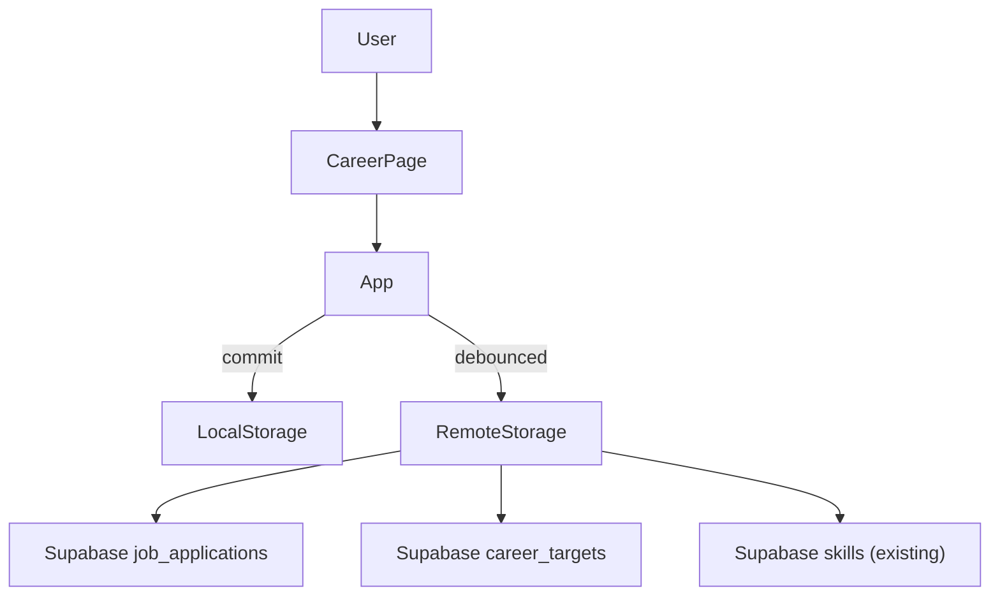
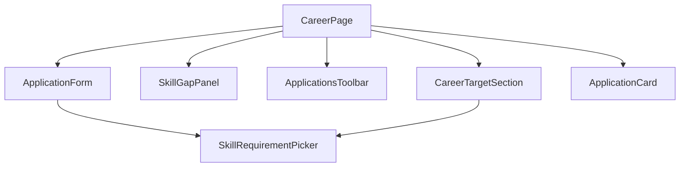

# Phase 12: Career and Job Applications System

## Goals and constraints

- **Goal**: New **Career** page to track job applications (company, role, status, salary, location, skills) and a **dream job target** with skill-gap visibility against existing [`Skill`](src/core/model.ts) records.
- **Hard constraints** (from [PROJECT_RULES.md](PROJECT_RULES.md), [SECURITY_RULES.md](SECURITY_RULES.md), [docs/architecture.md](docs/architecture.md)):
  - Same auth/sync/storage pipeline: `commit` → `saveAppData` → debounced `replaceRemotePayload`; RLS-scoped Supabase tables; no custom backend.
  - No new npm dependencies.
  - No web scraping, job-board APIs, or AI automation in this phase.
  - Pure logic in `src/core`; presentational pages/components (props in, callbacks out).
  - **Backward compatible**: existing payloads without career fields load as empty arrays / no target.

## Architecture (unchanged pipeline)



Follow the [Phase 11 people blueprint](.cursor/plans/phase-11-people-system_7958ea0c.plan.md): model → migration → mappers → remote sync → App CRUD → page → nav → optional dashboard widget.

---

## Data model proposal

### New types in [`src/core/model.ts`](src/core/model.ts)

```typescript
export type ApplicationStatus =
  | "saved"           // bookmarked, not yet applied
  | "applied"
  | "screening"       // recruiter / phone screen
  | "technical"
  | "onsite"
  | "offer"
  | "rejected"
  | "withdrawn";

export type RemotePolicy = "remote" | "hybrid" | "onsite" | "unknown";

export type JobApplication = {
  id: string;                      // UUID
  company: string;                 // required
  roleTitle: string;               // required
  status: ApplicationStatus;
  salaryMin?: number;              // annual USD, positive integer
  salaryMax?: number;              // annual USD; must be >= salaryMin when both set
  location?: string;               // free text, e.g. "San Francisco, CA"
  remotePolicy?: RemotePolicy;
  appliedDate?: string;            // ISO date "YYYY-MM-DD"
  url?: string;                    // posting or company careers link
  notes?: string;
  requiredSkillIds: string[];      // FK refs to Skill.id (validated on upload)
  requiredSkillsText?: string;     // free-text reqs not yet in skill tracker
  createdAtIso: string;
  updatedAtIso: string;
};

export type CareerTarget = {
  id: string;                      // UUID
  roleTitle: string;               // required dream role
  company?: string;                // optional target company
  notes?: string;
  requiredSkillIds: string[];      // skills to develop / prioritize
  requiredSkillsText?: string;     // additional reqs as free text
  updatedAtIso: string;
};
```

Extend [`AppPayload`](src/core/model.ts):

```typescript
export type AppPayload = {
  skills: Skill[];
  sessions: Session[];
  overrides: Array<unknown>;
  events: LifeEvent[];
  people: Person[];
  jobApplications: JobApplication[];   // new; default []
  careerTarget?: CareerTarget;         // optional singleton; omit when unset
};
```

Update [`defaultPayload()`](src/core/state.ts) and [`normalizePayload()`](src/core/storage.ts) with `jobApplications: []` and optional `careerTarget`.

### Design rationale

| Choice | Rationale |
|--------|-----------|
| **Two entities** (`JobApplication` + `CareerTarget`) | Applications are many; dream job is one active target. Matches user mental model. |
| **`requiredSkillIds` as UUID arrays** | Reuses existing skills; validated in `validatePayloadForUpload` like `sessions.skillId`. Stored as `jsonb` in Postgres (no junction table, no FK ordering complexity). |
| **`requiredSkillsText` alongside IDs** | Job posts list skills the user hasn't added to the tracker yet; avoids forcing skill creation upfront. |
| **Salary as integer USD** | Simple v1; no currency table. Display as `$120k–$160k` in UI. |
| **Status enum** | CS pipeline stages without over-fitting to one company's process. |

**Explicitly out of scope for Phase 12:**
- Interview calendar events linked to applications (use existing Events manually)
- Offer negotiation history, equity, benefits breakdown
- Multi-target career planning (multiple dream jobs)
- Auto-import from LinkedIn/Greenhouse/Lever

---

## Supabase schema / migration

New file: [`supabase/migrations/20260527300000_career.sql`](supabase/migrations/20260527300000_career.sql)

### `job_applications`

```sql
CREATE TABLE public.job_applications (
  id uuid PRIMARY KEY DEFAULT extensions.gen_random_uuid(),
  user_id uuid NOT NULL REFERENCES auth.users (id) ON DELETE CASCADE,
  company text NOT NULL,
  role_title text NOT NULL,
  status text NOT NULL,
  salary_min integer NULL,
  salary_max integer NULL,
  location text NULL,
  remote_policy text NULL,
  applied_date date NULL,
  url text NULL,
  notes text NULL,
  required_skill_ids jsonb NOT NULL DEFAULT '[]'::jsonb,
  required_skills_text text NULL,
  created_at timestamptz NOT NULL DEFAULT now(),
  updated_at timestamptz NOT NULL DEFAULT now(),
  CONSTRAINT job_applications_company_nonempty_chk CHECK (char_length(company) > 0),
  CONSTRAINT job_applications_role_title_nonempty_chk CHECK (char_length(role_title) > 0),
  CONSTRAINT job_applications_status_chk CHECK (status IN (
    'saved','applied','screening','technical','onsite','offer','rejected','withdrawn'
  )),
  CONSTRAINT job_applications_remote_policy_chk CHECK (
    remote_policy IS NULL OR remote_policy IN ('remote','hybrid','onsite','unknown')
  ),
  CONSTRAINT job_applications_salary_min_chk CHECK (salary_min IS NULL OR salary_min > 0),
  CONSTRAINT job_applications_salary_max_chk CHECK (
    salary_max IS NULL OR (salary_max > 0 AND (salary_min IS NULL OR salary_max >= salary_min))
  ),
  CONSTRAINT job_applications_required_skill_ids_array_chk CHECK (jsonb_typeof(required_skill_ids) = 'array')
);
```

Indexes: `(user_id, status)`, `(user_id, applied_date DESC NULLS LAST)`.

Standard RLS (select/insert/update/delete own rows), `updated_at` trigger, revoke from `PUBLIC`/`anon`, grant to `authenticated` — same pattern as [`20260527200000_people.sql`](supabase/migrations/20260527200000_people.sql).

### `career_targets`

```sql
CREATE TABLE public.career_targets (
  id uuid PRIMARY KEY DEFAULT extensions.gen_random_uuid(),
  user_id uuid NOT NULL REFERENCES auth.users (id) ON DELETE CASCADE,
  role_title text NOT NULL,
  company text NULL,
  notes text NULL,
  required_skill_ids jsonb NOT NULL DEFAULT '[]'::jsonb,
  required_skills_text text NULL,
  updated_at timestamptz NOT NULL DEFAULT now(),
  CONSTRAINT career_targets_user_id_unique UNIQUE (user_id),
  CONSTRAINT career_targets_role_title_nonempty_chk CHECK (char_length(role_title) > 0),
  CONSTRAINT career_targets_required_skill_ids_array_chk CHECK (jsonb_typeof(required_skill_ids) = 'array')
);
```

Same RLS/trigger pattern. **One row per user** enforced by `UNIQUE(user_id)`.

**No Postgres FK from `required_skill_ids` to `skills`**: arrays stay in jsonb; referential integrity enforced client-side in [`validatePayloadForUpload`](src/core/dbMappers.ts) (consistent with replace-all sync model).

---

## Mapper / storage / sync changes

### [`src/core/dbMappers.ts`](src/core/dbMappers.ts)

Add `JobApplicationRow`, `CareerTargetRow`, and mappers:

- `jobApplicationToRow` / `jobApplicationFromRow`
- `careerTargetToRow` / `careerTargetFromRow`
- `parseRequiredSkillIds(jsonb)` — array of UUID strings; reject non-UUID entries
- `assertValidJobApplication`, `assertValidCareerTarget`
- Extend `payloadFromRows(..., jobApplicationRows?, careerTargetRows?)` → `{ jobApplications, careerTarget }`
  - Map 0-or-1 `careerTargetRows` to optional singleton; if multiple rows (shouldn't happen), take first and log via mapper error or deterministic sort by `updated_at`
- Extend `validatePayloadForUpload`:
  - Unique application IDs
  - Each `requiredSkillIds` entry exists in `payload.skills`
  - Salary range valid
  - Status / remotePolicy enums
  - Optional URL: trim; if present, must parse as `http:` or `https:` URL

### [`src/core/dbMappers.test.ts`](src/core/dbMappers.test.ts)

Round-trip tests, invalid status/salary/skill-ref rejection, empty skill-id arrays, career target singleton mapping.

### [`src/core/remoteStorage.ts`](src/core/remoteStorage.ts)

Extend `AppTable` with `"job_applications" | "career_targets"`.

**Fetch** (parallel with existing tables):

```typescript
supabase.from("job_applications").select("*").eq("user_id", userId),
supabase.from("career_targets").select("*").eq("user_id", userId),
```

**Replace ordering** (upsert then delete-not-in):

1. Upsert: skills → sessions → overrides → people → events → **job_applications** → **career_targets**
2. Delete-not-in: sessions → skills → overrides → events → people → **job_applications** → **career_targets**

No FK dependency between career tables and skills (jsonb only), so ordering is flexible; place after skills upsert for consistency.

**Career target delete**: when `payload.careerTarget` is undefined, call `delete().eq("user_id", userId)` on `career_targets` (same pattern as clearing data via empty keepIds list).

Extend `payloadHasData()`:

```typescript
payload.jobApplications.length > 0 || payload.careerTarget !== undefined
```

### [`src/core/storage.ts`](src/core/storage.ts)

```typescript
jobApplications: Array.isArray(p.jobApplications) ? p.jobApplications : [],
// careerTarget: accept object or omit; ignore malformed
```

Backup export/import automatically includes new fields via full payload JSON.

---

## Skill-gap relationship strategy

New [`src/core/career.ts`](src/core/career.ts) (pure helpers + unit tests in `career.test.ts`):

```typescript
export type ResolvedSkillRequirement = {
  skillId: string;
  skillName: string;
};

export type SkillGapSummary = {
  linkedRequirements: ResolvedSkillRequirement[];  // IDs resolved to Skill names
  unlinkedText?: string;                           // requiredSkillsText passthrough
  missingSkillIds: string[];                       // IDs in requiredSkillIds not found in skills (orphans)
};

export type ApplicationPipelineSummary = {
  total: number;
  byStatus: Record<ApplicationStatus, number>;
  activeCount: number;                             // not rejected/withdrawn/offer
  recentApplications: JobApplication[];            // by appliedDate desc, then updatedAtIso
};

// Core functions
buildSkillsById(skills: Skill[]): Map<string, Skill>
resolveRequiredSkills(skillIds: string[], skillsById: Map<string, Skill>): SkillGapSummary
buildDreamJobSkillGap(skills: Skill[], target: CareerTarget | undefined): SkillGapSummary | null
buildApplicationPipelineSummary(apps: JobApplication[], opts?: { recentLimit?: number }): ApplicationPipelineSummary
filterAndSortApplications(apps: JobApplication[], opts: { query?: string; sortMode: ApplicationsSortMode; statusFilter?: ApplicationStatus | "all" }): JobApplication[]
applicationMatchesQuery(app: JobApplication, query: string): boolean
formatSalaryRange(min?: number, max?: number): string | undefined
formatApplicationStatus(status: ApplicationStatus): string
isActiveApplication(status: ApplicationStatus): boolean
```

**Gap semantics (v1, intentionally simple):**

- **Linked skills**: `requiredSkillIds` resolved against `skills[]` — shown as tracked requirements with skill names.
- **Unlinked text**: `requiredSkillsText` shown as "Not yet in tracker" items; user can manually create skills later.
- **Missing IDs**: orphaned refs (e.g. after skill delete) listed separately; `deleteSkill` in App strips IDs from applications + target in the same `commit`.
- **No "weak skill" scoring yet** (no session-minute thresholds) — defer to Phase 12.1 to avoid coupling career to progression heuristics.

**UI skill picker** (in form components): multi-select checklist of existing skills + optional textarea for free-text requirements. Same skills list passed from `App` as on Skills page.

**Cascade on skill delete** — extend [`deleteSkill`](src/App.tsx) in one commit:

```typescript
// Strip skillId from jobApplications.requiredSkillIds and careerTarget.requiredSkillIds
// (mirror deletePerson → events.personId cleanup)
```

---

## Career page UI structure

New [`src/pages/CareerPage.tsx`](src/pages/CareerPage.tsx) — orchestrator (mirror [`PeoplePage.tsx`](src/pages/PeoplePage.tsx)).



| File | Responsibility |
|------|----------------|
| [`src/pages/CareerPage.tsx`](src/pages/CareerPage.tsx) | Page shell, form visibility, search/sort/filter state, empty states |
| [`src/components/career/CareerTargetSection.tsx`](src/components/career/CareerTargetSection.tsx) | Dream job display/edit (role, company, notes, skill reqs) |
| [`src/components/career/SkillGapPanel.tsx`](src/components/career/SkillGapPanel.tsx) | Read-only gap summary from `buildDreamJobSkillGap` |
| [`src/components/career/ApplicationsToolbar.tsx`](src/components/career/ApplicationsToolbar.tsx) | Search, status filter, sort select, result count |
| [`src/components/career/ApplicationForm.tsx`](src/components/career/ApplicationForm.tsx) | Add/edit application fields + validation |
| [`src/components/career/ApplicationCard.tsx`](src/components/career/ApplicationCard.tsx) | Collapsed summary, status pill, salary/location line, expanded notes/link/skills |
| [`src/components/career/SkillRequirementPicker.tsx`](src/components/career/SkillRequirementPicker.tsx) | Shared multi-select + free-text (used by target + application forms) |
| [`src/components/career/applicationFormState.ts`](src/components/career/applicationFormState.ts) | Form state, validation, payload builders (mirror `personFormState.ts`) |
| [`src/components/career/careerTargetFormState.ts`](src/components/career/careerTargetFormState.ts) | Target form state + validation |

### Page layout (mobile-first)

1. **Header** — "Career" + helper copy
2. **Dream job** — collapsible card; empty state prompts user to set target
3. **Skill gap panel** — hidden when no target; shows linked skill chips + unlinked text
4. **Applications toolbar** — search + status filter + sort (`recent`, `company`, `status`)
5. **Application list** — cards with status pill (reuse [`styles.statusPill`](src/ui/appStyles.ts)), salary/remote/location summary
6. **Add application** — toggles inline form (same pattern as People)

### Sort / filter modes

- **Sort**: `recent` (appliedDate desc, fallback updatedAtIso), `company` (alpha), `status` (pipeline order)
- **Filter**: all | saved | applied | in-progress (screening+technical+onsite) | offer | closed (rejected+withdrawn)
- **Search**: company, roleTitle, location, notes (via `applicationMatchesQuery`)

### Empty states

| State | Copy |
|-------|------|
| No applications | "No applications yet. Save roles you're interested in or track where you've applied." |
| No search results | "No matches for '{query}'." |
| No dream job | "Set a dream job target to see which skills to focus on." |

---

## App wiring

### [`src/pages/types.ts`](src/pages/types.ts)

```typescript
export type Page = "dashboard" | "skills" | "events" | "people" | "career";
```

### [`src/App.tsx`](src/App.tsx)

New handlers (same `commit` guard pattern):

- `addJobApplication(input)` / `updateJobApplication(app)` / `deleteJobApplication(id)`
- `setCareerTarget(input)` / `clearCareerTarget()` — upsert or remove singleton
- Extend `deleteSkill` to strip skill IDs from career entities

Pass to `CareerPage`:

```typescript
jobApplications={app.payload.jobApplications ?? []}
careerTarget={app.payload.careerTarget}
skills={app.payload.skills}
onAddApplication={...} onUpdateApplication={...} onDeleteApplication={...}
onSetCareerTarget={...} onClearCareerTarget={...}
```

### [`src/components/layout/AppShell.tsx`](src/components/layout/AppShell.tsx)

Add **Career** nav button after People.

---

## Dashboard integration options

| Option | Phase | Description |
|--------|-------|-------------|
| **A. Career pipeline widget** (recommended) | **12** | [`CareerPipelineSection`](src/components/dashboard/CareerPipelineSection.tsx): active application count, status breakdown chips, 3 most recent apps. Hidden when `jobApplications.length === 0`. |
| **B. Dream job skill gap widget** | 12.1 | Compact list of top unlinked requirements + linked skill names; hidden when no `careerTarget`. |
| **C. Dashboard deep-link** | 12.1 | "View career" / "Add application" buttons navigating via `setPage("career")`. |
| **D. Interview timeline integration** | Future | Link applications to `LifeEvent` with type `deadline`; not in Phase 12. |

**Recommended placement in [`DashboardPage.tsx`](src/pages/DashboardPage.tsx):** after `PeopleRemindersSection`, before `UnifiedTimelineSection` — keeps life/career reminders grouped.

Wire props: `jobApplications`, `careerTarget`, `skills` from `App`; derive via `buildApplicationPipelineSummary` and optionally `buildDreamJobSkillGap`.

---

## Future AI extension points

Document in header comment of [`src/core/career.ts`](src/core/career.ts) (mirror [`people.ts`](src/core/people.ts)):

- **`CareerContext` bundle** for prompts: dream target, active applications, skill gaps, salary ranges
- **Job posting paste → structured parse** (company, role, skills, salary) with user confirmation
- **Cover letter / outreach draft** using application notes + company info
- **Skill gap → learning plan** suggestions tied to skill daily goals
- **Application status nudges** ("no update in 14 days")
- **Board sync** (Greenhouse/Lever/LinkedIn) — explicit non-goal for v1

No hooks or API stubs in Phase 12; typed context builder function signature only:

```typescript
// Future: buildCareerContext(payload: AppPayload): CareerContext
```

---

## Step-by-step implementation order

1. **Migration** — `20260527300000_career.sql` (tables, RLS, indexes, triggers)
2. **Model + defaults** — types in `model.ts`; `defaultPayload` + `normalizePayload`
3. **DB mappers + tests** — rows, validation, `payloadFromRows`, upload validation for skill refs
4. **Core career helpers + tests** — gap analysis, pipeline summary, search/sort/format
5. **Remote sync** — fetch/upsert/delete for both tables; `payloadHasData`
6. **App CRUD** — application + target handlers; extend `deleteSkill` cascade
7. **Career page + components** — forms, cards, toolbar, skill picker
8. **Nav** — `Page` type, `AppShell`, `App` render block
9. **Dashboard widget (Option A)** — `CareerPipelineSection` + `DashboardPage` wiring
10. **Docs** — update [docs/architecture.md](docs/architecture.md) (folder table, Career domain section, nav list)
11. **Validate** — `npm test`, `npm run lint`, `npm run build`; manual sync/backup smoke

---

## Validation checklist

### Unit tests

- [ ] `jobApplicationToRow` / `jobApplicationFromRow` round-trip
- [ ] `careerTargetToRow` / `careerTargetFromRow` round-trip
- [ ] `validatePayloadForUpload` rejects unknown `requiredSkillIds`, invalid status, bad salary range, bad URL
- [ ] `payloadFromRows` maps 0/1 career target rows correctly
- [ ] `buildDreamJobSkillGap` resolves linked skills and surfaces unlinked text
- [ ] `filterAndSortApplications` search (case-insensitive) and sort modes
- [ ] `buildApplicationPipelineSummary` counts and active filter
- [ ] `formatSalaryRange` edge cases (min only, max only, both, neither)

### Manual UI

- [ ] Career nav opens page; empty states render correctly
- [ ] Add/edit/delete application persists locally and syncs to Supabase
- [ ] Set/edit/clear dream job target works; skill gap panel updates
- [ ] Skill multi-select shows existing skills; free-text requirements saved
- [ ] Status pills and salary/remote/location display correctly on cards
- [ ] Search + status filter + sort behave predictably
- [ ] Delete skill removes it from application/target skill lists in same session
- [ ] Export backup includes `jobApplications` and `careerTarget`; import restores them
- [ ] Legacy backup without career fields loads without errors
- [ ] Dashboard pipeline widget shows when applications exist; hidden when empty

### Repo checks

- [ ] `npm test`, `npm run lint`, `npm run build`
- [ ] Migration applies cleanly via Supabase CLI / SQL editor
- [ ] No secrets in migration or client code; RLS policies match existing pattern
