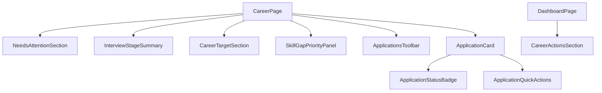

# Phase 12.1: Career UX Polish and Follow-up Reminders

## Goals and constraints

- **Goal**: Make [`src/pages/CareerPage.tsx`](src/pages/CareerPage.tsx) more actionable for active job searching—surface what needs attention, enable one-tap pipeline moves, and show follow-up-aware summaries on Dashboard.
- **Hard constraints** (from [PROJECT_RULES.md](PROJECT_RULES.md), [SECURITY_RULES.md](SECURITY_RULES.md), [docs/architecture.md](docs/architecture.md)):
  - No changes to auth, Supabase schema, [`remoteStorage.ts`](src/core/remoteStorage.ts), [`storage.ts`](src/core/storage.ts), or the `commit` → `saveAppData` → debounced sync pipeline.
  - No new npm dependencies.
  - [`CareerPage`](src/pages/CareerPage.tsx) stays **presentational** (props in, callbacks out).
  - New attention/sort/badge/transition logic lives in [`src/core/career.ts`](src/core/career.ts) with unit tests.
  - No web scraping, job APIs, or AI automation.

**Allowed small wiring outside CareerPage** (not the commit pipeline): optional `onOpenCareer` callback from [`App.tsx`](src/App.tsx) so the dashboard widget can navigate to the Career tab (same pattern as People → Events draft in Phase 11.1).

---

## Current baseline

Phase 12 shipped:

- [`CareerPage`](src/pages/CareerPage.tsx): dream job target, skill gap panel, application list with search + 3 sort modes + 6 status filters
- [`ApplicationCard`](src/components/career/ApplicationCard.tsx): plain status pill (`statusIdle` for all), Details / Edit / Delete only
- [`career.ts`](src/core/career.ts): pipeline summary, search/sort, skill gap resolution—**no follow-up or staleness logic**
- [`CareerPipelineSection`](src/components/dashboard/CareerPipelineSection.tsx): active count, status chips, 3 recent apps (read-only)

**Existing data we can derive from (no model changes):**

| Field | Use |
|-------|-----|
| `status` | Pipeline stage, saved vs applied, interview grouping |
| `appliedDate` | Days since application for "no response" nudges |
| `updatedAtIso` | Days stuck in current stage (status changes already bump this in App) |

Reuse: [`daysBetweenDateKeys`](src/core/events.ts), [`formatLocalDateKey`](src/core/timeline.ts), [`styles.statusOverdue`](src/ui/appStyles.ts) / `statusIdle` / `statusOnTrack` (same tokens as People cards).

---

## Recommended UX improvements

### Include in Phase 12.1 (ship now)

| Improvement | Why now |
|-------------|---------|
| **Needs attention detection** | Core job-search value; pure helper from existing fields |
| **NeedsAttentionSection** on Career page | Surfaces saved bookmarks, stale applied, stuck interview stages at a glance |
| **Interview stage summary bar** | Compact count of screening + technical + onsite (active pipeline visibility) |
| **Status-specific badge styling** | Offer/on-track vs overdue/stale vs neutral saved—scan without expanding |
| **Attention badges on cards** | e.g. "Ready to apply", "No response in 14d", "Stuck in screening 21d" |
| **Quick status transitions** | One tap via existing `onUpdateApplication`; auto-set `appliedDate` when moving saved → applied |
| **Sort: needs attention** | Mirrors [`sortPeopleByFollowUpPriority`](src/core/people.ts) pattern |
| **Filter: needs attention** | Toolbar option alongside existing status filters |
| **Skill gap priority panel** | Upgrade [`SkillGapPanel`](src/components/career/SkillGapPanel.tsx): ordered focus list (linked skills + unlinked text blocks) |
| **Dashboard Career actions widget** | Saved-to-apply count + top attention items + interview count; hidden when empty |
| **Empty / no-results copy polish** | Contextual helper text when attention filter returns nothing |

### Defer to Phase 12.2+ (out of scope)

| Idea | Reason to defer |
|------|-----------------|
| Per-application custom follow-up cadence | Requires model + migration |
| `lastStatusChangeDate` field | `updatedAtIso` is sufficient for v1; schema change not justified yet |
| Skill gap scored by session minutes / "weak skills" | Couples career to progression heuristics; planned for AI/learning-plan phase |
| Link applications to Events (interview deadlines) | Cross-domain; duplicates Events form work |
| Dashboard deep-link with pre-selected filter | Nice polish after attention filter exists |
| Batch status updates / archive | Low priority until lists are longer |
| Offer negotiation tracking, equity fields | Out of original career scope |
| AI posting parse / cover letter draft | Explicit non-goal |
| Push notifications or email reminders | No notification infra |

---

## Model changes

**None required.**

Follow-up rules use constants in [`career.ts`](src/core/career.ts):

```typescript
export const APPLIED_NO_RESPONSE_DAYS = 14;
export const STUCK_IN_STAGE_DAYS = 21;
```

Quick transition side effect (client-only, no schema):

- **saved → applied**: if `appliedDate` is missing, set to `todayKey` on update

---

## Core helper additions ([`src/core/career.ts`](src/core/career.ts))

Add tested helpers (extend [`career.test.ts`](src/core/career.test.ts)):

```typescript
export type ApplicationAttentionReason =
  | "saved_not_applied"
  | "no_response"
  | "stuck_in_stage";

export type ApplicationAttentionStatus = {
  application: JobApplication;
  reasons: ApplicationAttentionReason[];
  daysSinceApplied: number | null;   // from appliedDate
  daysInStage: number | null;        // from updatedAtIso date slice
  priority: number;                 // higher = more urgent (for sort)
};

export type InterviewStageSummary = {
  count: number;
  byStage: Pick<Record<ApplicationStatus, number>, "screening" | "technical" | "onsite">;
  applications: JobApplication[];
};

export type SkillGapPriorityItem =
  | { kind: "linked"; skillId: string; skillName: string; skillPriority?: number }
  | { kind: "unlinked"; label: string };

export type QuickStatusAction = {
  label: string;
  nextStatus: ApplicationStatus;
  setAppliedDateToday?: boolean;
};

// Detection
getApplicationAttentionStatus(app: JobApplication, todayKey: string): ApplicationAttentionStatus | null
buildApplicationsNeedingAttention(apps: JobApplication[], todayKey: string, opts?: { limit?: number }): ApplicationAttentionStatus[]
buildInterviewStageSummary(apps: JobApplication[]): InterviewStageSummary
buildSkillGapPriorityList(skills: Skill[], target: CareerTarget | undefined): SkillGapPriorityItem[]

// Badges / copy
formatAttentionReasonLabel(reason: ApplicationAttentionReason, status: ApplicationAttentionStatus): string
getStatusBadgeVariant(status: ApplicationStatus, attention: ApplicationAttentionStatus | null): "neutral" | "positive" | "warning" | "overdue"

// Quick transitions
getQuickStatusActions(status: ApplicationStatus): QuickStatusAction[]
applyQuickStatusTransition(app: JobApplication, action: QuickStatusAction, todayKey: string): JobApplication

// Sort / filter extensions
export type ApplicationsSortMode = "recent" | "company" | "status" | "needsAttention";
export type ApplicationStatusFilter = ... | "needs-attention";

sortApplicationsByAttentionPriority(items: ApplicationAttentionStatus[]): ApplicationAttentionStatus[]
// Extend filterAndSortApplications to support new sort + filter
```

### Attention rules (v1)

| Reason | Condition |
|--------|-----------|
| `saved_not_applied` | `status === "saved"` |
| `no_response` | `status === "applied"` AND `appliedDate` set AND days since applied ≥ `APPLIED_NO_RESPONSE_DAYS` |
| `stuck_in_stage` | `status ∈ {screening, technical, onsite}` AND days since `updatedAtIso` (date part) ≥ `STUCK_IN_STAGE_DAYS` |

**Not flagged:** `offer`, `rejected`, `withdrawn` (terminal/inactive per [`isActiveApplication`](src/core/career.ts)).

**Priority sort:** `stuck_in_stage` > `no_response` > `saved_not_applied`; tie-break by days descending, then company name.

### Quick transition map

| Current | Primary actions |
|---------|-----------------|
| `saved` | Mark applied (→ `applied`, set date) |
| `applied` | Move to screening |
| `screening` | Move to technical |
| `technical` | Move to onsite |
| `onsite` | Offer / Rejected / Withdrawn |
| Any active (non-terminal) | Rejected, Withdrawn shortcuts in secondary row |

Terminal statuses (`offer`, `rejected`, `withdrawn`): no forward actions; optional "Reopen as applied" deferred.

---

## Component and page changes



| File | Change |
|------|--------|
| [`src/core/career.ts`](src/core/career.ts) | Attention, interview summary, gap priority, quick transitions, extended sort/filter |
| [`src/core/career.test.ts`](src/core/career.test.ts) | Tests for all new helpers and edge cases |
| [`src/components/career/ApplicationStatusBadge.tsx`](src/components/career/ApplicationStatusBadge.tsx) | **New** — status label + variant styling |
| [`src/components/career/ApplicationQuickActions.tsx`](src/components/career/ApplicationQuickActions.tsx) | **New** — primary/secondary transition buttons |
| [`src/components/career/ApplicationCard.tsx`](src/components/career/ApplicationCard.tsx) | Badge row, attention pills, quick actions, summary line with staleness |
| [`src/components/career/NeedsAttentionSection.tsx`](src/components/career/NeedsAttentionSection.tsx) | **New** — top-N attention items with reason labels; hidden when empty |
| [`src/components/career/InterviewStageSummary.tsx`](src/components/career/InterviewStageSummary.tsx) | **New** — compact bar: "2 screening · 1 technical · 0 onsite" |
| [`src/components/career/SkillGapPanel.tsx`](src/components/career/SkillGapPanel.tsx) | Rename internally or add `SkillGapPriorityPanel` wrapper using `buildSkillGapPriorityList`; show numbered focus list |
| [`src/components/career/ApplicationsToolbar.tsx`](src/components/career/ApplicationsToolbar.tsx) | Add "Needs attention" filter + sort option |
| [`src/pages/CareerPage.tsx`](src/pages/CareerPage.tsx) | Wire sections, pass `todayKey`, handle quick transitions via `onUpdateApplication` |
| [`src/components/dashboard/CareerActionsSection.tsx`](src/components/dashboard/CareerActionsSection.tsx) | **New** — replaces or wraps [`CareerPipelineSection`](src/components/dashboard/CareerPipelineSection.tsx) |
| [`src/pages/DashboardPage.tsx`](src/pages/DashboardPage.tsx) | Swap pipeline widget for actions widget; pass `todayKey`, optional `onOpenCareer` |
| [`src/App.tsx`](src/App.tsx) | Optional: `onOpenCareer={() => setPage("career")}` to Dashboard only |

### ApplicationCard layout (mobile-first)

1. **Header**: company + role
2. **Badge row**: [`ApplicationStatusBadge`](src/components/career/ApplicationStatusBadge.tsx) + attention pill(s) when applicable
3. **Summary line**: salary · remote · location · applied date · "In stage N days"
4. **Quick actions**: primary pipeline button (if any) + secondary terminal actions
5. **Standard actions**: Details · Edit · Delete
6. **Expanded panel**: unchanged structure

### Career page section order

1. Header
2. **NeedsAttentionSection** (if any)
3. **InterviewStageSummary** (if any interview-stage apps)
4. Dream job target
5. Skill gap priority panel
6. Applications list + toolbar

---

## Dashboard widget changes

Replace [`CareerPipelineSection`](src/components/dashboard/CareerPipelineSection.tsx) with **CareerActionsSection** (can keep pipeline chips inside it):

- **Saved to apply**: count + up to 2 saved apps
- **Needs attention**: up to 3 items from `buildApplicationsNeedingAttention` with reason labels
- **Interview pipeline**: total in screening/technical/onsite
- **View career** button when `onOpenCareer` provided
- Hidden when `jobApplications.length === 0`

Placement unchanged: after [`PeopleRemindersSection`](src/components/dashboard/PeopleRemindersSection.tsx), before unified timeline ([`DashboardPage.tsx`](src/pages/DashboardPage.tsx)).

Props:

```typescript
type CareerActionsSectionProps = {
  jobApplications: JobApplication[];
  todayKey: string;
  onOpenCareer?: () => void;
};
```

Keep [`buildApplicationPipelineSummary`](src/core/career.ts) for status chip counts inside the widget.

---

## Testing strategy

### Unit tests ([`career.test.ts`](src/core/career.test.ts))

- `getApplicationAttentionStatus`: saved, no_response at threshold, stuck_in_stage, terminal statuses return null
- Edge cases: missing `appliedDate` on applied (no `no_response` flag), exactly at threshold boundaries
- `buildApplicationsNeedingAttention`: ordering by priority, limit option
- `buildInterviewStageSummary`: counts only active interview statuses
- `getQuickStatusActions`: correct actions per status; terminal returns empty
- `applyQuickStatusTransition`: saved→applied sets `appliedDate`; preserves other fields
- `buildSkillGapPriorityList`: linked skills ordered by skill priority desc; unlinked text split into items
- `filterAndSortApplications`: `needs-attention` filter, `needsAttention` sort
- `getStatusBadgeVariant`: overdue vs positive offer vs neutral saved

### Manual UI checklist

- Attention section appears/disappears correctly
- Quick "Mark applied" sets date and updates badge
- Stale applications show overdue styling
- Toolbar filter/sort for needs attention
- Dashboard widget matches Career page attention logic
- Mobile: action buttons wrap; no horizontal overflow
- Sync still works after quick transitions (no pipeline changes)

### Repo checks

- `npm test`, `npm run lint`, `npm run build`
- No migration or sync file diffs

---

## Step-by-step implementation order

1. **Core helpers + tests** — attention detection, interview summary, gap priority list, quick transitions, extended sort/filter.
2. **ApplicationStatusBadge + ApplicationQuickActions** — presentational building blocks.
3. **Upgrade ApplicationCard** — badges, attention pills, quick actions, staleness summary line.
4. **NeedsAttentionSection + InterviewStageSummary** — new Career page sections.
5. **Skill gap priority upgrade** — enhance SkillGapPanel using `buildSkillGapPriorityList`.
6. **ApplicationsToolbar** — needs-attention filter and sort.
7. **CareerPage wiring** — section order, `todayKey`, quick transition handler calling `onUpdateApplication`.
8. **CareerActionsSection + DashboardPage** — replace pipeline widget; optional App nav callback.
9. **Empty states + copy polish** — attention-specific empty messages.
10. **Docs touch-up** — brief note in [docs/architecture.md](docs/architecture.md) Career domain section (attention helpers, dashboard widget name).
11. **Validate** — tests, lint, build, manual Career + Dashboard smoke.

---

## Validation checklist

### Unit tests

- [ ] Attention reasons fire at correct thresholds; terminal statuses excluded
- [ ] Priority sort orders stuck before no_response before saved
- [ ] Quick transitions produce valid `JobApplication` patches
- [ ] saved → applied sets `appliedDate` when missing
- [ ] Interview summary counts screening/technical/onsite only
- [ ] Skill gap priority respects skill priority ordering
- [ ] Filter/sort `needs-attention` / `needsAttention` work with search

### Manual UI

- [ ] Needs attention section lists correct apps with readable reason labels
- [ ] Quick status buttons update card without opening edit form
- [ ] Status badges use overdue/warning/positive variants appropriately
- [ ] Saved jobs show "Ready to apply" and filter works
- [ ] Interview summary bar reflects current pipeline
- [ ] Skill gap panel shows ordered focus list
- [ ] Dashboard career actions widget hidden when no applications
- [ ] "View career" navigates to Career tab
- [ ] Cloud sync unchanged after quick actions

### Repo checks

- [ ] `npm test`, `npm run lint`, `npm run build`
- [ ] No schema/migration/sync/storage diffs
