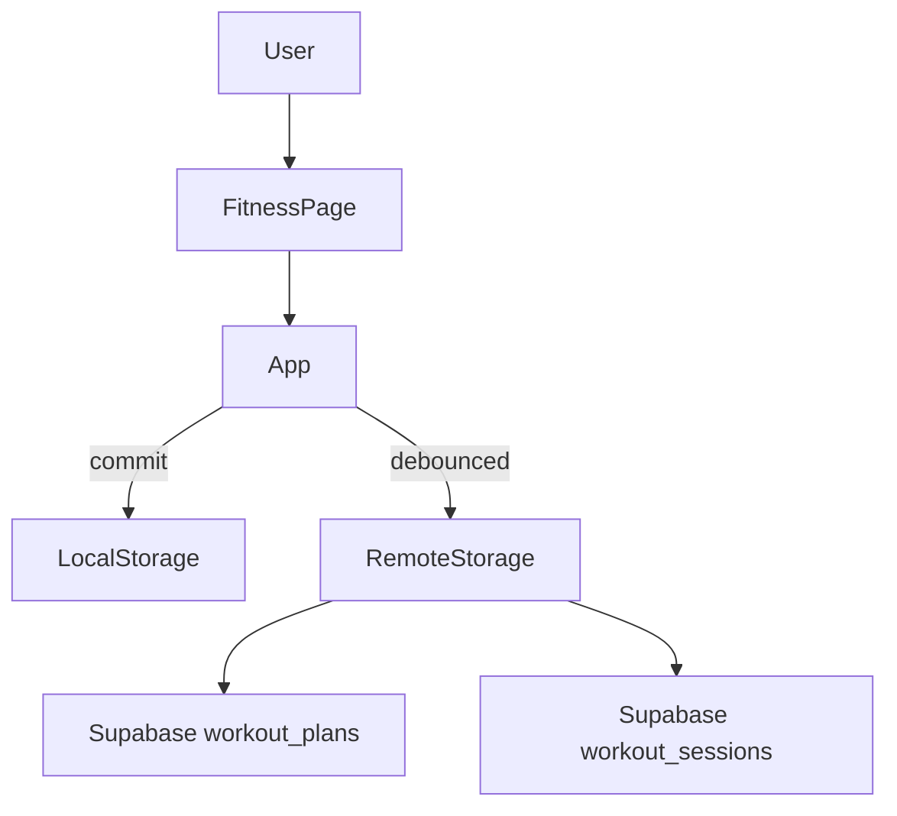
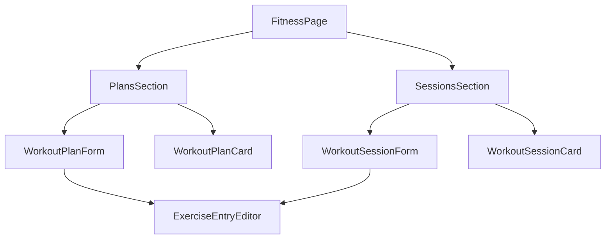

# Phase 13: Fitness and Workout System

## Goals and constraints

- **Goal**: New **Fitness** page to track **workout plans** (templates) and **completed workout sessions** with per-exercise sets, reps, weight, and notes.
- **Hard constraints** ([PROJECT_RULES.md](PROJECT_RULES.md), [SECURITY_RULES.md](SECURITY_RULES.md), [docs/architecture.md](docs/architecture.md)):
  - Same auth/sync/storage pipeline: `commit` → `saveAppData` → debounced `replaceRemotePayload`; RLS-scoped Supabase tables; no custom backend.
  - **No new npm dependencies.**
  - Pure domain logic in [`src/core/fitness.ts`](src/core/fitness.ts) with unit tests.
  - Pages/components stay **presentational** (props in, callbacks out).
  - **Backward compatible**: existing payloads without fitness fields load as empty arrays.
- **Explicitly out of scope for Phase 13**: calorie tracking, supplements, exercise video library, rest timers, charts/PR analytics, Skills XP integration, scheduled plan calendar.

Follow the [Phase 12 career blueprint](.cursor/plans/phase-12-career-system_22355ed7.plan.md): model → migration → mappers → remote sync → App CRUD → page → nav → optional dashboard widget.



---

## Data model proposal

### New types in [`src/core/model.ts`](src/core/model.ts)

```typescript
export type WorkoutFocus =
  | "push"
  | "pull"
  | "legs"
  | "full_body"
  | "cardio"
  | "mobility";

export type ExerciseEntry = {
  id: string;           // UUID; stable row id within plan/session editor
  name: string;         // required when row is included
  sets?: number;        // positive integer
  reps?: number;        // positive integer
  weight?: number;      // non-negative number; unit not stored in v1
  notes?: string;
};

export type WorkoutPlan = {
  id: string;
  name: string;         // e.g. "Push A", "Leg day"
  focus?: WorkoutFocus;
  exercises: ExerciseEntry[];
  notes?: string;
  createdAtIso: string;
  updatedAtIso: string;
};

export type WorkoutSession = {
  id: string;
  date: string;         // ISO date "YYYY-MM-DD" (workout date)
  focus?: WorkoutFocus;
  planId?: string;      // optional link to WorkoutPlan.id (informational)
  exercises: ExerciseEntry[];
  notes?: string;
  createdAtIso: string;
  updatedAtIso: string;
};
```

Extend [`AppPayload`](src/core/model.ts):

```typescript
export type AppPayload = {
  // ...existing fields...
  workoutPlans: WorkoutPlan[];       // new; default []
  workoutSessions: WorkoutSession[];   // new; default []
};
```

Update [`defaultPayload()`](src/core/state.ts) and [`normalizePayload()`](src/core/storage.ts) with `workoutPlans: []` and `workoutSessions: []`.

### Design rationale

| Choice | Rationale |
|--------|-----------|
| **Two entities** (`WorkoutPlan` + `WorkoutSession`) | Plans are reusable templates; sessions are dated logs. Matches user mental model and keeps v1 small. |
| **Embedded `ExerciseEntry[]`** (not a third table) | Satisfies “track exercises” within plans/sessions without catalog CRUD, extra sync tables, or junction complexity. |
| **`exercises` as jsonb arrays** | Same pattern as `required_skill_ids` in career; replace-all sync stays simple. |
| **`planId` optional on sessions** | “Log from plan” copies exercises and records origin; session data remains complete if plan is later deleted. |
| **No weight unit field** | Avoid premature locale/settings work; display raw number in UI (user picks lbs/kg mentally). Add `weightUnit` in a later phase if needed. |
| **`WorkoutFocus` enum** | Covers requested push/pull/legs/full body/cardio/mobility with DB check constraint. |

**How “exercises” are tracked in v1:** each plan/session owns an ordered list of `ExerciseEntry` rows. There is no global exercise library table. Phase 13.1 can add autocomplete from historical names via a pure helper in `fitness.ts`.

---

## Supabase schema / migration

New file: [`supabase/migrations/20260527400000_fitness.sql`](supabase/migrations/20260527400000_fitness.sql)

### `workout_plans`

```sql
CREATE TABLE public.workout_plans (
  id uuid PRIMARY KEY DEFAULT extensions.gen_random_uuid(),
  user_id uuid NOT NULL REFERENCES auth.users (id) ON DELETE CASCADE,
  name text NOT NULL,
  focus text NULL,
  exercises jsonb NOT NULL DEFAULT '[]'::jsonb,
  notes text NULL,
  created_at timestamptz NOT NULL DEFAULT now(),
  updated_at timestamptz NOT NULL DEFAULT now(),
  CONSTRAINT workout_plans_name_nonempty_chk CHECK (char_length(name) > 0),
  CONSTRAINT workout_plans_focus_chk CHECK (
    focus IS NULL OR focus IN ('push','pull','legs','full_body','cardio','mobility')
  ),
  CONSTRAINT workout_plans_exercises_array_chk CHECK (jsonb_typeof(exercises) = 'array')
);
```

Index: `(user_id, updated_at DESC)`.

### `workout_sessions`

```sql
CREATE TABLE public.workout_sessions (
  id uuid PRIMARY KEY DEFAULT extensions.gen_random_uuid(),
  user_id uuid NOT NULL REFERENCES auth.users (id) ON DELETE CASCADE,
  workout_date date NOT NULL,
  focus text NULL,
  plan_id uuid NULL,
  exercises jsonb NOT NULL DEFAULT '[]'::jsonb,
  notes text NULL,
  created_at timestamptz NOT NULL DEFAULT now(),
  updated_at timestamptz NOT NULL DEFAULT now(),
  CONSTRAINT workout_sessions_focus_chk CHECK (
    focus IS NULL OR focus IN ('push','pull','legs','full_body','cardio','mobility')
  ),
  CONSTRAINT workout_sessions_exercises_array_chk CHECK (jsonb_typeof(exercises) = 'array')
);
```

Indexes: `(user_id, workout_date DESC)`, `(user_id, plan_id)` where useful for lookups.

**No Postgres FK from `plan_id` to `workout_plans`**: consistent with replace-all sync and jsonb-only refs elsewhere. Referential integrity enforced in [`validatePayloadForUpload`](src/core/dbMappers.ts).

Both tables: standard `updated_at` trigger, RLS (select/insert/update/delete own rows), revoke from `PUBLIC`/`anon`, grant to `authenticated` — same pattern as [`20260527300000_career.sql`](supabase/migrations/20260527300000_career.sql).

---

## Mapper / storage / sync changes

### [`src/core/dbMappers.ts`](src/core/dbMappers.ts)

Add `WorkoutPlanRow`, `WorkoutSessionRow`, and mappers:

- `workoutPlanToRow` / `workoutPlanFromRow`
- `workoutSessionToRow` / `workoutSessionFromRow`
- `parseExerciseEntries(jsonb)` — validate array of objects with UUID `id`, non-empty trimmed `name`, optional positive `sets`/`reps`, non-negative `weight`, optional `notes`
- `assertValidWorkoutPlan`, `assertValidWorkoutSession`, `assertValidExerciseEntry`
- Extend `payloadFromRows(..., workoutPlanRows?, workoutSessionRows?)` → `{ workoutPlans, workoutSessions }`
- Extend `validatePayloadForUpload`:
  - Unique plan and session IDs
  - `session.planId` exists in `workoutPlans` when set
  - Each plan/session has ≥1 valid exercise entry (name non-empty)
  - Focus enum validation
  - `workout_date` / ISO date format on sessions

### [`src/core/dbMappers.test.ts`](src/core/dbMappers.test.ts)

Round-trip tests, invalid focus/exercise jsonb rejection, orphan `planId` rejection, empty exercise list rejection.

### [`src/core/remoteStorage.ts`](src/core/remoteStorage.ts)

Extend `AppTable` with `"workout_plans" | "workout_sessions"`.

**Fetch** (parallel):

```typescript
supabase.from("workout_plans").select("*").eq("user_id", userId),
supabase.from("workout_sessions").select("*").eq("user_id", userId),
```

**Replace ordering** (upsert then delete-not-in):

1. Upsert: … → **workout_plans** → **workout_sessions**
2. Delete-not-in: … → **workout_plans** → **workout_sessions**

Extend `payloadHasData()`:

```typescript
payload.workoutPlans.length > 0 || payload.workoutSessions.length > 0
```

### [`src/core/storage.ts`](src/core/storage.ts)

```typescript
workoutPlans: Array.isArray(p.workoutPlans) ? p.workoutPlans : [],
workoutSessions: Array.isArray(p.workoutSessions) ? p.workoutSessions : [],
```

Backup export/import automatically includes new fields via full payload JSON.

---

## Core fitness helpers

New [`src/core/fitness.ts`](src/core/fitness.ts) + [`src/core/fitness.test.ts`](src/core/fitness.test.ts):

```typescript
// Labels and display
WORKOUT_FOCUS_LABELS: Record<WorkoutFocus, string>
formatWorkoutFocus(focus?: WorkoutFocus): string
formatExerciseSummary(entry: ExerciseEntry): string   // e.g. "3×10 @ 135"
formatSessionHeadline(session: WorkoutSession): string

// Search / sort
type PlansSortMode = "recent" | "name" | "focus"
type SessionsSortMode = "recent" | "date" | "focus"
type WorkoutFocusFilter = WorkoutFocus | "all"
planMatchesQuery(plan, query): boolean
sessionMatchesQuery(session, query): boolean
filterAndSortPlans(plans, opts): WorkoutPlan[]
filterAndSortSessions(sessions, opts): WorkoutSession[]

// Summaries (dashboard + page headers)
buildWorkoutWeekSummary(sessions, todayKey): { count: number; byFocus: Partial<Record<WorkoutFocus, number>> }
buildRecentSessions(sessions, limit): WorkoutSession[]
getLastSession(sessions): WorkoutSession | undefined

// Plan → session workflow
copyExercisesFromPlan(plan: WorkoutPlan): ExerciseEntry[]   // new UUIDs per entry
createSessionDraftFromPlan(plan, dateKey): Omit<WorkoutSession, "id" | "createdAtIso" | "updatedAtIso">

// Optional autocomplete helper (used by forms, no extra persistence)
collectRecentExerciseNames(plans, sessions, limit?): string[]
```

Header comment documents future AI extension points (workout plan generation, form-check notes) — same style as [`career.ts`](src/core/career.ts).

---

## Fitness page UI structure

New [`src/pages/FitnessPage.tsx`](src/pages/FitnessPage.tsx) — orchestrator (mirror [`PeoplePage.tsx`](src/pages/PeoplePage.tsx) / [`CareerPage.tsx`](src/pages/CareerPage.tsx)).



| File | Responsibility |
|------|----------------|
| [`src/pages/FitnessPage.tsx`](src/pages/FitnessPage.tsx) | Page shell, dual-section layout, form visibility, search/sort/filter state |
| [`src/components/fitness/WorkoutPlanCard.tsx`](src/components/fitness/WorkoutPlanCard.tsx) | Collapsed plan summary, exercise count, focus badge, “Log session” action |
| [`src/components/fitness/WorkoutPlanForm.tsx`](src/components/fitness/WorkoutPlanForm.tsx) | Add/edit plan: name, focus, notes, exercise rows |
| [`src/components/fitness/WorkoutSessionCard.tsx`](src/components/fitness/WorkoutSessionCard.tsx) | Date, focus, exercise summaries, linked plan name |
| [`src/components/fitness/WorkoutSessionForm.tsx`](src/components/fitness/WorkoutSessionForm.tsx) | Add/edit session: date, focus, plan picker, exercise rows |
| [`src/components/fitness/ExerciseEntryEditor.tsx`](src/components/fitness/ExerciseEntryEditor.tsx) | Shared add/remove/reorder rows (name, sets, reps, weight, notes) |
| [`src/components/fitness/WorkoutFocusBadge.tsx`](src/components/fitness/WorkoutFocusBadge.tsx) | Focus pill using existing [`styles.statusPill`](src/ui/appStyles.ts) tokens |
| [`src/components/fitness/FitnessToolbar.tsx`](src/components/fitness/FitnessToolbar.tsx) | Search + focus filter + sort (reused per section or shared with `mode` prop) |
| [`src/components/fitness/workoutPlanFormState.ts`](src/components/fitness/workoutPlanFormState.ts) | Form state, validation, payload builders |
| [`src/components/fitness/workoutSessionFormState.ts`](src/components/fitness/workoutSessionFormState.ts) | Form state, validation, payload builders |

### Page layout (mobile-first)

1. **Header** — “Fitness” + short helper copy
2. **Workout plans** — toolbar + plan cards; empty state: “Create a plan to reuse your usual exercises.”
3. **Workout sessions** — toolbar + session cards (newest first); empty state: “Log a workout when you’re done.”
4. **Inline forms** — toggle per section (same pattern as People/Career)

### Key interactions

- **Create plan** → inline form with ≥1 exercise row
- **Edit / delete plan** → standard card actions
- **Log session from plan** → pre-fill session form via `createSessionDraftFromPlan`; user can edit before save
- **Log session manually** → empty session form, date defaults to today (`formatLocalDateKey`)
- **Delete plan** → App clears `planId` on affected sessions in same `commit` (mirror `deletePerson` → `events.personId` cleanup)

### Sort / filter modes

- **Plans sort**: `recent` (updatedAtIso desc), `name` (alpha), `focus`
- **Sessions sort**: `recent` (date desc, then updatedAtIso), `date`, `focus`
- **Focus filter**: all | push | pull | legs | full_body | cardio | mobility
- **Search**: plan name/notes/exercise names; session notes/exercise names

---

## App wiring

### [`src/pages/types.ts`](src/pages/types.ts)

```typescript
export type Page = "dashboard" | "skills" | "events" | "people" | "career" | "fitness";
```

### [`src/App.tsx`](src/App.tsx)

New handlers (same `commit` / `syncReadyRef` guard):

- `addWorkoutPlan(input)` / `updateWorkoutPlan(plan)` / `deleteWorkoutPlan(id)`
- `addWorkoutSession(input)` / `updateWorkoutSession(session)` / `deleteWorkoutSession(id)`
- `deleteWorkoutPlan`: strip `planId` from sessions referencing deleted plan

Pass to `FitnessPage`:

```typescript
workoutPlans={app.payload.workoutPlans ?? []}
workoutSessions={app.payload.workoutSessions ?? []}
onAddPlan / onUpdatePlan / onDeletePlan
onAddSession / onUpdateSession / onDeleteSession
```

### [`src/components/layout/AppShell.tsx`](src/components/layout/AppShell.tsx)

Add **Fitness** nav button after Career.

---

## Dashboard integration (recommended — small)

Add [`src/components/dashboard/FitnessSummarySection.tsx`](src/components/dashboard/FitnessSummarySection.tsx):

- **Hidden when** both `workoutPlans` and `workoutSessions` are empty
- **Shows**:
  - Sessions logged this calendar week (`buildWorkoutWeekSummary`)
  - Last workout: date + focus + top exercise line
  - Up to 2 recent session one-liners
  - Optional “View fitness” button via `onOpenFitness` callback (same pattern as [`CareerActionsSection`](src/components/dashboard/CareerActionsSection.tsx))
- **Placement**: after `CareerActionsSection`, before `UnifiedTimelineSection` in [`DashboardPage.tsx`](src/pages/DashboardPage.tsx)

Wire `onOpenFitness={() => setPage("fitness")}` from `App`.

**Not recommended for v1**: “today’s scheduled plan” widget (requires plan scheduling — defer to Phase 13.1).

---

## Future phases (deferred)

| Phase | Scope |
|-------|--------|
| **13.1 Fitness UX** | Exercise name autocomplete (`collectRecentExerciseNames`), PR highlights, volume/streak summaries, plan duplicate, richer session cards |
| **13.2 Plan scheduling** | Assign plans to weekdays; dashboard “planned for today” |
| **14 Calorie tracker** | `MealEntry` / daily calorie targets; separate tables; no coupling to workout sessions in v1 |
| **15 Supplement tracker** | `Supplement` + dose log; schedule/reminder fields |
| **Optional later** | Weight unit preference, rest timers, Skills cross-link (e.g. “Mobility” skill minutes), unified timeline entries for workouts |

---

## Step-by-step implementation order

1. **Migration** — `20260527400000_fitness.sql` (tables, indexes, RLS, triggers)
2. **Model + defaults** — types in `model.ts`; `defaultPayload` + `normalizePayload`
3. **DB mappers** — row types, parse/validate exercise jsonb, `payloadFromRows`, `validatePayloadForUpload`; tests in `dbMappers.test.ts`
4. **Remote sync** — extend `remoteStorage.ts` fetch/upsert/delete/payloadHasData
5. **Core fitness** — `fitness.ts` helpers + `fitness.test.ts`
6. **App CRUD** — handlers in `App.tsx` including plan-delete cascade on `planId`
7. **Fitness page + components** — page shell and form/card/editor components under `components/fitness/`
8. **Nav** — `Page` type, `AppShell` button, `App` render block
9. **Dashboard widget** — `FitnessSummarySection` + `DashboardPage` / `App` wiring
10. **Docs + validate** — update [`docs/architecture.md`](docs/architecture.md) Fitness section; run `npm test`, `npm run lint`, `npm run build`

---

## Validation checklist

### Automated

- [ ] `npm test` — `fitness.test.ts`, extended `dbMappers.test.ts`
- [ ] `npm run lint`
- [ ] `npm run build`

### Manual — Fitness page

- [ ] Create plan with multiple exercises; edit and delete
- [ ] Log session manually with date, focus, sets/reps/weight
- [ ] “Log from plan” pre-fills exercises; saved session retains editable data
- [ ] Search, focus filter, and sort modes behave on both sections
- [ ] Delete plan clears `planId` on linked sessions (no upload validation failure)

### Manual — Sync and backup

- [ ] Fresh account: empty fitness arrays; add data → refresh → persists locally
- [ ] Remote sync enabled: second browser/device sees plans and sessions after debounced sync
- [ ] Export backup JSON includes `workoutPlans` / `workoutSessions`; import restores them
- [ ] `VITE_ENABLE_REMOTE_SYNC=false`: local-only still works

### Manual — Dashboard

- [ ] `FitnessSummarySection` hidden with no fitness data
- [ ] Shows week count + last session when sessions exist
- [ ] “View fitness” navigates to Fitness tab

### Security / architecture

- [ ] No new env vars or secrets; client uses anon key + RLS only
- [ ] `validatePayloadForUpload` rejects malformed exercise jsonb and orphan `planId`
- [ ] Pages/components do not call `saveAppData` or Supabase directly
