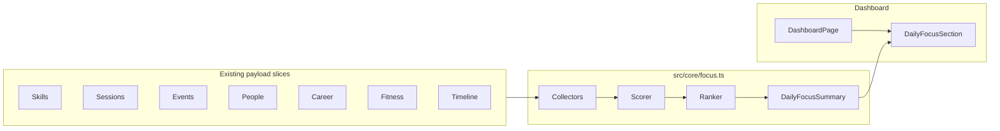

# Phase 14: Daily Focus Engine / Unified Planner

## Goals and constraints

- **Goal**: Answer “What should I focus on today?” with a single ranked list of actionable recommendations derived from existing structured data.
- **Hard constraints** ([PROJECT_RULES.md](PROJECT_RULES.md), [SECURITY_RULES.md](SECURITY_RULES.md), [docs/architecture.md](docs/architecture.md)):
  - All scoring, collection, deduplication, and ranking live in [`src/core/focus.ts`](src/core/focus.ts) (pure, unit-tested).
  - Dashboard/components stay **presentational** — props in, events out.
  - **No** auth/sync/Supabase schema/storage changes, **no** new npm dependencies, **no** AI, notifications, auto-rescheduling, or external APIs.
  - **Recommendations only** — engine never mutates user data.
- **Scope**: Dashboard widget v1; existing per-domain dashboard sections remain (complementary detail, not replaced).



---

## 1. Focus scoring strategy

Use a **single numeric `priorityScore`** (higher = more important) composed of layered components. Keep weights as named constants at the top of `focus.ts` for tuning and tests.

### Score formula (per item)

```
priorityScore = categoryBase + urgencyBonus + severityBonus + skillPriorityBonus + timeOfDayBonus
```

| Layer | Purpose | Examples |
|-------|---------|----------|
| `categoryBase` | Domain importance floor | Timeline conflict: 900; event today: 850; skill overdue: 800 |
| `urgencyBonus` | Time proximity | `daysUntil === 0` → +100; tomorrow → +50; each overdue day → +5 (cap 50) |
| `severityBonus` | Magnitude | Minutes behind schedule; conflict overlap minutes; days overdue on follow-up |
| `skillPriorityBonus` | User-set skill priority | `(skill.priority ?? 0) * 25` |
| `timeOfDayBonus` | Streak / EOD nudges | After 18:00 local and streak not active today → +80 |

### Urgency label mapping (derived from final score)

| `FocusPriority` | Score range | UI label |
|-----------------|-------------|----------|
| `critical` | ≥ 950 | Critical |
| `high` | 750–949 | High |
| `medium` | 500–749 | Medium |
| `low` | &lt; 500 | Low |

Recompute `urgencyLabel` from score **after** all bonuses (not from domain alone) so cross-domain ranking stays consistent.

### Time-of-day behavior

- Accept `now?: Date` (default `new Date()`) alongside `todayKey = formatLocalDateKey(now)`.
- **Morning** (&lt; 12:00): boost today’s timed events and schedule conflicts.
- **Afternoon/evening** (≥ 18:00): boost streak-at-risk, incomplete daily goals, and overdue skills.
- **Streak risk** only fires when `currentStreak > 0`, `!streakActiveToday`, and local hour ≥ 16 (configurable constant).

### Deduplication

- One focus item per `(category, sourceId)` when `sourceId` is set.
- When the same entity would produce multiple reason codes (e.g. skill both overdue and streak-at-risk), **merge** into one item with combined `reasonCodes[]` and take the **max** component scores.
- Cap raw collectors per domain before merge (see §5) to avoid one domain flooding the list.

---

## 2. Focus item type definitions

All types live in [`src/core/focus.ts`](src/core/focus.ts) (not `model.ts` — focus output is derived/ephemeral, not persisted).

```typescript
export type FocusCategory =
  | "skill"
  | "event"
  | "people"
  | "career"
  | "fitness"
  | "timeline";

export type FocusPriority = "critical" | "high" | "medium" | "low";

export type FocusReasonCode =
  // skill
  | "skill_overdue"
  | "skill_daily_goal_incomplete"
  | "skill_streak_at_risk"
  | "skill_high_priority"
  // event
  | "event_today"
  | "event_tomorrow"
  | "event_urgent_upcoming"
  | "event_deadline"
  // people
  | "people_birthday_today"
  | "people_birthday_soon"
  | "people_follow_up_overdue"
  // career
  | "career_saved_not_applied"
  | "career_no_response"
  | "career_stuck_in_stage"
  | "career_interview_active"
  | "career_skill_gap"
  // fitness
  | "fitness_no_workout_this_week"
  | "fitness_long_gap_since_last"
  | "fitness_log_from_plan"
  // timeline
  | "timeline_schedule_conflict"
  | "timeline_high_blocked_time"
  | "timeline_low_available_skill_time";

export type FocusItem = {
  id: string;                    // stable: `${category}:${sourceId ?? slug}`
  category: FocusCategory;
  title: string;
  description: string;
  priorityScore: number;
  urgency: FocusPriority;
  urgencyLabel: string;          // "Critical" | "High" | "Medium" | "Low"
  actionLabel?: string;          // e.g. "Log minutes", "View career"
  sourceId?: string;             // skillId, eventId, personId, applicationId, etc.
  estimatedMinutes?: number;
  reasonCodes: FocusReasonCode[];
};

export type DailyFocusSummary = {
  todayKey: string;
  generatedAtIso: string;
  items: FocusItem[];            // ranked, capped
  byCategory: Record<FocusCategory, FocusItem[]>;
  headline?: string;             // e.g. "3 high-priority items today"
  context: DailyFocusContext;    // non-actionable workload stats for UI subtitle
};

export type DailyFocusContext = {
  skillOverdueCount: number;
  eventsTodayCount: number;
  timelineConflictMinutes: number;
  netAvailableSkillMinutes: number;
  workoutsThisWeek: number;
  applicationsNeedingAttention: number;
};
```

### Public API

```typescript
export type BuildDailyFocusInput = {
  skills: Skill[];
  sessions: Session[];
  events: LifeEvent[];
  people: Person[];
  jobApplications: JobApplication[];
  careerTarget?: CareerTarget;
  workoutPlans: WorkoutPlan[];
  workoutSessions: WorkoutSession[];
  todayKey: string;
  now?: Date;
  opts?: { maxItems?: number; perCategoryCap?: number };
};

export function buildDailyFocusSummary(input: BuildDailyFocusInput): DailyFocusSummary;
```

Internal helpers (exported for tests only if useful): `collectSkillFocusItems`, `collectEventFocusItems`, etc., plus `scoreFocusItem`, `mergeFocusItems`, `rankFocusItems`, `priorityFromScore`.

---

## 3. Signal sources → focus items

Reuse existing domain builders; **do not duplicate** their business rules. Collectors call helpers, then map DTOs → `FocusItem` drafts with reason codes and raw bonuses.

### Skills ([`dashboardStats.ts`](src/core/dashboardStats.ts), [`progression.ts`](src/core/progression.ts))

| Signal | Source | Focus item |
|--------|--------|------------|
| Overdue schedule | `buildSkillDayRows` → `status === "overdue"` | “Catch up on {skill}” — `skill_overdue`; `estimatedMinutes = expectedByNow - todayMinutes`; `sourceId = skill.id` |
| Daily goal incomplete | row with `progressTargetMinutes` and `todayMinutes < target` (even if not overdue) | “Hit daily goal for {skill}” — `skill_daily_goal_incomplete` |
| Streak at risk | `buildSkillProgressions` → `currentStreak > 0 && !streakActiveToday` (+ time gate) | “Keep your {n}-day streak on {skill}” — `skill_streak_at_risk` |
| High priority idle | `skill.priority >= 3` and `plannedTodayMinutes > 0` and `status === "idle"` late day | `skill_high_priority` (lower base than overdue) |

### Events ([`events.ts`](src/core/events.ts))

| Signal | Source | Focus item |
|--------|--------|------------|
| Events today | `buildUpcomingEventItems(..., windowDays: 1)` or filter `daysUntil === 0` | “{title} today” — `event_today`; boost if `event.reminder` |
| Urgent upcoming | items with `daysUntil <= 2` | `event_tomorrow` / `event_urgent_upcoming` |
| Deadlines | `event.type === "deadline"` within 3 days | `event_deadline` |

Use `resolveEventPersonLabel` from [`people.ts`](src/core/people.ts) for descriptions when `personId` is set.

### People ([`people.ts`](src/core/people.ts))

| Signal | Source | Focus item |
|--------|--------|------------|
| Birthday today | `buildUpcomingBirthdayItems` → `daysUntil === 0` | `people_birthday_today` |
| Birthday soon | within 7 days (tighter than dashboard’s 30-day window) | `people_birthday_soon` |
| Follow-up overdue | `buildPeopleNeedingFollowUp` | `people_follow_up_overdue`; severity = `daysSinceContact - cadenceDays` |

### Career ([`career.ts`](src/core/career.ts))

| Signal | Source | Focus item |
|--------|--------|------------|
| Needs attention | `buildApplicationsNeedingAttention` | Map `ApplicationAttentionReason` → reason codes; reuse `status.priority` as `severityBonus` baseline |
| Saved ready to apply | `status === "saved"` (top 2 by recency if many) | `career_saved_not_applied`; action “View career” |
| Interview active | `buildInterviewStageSummary` applications not already flagged stuck | `career_interview_active` (prep nudge, medium priority) |
| Dream job skill gap | `buildSkillGapPriorityList(skills, careerTarget)` top 1 linked skill | `career_skill_gap` (only if `careerTarget` present) |

**App wiring note**: [`App.tsx`](src/App.tsx) currently does **not** pass `careerTarget` to `DashboardPage`. Phase 14 adds `careerTarget?: CareerTarget` to dashboard props (read-only pass-through — no sync change).

### Fitness ([`fitness.ts`](src/core/fitness.ts))

| Signal | Source | Focus item |
|--------|--------|------------|
| No workout this week | `buildWorkoutWeekSummary` → `count === 0` and user has plans or past sessions | `fitness_no_workout_this_week` |
| Long gap | `getLastSession` + `daysBetweenDateKeys(last.date, todayKey) >= 4` | `fitness_long_gap_since_last` |
| Log from plan | `workoutPlans.length > 0` and no session today | `fitness_log_from_plan` (low; only if no higher fitness signal) |

Compute days-since-last inline in `focus.ts` using `daysBetweenDateKeys` from `events.ts` — no new fitness.ts export required unless tests want a shared helper.

### Timeline ([`timeline.ts`](src/core/timeline.ts))

| Signal | Source | Focus item |
|--------|--------|------------|
| Schedule conflicts | `buildUnifiedTimelineRange(..., today, today)` → `conflicts` where `reason === "eventBlocksSchedule"` | One item per conflict or one aggregated “{n} schedule conflicts today” if &gt; 2 — `timeline_schedule_conflict`; `estimatedMinutes = overlapMinutes` |
| High blocked time | `computeDailyWorkloadForDay` → `blockedMinutes >= 480` (8h) | `timeline_high_blocked_time` |
| Low available skill time | `netAvailableForSkillsMinutes < 30` and `plannedSkillMinutes > 0` | `timeline_low_available_skill_time` |

Populate `DailyFocusContext` from the same timeline/workload computation (single pass).

---

## 4. Ranking algorithm

1. **Collect** items from all collectors (respect per-category caps, default 4 each).
2. **Merge** by `(category, sourceId)`.
3. **Score** each merged item → set `priorityScore` and derive `urgency` / `urgencyLabel`.
4. **Sort** descending by:
   - `priorityScore`
   - category tie-break order: `timeline` → `event` → `skill` → `people` → `career` → `fitness`
   - `title` localeCompare (stable, deterministic)
5. **Slice** to `maxItems` (default **5** for dashboard primary list).
6. **Build** `byCategory` from the full pre-slice merged set (or post-slice — document choice: **pre-slice** for category counts, **display uses top N**).

---

## 5. How many items to show on dashboard

| Surface | Count | Rationale |
|---------|-------|-----------|
| Primary ranked list | **5** (`FOCUS_DASHBOARD_MAX_ITEMS`) | Fits mobile; matches people/career sub-lists |
| Per-category collector cap | **4** (`FOCUS_PER_CATEGORY_CAP`) | Prevents skills from dominating |
| Empty state | Show friendly copy when `items.length === 0` | “You’re caught up — no urgent focus items today.” |
| Context line | Always show `DailyFocusContext` one-liner when items exist | e.g. “2 conflicts · 45m available for skills · 1 workout this week” |

Do **not** hide the section when empty — unlike `FitnessSummarySection`, the Focus section is the dashboard hero for planning and should explain “all clear.”

---

## 6. New core file structure

```
src/core/
  focus.ts          # types, constants, collectors, scoring, buildDailyFocusSummary
  focus.test.ts     # deterministic unit tests (fixed todayKey + now)
```

**No changes** to `model.ts`, `storage.ts`, `remoteStorage.ts`, `dbMappers.ts`, or migrations.

Optional **minimal** touch to [`docs/architecture.md`](docs/architecture.md): add `focus.ts` to core list and dashboard section order.

Header comment in `focus.ts` (mirror career/people/fitness pattern):

```typescript
/**
 * Pure Daily Focus Engine — ranked read-only recommendations.
 *
 * Future AI extension points (not implemented):
 * - FocusContext bundle for “explain my day” prompts
 * - Natural-language summaries from reasonCodes + context
 * - Personalized weight tuning from user feedback
 *
 * Future: buildFocusContext(summary: DailyFocusSummary): FocusContext
 */
```

---

## 7. Dashboard component structure

### New presentational component

[`src/components/dashboard/DailyFocusSection.tsx`](src/components/dashboard/DailyFocusSection.tsx)

**Props** (Pattern A — page computes, section renders):

```typescript
export type DailyFocusSectionProps = {
  summary: DailyFocusSummary;
  onOpenSkills?: () => void;
  onOpenEvents?: () => void;
  onOpenPeople?: () => void;
  onOpenCareer?: () => void;
  onOpenFitness?: () => void;
  onAddSession?: (skillId: string, minutes: number) => void;
};
```

**UI structure** (mirror [`CareerActionsSection`](src/components/dashboard/CareerActionsSection.tsx) + [`FitnessSummarySection`](src/components/dashboard/FitnessSummarySection.tsx)):

- `<section aria-label="Daily focus">`
- `h2` “Today’s focus” + optional context subtitle from `summary.context`
- Ranked list: each row shows urgency pill (`styles.statusPill`), title, description, optional `actionLabel` button
- Category icon/emoji or text badge (reuse `priorityEmoji` pattern from [`ui/format.ts`](src/ui/format.ts) if applicable; add small `formatFocusCategory` in `focus.ts` or `format.ts`)
- Skill items with `sourceId` + `onAddSession`: optional inline quick-log (same as `OverdueBehindSection` pattern)
- Deep-link buttons call optional `onOpen*` callbacks (wire new nav callbacks in `App.tsx` only for pages that exist today: career, fitness; skills/events/people via `setPage`)

### DashboardPage changes

[`src/pages/DashboardPage.tsx`](src/pages/DashboardPage.tsx):

- Add `careerTarget?: CareerTarget` to props.
- `useMemo(() => buildDailyFocusSummary({ ... }), [all slices, today])`.
- Insert `<DailyFocusSection />` **immediately after `TodayHero`** (before domain-specific widgets) — this is the unified answer; existing sections remain below for drill-down.

### App.tsx changes (minimal, allowed)

- Pass `careerTarget={app.payload.careerTarget}` to `DashboardPage`.
- Add optional `onOpenSkills`, `onOpenEvents`, `onOpenPeople` callbacks (`setPage(...)`) for focus row actions.

**No** new `Page` type, **no** `AppShell` nav entry in v1.

---

## 8. Dedicated Focus page vs dashboard-only v1

**Recommendation: dashboard-only v1.**

| Option | Pros | Cons |
|--------|------|------|
| Dashboard-only | No CRUD, no nav clutter, no empty page; matches Phase 10 events widget pattern | Full history / “snooze” not available |
| Dedicated Focus page | Room for filters, history, user prefs | Implies persisted focus state or richer UX — out of scope |

Defer Focus page until Phase 14.1+ when there is persisted user feedback (dismiss/snooze/pin) or AI explanations. v1 is read-only recommendations computed at render time.

---

## 9. Testing strategy

New file [`src/core/focus.test.ts`](src/core/focus.test.ts) following [`fitness.test.ts`](src/core/fitness.test.ts) / [`career.test.ts`](src/core/career.test.ts) conventions:

- Fixed anchors: `TODAY = "2026-05-27"`, `NOW = new Date("2026-05-27T18:30:00")` (local-safe factory helper).
- Factory helpers: `sampleSkill`, `sampleEvent`, etc. with spread overrides.

**Test groups**:

1. **Scoring / urgency bands** — known inputs → expected `priorityScore` and `urgency`.
2. **Per-domain collectors** — one domain at a time, assert reason codes and titles.
3. **Ranking** — cross-domain fixture where timeline conflict beats fitness nudge.
4. **Merge** — skill overdue + streak risk → single item, both reason codes.
5. **Caps** — 10 skill overdue → max 4 collected, top 5 overall in summary.
6. **Empty payload** — empty arrays → `items: []`, sensible headline.
7. **Edge cases** — no skills but events exist; career target without applications; leap-year birthday (delegate to people builder, assert focus maps correctly).
8. **Determinism** — same input + `now` → identical `id` and order.

Run `npm test`, `npm run lint`, `npm run build` before merge.

---

## 10. Step-by-step implementation order

1. **Types + constants** — `FocusItem`, `DailyFocusSummary`, weight constants, `priorityFromScore`.
2. **Scoring utilities** — `scoreFocusItem`, `mergeFocusItems`, `rankFocusItems`.
3. **Collectors** — one domain at a time (skill → event → people → career → fitness → timeline).
4. **`buildDailyFocusSummary`** — orchestrator + `DailyFocusContext`.
5. **`focus.test.ts`** — write alongside collectors (TDD-friendly order).
6. **`DailyFocusSection.tsx`** — presentational UI.
7. **`DashboardPage.tsx`** — wire `useMemo` + placement after `TodayHero`.
8. **`App.tsx`** — pass `careerTarget` + optional `onOpen*` page callbacks.
9. **`docs/architecture.md`** — document focus module and dashboard order.
10. **Validate** — test/lint/build + manual dashboard check (morning vs evening, empty state, mixed domains).

---

## 11. Risks and edge cases

| Risk | Mitigation |
|------|------------|
| **Duplicate noise** (same app in career section + focus list) | Expected in v1; focus is unified rank. Copy should be concise; dedupe by `sourceId`. |
| **Skills dominate** | Per-category cap + overdue uses schedule not raw session count |
| **Morning vs evening flip** | Document `now` in tests; use hour gates explicitly |
| **Timezone / date key drift** | Always derive `todayKey` from same `now` passed to all collectors |
| **No skills but other domains** | Engine still produces event/people/career/fitness items; hide skill-specific context counts |
| **Stale `today` on long-lived tab** | Same as existing dashboard (`formatLocalDateKey(new Date())` each render) — acceptable v1 |
| **Interview “active” vs “stuck”** | Stuck uses existing attention builder; active interviews exclude those already flagged |
| **Fitness false alarms for new users** | Only emit `fitness_no_workout_this_week` if `workoutSessions.length > 0 \|\| workoutPlans.length > 0` |
| **Low score inflation** | Many low items still capped at 5; context line optional |
| **Quick-log on focus row** | Only for `category === "skill"` with `sourceId`; reuse existing `onAddSession` |

---

## 12. Future AI extension points

Document in `focus.ts` header (no implementation in Phase 14):

- **`FocusContext` bundle** — `{ summary, payload slices, reasonCodeLabels }` for LLM “explain my day” / “what should I do first?”
- **Reason-code explainability** — each `FocusReasonCode` maps to a template string (already partially done via `description`; AI can expand)
- **User feedback loop** — future persisted `FocusDismissal` rows (would need schema — explicitly deferred)
- **Weight personalization** — adjust category bases from accepted/dismissed items
- **Notification handoff** — `FocusItem`s with `priorityScore >= threshold` become notification candidates (Phase N)
- **Auto-reschedule** — timeline module could consume focus output to suggest block moves (never auto-apply)

---

## Relationship to existing dashboard sections

Existing widgets ([`UpcomingEventsSection`](src/components/dashboard/UpcomingEventsSection.tsx), [`PeopleRemindersSection`](src/components/dashboard/PeopleRemindersSection.tsx), [`CareerActionsSection`](src/components/dashboard/CareerActionsSection.tsx), [`FitnessSummarySection`](src/components/dashboard/FitnessSummarySection.tsx), [`UnifiedTimelineSection`](src/components/dashboard/UnifiedTimelineSection.tsx)) **stay unchanged** in v1. Daily Focus is the **prioritized cross-domain lens**; domain sections remain the detailed views. Avoid removing or refactoring them in this phase.
