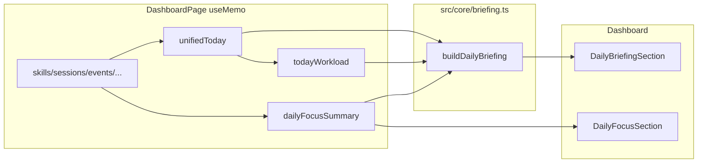

# Phase 15: Daily Briefing Engine

## Goals and constraints

- **Goal**: Deterministic, assistant-style daily narrative from existing dashboard state — no AI APIs.
- **Hard constraints** ([PROJECT_RULES.md](PROJECT_RULES.md), [docs/architecture.md](docs/architecture.md)):
  - Pure logic in [`src/core/briefing.ts`](src/core/briefing.ts); UI stays presentational.
  - **No** schema/sync/auth changes, **no** new npm dependencies, **no** AI.
  - Reuse Phase 14 focus engine outputs; briefing complements (does not replace) Today's Focus.
- **Placement**: Briefing section sits **after** [`TodayHero`](src/components/dashboard/TodayHero.tsx), **before** [`DailyFocusSection`](src/components/dashboard/DailyFocusSection.tsx) in [`DashboardPage.tsx`](src/pages/DashboardPage.tsx).



---

## 1. Core module: `src/core/briefing.ts`

### Types (exact shape from spec)

```typescript
export type DailyBriefing = {
  greeting: string;
  summary: string;
  workloadSummary: string;
  focusSummary: string;
  recommendations: string[];
  riskFlags: string[];
  generatedAtIso: string;
};

export type BuildDailyBriefingInput = {
  skills: Skill[];
  sessions: Session[];
  events: LifeEvent[];
  people: Person[];
  jobApplications: JobApplication[];
  workoutPlans: WorkoutPlan[];
  workoutSessions: WorkoutSession[];
  focusSummary: DailyFocusSummary;
  unifiedTimelineDay: UnifiedTimelineDay;
  workload: DailyWorkloadTotals;
  todayKey: string;
  now?: Date;
};
```

`careerTarget` is **not** required as a separate input — it is already folded into `focusSummary` when [`DashboardPage`](src/pages/DashboardPage.tsx) calls `buildDailyFocusSummary`.

### Public API

- `buildDailyBriefing(input): DailyBriefing` — main orchestrator
- Small exported helpers (for tests): `classifyWorkloadLevel`, `buildGreeting`, `focusItemToRecommendation`, `collectRiskFlags` (optional but keeps tests focused)

### Reuse existing constants from [`focus.ts`](src/core/focus.ts)

Import rather than duplicate thresholds where possible:

| Constant | Use in briefing |
|----------|-----------------|
| `HIGH_BLOCKED_MINUTES` (480) | heavy workload + overloaded risk |
| `LOW_AVAILABLE_SKILL_MINUTES` (30) | interview-no-prep heuristic |
| `FITNESS_LONG_GAP_DAYS` (4) | no-workout risk |
| `MORNING_HOUR` / `EVENING_HOUR` | greeting + time-of-day phrasing |
| `rankFocusItems` | reorder overflow focus items for recommendations |

Also read `focusSummary.context` ([`DailyFocusContext`](src/core/focus.ts)): `skillOverdueCount`, `eventsTodayCount`, `timelineConflictMinutes`, `netAvailableSkillMinutes`, `workoutsThisWeek`, `applicationsNeedingAttention`.

### Workload classification (`workloadSummary`)

Compute a `WorkloadLevel`: `light` | `moderate` | `heavy` from `workload` + timeline:

- Count schedule conflicts: `unifiedTimelineDay.conflicts.filter(c => c.reason === "eventBlocksSchedule").length`
- **Heavy**: `blockedMinutes >= HIGH_BLOCKED_MINUTES` OR `conflictCount >= 2` OR (`blockedMinutes >= 300` AND `eventsTodayCount >= 3`)
- **Moderate**: not heavy AND (`blockedMinutes >= 180` OR `conflictCount >= 1` OR `eventsTodayCount >= 2` OR `plannedSkillMinutes >= 120`)
- **Light**: otherwise

Example strings:

- `"Today looks light."`
- `"Today looks moderately busy."`
- `"Today looks heavy — limited free time."`

### Narrative paragraphs

**`greeting`** — time-of-day from `now` (default `new Date()`):

- `< MORNING_HOUR`: `"Good morning."`
- `< EVENING_HOUR`: `"Good afternoon."`
- else: `"Good evening."`

**`summary`** — 1–2 sentences combining workload level, events, conflicts, career pipeline (from `context`):

- Example: `"Today looks moderately busy. You have 2 events and 1 schedule conflict."`
- Append career clause when `applicationsNeedingAttention > 0`: `"Your career pipeline has 3 items needing attention."`
- Empty-ish day: `"Your schedule looks clear today."`

**`focusSummary`** — skills/fitness/people signals:

- Overdue skills count from `context.skillOverdueCount`
- Workout consistency from `context.workoutsThisWeek` + `getLastSession(workoutSessions)` (from [`fitness.ts`](src/core/fitness.ts))
- People follow-ups via existing `buildPeopleNeedingFollowUp(people, todayKey, 5)` count
- Compose 1 sentence, e.g. `"2 skills are behind schedule, and you haven't logged a workout this week."`

**`generatedAtIso`**: `now.toISOString()` (same pattern as focus engine).

---

## 2. Recommendation generation (max 5, no Focus duplication)

**Source pool**: all active focus items already in `focusSummary.byCategory` (Phase 14 stores every post-filter ranked item there, not just top 5). Flatten + `rankFocusItems` for global order.

**Exclude visible items**: filter out any item whose `id` appears in `focusSummary.items` (the 5 shown in Today's Focus).

**Convert to NL** via `focusItemToRecommendation(item)` keyed on primary `reasonCodes[0]`:

| Reason code | Example output |
|-------------|----------------|
| `timeline_schedule_conflict` | `"Resolve your afternoon timeline conflict."` (morning/afternoon/evening from conflict overlap or `now`) |
| `skill_overdue` / `skill_daily_goal_incomplete` | `"Log 30 minutes toward Machine Learning."` (use `estimatedMinutes` + skill name parsed from title) |
| `skill_streak_at_risk` | `"Log time today to keep your streak on {skill}."` |
| `people_follow_up_overdue` | `"Follow up with {name}."` |
| `career_no_response` / `career_stuck_in_stage` | `"Follow up with recruiter from {company}."` |
| `career_saved_not_applied` | `"Apply to the saved role at {company}."` |
| `career_interview_active` | `"Block prep time for your {company} interview."` |
| `fitness_no_workout_this_week` / `fitness_long_gap_since_last` | `"Schedule a workout today."` |
| default | Imperative rewrite of `item.title` (fallback, still deterministic) |

Take first 5 after filter; constant `BRIEFING_MAX_RECOMMENDATIONS = 5`.

---

## 3. Risk flag generation

Short warning strings (ordered by severity). Only add when heuristic fires:

| Flag | Heuristic |
|------|-----------|
| `"Overloaded day"` | `blockedMinutes >= HIGH_BLOCKED_MINUTES` AND `eventsTodayCount >= 2` |
| `"Excessive schedule conflicts"` | schedule conflict count `>= 2` OR `workload.conflictMinutes >= 60` |
| `"No workouts recently"` | fitness data exists AND last session gap `>= FITNESS_LONG_GAP_DAYS` |
| `"Too many overdue skills"` | `skillOverdueCount >= 3` |
| `"Interview with no prep time"` | active interview apps (`buildInterviewStageSummary`) AND `plannedSkillMinutes > 0` AND `netAvailableForSkillsMinutes < LOW_AVAILABLE_SKILL_MINUTES` |
| `"Burnout risk"` | `skillOverdueCount >= 2` AND `blockedMinutes >= 360` AND local hour `>= EVENING_HOUR` |

Import career/fitness helpers from existing modules; no new domain logic.

---

## 4. UI: `src/components/dashboard/DailyBriefingSection.tsx`

Presentational component; props: `{ briefing: DailyBriefing }`.

Layout (match existing dashboard cards via [`styles.dashboardSection`](src/ui/appStyles.ts)):

```
┌ Daily briefing ─────────────────────┐
│ Good morning.                       │  ← greeting (fontWeight 800, ~18px)
│                                     │
│ Today looks moderately busy...      │  ← summary (14px)
│ Today looks moderately busy.        │  ← workloadSummary (13px, opacity 0.85)
│ 2 skills are behind schedule...     │  ← focusSummary (13px, opacity 0.85)
│                                     │
│ Suggestions                         │  ← h3 if recommendations.length > 0
│ • Resolve your afternoon...         │  ← ul/li, no buttons
│                                     │
│ ⚠ Overloaded day                    │  ← risk flags (styles.statusOverdue pill or list)
└─────────────────────────────────────┘
```

- `aria-label="Daily briefing"`
- No chat bubbles, no CTAs (actions remain in DailyFocusSection)
- Hide empty subsections (no recommendations list if empty; risk block only when flags exist)

---

## 5. Wire into [`DashboardPage.tsx`](src/pages/DashboardPage.tsx)

Add import + `useMemo`:

```typescript
const dailyBriefing = useMemo(
  () =>
    buildDailyBriefing({
      skills,
      sessions,
      events,
      people,
      jobApplications,
      workoutPlans,
      workoutSessions,
      focusSummary: dailyFocusSummary,
      unifiedTimelineDay: unifiedToday,
      workload: todayWorkload,
      todayKey: today,
    }),
  [
    skills, sessions, events, people, jobApplications,
    workoutPlans, workoutSessions,
    dailyFocusSummary, unifiedToday, todayWorkload, today,
  ]
);
```

Insert between `TodayHero` and `DailyFocusSection`:

```tsx
<TodayHero ... />
<div style={{ marginTop: 12 }}>
  <DailyBriefingSection briefing={dailyBriefing} />
</div>
<div style={{ marginTop: 12 }}>
  <DailyFocusSection ... />
</div>
```

**No [`App.tsx`](src/App.tsx) changes** — all inputs already flow through `DashboardPage`.

---

## 6. Tests: `src/core/briefing.test.ts`

Follow [`focus.test.ts`](src/core/focus.test.ts) patterns: shared fixtures (`TODAY`, `NOW_MORNING`, `sampleSkill`, etc.), `describe` blocks for:

| Test | Assertion focus |
|------|-----------------|
| Empty state | light workload strings, empty recommendations/flags, stable greeting |
| Heavy workload | `blockedMinutes >= 480` → heavy classification + `"Overloaded day"` risk |
| Conflict detection | unified day with `eventBlocksSchedule` conflicts reflected in summary |
| Recommendation ordering | overflow items ranked by `priorityScore`; visible focus ids excluded |
| Deterministic output | same input twice → deep equality on full `DailyBriefing` |
| Risk flags | each heuristic individually + combined ordering |

Use `buildDailyFocusSummary(emptyInput())` (or fixture builder) to produce `focusSummary` input.

---

## 7. Documentation: [`docs/architecture.md`](docs/architecture.md)

Add alongside Daily Focus section:

- Folder entry: `briefing.ts` under `src/core/`
- New bullet under Core: `buildDailyBriefing` — deterministic NL summaries from derived dashboard state; **not persisted**; tested in `briefing.test.ts`
- Relationship diagram: Briefing **reads** Focus output + workload/timeline; Focus remains actionable ranked list; Briefing is narrative + secondary suggestions
- Update Dashboard section ordered list: insert **DailyBriefingSection** as item 3 (shift DailyFocusSection to 4)

---

## 8. Validation

Run after implementation:

```bash
npm test
npm run lint
npm run build
```

---

## Files changed (expected)

| File | Action |
|------|--------|
| [`src/core/briefing.ts`](src/core/briefing.ts) | **Create** — types, heuristics, `buildDailyBriefing` |
| [`src/core/briefing.test.ts`](src/core/briefing.test.ts) | **Create** — unit tests |
| [`src/components/dashboard/DailyBriefingSection.tsx`](src/components/dashboard/DailyBriefingSection.tsx) | **Create** — presentational UI |
| [`src/pages/DashboardPage.tsx`](src/pages/DashboardPage.tsx) | **Edit** — `useMemo` + section placement |
| [`docs/architecture.md`](docs/architecture.md) | **Edit** — Daily Briefing layer docs |

No changes to: `App.tsx`, Supabase migrations, `model.ts`, `package.json`.
