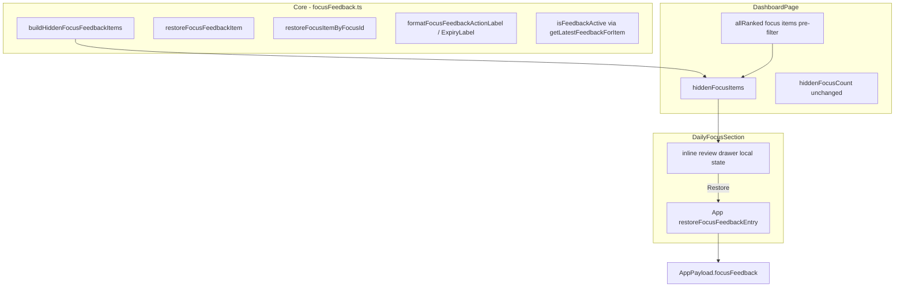

# Phase 16.2 — Focus Feedback History and Review Drawer

## Scope summary

Small, layered extension on top of Phase 16/16.1. **No Supabase migration, no new npm packages, no AI, no notifications, no domain mutations.** All suppression/history logic stays in [`src/core/focusFeedback.ts`](src/core/focusFeedback.ts); UI stays presentational in [`DailyFocusSection`](src/components/dashboard/DailyFocusSection.tsx); CRUD stays in [`App.tsx`](src/App.tsx).

**~6 files touched**, all existing paths.

---

## Architecture (unchanged boundaries)



Briefing continues to use **unsuppressed** [`dailyFocusSummary`](src/core/focus.ts). Only Today's Focus visibility changes on restore.

---

## 1. Core helpers — [`src/core/focusFeedback.ts`](src/core/focusFeedback.ts)

Keep `isFeedbackActive` **private** (used by existing suppression + cleanup). Reuse `getLatestFeedbackForItem` (already exported).

### New exports

| Helper | Behavior |
|--------|----------|
| `buildHiddenFocusFeedbackItems(feedback, rankedFocusItems, nowIso)` | For each item in **ranked pre-filter pool** (same pool as [`hiddenFocusCount`](src/pages/DashboardPage.tsx)), resolve newest feedback per `focusItemId`; include only if `isFeedbackActive`. Sort **newest first** by `createdAtIso`. Guarantees drawer length === `hiddenFocusCount`. |
| `formatFocusFeedbackActionLabel(action)` | `"Dismissed"` \| `"Snoozed"` |
| `formatFocusFeedbackExpiryLabel(entry, nowIso)` | `dismissed` → `"Dismissed today"`; `snoozed` → if `untilIso` equals `startOfNextLocalDayIso(todayKey)` → `"Snoozed until tomorrow"`, else `"Snoozed until {time}"` using existing [`formatTimeOnly`](src/ui/format.ts) imported into core (already used elsewhere from UI; acceptable for label formatting) **or** duplicate minimal `toLocaleTimeString` in core to avoid UI import — prefer **inline time format in core** matching `formatTimeOnly` to keep core free of `ui/` imports |
| `resolveHiddenFocusDisplayLabel(entry)` | `sourceSnapshot.trim()` if non-empty, else `focusItemId` (supports test + UI) |
| `restoreFocusFeedbackItem(feedback, feedbackId)` | Pure filter: remove entry with matching `id` |
| `restoreFocusItemByFocusId(feedback, focusItemId, nowIso)` | Find newest entry for `focusItemId`; if active, remove **only that entry**; otherwise no-op |

**Do not change** `cleanupExpiredFeedback`, dismiss/snooze factories, or suppression semantics.

### Scoping note

`buildHiddenFocusFeedbackItems` takes the **globally ranked** focus list (before suppression filter and before top-5 slice)—the same `allRanked` array already computed in `DashboardPage` for `visibleFocusSummary` / `hiddenFocusCount`. This avoids showing orphaned feedback for items no longer emitted by the focus engine and keeps count + drawer aligned.

---

## 2. App orchestration — [`src/App.tsx`](src/App.tsx)

Add two handlers mirroring existing `restoreAllFocusItems` / `upsertFocusFeedbackEntry` pattern:

```typescript
function restoreFocusFeedbackEntry(feedbackId: string) {
  if (!app) return;
  const next = restoreFocusFeedbackItem(app.payload.focusFeedback ?? [], feedbackId);
  commit({ ...app, payload: { ...app.payload, focusFeedback: next } });
}

function restoreFocusItemByFocusId(focusItemId: string) {
  if (!app) return;
  const next = restoreFocusItemByFocusId(
    app.payload.focusFeedback ?? [],
    focusItemId,
    nowIso()
  );
  commit({ ...app, payload: { ...app.payload, focusFeedback: next } });
}
```

- Pass `onRestoreFocusFeedbackEntry={restoreFocusFeedbackEntry}` to `DashboardPage`.
- Optionally pass `onRestoreFocusItemByFocusId` for future use; drawer uses **feedbackId** path only.
- Keep `restoreAllFocusItems` as-is (clears entire array).

At runtime `upsertFocusFeedbackEntry` stores **one row per `focusItemId`**, but restore-by-id still matters for tests and defensive correctness if multiple historical rows exist before cleanup.

---

## 3. Dashboard wiring — [`src/pages/DashboardPage.tsx`](src/pages/DashboardPage.tsx)

Extract shared `allRanked` memo (currently duplicated in `visibleFocusSummary` and `hiddenFocusCount`) to avoid triple computation:

```typescript
const allRankedFocusItems = useMemo(() =>
  rankFocusItems(
    (Object.values(dailyFocusSummary.byCategory) as FocusItem[][]).flat()
  ),
  [dailyFocusSummary]
);
```

Add:

```typescript
const hiddenFocusItems = useMemo(
  () => buildHiddenFocusFeedbackItems(
    focusFeedback,
    allRankedFocusItems,
    dailyFocusSummary.generatedAtIso
  ),
  [focusFeedback, allRankedFocusItems, dailyFocusSummary.generatedAtIso]
);
```

Pass to `DailyFocusSection`:

- `hiddenFocusItems={hiddenFocusItems}`
- `onRestoreFocusFeedbackEntry={...}` (from props)
- Keep existing `hiddenCount`, dismiss/snooze, `onRestoreAll`

Extend `DashboardPageProps` accordingly.

---

## 4. UI — [`src/components/dashboard/DailyFocusSection.tsx`](src/components/dashboard/DailyFocusSection.tsx)

Stay presentational; local drawer state only (`useState`).

### Footer row (when `hiddenCount > 0`)

Replace/enhance current footer ([lines 283–301](src/components/dashboard/DailyFocusSection.tsx)):

- Keep: `"N focus item(s) hidden"`
- Add: **Review hidden** toggle button (`aria-expanded`, `aria-controls`)
- Keep: **Restore all**

### Inline drawer (not a modal)

- Render below footer when `drawerOpen && hiddenFocusItems.length > 0`
- Card styling: reuse `styles.dashboardSection` / `styles.listRow` / existing `SECONDARY_BUTTON_STYLE` — bordered white panel, mobile-friendly stack layout
- Header: **Hidden focus items**
- Each row shows:
  - **Title line**: `resolveHiddenFocusDisplayLabel(entry)` — if snapshot has `\n`, show first line bold + second line muted (simple split)
  - **Meta line**: `{actionLabel} · {expiryLabel}` via core formatters
  - **Created**: `formatLocal(entry.createdAtIso)` from [`ui/format.ts`](src/ui/format.ts)
  - **Restore** button → `onRestoreFocusFeedbackEntry(entry.id)` with `aria-label`

### Auto-close

`useEffect`: when `hiddenFocusItems.length === 0`, set `drawerOpen` to `false`.

### Copy (exact)

- Section title: "Hidden focus items"
- Expiry: "Dismissed today", "Snoozed until 3:00 PM", "Snoozed until tomorrow"
- Button: "Restore", "Review hidden", "Restore all"

No new component file unless the section grows unwieldy; follow existing `FocusItemRow` private subcomponent pattern inside the same file.

---

## 5. Tests — [`src/core/focusFeedback.test.ts`](src/core/focusFeedback.test.ts)

Add `describe` blocks for new helpers. Reuse existing fixtures (`NOW_MORNING`, `dismissedEntry`, `snoozedEntry`, `sampleFocusItem`).

| Test | Assertion |
|------|-----------|
| Newest active feedback appears once | Two entries same `focusItemId` (older expired dismiss + newer active snooze); builder returns single newest active |
| Expired entries excluded | Active dismiss + expired snooze for different ids; only active in result |
| `sourceSnapshot` fallback | Entry without snapshot → `resolveHiddenFocusDisplayLabel` returns `focusItemId`; with snapshot → snapshot text |
| Restore individual by id | Array of 2 entries; restore one id → length 1, correct id removed |
| Restore by focusItemId | Newest active removed; inactive older row remains if present in test array |
| Snooze expiry label | 3h snooze → `"Snoozed until …"` with local time; tomorrow snooze → `"Snoozed until tomorrow"` |
| Dismiss expiry label | `"Dismissed today"` |
| Cleanup still passes | Existing `cleanupExpiredFeedback` tests unchanged and still green |

No component tests (none exist for dashboard sections today).

---

## 6. Docs — [`docs/architecture.md`](docs/architecture.md)

Extend the **Focus feedback** bullet (~lines 119–125):

- Document **hidden focus review drawer** in `DailyFocusSection`: inline panel lists active suppressed items with restore-one + restore-all.
- Clarify **`sourceSnapshot` is for human-readable history/review only** — not suppression, matching, or ranking.
- Clarify **`focusFeedback` is UI feedback history, not domain data** — restoring removes visibility suppression only; skills/events/people/etc. are untouched.
- Note `buildHiddenFocusFeedbackItems` scopes to today's ranked focus pool so drawer aligns with hidden count.

Update dashboard section list item 4 to mention "Review hidden" drawer.

---

## Files to change

| File | Change |
|------|--------|
| [`src/core/focusFeedback.ts`](src/core/focusFeedback.ts) | New helpers + display label resolver |
| [`src/core/focusFeedback.test.ts`](src/core/focusFeedback.test.ts) | 8 new test cases |
| [`src/App.tsx`](src/App.tsx) | `restoreFocusFeedbackEntry`, optional `restoreFocusItemByFocusId` |
| [`src/pages/DashboardPage.tsx`](src/pages/DashboardPage.tsx) | Shared `allRanked` memo, `hiddenFocusItems`, new props |
| [`src/components/dashboard/DailyFocusSection.tsx`](src/components/dashboard/DailyFocusSection.tsx) | Review drawer UI + props |
| [`docs/architecture.md`](docs/architecture.md) | Drawer + snapshot/history semantics |

**Not changed:** Supabase/RLS, `model.ts`, mappers, briefing, focus engine collectors, auth.

---

## Validation checklist

```bash
npm test
npm run lint
npm run build
```

Manual smoke:

1. Dismiss a focus item → hidden count increments, Review hidden opens list with snapshot text.
2. Snooze 3h → expiry shows local time; Restore returns item to visible list.
3. Snooze tomorrow → "Snoozed until tomorrow".
4. Restore one → item reappears; drawer closes when last hidden item restored.
5. Restore all → count zero, drawer hidden.
6. Reload app → expired feedback still cleaned on load; drawer empty for stale entries.

---

## UI behavior summary

| State | UI |
|-------|-----|
| No suppressed ranked items | No hidden footer, no drawer |
| Suppressed items exist | Footer: count + Review hidden + Restore all |
| Review hidden clicked | Inline card lists active entries newest-first |
| Restore on row | Removes that feedback entry; item may reappear in focus list if still ranked |
| Last item restored | Drawer auto-closes |
| Restore all | Clears feedback array; drawer closes |
