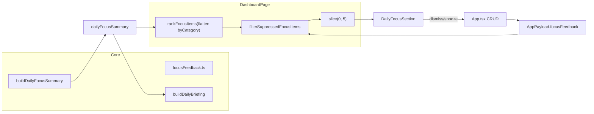

# Phase 16: Focus Feedback, Dismiss, and Snooze

## Goals and constraints

- **Goal**: Let users dismiss or snooze focus cards; suppression is a lightweight feedback layer keyed by stable `FocusItem.id` (e.g. `skill:{uuid}`, `timeline:conflicts-aggregated`).
- **Hard constraints** ([PROJECT_RULES.md](PROJECT_RULES.md)):
  - No AI, notifications, push APIs, or new npm dependencies.
  - **Never mutate** skills/events/people/career/fitness entities.
  - No auto-rescheduling; no auth changes.
  - Pure suppression logic in [`src/core/focusFeedback.ts`](src/core/focusFeedback.ts); UI stays presentational.
- **Briefing vs Focus**: [`buildDailyBriefing`](src/core/briefing.ts) continues to read the **unsuppressed** [`dailyFocusSummary`](src/core/focus.ts). Only [`DailyFocusSection`](src/components/dashboard/DailyFocusSection.tsx) sees filtered items.



---

## 1. Data model — [`src/core/model.ts`](src/core/model.ts)

Add types exactly as specified:

```typescript
export type FocusFeedbackAction = "dismissed" | "snoozed";

export type FocusFeedback = {
  id: string;
  focusItemId: string;
  action: FocusFeedbackAction;
  untilIso?: string;
  createdAtIso: string;
  updatedAtIso: string;
};
```

Extend `AppPayload`:

```typescript
focusFeedback: FocusFeedback[];
```

**Semantics** (storage vs behavior):

| Action | Stored `untilIso` | Suppressed when |
|--------|-------------------|-----------------|
| `dismissed` | **must be absent** (validation) | `createdAtIso` is on the **same local calendar day** as `nowIso` |
| `snoozed` | **required** valid ISO | `nowIso < untilIso` |

Reuse existing local-day helpers: [`formatLocalDateKey`](src/core/timeline.ts) + compare date keys (same pattern as [`focus.ts`](src/core/focus.ts) `endOfLocalDayIso`).

---

## 2. Supabase migration

Create [`supabase/migrations/20260527500000_focus_feedback.sql`](supabase/migrations/20260527500000_focus_feedback.sql) following the fitness/people template ([`20260527400000_fitness.sql`](supabase/migrations/20260527400000_fitness.sql)):

```sql
CREATE TABLE public.focus_feedback (
  id uuid PRIMARY KEY DEFAULT extensions.gen_random_uuid(),
  user_id uuid NOT NULL REFERENCES auth.users (id) ON DELETE CASCADE,
  focus_item_id text NOT NULL,
  action text NOT NULL,
  until_iso timestamptz NULL,
  created_at timestamptz NOT NULL DEFAULT now(),
  updated_at timestamptz NOT NULL DEFAULT now(),
  CONSTRAINT focus_feedback_action_chk
    CHECK (action IN ('dismissed', 'snoozed')),
  CONSTRAINT focus_feedback_focus_item_id_nonempty_chk
    CHECK (char_length(focus_item_id) > 0),
  CONSTRAINT focus_feedback_snooze_until_chk
    CHECK (
      (action = 'snoozed' AND until_iso IS NOT NULL)
      OR (action = 'dismissed' AND until_iso IS NULL)
    )
);

CREATE INDEX focus_feedback_user_id_idx ON public.focus_feedback (user_id);
CREATE INDEX focus_feedback_focus_item_id_idx ON public.focus_feedback (focus_item_id);
```

Plus: `set_focus_feedback_updated_at()` trigger, RLS (select/insert/update/delete own), `REVOKE ALL FROM PUBLIC, anon`, `GRANT ... TO authenticated`.

No unique constraint on `(user_id, focus_item_id)` — multiple rows allowed; **newest `updatedAtIso` wins** in core logic. App CRUD will upsert-by-`focusItemId` to keep payload lean.

---

## 3. Local defaults + normalization

| File | Change |
|------|--------|
| [`src/core/state.ts`](src/core/state.ts) | Add `focusFeedback: []` to `defaultPayload()` |
| [`src/core/storage.ts`](src/core/storage.ts) | Add `focusFeedback: Array.isArray(p.focusFeedback) ? p.focusFeedback : []` in `normalizePayload()` |

Backward compatible: older localStorage backups without the field get `[]`.

---

## 4. DB mappers + remote storage

### [`src/core/dbMappers.ts`](src/core/dbMappers.ts)

Follow `WorkoutSession` / `Person` pattern:

- `FocusFeedbackRow` — snake_case columns (`focus_item_id`, `until_iso`, `created_at`, `updated_at`)
- `assertValidFocusFeedback(entry)`:
  - non-empty `focusItemId`
  - `action` in `("dismissed", "snoozed")`
  - snoozed → `untilIso` required + valid ISO timestamp
  - dismissed → `untilIso` must be undefined
  - valid UUID id + ISO timestamps on `createdAtIso` / `updatedAtIso`
- `focusFeedbackToRow` / `focusFeedbackFromRow`
- Extend `payloadFromRows(..., focusFeedbackRows = [])` → `focusFeedback` array
- Extend `validatePayloadForUpload` — duplicate id check + per-entry validation

### [`src/core/remoteStorage.ts`](src/core/remoteStorage.ts)

Mirror fitness wiring:

- Add `"focus_feedback"` to `AppTable` union + row type import
- `fetchRemotePayload`: parallel select + pass rows to `payloadFromRows`
- `replaceRemotePayload`: map → upsert → `deleteRowsNotIn`
- `payloadHasData`: include `payload.focusFeedback.length > 0`

### Tests — [`src/core/dbMappers.test.ts`](src/core/dbMappers.test.ts)

Add round-trip + validation cases (snoozed without `untilIso`, dismissed with `untilIso`, invalid action).

---

## 5. Core module — [`src/core/focusFeedback.ts`](src/core/focusFeedback.ts)

Pure helpers only (no React, no Supabase):

| Function | Responsibility |
|----------|----------------|
| `getLatestFeedbackForItem(feedback, focusItemId)` | Pick entry with max `updatedAtIso` for id |
| `isFocusItemSuppressed(item, feedback, nowIso)` | Apply dismiss-day / snooze-until rules on latest entry |
| `filterSuppressedFocusItems(items, feedback, nowIso)` | Filter array |
| `cleanupExpiredFeedback(feedback, nowIso)` | Drop entries no longer actively suppressing |
| `dismissUntilEndOfDay(focusItemId, nowIso)` | Factory: `action: "dismissed"`, no `untilIso`, new UUID + timestamps |
| `snoozeFocusItem(focusItemId, nowIso, hours)` | Factory: `action: "snoozed"`, `untilIso: addHoursIso(nowIso, hours)` |

**Snooze tomorrow** (UI requirement, not a separate persisted action): add a small companion factory in the same file:

```typescript
export function snoozeFocusItemUntilTomorrow(focusItemId: string, nowIso: string): FocusFeedback
```

Implementation: `untilIso = startOfNextLocalDayIso(formatLocalDateKey(new Date(nowIso)))`. **Export** the existing private `startOfNextLocalDayIso` from [`src/core/focus.ts`](src/core/focus.ts) (already used for people follow-up expiry at line 895) rather than duplicating date math.

**Newest wins**: `isFocusItemSuppressed` always reads the latest entry per `focusItemId`.

**Cleanup rules** (symmetric with suppression):

- `dismissed`: remove when `createdAtIso` local day ≠ `nowIso` local day
- `snoozed`: remove when `nowIso >= untilIso`

**Optional helper** for dashboard (keeps DashboardPage thin):

```typescript
export function countSuppressedFocusItems(items, feedback, nowIso): number
```

Reuse [`addHoursIso`](src/core/focus.ts) for 3h snooze.

---

## 6. Dashboard integration — [`src/pages/DashboardPage.tsx`](src/pages/DashboardPage.tsx)

**Do not** pass feedback into `buildDailyFocusSummary`. Keep the existing `dailyFocusSummary` useMemo unchanged (briefing depends on it).

Add props: `focusFeedback`, `onDismissFocusItem`, `onSnoozeFocusItem`, `onSnoozeFocusItemUntilTomorrow`, `onRestoreAllFocusItems`.

Add a second useMemo for visible focus:

```typescript
const visibleFocusSummary = useMemo(() => {
  const allRanked = rankFocusItems(
    (Object.values(dailyFocusSummary.byCategory) as FocusItem[][]).flat()
  );
  const visible = filterSuppressedFocusItems(
    allRanked,
    focusFeedback,
    dailyFocusSummary.generatedAtIso
  ).slice(0, FOCUS_DASHBOARD_MAX_ITEMS);

  return {
    ...dailyFocusSummary,
    items: visible,
    headline: buildHeadline(visible), // export from focus.ts (currently private at line 1268)
  };
}, [dailyFocusSummary, focusFeedback]);
```

- `dailyBriefing` useMemo: still uses `dailyFocusSummary` (unsuppressed).
- `DailyFocusSection`: receives `visibleFocusSummary` + feedback handlers + `hiddenCount`.

**Filter-before-slice**: reconstructing from `byCategory` + `rankFocusItems` matches the engine's global order without modifying [`buildDailyFocusSummary`](src/core/focus.ts) (line 1342–1343 slice stays internal; dashboard re-slices after suppression so backfill works).

**Minimal focus.ts change**: export `buildHeadline` (rename export only; logic unchanged).

---

## 7. App CRUD — [`src/App.tsx`](src/App.tsx)

Add handlers (guard `if (!app) return`; use existing `id()` + `commit()` pattern from `addPerson`):

```typescript
function upsertFocusFeedbackEntry(entry: FocusFeedback) {
  const existing = app.payload.focusFeedback ?? [];
  const next = [
    ...existing.filter((f) => f.focusItemId !== entry.focusItemId),
    entry,
  ];
  commit({ ...app, payload: { ...app.payload, focusFeedback: next } });
}

function dismissFocusItem(focusItemId: string) { /* dismissUntilEndOfDay */ }
function snoozeFocusItem(focusItemId: string, hours: number) { /* 3 for UI */ }
function snoozeFocusItemUntilTomorrow(focusItemId: string) { /* companion factory */ }
function restoreAllFocusItems() { /* focusFeedback: [] */ }
```

**Startup cleanup** in `runInitialSync` (after `initialSync` resolves, before `setApp`):

```typescript
const cleaned = cleanupExpiredFeedback(data.payload.focusFeedback ?? [], nowIso());
if (cleaned.length !== (data.payload.focusFeedback ?? []).length) {
  data = saveAppData({ ...data, payload: { ...data.payload, focusFeedback: cleaned } }, userId);
}
```

No background timers.

Wire new props into `DashboardPage` (lines 907–923).

---

## 8. UI — [`src/components/dashboard/DailyFocusSection.tsx`](src/components/dashboard/DailyFocusSection.tsx)

Extend `FocusItemRow` with a secondary action row below existing CTAs:

- **Dismiss** — calls `onDismissFocusItem(item.id)`
- **Snooze 3h** — calls `onSnoozeFocusItem(item.id, 3)`
- **Snooze tomorrow** — calls `onSnoozeFocusItemUntilTomorrow(item.id)`

Style: small secondary buttons (`fontSize: 12`, light border, `opacity: 0.85`, flex-wrap, adequate touch targets). No modals.

Footer copy (always visible when section renders):

> Hidden items may reappear when conditions change.

**Optional hidden count** (simple):

- Prop: `hiddenCount: number`, `onRestoreAll?: () => void`
- When `hiddenCount > 0`: `"3 focus items hidden"` + small "Restore all" button
- `hiddenCount` computed in DashboardPage via `countSuppressedFocusItems(allRanked, feedback, now)`

Optimistic feel: `commit()` updates React state immediately via existing `setApp` path.

---

## 9. Tests — [`src/core/focusFeedback.test.ts`](src/core/focusFeedback.test.ts)

Follow [`src/core/focus.test.ts`](src/core/focus.test.ts) fixtures (`TODAY = "2026-05-27"`, fixed ISO timestamps).

| Case | Assertion |
|------|-----------|
| Dismiss same local day | suppressed; not suppressed next local day |
| Snooze 3h | suppressed before `untilIso`, visible after |
| Snooze tomorrow | suppressed until start of next local day |
| Newest wins | older dismiss + newer snooze → snooze rules apply |
| Expired snooze ignored | entry in array but `now >= untilIso` → not suppressed |
| `filterSuppressedFocusItems` | correct length and ids |
| `cleanupExpiredFeedback` | removes stale dismiss + expired snooze |
| Determinism | same inputs → same outputs |

Update [`src/core/dbMappers.test.ts`](src/core/dbMappers.test.ts) for mapper round-trip (integration-level, not E2E).

---

## 10. Documentation — [`docs/architecture.md`](docs/architecture.md)

Add alongside Daily Focus (lines 113–119):

- New domain: `FocusFeedback` in `AppPayload` + `focus_feedback` Supabase table
- New core module: [`focusFeedback.ts`](src/core/focusFeedback.ts) — suppression helpers; tested in `focusFeedback.test.ts`
- **Suppression semantics**: dismiss = rest of local day; snooze = until `untilIso`; newest entry wins
- **Briefing intentionally ignores suppression** — narrative still reflects underlying signals
- **No auto-rescheduling** — feedback never writes to skills/events/etc.
- **Future**: persisted dismiss/snooze history could feed AI personalization weights (deferred)

Update Dashboard ordered list: note dismiss/snooze controls on DailyFocusSection.

---

## 11. Validation

```bash
npm test
npm run lint
npm run build
```

Report: changed files, migration summary, dismiss vs snooze semantics, test/lint/build results.

---

## Files changed (expected)

| File | Action |
|------|--------|
| [`src/core/model.ts`](src/core/model.ts) | Add `FocusFeedback` types + `AppPayload.focusFeedback` |
| [`src/core/state.ts`](src/core/state.ts) | Default `focusFeedback: []` |
| [`src/core/storage.ts`](src/core/storage.ts) | Normalize `focusFeedback` |
| [`supabase/migrations/20260527500000_focus_feedback.sql`](supabase/migrations/20260527500000_focus_feedback.sql) | **Create** table + RLS + trigger |
| [`src/core/dbMappers.ts`](src/core/dbMappers.ts) | Row type, validation, mappers, payload wiring |
| [`src/core/remoteStorage.ts`](src/core/remoteStorage.ts) | Fetch/upsert/delete `focus_feedback` |
| [`src/core/focusFeedback.ts`](src/core/focusFeedback.ts) | **Create** — pure suppression logic |
| [`src/core/focusFeedback.test.ts`](src/core/focusFeedback.test.ts) | **Create** — unit tests |
| [`src/core/focus.ts`](src/core/focus.ts) | Export `buildHeadline`, export `startOfNextLocalDayIso` |
| [`src/core/dbMappers.test.ts`](src/core/dbMappers.test.ts) | Mapper tests |
| [`src/App.tsx`](src/App.tsx) | CRUD + startup cleanup + dashboard wiring |
| [`src/pages/DashboardPage.tsx`](src/pages/DashboardPage.tsx) | Visible summary useMemo + props |
| [`src/components/dashboard/DailyFocusSection.tsx`](src/components/dashboard/DailyFocusSection.tsx) | Dismiss/snooze/restore UI |
| [`docs/architecture.md`](docs/architecture.md) | FocusFeedback domain docs |

**No changes to**: `buildDailyFocusSummary` pipeline, `briefing.ts`, auth, `package.json`, domain entity tables.

---

## Suppression behavior summary

- **Dismiss**: hides for remainder of **local calendar day** (based on `createdAtIso`, no stored `untilIso`).
- **Snooze 3h**: hides until `now + 3 hours`.
- **Snooze tomorrow**: hides until **start of next local day** (reappears tomorrow morning).
- **Backfill**: suppressed top-5 slots are filled by next ranked items from `byCategory`.
- **Restore all**: clears `focusFeedback` array (after cleanup of expired entries).
- **Reappearance**: items can return when feedback expires, local day rolls over, or underlying focus conditions change (new `FocusItem.id` or re-ranked signal).
