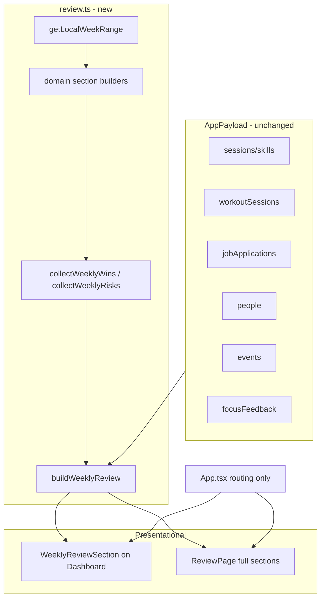

# Phase 17 — Weekly Review and Personal Analytics

## Scope summary

Cross-domain **read-only** weekly reflection, parallel to [`briefing.ts`](src/core/briefing.ts) (daily) and [`dashboardStats.ts`](src/core/dashboardStats.ts) (today/week skill math). All logic lives in new [`src/core/review.ts`](src/core/review.ts). UI stays presentational; [`App.tsx`](src/App.tsx) only adds routing and passes payload slices.

**In scope:** deterministic aggregation, narrative copy via templates, dashboard teaser + full Review page.

**Out of scope:** Supabase migrations, new npm packages, AI APIs, notifications, auto-actions, persisted review notes, prior-week comparison (defer to future), mutating domain data.

**Note on “daily focus history”:** ranked focus items are **not persisted** per day. Weekly focus analytics come from persisted [`FocusFeedback`](src/core/model.ts) rows (`createdAtIso` in week, grouped by `focusItemId`, labels from `sourceSnapshot`).

---

## Architecture



Boundaries unchanged: pages compute `useMemo(() => buildWeeklyReview(...))`; sections receive DTOs only.

---

## 1. WeeklyReview type model

Define in [`src/core/review.ts`](src/core/review.ts). Mirror [`DailyBriefing`](src/core/briefing.ts) top-level shape; add structured domain sections for the Review page and compact fields for the dashboard widget.

```typescript
export type ReviewTone = "neutral" | "encouraging" | "warning"; // reuse semantics from briefing

export type LocalWeekRange = {
  weekStartKey: string;   // Monday YYYY-MM-DD
  weekEndKey: string;     // Sunday YYYY-MM-DD
  weekStartDate: Date;    // Monday 00:00 local
};

export type SkillWeekRow = {
  skillId: string;
  skillName: string;
  minutesLogged: number;
  weeklyGoalMinutes: number | null;
  goalPercent: number | null;       // null when no weekly goal
  activeDays: number;               // days with minutes > 0
  scheduledDays: number;            // days with planned schedule blocks
  consistencyScore: number | null;  // activeDays / scheduledDays when scheduledDays > 0
};

export type SkillWeekSummary = {
  totalMinutes: number;
  skills: SkillWeekRow[];
  topConsistent: SkillWeekRow[];    // max 3, sorted by consistencyScore desc
  missedOrOverdue: SkillWeekRow[];  // weekly goal miss OR scheduled day with 0 minutes
};

export type FitnessWeekSection = WorkoutWeekSummary & {
  summaryLine: string;              // deterministic one-liner
};

export type CareerWeekItem = {
  id: string;
  company: string;
  roleTitle: string;
  status: ApplicationStatus;
  reason: "updated_this_week" | "needs_attention";
  attentionReason?: ApplicationAttentionReason;
};

export type CareerWeekSection = {
  updatedThisWeek: CareerWeekItem[];
  stillNeedingAttention: CareerWeekItem[]; // from buildApplicationsNeedingAttention at weekEnd anchor
};

export type PeopleWeekSection = {
  followedUpThisWeek: PersonFollowUpItem[];  // lastContactDate in week
  stillNeedingFollowUp: PersonFollowUpItem[]; // buildPeopleNeedingFollowUp at todayKey
};

export type EventsWeekSection = {
  completedThisWeek: UpcomingEventItem[];     // date in [weekStart, weekEnd], sorted past-first
  upcomingNextWeek: UpcomingEventItem[];      // date in (weekEnd, weekEnd+7]
};

export type FocusFeedbackWeekItem = {
  focusItemId: string;
  displayLabel: string;             // resolveHiddenFocusDisplayLabel / snapshot
  dismissCount: number;
  snoozeCount: number;
  totalCount: number;
};

export type FocusFeedbackWeekSection = {
  mostHidden: FocusFeedbackWeekItem[]; // top N by totalCount
  totalDismissed: number;
  totalSnoozed: number;
};

export type WeeklyReview = {
  week: LocalWeekRange;
  greeting: string;
  summary: string;                  // 2–4 sentence overview
  tone: ReviewTone;
  wins: string[];                   // max 5 bullet strings
  risks: string[];                  // max 5 bullet strings
  skills: SkillWeekSummary;
  fitness: FitnessWeekSection;
  career: CareerWeekSection;
  people: PeopleWeekSection;
  events: EventsWeekSection;
  focusFeedback: FocusFeedbackWeekSection;
  generatedAtIso: string;
};

export type BuildWeeklyReviewInput = {
  skills: Skill[];
  sessions: Session[];
  events: LifeEvent[];
  people: Person[];
  jobApplications: JobApplication[];
  workoutSessions: WorkoutSession[];
  focusFeedback: FocusFeedback[];
  todayKey: string;
  now?: Date;
};
```

Reuse existing DTO types where possible: [`WorkoutWeekSummary`](src/core/fitness.ts), [`PersonFollowUpItem`](src/core/people.ts), [`UpcomingEventItem`](src/core/events.ts), [`ApplicationAttentionReason`](src/core/career.ts).

---

## 2. Core helper design

Single orchestrator **`buildWeeklyReview(input): WeeklyReview`** composes private domain builders. Import reuse helpers; do **not** duplicate business rules already in domain modules.

| Helper | Responsibility |
|--------|----------------|
| `getLocalWeekRange(todayKey, now?)` | Parse `todayKey` → `startOfWeekLocal` → `weekStartKey`/`weekEndKey` via [`formatLocalDateKey`](src/core/timeline.ts) + [`iterateDateRange`](src/core/timeline.ts) |
| `isDateKeyInLocalWeek(dateKey, weekStartDate)` | Half-open Mon–Sun window on date keys (same semantics as fitness private helper) |
| `isIsoInLocalWeek(iso, weekStartDate)` | Delegate to [`isInLocalWeek`](src/core/dashboardStats.ts) |
| `buildSkillWeekSummary(...)` | Per-skill minutes ([`minutesThisWeekForSkill`](src/core/dashboardStats.ts)), active days from session day keys, scheduled days from [`plannedMinutesForDay`](src/core/dashboardStats.ts) + [`weekdayFromDate`](src/core/schedule.ts); compute consistency; flag missed/overdue |
| `buildFitnessWeekSection(...)` | Wrap [`buildWorkoutWeekSummary`](src/core/fitness.ts) + template summary line |
| `buildCareerWeekSection(...)` | Apps with `updatedAtIso` in week (excluding pure create-only if `appliedDate` also in week → label “applied”); merge [`buildApplicationsNeedingAttention`](src/core/career.ts) for still-open items |
| `buildPeopleWeekSection(...)` | `lastContactDate` in week → followed up; [`buildPeopleNeedingFollowUp`](src/core/people.ts) for outstanding |
| `buildEventsWeekSection(...)` | Filter events by date key into completed-this-week vs upcoming-next-week (reuse [`buildUpcomingEventItems`](src/core/events.ts) shaping or map to `UpcomingEventItem`) |
| `buildFocusFeedbackWeekSection(...)` | Filter `focusFeedback` by `createdAtIso` in week; group by `focusItemId`; count dismiss/snooze; sort by total; labels via [`resolveHiddenFocusDisplayLabel`](src/core/focusFeedback.ts) |
| `collectWeeklyWins(review)` | Deterministic rules → string bullets (see below) |
| `collectWeeklyRisks(review)` | Deterministic rules → string bullets |
| `buildWeeklyReviewSummary(review)` | Join domain one-liners with [`selectDeterministicTemplate`](src/core/briefing.ts) |
| `classifyReviewTone(review)` | `warning` if risks.length > 0 or multiple missed skills; `encouraging` if wins ≥ 3 and risks = 0; else `neutral` |
| `buildWeeklyReviewSeed(weekStartKey, scope, counts...)` | Stable hash input for template picks |

**Wins rules (v1, capped at 5):**
- Total skill minutes ≥ weekly goal aggregate (skills with goals)
- Any skill with consistency ≥ 80% and scheduledDays ≥ 2
- Workout count ≥ 2 or total duration ≥ 90 min
- Career item updated to interview/offer this week
- Person followed up (`lastContactDate` in week)
- Life event completed this week

**Risks rules (v1, capped at 5):**
- Skill(s) below 50% of weekly goal with ≤ 1 day left in week (use `todayKey` vs `weekEndKey`)
- Scheduled skill days missed (consistency < 50%)
- [`buildApplicationsNeedingAttention`](src/core/career.ts) non-empty
- Follow-ups overdue ([`buildPeopleNeedingFollowUp`](src/core/people.ts))
- Heavy next-week events (≥ 3 timed events or reuse upcoming count threshold)
- Focus item dismissed/snoozed ≥ 3 times in week (same `focusItemId`)

**Optional workload signal (v1 light):** wire [`buildUnifiedTimelineRange`](src/core/timeline.ts) + [`computeDailyWorkload`](src/core/timeline.ts) + [`summarizeWeek`](src/core/timeline.ts) for a single summary sentence in `summary` (not a full section)—already tested in [`timeline.test.ts`](src/core/timeline.test.ts).

---

## 3. Date / week boundary strategy

**Convention (locked, matches existing code):** local calendar week **Monday 00:00 → next Monday 00:00** (exclusive end).

| Data field | Filter mechanism |
|------------|------------------|
| `Session.startedAtIso` | `isInLocalWeek` / `isIsoInLocalWeek` |
| `WorkoutSession.date`, `LifeEvent.date`, `Person.lastContactDate`, `JobApplication.appliedDate` | `isDateKeyInLocalWeek` |
| `JobApplication.updatedAtIso`, `FocusFeedback.createdAtIso` | `isIsoInLocalWeek` |
| Week enumeration | `iterateDateRange(weekStartKey, weekEndKey)` |

**Anchor:** `todayKey` from page (same as dashboard). Review always describes **the week containing today**, not a user-selected historical week (defer week picker).

**Mid-week behavior:** skill goal miss flags use `(minutesLogged / weeklyGoalMinutes)` vs days elapsed in week—only emit “behind pace” risk when projected to miss at week end.

No timezone changes; reuse existing local-date helpers only.

---

## 4. Dashboard widget vs dedicated Review page

| Surface | Role | Content |
|---------|------|---------|
| **`WeeklyReviewSection`** (dashboard) | Teaser | Greeting, 1–2 summary lines, top 3 wins, top 3 risks, tone styling (mirror [`DailyBriefingSection`](src/components/dashboard/DailyBriefingSection.tsx)), **“View weekly review”** button |
| **`ReviewPage`** (new nav tab) | Full breakdown | All domain sections with lists/tables; read-only; no CRUD |
| **`WeeklyPreviewSection`** (existing) | Unchanged | Per-skill weekly goal progress bars—complementary, not replaced |

Placement on dashboard: **after Daily Briefing, before Daily Focus**—weekly reflection before daily action items.

Navigation: new `"review"` page in [`types.ts`](src/pages/types.ts) + [`AppShell`](src/components/layout/AppShell.tsx) nav label **“Review”** (or “Weekly review” if space allows).

---

## 5. v1 scope recommendation

**Ship in Phase 17:**
- Full `review.ts` with all required summary domains
- `review.test.ts` with deterministic fixtures
- Dashboard `WeeklyReviewSection` (compact)
- `ReviewPage` + nav entry (full sections—logic is cheap once core exists)
- `docs/architecture.md` update

**Defer (document as future):**
- User-selected past weeks / week picker
- Prior-week delta (“vs last week”)
- Persisted review notes or “mark reviewed” state (would need schema)
- Replacing [`WeeklyPreviewSection`](src/components/dashboard/WeeklyPreviewSection.tsx) (keep both)
- Timeline workload as its own Review page section (one summary sentence only in v1)
- AI narrative

**No schema changes** — all inputs exist in [`AppPayload`](src/core/model.ts).

---

## 6. Files to create / change

| File | Action |
|------|--------|
| [`src/core/review.ts`](src/core/review.ts) | **Create** — types, builders, orchestrator |
| [`src/core/review.test.ts`](src/core/review.test.ts) | **Create** — unit tests |
| [`src/components/dashboard/WeeklyReviewSection.tsx`](src/components/dashboard/WeeklyReviewSection.tsx) | **Create** — compact dashboard widget |
| [`src/pages/ReviewPage.tsx`](src/pages/ReviewPage.tsx) | **Create** — full presentational layout |
| [`src/pages/DashboardPage.tsx`](src/pages/DashboardPage.tsx) | **Change** — `useMemo` + pass `weeklyReview`, `onOpenReview` |
| [`src/pages/types.ts`](src/pages/types.ts) | **Change** — add `"review"` to `Page` |
| [`src/App.tsx`](src/App.tsx) | **Change** — render `ReviewPage`, wire `onOpenReview`, no new commit handlers |
| [`src/components/layout/AppShell.tsx`](src/components/layout/AppShell.tsx) | **Change** — nav button |
| [`docs/architecture.md`](docs/architecture.md) | **Change** — document review engine + UI surfaces |

**Not changed:** `model.ts`, Supabase migrations, mappers, `briefing.ts`, `focus.ts`, domain CRUD pages.

**Optional tiny refactor (only if needed for tests):** export `isDateKeyInLocalWeek` from [`dashboardStats.ts`](src/core/dashboardStats.ts) to dedupe fitness private copy—skip unless duplication becomes painful.

---

## 7. Testing strategy

Follow existing core patterns ([`briefing.test.ts`](src/core/briefing.test.ts), [`dashboardStats.test.ts`](src/core/dashboardStats.test.ts)).

**Fixtures:** fixed `todayKey` (e.g. `"2026-05-27"` Wednesday), fixed `now` Date, minimal skills/sessions/events/people/apps/workouts/feedback arrays.

| Test area | Assertions |
|-----------|------------|
| `getLocalWeekRange` | Monday/Sunday keys; week containing Wednesday |
| Week filters | ISO and date-key inclusivity at boundaries |
| `buildSkillWeekSummary` | minutes, activeDays, consistency, missed/overdue detection |
| Fitness section | reuses `buildWorkoutWeekSummary` counts |
| Career section | updated-in-week vs attention list |
| People section | contact-in-week vs overdue follow-ups |
| Events section | completed vs next-week partition |
| Focus feedback | grouping, dismiss/snooze counts, label fallback |
| Wins / risks | rule triggers with edge cases (empty payload → encouraging/neutral copy) |
| `buildWeeklyReview` | deterministic: same input → identical output including template choice |
| Tone | warning when risks present |

No React component tests (none exist for dashboard sections today).

Validation: `npm test`, `npm run lint`, `npm run build`.

---

## 8. Step-by-step implementation order

1. **Core types + week range** — `LocalWeekRange`, `getLocalWeekRange`, date/ISO week filters + tests
2. **Skill week builder** — `SkillWeekSummary`, consistency math + tests
3. **Domain section builders** — fitness, career, people, events, focus feedback + tests each
4. **Wins, risks, summary, tone** — narrative assembly + orchestrator `buildWeeklyReview` + integration tests
5. **`WeeklyReviewSection`** — dashboard compact UI (tone styling from briefing pattern)
6. **`ReviewPage`** — full section layout (subcomponents private to page file or `components/dashboard/Review*` if large)
7. **Wire App** — `Page` type, nav, `DashboardPage` memo, `onOpenReview`
8. **Docs + manual smoke** — architecture.md; verify Mon–Sun boundaries, empty states, nav round-trip

---

## 9. Future AI extension points

Document at top of `review.ts` (same style as [`briefing.ts`](src/core/briefing.ts) / [`people.ts`](src/core/people.ts)):

- **`WeeklyReviewContext` bundle** — structured `WeeklyReview` + raw payload slices for “explain my week” prompts
- **Personalized tone** — adjust template weights from focus feedback patterns (dismissed categories)
- **Prior-week narrative** — feed `(thisWeek, lastWeek)` diffs to AI without changing v1 deterministic output
- **Suggested actions** — map risks to existing `FocusActionType` / page deep-links (still no auto-actions)
- **Persisted reflections** — user journal entries per week (requires new `AppPayload` field + migration)
- **Export/share** — markdown summary from `WeeklyReview` DTO

AI must remain **opt-in layer on top of** deterministic `WeeklyReview`; never replace core aggregation.

---

## Manual smoke checklist

1. Dashboard shows weekly review teaser with wins/risks when any domain has data.
2. “View weekly review” opens Review page with all sections populated.
3. Skill consistency ranks skills with schedule blocks correctly.
4. Focus feedback section lists most-dismissed items with snapshot labels.
5. Empty week still renders neutral copy (no crashes, sections hidden when empty).
6. Reload does not mutate payload (read-only verification).
