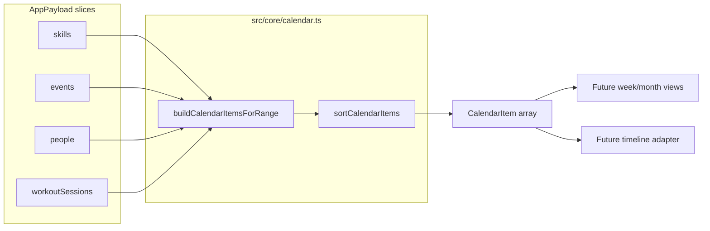
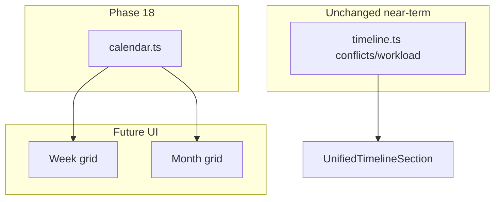

# Phase 18 — Unified Calendar Foundation

## Scope

**In:** `CalendarItem` type, `buildCalendarItemsForRange`, sorting/stable IDs, unit tests, brief [`docs/architecture.md`](docs/architecture.md) update.

**Out:** UI calendar, Supabase migrations, new npm packages, recurrence engine, drag/drop, external sync, career-derived items (deferred per your choice), mutating inputs.

**Relationship to existing code:** [`timeline.ts`](src/core/timeline.ts) remains the today-focused schedule+event merge with conflict detection. Phase 18 builds a **broader, UI-ready calendar DTO** across domains and date ranges. Future dashboard week/month views will consume `CalendarItem[]`; today's unified timeline can stay on `UnifiedTimelineItem` until a later adapter phase.



---

## 1. CalendarItem type design

New file [`src/core/calendar.ts`](src/core/calendar.ts). Follow the discriminated-metadata pattern used by [`UnifiedTimelineItem`](src/core/timeline.ts) and [`FocusItem`](src/core/focus.ts).

```typescript
export type CalendarSourceType =
  | "skill"
  | "event"
  | "fitness"
  | "career"   // reserved; no items emitted in Phase 18
  | "people";

export type CalendarItem = {
  id: string;                    // stable, precomputed
  sourceType: CalendarSourceType;
  sourceId: string;              // domain entity id (skill block uses blockId)
  title: string;
  date: string;                  // YYYY-MM-DD local
  startTime?: string;            // HH:MM
  endTime?: string;              // HH:MM
  allDay?: boolean;              // true when no timed window
  categoryKey: string;           // top-level bucket for future theming
  subcategoryKey?: string;       // e.g. event.type, workout focus
  colorKey?: string;             // undefined in Phase 18
  iconKey?: string;              // undefined in Phase 18
  description?: string;
  isTimed: boolean;              // startTime !== undefined
  isMultiDay: boolean;           // always false in Phase 18 (model has no endDate)
  sourceMeta: CalendarItemSourceMeta;
};

export type CalendarItemSourceMeta =
  | {
      kind: "skillScheduleBlock";
      skillId: string;
      blockId: string;
      skillName: string;
      skillPriority?: Priority;
      plannedMinutes: number;
    }
  | {
      kind: "lifeEvent";
      eventId: string;
      eventType: EventType;
      reminder: boolean;
      personName?: string;
    }
  | {
      kind: "personBirthday";
      personId: string;
      personName: string;
      birthdayMonthDay: string;
    }
  | {
      kind: "workoutSession";
      sessionId: string;
      planId?: string;
      focus?: WorkoutFocus;
      durationMinutes?: number;
      completedAtIso: string;
    };
```

**Derived flags (computed at build time, not stored in payload):**

| Field | Rule |
|-------|------|
| `isTimed` | `startTime !== undefined` |
| `allDay` | `!isTimed` (matches [`UnifiedTimelineRow`](src/components/dashboard/UnifiedTimelineRow.tsx) tier-2 behavior) |
| `isMultiDay` | `false` for all Phase 18 items |
| `categoryKey` | `"skill"` \| `"event"` \| `"people"` \| `"fitness"` mirroring `sourceType` |
| `subcategoryKey` | `event.type`, `workout focus`, `"scheduleBlock"`, `"birthday"` |

**Category/color keys in Phase 18:** set `categoryKey` / `subcategoryKey` only; leave `colorKey` / `iconKey` undefined. UI maps keys to styles later (see Future phases).

---

## 2. Calendar source mapping per domain

### Skills → `sourceType: "skill"`

Mirror [`generateScheduleItems`](src/core/timeline.ts) logic locally (copy patterns, do not refactor timeline):

- For each date in range via imported [`iterateDateRange`](src/core/timeline.ts)
- Map weekday with [`weekdayFromDateString`](src/core/timeline.ts)
- Expand each `Skill.schedule[weekday]` block
- Compute `endTime` with [`addMinutesToHHMM`](src/core/schedule.ts)
- **Stable ID:** `skill:${skillId}:${blockId}:${date}`
- **Title:** skill name
- **Timed:** always (blocks require `startTime`)

### Life events → `sourceType: "event"`

Mirror [`lifeEventToItem`](src/core/timeline.ts):

- Filter `event.date` within `[startDate, endDate]`
- Resolve person label via [`resolveEventPersonLabel`](src/core/people.ts) + [`buildPeopleById`](src/core/people.ts)
- **Timed tiers:** both times → timed range; start only → timed marker; neither → all-day (birthdays, holidays, untimed deadlines)
- **Stable ID:** `event:${eventId}`
- **Title:** event title; **description:** optional `event.notes`
- **subcategoryKey:** `event.type` (`birthday`, `deadline`, `hangout`, etc.)

Career interviews/deadlines stay here as ordinary life events (often `deadline` / `other` types) until a future career-scheduling phase.

### People birthdays → `sourceType: "people"`

Expand `Person.birthdayMonthDay` (`MM-DD`) into concrete dates for each calendar year intersecting the range:

- Reuse leap-year handling from [`birthdayMonthDayToDay`](src/core/people.ts) logic (duplicate the small helper privately in `calendar.ts` to avoid exporting internals from `people.ts`)
- **Title:** `"${person.name}'s birthday"`
- **allDay:** true, no times
- **Stable ID:** `people:birthday:${personId}:${date}`

**Dedup rule (your choice — prefer event):** skip a person-birthday item when a matching birthday life event exists on the same date:

```typescript
function hasBirthdayEventForPerson(
  person: Person,
  date: string,
  events: LifeEvent[]
): boolean {
  return events.some(
    (e) =>
      e.type === "birthday" &&
      e.date === date &&
      (e.personId === person.id ||
        (e.personName !== undefined && e.personName === person.name))
  );
}
```

Unlinked manual birthday events (name-only match) still suppress the people item when names align.

### Fitness history → `sourceType: "fitness"` (opt-in)

**Default off** (`includeFitnessHistory: false`).

When enabled, include `WorkoutSession` rows where:

- `session.date` is in range
- `completedAtIso` is defined

Mapping:

- **date:** `session.date` (not the ISO calendar day — keeps consistency with fitness domain)
- **startTime:** local HH:MM from `new Date(completedAtIso)`
- **endTime:** start + `durationMinutes` when present; otherwise start-only marker (`isTimed` true, partial range)
- **Title:** reuse [`formatWorkoutFocus`](src/core/fitness.ts) + first exercise pattern from [`formatSessionHeadline`](src/core/fitness.ts) or a slimmer calendar-specific formatter inline
- **Stable ID:** `fitness:session:${sessionId}`
- **description:** optional `session.notes`

Workout **plans** are not calendar items in Phase 18 (no scheduled time in model).

### Career → deferred

`sourceType: "career"` stays in the union for forward compatibility but **Phase 18 emits zero career items**. Document in module header comment that career calendar entries currently flow through `sourceType: "event"`.

---

## 3. Date range strategy

**Public API:**

```typescript
export type BuildCalendarItemsForRangeInput = {
  startDate: string;
  endDate: string;
  skills: Skill[];
  events: LifeEvent[];
  people: Person[];
  workoutSessions?: WorkoutSession[];
  workoutPlans?: WorkoutPlan[]; // optional; for richer fitness titles via planId
};

export type BuildCalendarItemsForRangeOptions = {
  includeSkills?: boolean;           // default true
  includeEvents?: boolean;           // default true
  includePeopleBirthdays?: boolean;  // default true
  includeFitnessHistory?: boolean;   // default false
};

export function buildCalendarItemsForRange(
  input: BuildCalendarItemsForRangeInput,
  options?: BuildCalendarItemsForRangeOptions
): CalendarItem[];
```

**Range rules:**

- Import [`iterateDateRange`](src/core/timeline.ts) — returns `[]` when `startDate > endDate`
- All filtering uses inclusive `YYYY-MM-DD` string compare (same as timeline/events)
- Collectors run independently; results concatenated then sorted once
- **Never mutate** input arrays or domain objects — spread/new objects only
- Optional helper: `groupCalendarItemsByDate(items): Map<string, CalendarItem[]>` for future UI (preserves sort order within each day)

**Birthday year iteration:** for each person, loop `year` from `startDate`'s year through `endDate`'s year, construct `YYYY-MM-DD`, include if in range and not deduped.

---

## 4. Sorting rules

Align with [`compareUnifiedTimelineItems`](src/core/timeline.ts) so calendar and timeline feel consistent:

1. `date` ascending (`localeCompare`)
2. **Time tier** (lower first):
   - Tier 0: `startTime` + `endTime`
   - Tier 1: `startTime` only
   - Tier 2: all-day / untimed
3. Within tier 0/1: `startTime`, then `endTime` (tier 0)
4. **Source tie-break** (stable UX): `skill` → `event` → `people` → `fitness`
5. `title` ascending
6. `id` ascending (final stability)

Export `calendarTimeSortTier`, `compareCalendarItems`, `sortCalendarItems`, and `buildStableCalendarItemId` (used internally when constructing items; tests assert IDs match).

---

## 5. Edge cases

| Case | Behavior |
|------|----------|
| `startDate > endDate` | Return `[]` |
| Empty domain arrays | Return items from enabled collectors only |
| Skill with empty schedule | No skill items |
| Invalid `birthdayMonthDay` | Skip person silently |
| Feb 29 non-leap year | Use Feb 28 (same as [`people.ts`](src/core/people.ts)) |
| Birthday dedupe | Person item skipped when matching `birthday` LifeEvent on same date |
| Duplicate sources | Both allowed when IDs differ (e.g. skill block + overlapping timed event) |
| Event outside range | Excluded |
| Fitness session in range but no `completedAtIso` | Excluded even when `includeFitnessHistory` |
| `completedAtIso` parse failure | Skip session (defensive) |
| Event notes / session notes | Truncate not needed; pass through as `description` |
| Timezone | All local (`Date` getters); consistent with rest of app |
| Multi-day trips | Single-day item on `event.date`; `isMultiDay: false` until model adds `endDate` |

---

## 6. Tests ([`src/core/calendar.test.ts`](src/core/calendar.test.ts))

Follow [`timeline.test.ts`](src/core/timeline.test.ts) / [`review.test.ts`](src/core/review.test.ts) patterns: vitest, factory helpers, fixed UUIDs, deterministic dates.

**Coverage checklist:**

- Invalid range → empty
- Skill block expansion across Mon–Sun in a 7-day window (stable IDs per date)
- Life event: timed range, start-only marker, all-day untimed
- Birthday LifeEvent type + person birthday dedupe (event wins; person suppressed)
- Person birthday without event → people item emitted
- Leap-year Feb 29 birthday in non-leap year
- Fitness history off → no fitness items
- Fitness history on → timed item from `completedAtIso`; endTime when `durationMinutes` set
- Fitness session without `completedAtIso` → excluded
- Sort order: date → tier → source → title → id
- Input arrays not mutated (reference equality on nested objects)
- Disabled collectors via options flags
- Stable ID snapshots for each source type

Run `npm test`, `npm run lint`, `npm run build` before merge.

---

## 7. Files to create / change

| Action | File |
|--------|------|
| **Create** | [`src/core/calendar.ts`](src/core/calendar.ts) — types, collectors, sort, `buildCalendarItemsForRange`, optional `groupCalendarItemsByDate` |
| **Create** | [`src/core/calendar.test.ts`](src/core/calendar.test.ts) |
| **Update** | [`docs/architecture.md`](docs/architecture.md) — add `calendar.ts` to folder table, core bullet, and a short "Unified calendar foundation" subsection (not persisted; date-range derivation; timeline remains for today conflicts) |
| **No change** | [`src/core/timeline.ts`](src/core/timeline.ts), pages, components, schema, `App.tsx` |

Imports allowed from existing modules only:

- [`timeline.ts`](src/core/timeline.ts): `iterateDateRange`, `weekdayFromDateString`, `formatLocalDateKey`
- [`schedule.ts`](src/core/schedule.ts): `parseHHMMToMinutes`, `addMinutesToHHMM`
- [`people.ts`](src/core/people.ts): `buildPeopleById`, `resolveEventPersonLabel`
- [`fitness.ts`](src/core/fitness.ts): title helpers (minimal)
- [`model.ts`](src/core/model.ts): domain types

---

## 8. Future phases

### Fitness scheduled workouts (Phase ~19 schema)

Add optional scheduling on plans or a new `WorkoutSchedule` entity:

```typescript
// Future model sketch (not Phase 18)
type WorkoutPlanSchedule = {
  planId: string;
  weekday: Weekday;
  startTime: string;
  durationMinutes?: number;
};
```

Calendar would emit `sourceType: "fitness"` **planned** items (distinct stable ID prefix `fitness:planSchedule:...`) separate from historical `fitness:session:...` completions.

### Recurring events (Phase ~20)

Extend `LifeEvent` with optional recurrence fields (`recurrenceRule`, `recurrenceEndDate`, `seriesId`) or a separate `RecurringEventSeries` table. Calendar foundation gains a pure expansion step **before** sorting:

```
stored events → expandRecurrenceInstances(range) → convert to CalendarItem
```

No recurrence engine in Phase 18; skill weekly blocks remain the only implicit recurrence (weekday template expansion).

### Category / color preferences (Phase ~21)

Add read-only user prefs to `AppPayload` (e.g. `calendarPreferences: Record<string, { colorKey, iconKey }>` keyed by `categoryKey` or `subcategoryKey`). UI resolves `CalendarItem.colorKey ?? preferences[categoryKey]?.colorKey ?? default`. Phase 18 keys are sufficient hooks.

### Dashboard week / month views (Phase ~22 UI)

[`DashboardPage.tsx`](src/pages/DashboardPage.tsx) (or new Calendar page):

```typescript
const weekStart = startOfWeekLocal(todayKey);
const weekEnd = addDaysToDateKey(weekStart, 6);
const items = buildCalendarItemsForRange(
  { startDate: weekStart, endDate: weekEnd, skills, events, people, workoutSessions },
  { includeFitnessHistory: true }
);
```

- **Week view:** 7-column grid or list grouped by `groupCalendarItemsByDate`
- **Month view:** range = first/last day of month; all-day row + timed slots
- **Today timeline:** keep [`buildUnifiedTimelineRange`](src/core/timeline.ts) for conflict/workload; optional thin adapter `calendarItemToTimelineItem` later if consolidating UI
- Enrichment (skill log status, conflict flags) stays outside `calendar.ts` — UI joins `CalendarItem` + live session state like today's `scheduleEnrichmentByKey`



---

## 9. Validation checklist

Before marking Phase 18 complete:

- [ ] `calendar.ts` is pure: no React, storage, Supabase, or side effects
- [ ] No new npm dependencies
- [ ] No Supabase migrations
- [ ] Input payloads never mutated (verify in test)
- [ ] Stable IDs documented and tested per source
- [ ] Sort order matches timeline tier semantics
- [ ] Birthday dedupe: event preferred over person
- [ ] Career emits nothing; type reserved in union
- [ ] Fitness history opt-in; requires `completedAtIso`
- [ ] `npm test` passes (including new `calendar.test.ts`)
- [ ] `npm run lint` passes
- [ ] `npm run build` passes
- [ ] [`docs/architecture.md`](docs/architecture.md) updated with calendar foundation section
- [ ] [`timeline.ts`](src/core/timeline.ts) untouched except any doc cross-reference
- [ ] No dashboard/UI wiring in this phase
