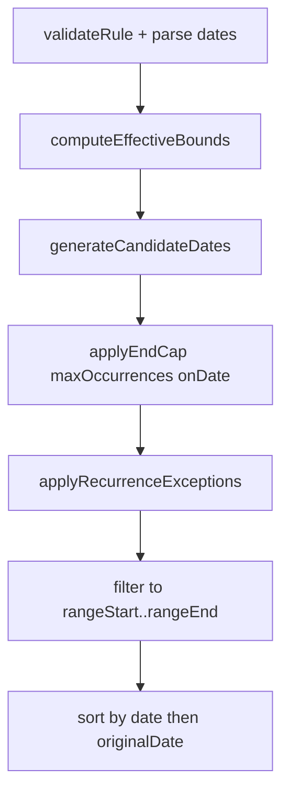
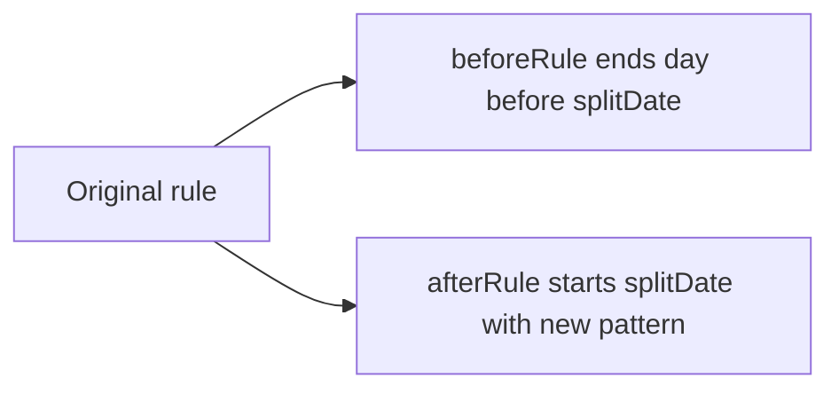
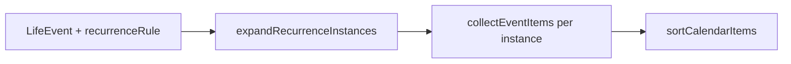

# Phase 22A — Recurrence Foundation

## Scope and constraints

| In scope | Out of scope |
|----------|----------------|
| [`src/core/recurrence.ts`](src/core/recurrence.ts) — types + pure helpers | Supabase migrations, `AppPayload` / `model.ts` changes |
| [`src/core/recurrence.test.ts`](src/core/recurrence.test.ts) — vitest | [`calendar.ts`](src/core/calendar.ts) wiring, UI, drag/drop |
| Reuse existing date utilities where possible | New npm recurrence libraries |
| Update [`docs/architecture.md`](docs/architecture.md) after implementation | Mutating domain entities inside helpers |

Follows the same pattern as [`calendar.ts`](src/core/calendar.ts): header comment, total functions, no side effects, inputs never mutated, `YYYY-MM-DD` local date keys, lexicographic date compare.

---

## 1. Type design

All types live in `recurrence.ts`. Import [`Weekday`](src/core/model.ts) only for weekly rules (matches skills/calendar weekday expansion).

```typescript
export type RecurrenceFrequency = "daily" | "weekly" | "monthly" | "yearly";

/** How the series stops. Omitted on rule = never ends (subject to expansion range). */
export type RecurrenceEnd =
  | { kind: "never" }
  | { kind: "onDate"; endDate: string }
  | { kind: "afterCount"; maxOccurrences: number };

export type RecurrenceException =
  | { kind: "skip"; date: string }
  | {
      kind: "override";
      date: string; // original occurrence date
      overrideDate: string; // where the instance appears instead
    };

export type RecurrenceRule = {
  /** First scheduled occurrence / series anchor (required). */
  anchorDate: string;
  /**
   * Undefined = one-time (only `anchorDate`).
   * Present = recurring from anchor using `interval` (default 1).
   */
  frequency?: RecurrenceFrequency;
  /** Step: every N days/weeks/months/years (integer >= 1, default 1). */
  interval?: number;
  /** Weekly only: at least one weekday when frequency is weekly. */
  byWeekdays?: Weekday[];
  /**
   * Monthly only: day 1–31.
   * Defaults to day-of-month from `anchorDate` when omitted.
   */
  dayOfMonth?: number;
  /**
   * Effective series start (>= anchor). Defaults to `anchorDate`.
   * Used after splits and delayed starts.
   */
  startDate?: string;
  end?: RecurrenceEnd;
  exceptions?: RecurrenceException[];
};

export type RecurrenceInstance = {
  /** Calendar date of this occurrence (after overrides). */
  date: string;
  /** Set when `kind: "override"` moved the instance. */
  originalDate?: string;
  /** 1-based index among scheduled candidates (see counting rules below). */
  occurrenceIndex: number;
  isException: boolean;
};
```

**One-time equivalent:** `frequency` omitted (or explicitly treated as non-recurring). Expansion yields at most one instance on `anchorDate` if it falls in range and bounds.

**Future override fields** (title, `startTime`, `endTime`) are intentionally deferred; `RecurrenceException` stays date-only in 22A so calendar/event layers can attach domain fields later without changing expansion semantics.

**Series identity** (`seriesId`) belongs on persisted domain rows in a later phase—not on `RecurrenceRule` in 22A.

---

## 2. Expansion algorithm

Public entry: `expandRecurrenceInstances(rule, rangeStart, rangeEnd): RecurrenceInstance[]`.



### Internal pipeline

1. **Validate** — Invalid `anchorDate` / unparseable range → `[]`. Invalid rule shapes (weekly with empty `byWeekdays`, `interval < 1`, `dayOfMonth` out of range) → `[]` (never throw).
2. **Effective bounds** — `seriesStart = max(anchorDate, startDate ?? anchorDate)`. `seriesEnd` from `end.kind` (`onDate` → `endDate`; `never` / `afterCount` → unbounded for generation). Intersect with `[rangeStart, rangeEnd]` for the **output clip**; generation may need to walk slightly before `rangeStart` to honor `maxOccurrences` correctly when the query window is narrow.
3. **Generate candidates** (by frequency, in ascending date order, starting no earlier than `seriesStart`):

| Frequency | Generator logic |
|-----------|-----------------|
| one-time | `[anchorDate]` if `anchorDate >= seriesStart` |
| daily | `anchorDate + k * interval` days |
| weekly | Each date `d >= seriesStart` where `weekdayFromDateString(d) ∈ byWeekdays` and `floor(daysBetween(anchorDate, d) / 7) % interval === 0` |
| monthly | Same `dayOfMonth` each month from anchor month, with **last-day-of-month clamp** when day > month length (e.g. Jan 31 → Feb 28/29) |
| yearly | Same month/day as anchor; **Feb 29 → Feb 28 in non-leap years** (same rule as [`calendar.ts`](src/core/calendar.ts) `birthdayDayForYear`) |

4. **End cap** — Stop generating when:
   - next candidate `> seriesEnd` (`onDate`), or
   - **candidate count** reaches `maxOccurrences` (`afterCount`).
5. **`applyRecurrenceExceptions`** — See section 3.
6. **Clip** — Keep instances with `date` in `[rangeStart, rangeEnd]` inclusive.
7. **Sort** — `date` asc, then `originalDate` asc, then `occurrenceIndex`.

### Counting rule for `maxOccurrences`

Count **scheduled candidates** from the generator **before** applying skips/overrides. A skipped date still consumes one slot (the occurrence existed in the series). Overrides do not add extra slots—they replace/move one candidate.

### Performance guard

Cap candidate generation at a fixed maximum (e.g. 10_000) per call to avoid runaway loops on bad input; return partial results or `[]` if exceeded (document in tests).

### Reused utilities

- [`iterateDateRange`](src/core/timeline.ts) — range sanity / optional iteration helpers
- [`weekdayFromDateString`](src/core/timeline.ts) — weekly matching
- [`addDaysToDateKey`](src/core/events.ts) — daily steps and split end dates
- [`formatLocalDateKey`](src/core/timeline.ts) — date arithmetic results

Keep **private** `parseDateKey`, `compareDateKeys`, `addMonthsToDateKey`, `addYearsToDateKey`, `clampDayOfMonth` inside `recurrence.ts` to avoid widening exports from other modules.

---

## 3. Exception / override model

`applyRecurrenceExceptions(candidates: RecurrenceInstance[], exceptions: RecurrenceException[]): RecurrenceInstance[]`

| Kind | Behavior |
|------|----------|
| `skip` | Remove instance whose `date` matches `date` (match on post-generation candidate date). |
| `override` | Remove candidate on `date`; insert instance on `overrideDate` with `originalDate: date`, `isException: true`. Preserve `occurrenceIndex` from removed candidate. |

**Rules:**

- Exceptions keyed by `YYYY-MM-DD` only (no time-of-day in 22A).
- Duplicate exceptions for same date: **last wins** (deterministic).
- Override to a date outside expansion range: still applied during expansion; **clip step** removes if outside query range (supports “moved to next month” visibility when range includes target).
- Override `overrideDate` colliding with another natural occurrence: both may appear (caller/UI dedupes later); document as known limitation for 22A.
- Skip on one-time rule: suppresses the single instance.

`expandRecurrenceInstances` calls `applyRecurrenceExceptions` internally; exporting the helper separately keeps unit tests focused and supports future UI preview (“what if I skip next Thursday?”).

---

## 4. Series split strategy

`splitRecurrenceSeriesAtDate(rule, splitDate, afterRule): { beforeRule: RecurrenceRule; afterRule: RecurrenceRule }`

Pure struct transform—**no mutation** of stored events. Supports: *“Tennis every Wednesday → every Friday starting 2026-11-01 without changing past Wednesdays.”*



**Algorithm:**

1. `beforeRule` = shallow copy of `rule` with `end: { kind: "onDate", endDate: splitDate - 1 day }` (via `addDaysToDateKey`). Preserve `exceptions` whose `date < splitDate` only.
2. `afterRule` = caller-supplied `afterRule` merged with:
   - `startDate: splitDate` (or `max(splitDate, afterRule.startDate)` if provided)
   - `anchorDate` unchanged from original unless caller sets it in `afterRule` (document: **caller should set `afterRule.anchorDate` to `splitDate`** for clean summaries)
   - `exceptions` filtered to `date >= splitDate` (re-key overrides if dates shift in a later UI phase)
3. If `splitDate <= rule.startDate ?? rule.anchorDate`, `beforeRule` is a degenerate one-time empty series (end before start) → return `beforeRule` with `frequency` undefined and no instances, or document returning `beforeRule` that expands to `[]`.

**Example (Wednesday → Friday):**

```typescript
const tennis: RecurrenceRule = {
  anchorDate: "2026-01-07", // a Wednesday
  frequency: "weekly",
  byWeekdays: ["wed"],
};

const { beforeRule, afterRule } = splitRecurrenceSeriesAtDate(
  tennis,
  "2026-07-01",
  {
    anchorDate: "2026-07-03", // first Friday on/after split
    frequency: "weekly",
    byWeekdays: ["fri"],
    startDate: "2026-07-03",
  }
);
```

Past Wednesdays through June still expand from `beforeRule`; Fridays from July from `afterRule`.

---

## 5. Date boundary rules

- **Storage format:** `YYYY-MM-DD` local calendar keys only; compare with `localeCompare`.
- **Inclusive ranges:** `rangeStart` and `rangeEnd` both inclusive; `rangeStart > rangeEnd` → `[]`.
- **`startDate`:** Occurrences before `startDate` are not generated (even if `anchorDate` is earlier—supports split tails).
- **`end.onDate`:** Last candidate on or before `endDate`.
- **`end.afterCount`:** Stop after N candidates (see counting rule).
- **Both `onDate` and `afterCount`:** Whichever limit is hit **first** while generating candidates.
- **Query range vs series bounds:** Expansion generates within series bounds, then clips to `[rangeStart, rangeEnd]`.
- **Invalid dates:** Unparseable keys → safe empty results (mirror [`calendar.ts`](src/core/calendar.ts) defensive style).

---

## 6. Edge cases

| Case | Expected behavior |
|------|-------------------|
| Feb 29 yearly anchor | Occurs Feb 28 in non-leap years |
| Monthly on 31st | Clamp to last day of shorter months |
| Monthly on 30th in February | Feb 28/29 |
| Weekly `interval: 2` | Biweekly from anchor week (week index = `floor(days/7) % interval`) |
| Empty `byWeekdays` | No instances |
| `anchorDate` after `endDate` | `[]` |
| Skip + override same date | Last exception wins |
| Override moves into range, source out of range | Only override visible when clip includes target |
| Split on non-occurrence date | Still valid; `before` ends day before split |
| One-time + `maxOccurrences: 1` | Single instance when in range |
| `interval` missing | Treat as `1` |
| Candidate cap exceeded | Stop / return `[]` (test chosen behavior) |

**Explicit non-goals in 22A:** timezone/DST (date-only), RRULE/iCal import, “nth weekday of month”, exception payloads beyond dates.

---

## 7. Tests ([`src/core/recurrence.test.ts`](src/core/recurrence.test.ts))

Mirror [`calendar.test.ts`](src/core/calendar.test.ts): vitest, small `makeRule()` factory, no React.

**`expandRecurrenceInstances`**

- One-time in/out of range
- Daily every 1 and every 2 days with `end.onDate`
- Weekly single and multiple weekdays; weekday-only template (“weekdays at 6 AM” = `mon`–`fri`)
- Weekly until December (`end.onDate`)
- Monthly by anchor day and explicit `dayOfMonth`
- Yearly birthday (Feb 29 anchor across leap/non-leap)
- `maxOccurrences` stops correctly; skips still count toward cap
- Range clip (partial series visible in month grid window)
- Invalid rule → `[]`
- Immutability: input `rule` unchanged after expand

**`isDateInRecurrenceRange`**

- True/false for recurring and one-time; false after skip; true on override target

**`getRecurrenceDateKeys`**

- Equals `expandRecurrenceInstances(...).map(i => i.date)` (order preserved)

**`applyRecurrenceExceptions`**

- Skip removes; override moves; last-wins duplicates

**`splitRecurrenceSeriesAtDate`**

- Wednesday→Friday split: before only Wed, after only Fri, no overlap
- Exceptions partitioned by split date

**`formatRecurrenceSummary`**

- Snapshots for: once, daily, weekly (single/multi weekday), monthly, yearly, until date, after N times

---

## 8. How [`calendar.ts`](src/core/calendar.ts) will consume it (later phase)

No changes in 22A. Planned integration (Phase 22B+):



1. `LifeEvent` gains optional `recurrence?: RecurrenceRule` (and later `seriesId`).
2. `collectEventItems` splits into:
   - **Non-recurring:** current path (`event.date` in range).
   - **Recurring:** `expandRecurrenceInstances(rule, startDate, endDate)` → one `CalendarItem` per `RecurrenceInstance`, stable id e.g. `event:${eventId}:${instance.date}` (update `buildStableCalendarItemId` for recurring).
3. **People birthdays** may optionally use `frequency: "yearly"` instead of the year-loop in `collectBirthdayItems` (keep dedupe with explicit birthday events).
4. **Skills** keep `WeeklySchedule` short-term; optional adapter `weeklyScheduleToRecurrenceRule(skill)` later—do not block 22A.
5. **Timeline** (`timeline.ts`) can share expansion for multi-day upcoming windows when events become recurring.

Views ([`CalendarPage`](src/pages/CalendarPage.tsx), [`calendarView.ts`](src/core/calendarView.ts)) stay unchanged—they already consume `CalendarItem[]`.

---

## 9. Future migration strategy

| Phase | Work |
|-------|------|
| **22A** (this) | Pure engine + tests + architecture doc subsection |
| **22B** | `LifeEvent.recurrence?: RecurrenceRule`, `seriesId?: string`; `dbMappers` validation; `events` table jsonb column + migration |
| **22C** | `buildCalendarItemsForRange` expansion; update stable IDs + tests in `calendar.test.ts` |
| **22D** | Events UI: recurrence picker, skip/override, split flow calling `splitRecurrenceSeriesAtDate` + `commit` |
| **Later** | Fitness plan schedules, skill schedule adapter; optional `recurring_series` table if jsonb proves insufficient |

**Persistence sketch (not implemented now):**

```typescript
// Future LifeEvent fields
recurrence?: RecurrenceRule;
seriesId?: string; // links split segments
```

**Backup/sync:** `parseRecurrenceRule` in `dbMappers.ts` with allowlisted frequencies, date regex, weekday allowlist, exception shape checks (per `SECURITY_RULES`).

**Backward compatibility:** Missing `recurrence` → current single-date behavior.

---

## 10. Validation checklist (implementation phase)

- [ ] `npm test` — `recurrence.test.ts` passes; full suite green
- [ ] `npm run lint` — no new issues
- [ ] `npm run build` — succeeds
- [ ] No changes to `supabase/migrations`, `model.ts`, `AppPayload`, pages, or components
- [ ] No new dependencies in `package.json`
- [ ] Module header documents pure/read-only contract
- [ ] All exported helpers are total (no throw on bad input)
- [ ] Inputs not mutated (assert in tests)
- [ ] [`docs/architecture.md`](docs/architecture.md) — add **Recurrence engine** subsection under `src/core` (mirror calendar foundation style): types, helpers, relationship to calendar, deferred persistence
- [ ] Future use cases from requirements covered by at least one test each

---

## Public API summary

| Function | Purpose |
|----------|---------|
| `expandRecurrenceInstances(rule, rangeStart, rangeEnd)` | Main expansion → `RecurrenceInstance[]` |
| `isDateInRecurrenceRange(rule, date)` | Membership test (post-exception semantics) |
| `getRecurrenceDateKeys(rule, rangeStart, rangeEnd)` | `string[]` date keys only |
| `applyRecurrenceExceptions(candidates, exceptions)` | Exception merge (exported for tests/UI preview) |
| `splitRecurrenceSeriesAtDate(rule, splitDate, afterRule)` | Pure series fork for edit flows |
| `formatRecurrenceSummary(rule)` | Human-readable label for UI |

Optional internal (export only if needed by tests): `isValidRecurrenceRule(rule): boolean`.

---

## Requirement mapping

| User scenario | Mechanism |
|---------------|-----------|
| Tennis every Wednesday | `weekly` + `byWeekdays: ["wed"]` |
| Workout every weekday 6 AM | `weekly` + `mon`–`fri` (time stays on domain entity later) |
| Blender every Thursday until December | `weekly` + `end: { kind: "onDate", endDate }` |
| Birthday every year | `yearly` from `anchorDate` |
| Change Wed → Fri from month 6 | `splitRecurrenceSeriesAtDate` + new `afterRule` |
| Skipped / overridden dates | `RecurrenceException` skip/override |
