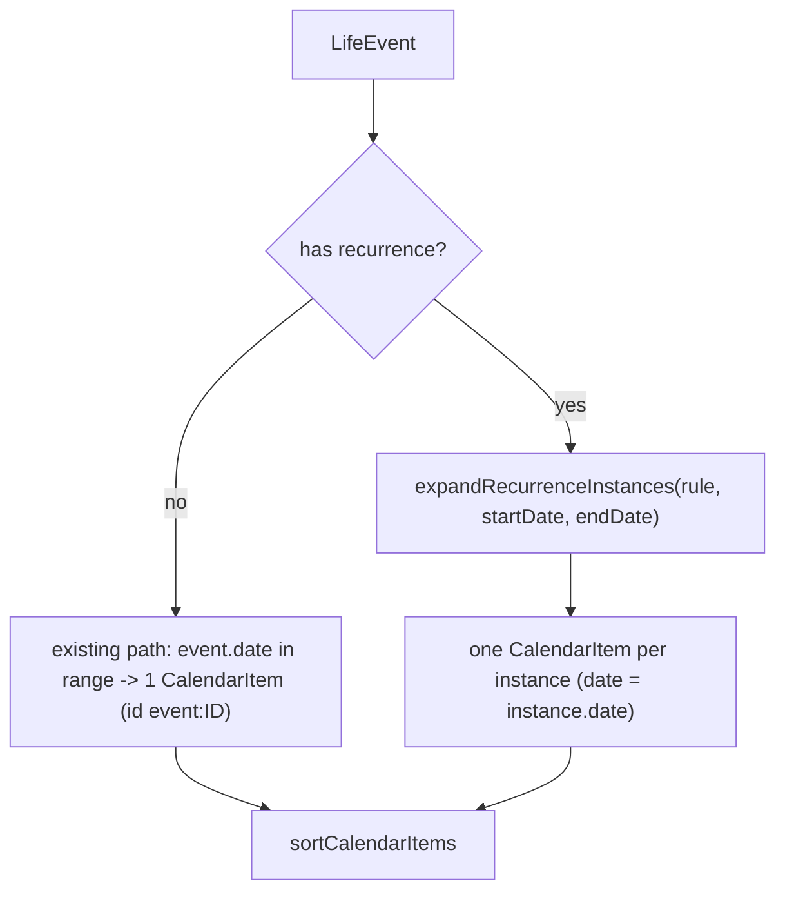

# Phase 22B — Recurring Events Persistence and Calendar Expansion

## Scope

| In scope | Out of scope |
|----------|----------------|
| `LifeEvent.recurrence?` / `seriesId?` on [model.ts](src/core/model.ts) | Recurrence editor UI |
| Migration: `recurrence jsonb` + `series_id uuid` on `events` | Drag/drop, series-split UI |
| Strict `parseRecurrenceRule` + event validation in [dbMappers.ts](src/core/dbMappers.ts) | New dependencies |
| Calendar expansion in [calendar.ts](src/core/calendar.ts) | EventsPage form fields (kept; safe display only) |
| Tests + [docs/architecture.md](docs/architecture.md) | AppPayload shape changes beyond event fields |

Reuses `expandRecurrenceInstances` from [recurrence.ts](src/core/recurrence.ts) (already tested). Follows the calendar-preferences persistence pattern (jsonb column + `parse*` validator wired into mapper and upload validation).

---

## 1. Files to change

- [src/core/model.ts](src/core/model.ts) — add `recurrence?: RecurrenceRule` and `seriesId?: string` to `LifeEvent`; `import type { RecurrenceRule } from "./recurrence"` (type-only; mirrors the existing `CalendarColorPreferences` cross-import, safe despite recurrence.ts importing `Weekday` from model).
- [supabase/migrations/20260528000000_event_recurrence.sql](supabase/migrations/20260528000000_event_recurrence.sql) — new migration (see section 2).
- [src/core/dbMappers.ts](src/core/dbMappers.ts) — extend `EventRow`, add `parseRecurrenceRule`, extend `assertValidEvent`, `eventToRow`, `eventFromRow`.
- [src/core/calendar.ts](src/core/calendar.ts) — extend `lifeEvent` `sourceMeta`, `buildStableCalendarItemId`, and `collectEventItems` expansion.
- [src/core/storage.ts](src/core/storage.ts) — no logic change needed (events array is preserved as-is, so nested `recurrence`/`seriesId` ride along); add one clarifying comment only.
- Tests: [src/core/dbMappers.test.ts](src/core/dbMappers.test.ts), [src/core/calendar.test.ts](src/core/calendar.test.ts), [src/core/storage.test.ts](src/core/storage.test.ts).
- [docs/architecture.md](docs/architecture.md) — event recurrence persistence + calendar expansion + deferred UI.

No change required to [remoteStorage.ts](src/core/remoteStorage.ts): it uses `select("*")` (auto-fetches new columns) and routes events through `eventToRow`/`upsertRows`, so sync works once the mapper is updated.

---

## 2. Migration design

New file `20260528000000_event_recurrence.sql` (additive, nullable, preserves all existing rows; RLS/policies inherited and unchanged):

```sql
-- Phase 22B: optional event recurrence + series linkage
ALTER TABLE public.events
  ADD COLUMN recurrence jsonb NULL,
  ADD COLUMN series_id uuid NULL;

ALTER TABLE public.events
  ADD CONSTRAINT events_recurrence_object_chk
    CHECK (recurrence IS NULL OR jsonb_typeof(recurrence) = 'object');

CREATE INDEX events_user_id_series_id_idx
  ON public.events (user_id, series_id)
  WHERE series_id IS NOT NULL;
```

- `recurrence` nullable jsonb, object-shape CHECK (mirrors `calendar_preferences_preferences_object_chk`). Deep validation stays in the mapper, not SQL.
- `series_id` nullable `uuid` (links split segments in a later phase); partial index for future series queries.
- No RLS/grant/trigger changes — existing `events` policies already scope by `user_id`.

---

## 3. Recurrence validation strategy

Add `parseRecurrenceRule(raw: unknown, field = "recurrence"): RecurrenceRule` to [dbMappers.ts](src/core/dbMappers.ts), following `parseCalendarColorPreferences`/`parseExerciseEntries` (allowlist keys, reject unknown, throw `MapperError`, return canonical object). Strict checks:

- Root must be a plain object; reject unknown top-level keys (allowlist: `anchorDate`, `frequency`, `interval`, `byWeekdays`, `dayOfMonth`, `startDate`, `end`, `exceptions`).
- `anchorDate` required, `isIsoDate`.
- `frequency` optional, in `["daily","weekly","monthly","yearly"]`.
- `interval` optional, `isPositiveInteger`.
- `byWeekdays` optional array of valid `Weekday` (reuse local `WEEKDAYS`); **required non-empty when `frequency === "weekly"`**.
- `dayOfMonth` optional integer 1–31.
- `startDate` optional, `isIsoDate`.
- `end` optional discriminated union: `{kind:"never"}` | `{kind:"onDate", endDate: isIsoDate}` | `{kind:"afterCount", maxOccurrences: positive int}`.
- `exceptions` optional array of `{kind:"skip", date}` | `{kind:"override", date, overrideDate}` with `isIsoDate` on every date.
- Cross-check with the engine: after building the canonical object, assert `isValidRecurrenceRule(rule)` and throw if false (single source of truth for shape rules like empty-weekly).

Wire into existing flow:
- `assertValidEvent` — when `event.recurrence !== undefined`, call `parseRecurrenceRule(event.recurrence)`; when `event.seriesId !== undefined`, `assertUuid`. Missing recurrence stays a valid one-time event (no behavior change).
- `eventToRow` — `recurrence: event.recurrence ? parseRecurrenceRule(event.recurrence) : null`, `series_id: event.seriesId ?? null`.
- `eventFromRow` — if `row.recurrence !== null`, set `event.recurrence = parseRecurrenceRule(row.recurrence, "events.recurrence")`; if `row.series_id !== null`, `assertUuid` then set `seriesId`.
- `validatePayloadForUpload` already calls `assertValidEvent` per event, so invalid recurrence is rejected on upload automatically.

`EventRow` gains `recurrence: unknown | null` and `series_id: string | null`.

---

## 4. Calendar expansion strategy



In [calendar.ts](src/core/calendar.ts):

- Extend the `lifeEvent` `sourceMeta` variant with optional recurrence fields (kept optional so one-time meta is byte-identical to today):

```typescript
| {
    kind: "lifeEvent";
    eventId: string;
    eventType: EventType;
    reminder: boolean;
    personName?: string;
    recurrenceDate?: string;   // instance.date
    originalDate?: string;     // instance.originalDate (override source)
    occurrenceIndex?: number;
    isRecurrenceException?: boolean;
  }
```

- `buildStableCalendarItemId` `lifeEvent` case: `meta.recurrenceDate !== undefined ? \`event:${meta.eventId}:${meta.recurrenceDate}\` : \`event:${meta.eventId}\``. One-time events keep `event:${eventId}` exactly. (Chosen the displayed-date form; collisions only if an override target lands on another instance's date — documented 22B limitation, consistent with recurrence engine notes.)
- `collectEventItems`: for each event,
  - **No `recurrence`** → current behavior unchanged (filter `event.date` within `[startDate,endDate]`, no recurrence meta fields).
  - **Has `recurrence`** → `expandRecurrenceInstances(event.recurrence, startDate, endDate)`; for each instance build a `CalendarItem` with `date = instance.date`, preserving `title`/`type`/`personName`/`notes`/`startTime`/`endTime` (same timed/all-day tiering as today), `subcategoryKey = event.type`, and recurrence meta (`recurrenceDate`, `originalDate`, `occurrenceIndex`, `isRecurrenceException`).
- Person birthday dedupe (`hasBirthdayEventForPerson`) stays keyed on `event.date` — one-time birthday dedupe is unchanged. Note in docs that recurring birthday-type events are not de-duplicated against people birthdays in 22B (birthdays remain a people-domain yearly concern).

Views and `calendarView.ts` consume `CalendarItem[]` unchanged.

---

## 5. Tests

**[dbMappers.test.ts](src/core/dbMappers.test.ts)**
- Recurring event round-trips `eventToRow` → `eventFromRow` (weekly rule + exceptions + `seriesId`).
- One-time event round-trips with `recurrence`/`series_id` null (existing behavior).
- Invalid recurrence rejected (empty weekly `byWeekdays`, bad `anchorDate`, unknown top-level key, bad `end.kind`, non-uuid `seriesId`).
- `validatePayloadForUpload` throws on an event with invalid recurrence.

**[calendar.test.ts](src/core/calendar.test.ts)**
- Existing one-time event assertions unchanged (id `event:e1`, etc.).
- Weekly recurring "tennis" event expands across a multi-week range (instance count + dates + stable ids `event:ID:YYYY-MM-DD`).
- Recurring event whose occurrences fall outside the range produces nothing.
- Override instance shifts the `CalendarItem.date` and sets `originalDate`/`isRecurrenceException` meta.
- Skip exception suppresses exactly one instance.
- People birthday dedupe against a one-time birthday event still works.

**[storage.test.ts](src/core/storage.test.ts)**
- Payload/event without recurrence normalizes unchanged.
- Event carrying `recurrence`/`seriesId` survives `normalizePayload` (backup round-trip).

---

## 6. Deferred UI work (explicitly NOT in 22B)

- Recurrence editor in [EventsPage](src/pages/EventsPage.tsx) (frequency/interval/weekday/end pickers) — forms unchanged except, if needed, a read-only "Repeats: <summary>" line using `formatRecurrenceSummary` for safe display.
- Per-instance skip/override and `splitRecurrenceSeriesAtDate` edit flows (calendar detail modal actions + `App.tsx` commit).
- Drag/drop, series-vs-occurrence edit prompts, `seriesId` generation/linking on split.

---

## 7. Validation checklist

- [ ] `npm test` — new + existing suites green (esp. calendar, dbMappers, storage).
- [ ] `npm run lint` — clean.
- [ ] `npm run build` — succeeds.
- [ ] One-time event behavior byte-identical (ids, items, round-trip).
- [ ] Invalid recurrence rejected at mapper and upload validation.
- [ ] Old rows / old backups without recurrence load unchanged.
- [ ] No new dependencies; RLS unchanged.
- [ ] [docs/architecture.md](docs/architecture.md) updated: event recurrence persistence, calendar expansion, deferred UI.

---

## Report summary

- **Files to change**: model.ts, new migration, dbMappers.ts, calendar.ts, storage.ts (comment), three test files, architecture doc. remoteStorage.ts needs no change (`select("*")` + existing mapper routing).
- **Migration design**: additive nullable `recurrence jsonb` (object CHECK) + `series_id uuid` + partial index; RLS/policies/grants untouched; existing rows preserved.
- **Recurrence validation**: strict `parseRecurrenceRule` (allowlisted keys, ISO dates, frequency/weekday/end/exception shape) cross-checked with `isValidRecurrenceRule`; wired through `assertValidEvent`/`eventToRow`/`eventFromRow`/`validatePayloadForUpload`.
- **Calendar expansion**: recurring events expand via `expandRecurrenceInstances` into one `CalendarItem` per instance (date = instance.date, recurrence meta attached, stable id `event:ID:date`); one-time path unchanged.
- **Deferred UI**: recurrence editor, skip/override + split flows, drag/drop.
