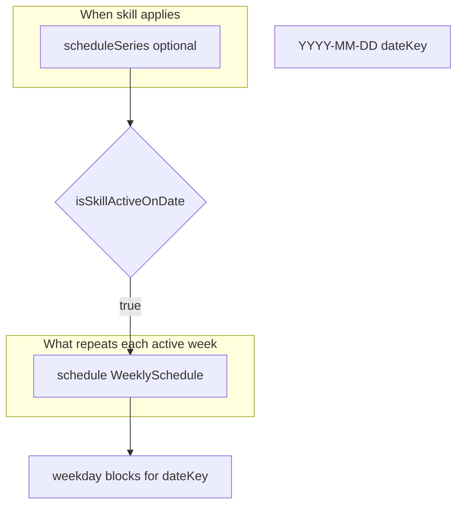
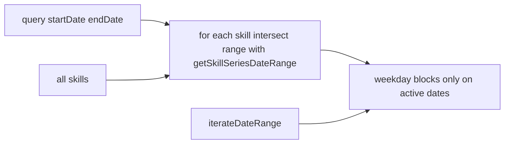

# Phase 23 — Recurring Skills Foundation

## Scope boundary

| In scope | Out of scope (explicit) |
|----------|-------------------------|
| Types on [`Skill`](src/core/model.ts) | UI (Skills page, recurrence editor) |
| Pure module [`src/core/skillSeries.ts`](src/core/skillSeries.ts) + tests | [`calendar.ts`](src/core/calendar.ts) / [`timeline.ts`](src/core/timeline.ts) / [`dashboardStats.ts`](src/core/dashboardStats.ts) / [`review.ts`](src/core/review.ts) integration |
| Load-time cleanup helper (optional wire in [`storage.ts`](src/core/storage.ts)) | Supabase migrations, new columns |
| [`docs/architecture.md`](docs/architecture.md) subsection | [`recurrence.ts`](src/core/recurrence.ts) changes, `weeklyScheduleToRecurrenceRule` |
| `npm test` / `lint` / `build` | Notifications, workout scheduling, drag/drop |

**Cloud sync:** No changes to [`dbMappers.ts`](src/core/dbMappers.ts) `skillToRow` / `skillFromRow` / `assertValidSkill`. `scheduleSeries` survives in **localStorage and JSON backup** via existing shallow `normalizePayload` (`skills` array passthrough). Remote round-trip will not persist `scheduleSeries` until a future migration phase — document this explicitly (not a bug for 23).

---

## Conceptual model

Two layers stay separate (matches architecture today):



- **`WeeklySchedule`** — unchanged; weekday template (implicit “every week” block pattern).
- **`scheduleSeries`** — optional bounds for when that template counts at all.
- **`recurrence.ts`** — full RRULE-style expansion for life events; **not used in Phase 23**. Skills do not get `RecurrenceRule` yet (Phase 22A deferred adapter).

---

## 1. Model extensions

**File:** [`src/core/model.ts`](src/core/model.ts)

Add types adjacent to `Skill` (no import from `recurrence.ts` — keep skill series self-contained):

```typescript
export type SkillRecurrenceMode = "indefinite" | "date_range" | "single_day";

export type SkillScheduleSeries =
  | { mode: "indefinite" }
  | { mode: "date_range"; startDate: string; endDate: string }
  | { mode: "single_day"; date: string };
```

Extend `Skill`:

```typescript
export type Skill = {
  // ...existing fields...
  schedule: WeeklySchedule;
  /** When the weekly template is in effect. Omitted = indefinite (legacy). */
  scheduleSeries?: SkillScheduleSeries;
  createdAtIso: string;
  updatedAtIso: string;
};
```

**Backward compatibility**

| `scheduleSeries` | Active-date behavior | Weekly blocks |
|------------------|----------------------|---------------|
| `undefined` | Active on **every** `dateKey` (today’s behavior) | Unchanged weekday expansion |
| `{ mode: "indefinite" }` | Same as `undefined` | Same |
| `{ mode: "date_range", ... }` | Active only when `startDate <= dateKey <= endDate` (inclusive, lexicographic `YYYY-MM-DD`) | Same template when active |
| `{ mode: "single_day", date }` | Active only when `dateKey === date` | Same template on that one day |

No changes to [`defaultPayload`](src/core/state.ts) / new skills in [`App.tsx`](src/App.tsx) — field stays omitted.

---

## 2. Pure validation — `src/core/skillSeries.ts`

New **pure, dependency-free** module (header mirrors [`recurrence.ts`](src/core/recurrence.ts): local `YYYY-MM-DD`, lexicographic compare, no timezone/DST, total functions, no throw, no input mutation).

### Private helpers (module-internal)

- `DATE_KEY_RE`, `parseDateKey(key: unknown): ParsedDate | null` — calendar-valid date (reuse recurrence-style rules, including month length).
- `compareDateKeys(a, b)` — lexicographic.

### Public API

| Function | Contract |
|----------|----------|
| `isValidSkillScheduleSeries(raw: unknown): raw is SkillScheduleSeries` | Structural + semantic validation |
| `normalizeSkillScheduleSeries(raw: unknown): SkillScheduleSeries \| undefined` | Canonical object or `undefined` if invalid |
| `isSkillActiveOnDate(skill: Skill, dateKey: string): boolean` | Membership test for one day |
| `buildActiveSkillsForDate(skills: Skill[], dateKey: string): Skill[]` | Filter; preserves input order |
| `getSkillSeriesDateRange(skill: Skill): SkillSeriesDateRange` | For future calendar range optimization |
| `cleanupInvalidSkillScheduleSeries(payload: AppPayload): AppPayload` | Load/import sanitizer (mirror [`cleanupInvalidEventRecurrence`](src/core/events.ts)) |

Export supporting type:

```typescript
export type SkillSeriesDateRange =
  | { kind: "unbounded" }
  | { kind: "bounded"; startDate: string; endDate: string };
```

### Validation rules

**`indefinite`**

- `mode === "indefinite"` only; no extra keys (reject unknown keys on raw objects during validation).

**`date_range`**

- `startDate`, `endDate`: valid `YYYY-MM-DD`.
- Require `startDate <= endDate` (inclusive range). **Do not auto-swap** — invalid → `undefined` from `normalizeSkillScheduleSeries` (predictable, matches strict mapper style).

**`single_day`**

- `date`: valid `YYYY-MM-DD`.

**Unknown `mode` / wrong shapes / arrays / null** → invalid.

### Invalid values: drop on load, defensive at read time

| Layer | Decision | Rationale |
|-------|----------|-----------|
| **Load/import** | `cleanupInvalidSkillScheduleSeries` strips invalid `scheduleSeries` from each skill (wired from [`sanitizeSkillReferences`](src/core/sessions.ts) or `normalizePayload` chain in [`storage.ts`](src/core/storage.ts)) | Mirrors event recurrence cleanup; keeps backup/import uploadable later |
| **`normalizeSkillScheduleSeries`** | Returns `undefined` for invalid input | Canonical storage shape for future UI |
| **`isSkillActiveOnDate` with invalid `scheduleSeries` still present** | Treat as **indefinite** (active on all dates) | Fail-open for in-memory edge cases; cleanup handles persistence |
| **`validatePayloadForUpload` / dbMappers** | **No change in Phase 23** | No DB column; avoids rejecting entire payload for a field that cannot sync yet |

When Phase 24 adds persistence, add `parseSkillScheduleSeries` in `dbMappers.ts` with allowlisted keys and cross-check `isValidSkillScheduleSeries`.

---

## 3. Active-date helpers

### `isSkillActiveOnDate(skill, dateKey)`

1. If `dateKey` is not a valid calendar date → `false` (invalid query date).
2. If `skill.scheduleSeries` is `undefined` → `true`.
3. If invalid series (shouldn’t happen after cleanup) → `true` (indefinite fallback).
4. `normalizeSkillScheduleSeries(skill.scheduleSeries)`; if `undefined` → `true`.
5. Mode switch:
   - **`indefinite`** → `true`
   - **`date_range`** → `startDate <= dateKey <= endDate`
   - **`single_day`** → `dateKey === date`

**Important:** This does **not** check whether `skill.schedule[weekday]` has blocks. A skill can be “active” on a date with zero planned minutes (same as today for empty weekdays). Downstream callers combine active filter + `plannedMinutesForDay` when needed.

### `buildActiveSkillsForDate(skills, dateKey)`

```typescript
return skills.filter((skill) => isSkillActiveOnDate(skill, dateKey));
```

- Stable order (input order preserved).
- Does not clone skills.
- Empty `skills` → `[]`.

---

## 4. Schedule filtering — future consumers

Phase 23 **exports only**; no call-site changes yet.

| Consumer | Current behavior | Future integration (one line each) |
|----------|------------------|-----------------------------------|
| [`dashboardStats.ts`](src/core/dashboardStats.ts) `buildSkillDayRows` | All `skills` | `buildActiveSkillsForDate(skills, todayKey)` before mapping |
| [`calendar.ts`](src/core/calendar.ts) `collectSkillItems` | All skills × dates | Filter skills per `date` in loop, or pre-filter with range helper |
| [`timeline.ts`](src/core/timeline.ts) `generateScheduleItems` | Same | Same as calendar |
| [`review.ts`](src/core/review.ts) `countScheduledDaysInWeek` / missed days | All skills, weekday template only | For each `dayKey` in week, skip skill if `!isSkillActiveOnDate(skill, dayKey)` |

**Weekly Review workload** (`buildUnifiedTimelineRange` over week) — same filter when wiring.

**Focus** ([`focus.ts`](src/core/focus.ts)) — uses `buildSkillDayRows` / timeline; inherits filtering once dashboard/timeline integrate.

---

## 5. Future calendar support — `getSkillSeriesDateRange`

```typescript
function getSkillSeriesDateRange(skill: Skill): SkillSeriesDateRange
```

| `scheduleSeries` | Result |
|------------------|--------|
| `undefined` or invalid (after normalize fails) or `indefinite` | `{ kind: "unbounded" }` |
| `date_range` | `{ kind: "bounded", startDate, endDate }` (normalized dates) |
| `single_day` | `{ kind: "bounded", startDate: date, endDate: date }` |

**Future [`collectSkillItems`](src/core/calendar.ts) optimization (Phase 24+):**



Today: iterate every date in range, map weekday, emit blocks for **all** skills. Tomorrow: skip `(skill, date)` when `!isSkillActiveOnDate(skill, date)`; optionally skip entire skills when bounded range does not intersect query range (use `getSkillSeriesDateRange` + lexicographic overlap test).

**Not** the same as `expandRecurrenceInstances` — skills keep weekday template recurrence; `scheduleSeries` is a simple visibility window, not frequency/interval/exceptions.

---

## 6. Tests — `src/core/skillSeries.test.ts`

Follow [`recurrence.test.ts`](src/core/recurrence.test.ts): Vitest, local `makeSkill` factory, `deepFreeze` immutability test on exported functions.

**Minimum 20 tests** (suggested grouping):

| # | Area | Cases |
|---|------|-------|
| 1–3 | `isValidSkillScheduleSeries` | valid indefinite, date_range, single_day |
| 4–8 | invalid | unknown mode, bad date strings, Feb 30, `startDate > endDate`, extra keys, non-object |
| 9–11 | `normalizeSkillScheduleSeries` | canonical output; invalid → undefined; does not mutate input |
| 12–15 | `isSkillActiveOnDate` | undefined series; indefinite; in/out of range; single_day match/miss |
| 16 | edge dates | range boundaries inclusive (`startDate`, `endDate`) |
| 17 | invalid series on skill | still active all days (fail-open) |
| 18 | invalid `dateKey` query | `false` |
| 19–20 | `buildActiveSkillsForDate` | mixed skills; all inactive day → `[]` |
| 21 | backward compat | skill without `scheduleSeries` equals explicit indefinite |
| 22 | `getSkillSeriesDateRange` | unbounded vs bounded for each mode |
| 23 | `cleanupInvalidSkillScheduleSeries` | strips bad series, preserves valid, no-op when clean |
| 24 | immutability | `deepFreeze` inputs to filter/active helpers |

Optional: leap-year date (`2024-02-29`) as valid single_day.

---

## 7. Documentation — [`docs/architecture.md`](docs/architecture.md)

Add subsection **Skill schedule series** under `src/core` (after Recurrence engine or Calendar foundation):

- Types: `SkillRecurrenceMode`, `SkillScheduleSeries`, optional `Skill.scheduleSeries`
- Active-date pipeline: `isSkillActiveOnDate` → `buildActiveSkillsForDate`
- `getSkillSeriesDateRange` and future calendar filtering
- **Relationship to `recurrence.ts`:** orthogonal; events use full rules; skills use weekday template + optional date window; no import between modules
- **Relationship to `calendar.ts`:** not wired in 23; document planned filter in `collectSkillItems`
- **Why no UI/sync/schema:** foundation-only; avoids migration and sync data loss before column exists
- **Load cleanup:** `cleanupInvalidSkillScheduleSeries` + link to event recurrence cleanup pattern

Update folder structure bullet list to include `skillSeries.ts`.

---

## 8. Validation checklist

After implementation:

```bash
npm test
npm run lint
npm run build
```

Confirm: no changes to pages/components; existing tests green; new `skillSeries.test.ts` passes.

---

## Files to create / change

| Action | Path |
|--------|------|
| **Create** | [`src/core/skillSeries.ts`](src/core/skillSeries.ts) |
| **Create** | [`src/core/skillSeries.test.ts`](src/core/skillSeries.test.ts) |
| **Edit** | [`src/core/model.ts`](src/core/model.ts) — types + `scheduleSeries?` |
| **Edit** | [`src/core/sessions.ts`](src/core/sessions.ts) or [`src/core/storage.ts`](src/core/storage.ts) — call `cleanupInvalidSkillScheduleSeries` from `sanitizeSkillReferences` |
| **Edit** | [`docs/architecture.md`](docs/architecture.md) |
| **No edit** | `dbMappers.ts`, `remoteStorage.ts`, `calendar.ts`, `timeline.ts`, `dashboardStats.ts`, `review.ts`, `focus.ts`, UI, migrations |

---

## Risks and tradeoffs

| Risk | Mitigation |
|------|------------|
| `scheduleSeries` lost on Supabase sync until migration | Document; Phase 24 adds jsonb column + mapper |
| Duplicated `parseDateKey` vs `recurrence.ts` | Accept for pure-module isolation; optional shared `dateKeys.ts` later if duplication grows |
| Invalid series fail-open in `isSkillActiveOnDate` | Load cleanup strips bad data; tests cover both paths |
| Confusion with `RecurrenceRule` | Distinct names (`SkillScheduleSeries`, not `recurrence` on Skill) |
| Review “scheduled days” vs “active days” | Future phase must filter by `isSkillActiveOnDate` before counting weekdays |

---

## Recommended implementation order

1. **Types** in `model.ts`
2. **`skillSeries.ts`** — validation + normalize + active-date + range + cleanup
3. **`skillSeries.test.ts`** — full matrix (≥20 tests)
4. **Wire cleanup** on load (`sanitizeSkillReferences`)
5. **`docs/architecture.md`**
6. **Run** test / lint / build

---

## Future phases (build on 23)

| Phase | Work |
|-------|------|
| **23B / 24 — Persistence** | `skills.schedule_series jsonb`, `parseSkillScheduleSeries` in `dbMappers`, upload validation |
| **24 — Calendar/timeline** | `buildActiveSkillsForDate` in `collectSkillItems` / `generateScheduleItems`; range optimization via `getSkillSeriesDateRange` |
| **25 — Dashboard & review** | `buildSkillDayRows`, `countScheduledDaysInWeek`, weekly workload |
| **26 — Skills UI** | Series mode picker (indefinite / range / single day); no RRULE editor |
| **27 — One-time skill blocks** | Optional non-weekly blocks (separate from `scheduleSeries`) |
| **28 — Series edit flows** | “This occurrence / future / entire series” (may adopt `splitRecurrenceSeriesAtDate` patterns or skill-specific splits) |
| **Later** | `weeklyScheduleToRecurrenceRule` adapter if skills need full RRULE |

---

## Requirement traceability

| User part | Deliverable |
|-----------|-------------|
| 1 Model | `SkillRecurrenceMode`, `SkillScheduleSeries`, `scheduleSeries?` |
| 2 Validation | `skillSeries.ts` validators + drop-on-load policy |
| 3 Active dates | `isSkillActiveOnDate` |
| 4 Filtering | `buildActiveSkillsForDate` + consumer table |
| 5 Calendar future | `getSkillSeriesDateRange` + integration notes |
| 6 Tests | `skillSeries.test.ts` (≥20) |
| 7 Docs | `architecture.md` |
| 8 Validate | npm scripts |
