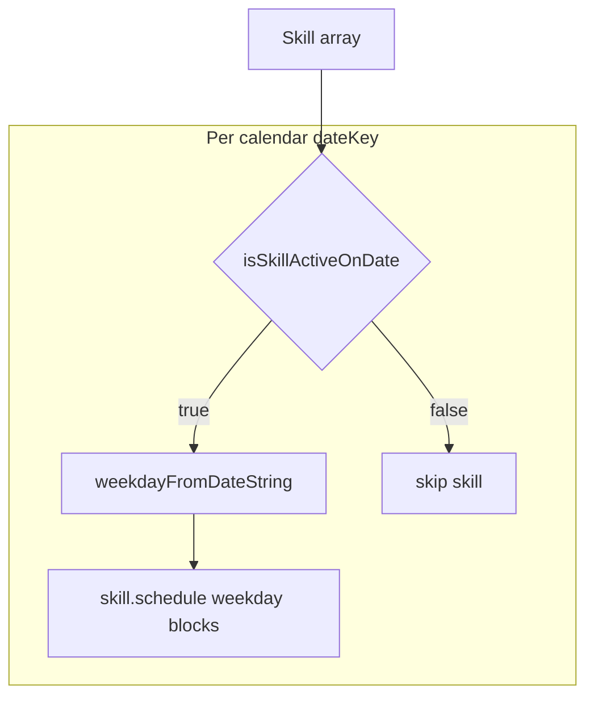

# Phase 24 — Skill Series Integration

## Scope

| In scope | Out of scope |
|----------|--------------|
| [`calendar.ts`](src/core/calendar.ts), [`timeline.ts`](src/core/timeline.ts), [`dashboardStats.ts`](src/core/dashboardStats.ts), [`review.ts`](src/core/review.ts) | Skills page UI, recurrence editor |
| Tests in existing `*.test.ts` files + optional `plannedMinutesOnDate` tests | New migrations, schema, dependencies |
| [`docs/architecture.md`](docs/architecture.md) update | Direct edits to [`focus.ts`](src/core/focus.ts) / [`briefing.ts`](src/core/briefing.ts) (inherit via `buildSkillDayRows`) |

**Backward compatibility:** `scheduleSeries === undefined` → `isSkillActiveOnDate` returns `true` for every valid date (unchanged emission/counting).



---

## Behavior decisions

### 1. `buildSkillDayRows` — **omit inactive skills** (recommended)

Filter with `isSkillActiveOnDate(skill, todayKey)` **before** mapping to rows; do not return rows with `plannedTodayMinutes: 0`.

**Why omit vs zero-out:**
- TodayHero overdue/idle counts, [`OverdueBehindSection`](src/components/dashboard/OverdueBehindSection.tsx), and focus/briefing (`skillOverdueCount` via [`buildContext`](src/core/focus.ts)) all consume `rows` — omission avoids false overdue/goal/streak nudges for inactive skills.
- [`collectSkillFocusItems`](src/core/focus.ts) iterates `rows` only; no separate focus.ts change needed.

**Side effect (acceptable, no UI code change):** [`SkillProgressSection`](src/components/dashboard/SkillProgressSection.tsx) receives fewer rows on inactive days — skills outside their series window disappear from today's progress strip until active again. Lifetime XP in [`ProgressionHero`](src/components/dashboard/ProgressionHero.tsx) still uses all skills via `buildSkillProgressions(skills, sessions)`.

**Unchanged:** `totalMinutesToday(sessions)` still counts all logged minutes today (sessions are historical facts, not schedule expectations).

### 2. `plannedMinutesOnDate` — shared gate for review

Add to [`dashboardStats.ts`](src/core/dashboardStats.ts):

```typescript
export function plannedMinutesOnDate(skill: Skill, dateKey: string): number {
  if (!isSkillActiveOnDate(skill, dateKey)) return 0;
  return plannedMinutesForDay(skill, weekdayFromDateString(dateKey));
}
```

Keep `plannedMinutesForDay(skill, weekday)` unchanged (weekday-only template math). Review switches from weekday-only loops to date-key-aware `plannedMinutesOnDate`.

### 3. Weekly review missed/overdue — require scheduled expectations

In [`isSkillMissedOrOverdue`](src/core/review.ts): if `row.scheduledDays === 0`, return `false` before weekly-goal or missed-day checks. Prevents date-range skills inactive all week from flagging a false weekly-goal miss.

### 4. Calendar range optimization (optional, low cost)

In [`collectSkillItems`](src/core/calendar.ts), before the date loop:

- Pre-filter skills whose `getSkillSeriesDateRange(skill)` does **not** intersect `[queryStart, queryEnd]` (lexicographic: `range.startDate <= endDate && range.endDate >= startDate`; `unbounded` always passes).
- Inside the per-date loop, still call `isSkillActiveOnDate(skill, date)` (handles indefinite + `startDate`, single-day, partial overlap).

Private helper `skillSeriesIntersectsRange(skill, startDate, endDate)` can live at bottom of `calendar.ts` (no new export required).

---

## 1. [`calendar.ts`](src/core/calendar.ts)

**File:** [`src/core/calendar.ts`](src/core/calendar.ts) — `collectSkillItems` (~L234)

**Changes:**
- Import `isSkillActiveOnDate`, `getSkillSeriesDateRange` from `./skillSeries`.
- Optional pre-filter via range intersection.
- In inner loop: `if (!isSkillActiveOnDate(skill, date)) continue;` before reading blocks.

**Unchanged:** item shape, stable IDs, sorting, `buildCalendarItemsForRange` signature, event/birthday/fitness paths.

---

## 2. [`timeline.ts`](src/core/timeline.ts)

**File:** [`src/core/timeline.ts`](src/core/timeline.ts) — `generateScheduleItems` (~L267)

**Changes:**
- Import `isSkillActiveOnDate` from `./skillSeries`.
- Same per-date guard: skip inactive skills before expanding blocks.

**Unchanged:** `buildUnifiedTimelineRange`, conflict detection, event generation, workload helpers (`computeDailyWorkloadForDay` inherits filtered schedule items automatically).

---

## 3. [`dashboardStats.ts`](src/core/dashboardStats.ts)

**Files touched:** [`src/core/dashboardStats.ts`](src/core/dashboardStats.ts)

**Changes:**

| Function | Change |
|----------|--------|
| `buildSkillDayRows` | Import `formatLocalDateKey` from `./timeline`, `isSkillActiveOnDate` from `./skillSeries`; `todayKey = formatLocalDateKey(now)`; `.filter(isSkillActiveOnDate)` then `.map(...)` |
| `buildTimelineItems` (deprecated) | Same todayKey filter before block expansion — keeps legacy timeline enrichment consistent |
| `plannedMinutesOnDate` | **New export** (see above) |

**Unchanged:** `plannedMinutesForDay`, `totalMinutesToday`, week session helpers.

**Downstream (no edits):**
- [`focus.ts`](src/core/focus.ts) — `buildSkillDayRows` + `buildContext`
- [`briefing.ts`](src/core/briefing.ts) — reads `skillOverdueCount` from focus context
- [`DashboardPage.tsx`](src/pages/DashboardPage.tsx) — no prop/callback changes

---

## 4. [`review.ts`](src/core/review.ts)

**File:** [`src/core/review.ts`](src/core/review.ts)

**Changes:**

| Function | Change |
|----------|--------|
| `countScheduledDaysInWeek` | Replace `plannedMinutesForDay(skill, weekday) > 0` with `plannedMinutesOnDate(skill, dayKey) > 0` |
| `hasMissedScheduledDay` | Same replacement in the missed-day loop |
| `isSkillMissedOrOverdue` | Early return `false` when `row.scheduledDays === 0` |

**Import:** add `plannedMinutesOnDate` from `./dashboardStats` (replace `plannedMinutesForDay` import if unused elsewhere in file).

**Unchanged:** `buildSkillWeekSummary` still maps **all** skills (minutes logged and consistency remain visible for inactive skills; only *scheduled* expectations respect series bounds).

---

## 5. Tests

### [`calendar.test.ts`](src/core/calendar.test.ts)

Add `describe("skill scheduleSeries")` with fixed range **2026-05-25 → 2026-05-31** (Mon–Sun) and Monday/Wednesday blocks:

| Test | Setup | Expect |
|------|-------|--------|
| Excludes date_range outside range | `scheduleSeries: { mode: "date_range", startDate: "2026-06-01", endDate: "2026-08-31" }` | 0 skill items in May range |
| Includes date_range inside range | Same blocks, range covers week | 2 items (Mon + Wed) — same as no-series baseline |
| Single-day only on that date | `singleDate: "2026-05-28"` (Wed), block on Wed | Exactly 1 item on `2026-05-28` |
| Undefined scheduleSeries unchanged | Existing test at L72 remains green | 2 items |

### [`timeline.test.ts`](src/core/timeline.test.ts)

| Test | Expect |
|------|--------|
| Inactive date_range skill skipped | `buildUnifiedTimelineRange` for one day outside range → no schedule items for that skill |
| Active day includes blocks | Inside range → schedule block present |

### [`dashboardStats.test.ts`](src/core/dashboardStats.test.ts)

Use frozen `now` (existing pattern, e.g. `2026-05-27` Wednesday):

| Test | Expect |
|------|--------|
| Inactive skill omitted from `buildSkillDayRows` | `rows` length 0 or excludes skill id |
| Active skill included | row present with expected planned minutes |
| `buildTimelineItems` skips inactive | 0 timeline items for inactive skill |
| No scheduleSeries regression | existing overdue/idle tests still pass |

Add tests for `plannedMinutesOnDate` returning 0 outside range.

### [`review.test.ts`](src/core/review.test.ts)

Extend or add cases in `describe("buildSkillWeekSummary")`:

| Test | Expect |
|------|--------|
| date_range outside week | `scheduledDays === 0`, not in `missedOrOverdue` |
| date_range partial week | Only active weekdays in week count toward `scheduledDays` |
| single_day in week | `scheduledDays === 1`; no miss on other weekdays with blocks in template |
| Existing no-series test (L169) | `scheduledDays === 2`, `missedOrOverdue.length === 1` unchanged |

**Not required:** new `focus.test.ts` cases (behavior covered indirectly); add only if a gap appears during implementation.

---

## 6. Documentation — [`docs/architecture.md`](docs/architecture.md)

Update **Skill schedule series** subsection (~L194):

- Remove "Deferred integration" bullet; state Phase 24 consumption:
  - [`calendar.ts`](src/core/calendar.ts) `collectSkillItems` — active-date filter + optional range pre-filter
  - [`timeline.ts`](src/core/timeline.ts) `generateScheduleItems` — active-date filter
  - [`dashboardStats.ts`](src/core/dashboardStats.ts) `buildSkillDayRows` / `buildTimelineItems` — omit inactive skills for today; `plannedMinutesOnDate` for date-key planned minutes
  - [`review.ts`](src/core/review.ts) — scheduled/missed days and missed/overdue gated by active dates; `scheduledDays === 0` suppresses false weekly-goal flags
- Note: `scheduleSeries` undefined = legacy indefinite (always active)
- Note: focus/briefing inherit filtered rows; UI still has no series editor

Update **Unified calendar foundation** bullet (~L157) if it still says skill blocks use implicit recurrence without series filtering.

---

## Files to change

| Action | Path |
|--------|------|
| Edit | [`src/core/calendar.ts`](src/core/calendar.ts) |
| Edit | [`src/core/timeline.ts`](src/core/timeline.ts) |
| Edit | [`src/core/dashboardStats.ts`](src/core/dashboardStats.ts) |
| Edit | [`src/core/review.ts`](src/core/review.ts) |
| Edit | [`src/core/calendar.test.ts`](src/core/calendar.test.ts) |
| Edit | [`src/core/timeline.test.ts`](src/core/timeline.test.ts) |
| Edit | [`src/core/dashboardStats.test.ts`](src/core/dashboardStats.test.ts) |
| Edit | [`src/core/review.test.ts`](src/core/review.test.ts) |
| Edit | [`docs/architecture.md`](docs/architecture.md) |
| **No edit** | `skillSeries.ts`, `model.ts`, UI, migrations, `focus.ts`, `briefing.ts` |

---

## Recommended implementation order

1. `dashboardStats.ts` — `plannedMinutesOnDate` + `buildSkillDayRows` / `buildTimelineItems` filter (unblocks review + tests)
2. `review.ts` — scheduled/missed/overdue gates
3. `timeline.ts` — schedule item filter
4. `calendar.ts` — schedule item filter + range optimization
5. Tests (dashboard → review → timeline → calendar)
6. `docs/architecture.md`
7. `npm test` → `npm run lint` → `npm run build`

---

## Risks and tradeoffs

| Risk | Mitigation |
|------|------------|
| Inactive skills hidden from SkillProgressSection | Document; intentional — no schedule expectations on inactive days |
| `buildSkillWeekSummary` still lists inactive skills with `minutesLogged` | Correct — logging history ≠ schedule obligation |
| Circular imports (`dashboardStats` → `timeline` → ?) | `dashboardStats` already imports from `./schedule`; `formatLocalDateKey` import from `timeline` matches existing cross-core pattern (timeline does not import dashboardStats) |
| Review test L169 breaks if week dates shift | Keep frozen `NOW` / `TODAY` constants; add new tests with explicit series bounds |

---

## Validation checklist

```bash
npm test
npm run lint
npm run build
```

Confirm: all pre-Phase-24 tests pass; new series tests pass; skills without `scheduleSeries` produce identical calendar/dashboard/review output to before.
