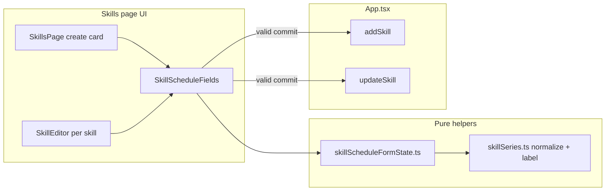

# Phase 25 — Skills Schedule Series UI

## Scope

| In scope | Out of scope |
|----------|--------------|
| [`SkillsPage.tsx`](src/pages/SkillsPage.tsx), [`SkillEditor.tsx`](src/components/skills/SkillEditor.tsx), new form UI module | Calendar, recurrence editor, `recurrence.ts`, `seriesId`, exceptions |
| [`skillSeries.ts`](src/core/skillSeries.ts) label helper + tests | Migrations, new deps, notifications, AI |
| [`App.tsx`](src/App.tsx) `addSkill` / `updateSkill` clearing semantics | Component/E2E tests (repo has none; vitest is `src/**/*.test.ts` only) |
| [`docs/architecture.md`](docs/architecture.md) UI subsection | Workout scheduling |

**Legacy rule:** persisted indefinite = **`scheduleSeries` omitted** (`undefined`), not `{ mode: "indefinite" }`. UI “Indefinite” always serializes to omission on save.

---

## Architecture



**Two layers unchanged:** `WeeklySchedule` (weekday blocks) + optional `scheduleSeries` (when blocks count). Phase 24 consumers already gate on `isSkillActiveOnDate`.

---

## 1. Pure helpers

### [`src/core/skillSeries.ts`](src/core/skillSeries.ts)

Add **`formatSkillScheduleSeriesLabel(skill: Skill): string`** (exported):

- Private `formatSkillScheduleDateKey(dateKey: string)` — same pattern as [`formatEventDate`](src/pages/ReviewPage.tsx) / [`ApplicationCard`](src/components/career/ApplicationCard.tsx): parse `YYYY-MM-DD`, `toLocaleDateString` with `{ month: "short", day: "numeric", year: "numeric" }`.
- Labels:
  - `scheduleSeries` **undefined** → `Available indefinitely`
  - Normalized `indefinite` without `startDate` → `Available indefinitely`
  - Normalized `indefinite` with `startDate` → `Available from {date}` (read-only edge case; UI does not edit this shape)
  - `date_range` → `Available {start} – {end}`
  - `single_day` → `Available only on {date}`
  - Invalid / failed normalize → `Available indefinitely` (display-safe; load cleanup still strips bad data)

Delegate validation semantics to existing **`normalizeSkillScheduleSeries`** — do not duplicate date rules in the label.

### [`src/components/skills/skillScheduleFormState.ts`](src/components/skills/skillScheduleFormState.ts) (new)

Mirror [`careerTargetFormState.ts`](src/components/career/careerTargetFormState.ts) / [`workoutSessionFormState.ts`](src/components/fitness/workoutSessionFormState.ts):

```typescript
export type SkillScheduleUiMode = "indefinite" | "date_range" | "single_day";

export type SkillScheduleFormState = {
  mode: SkillScheduleUiMode;
  startDate: string;
  endDate: string;
  singleDate: string;
};
```

| Function | Behavior |
|----------|----------|
| `emptySkillScheduleFormState()` | `mode: "indefinite"`, empty date strings |
| `skillScheduleFormFromSeries(series?: SkillScheduleSeries)` | `undefined` / invalid → indefinite empty; `date_range` / `single_day` populate fields; normalized `indefinite` → indefinite (ignore `startDate` in form—label still shows “from …” until user saves Indefinite, which clears to `undefined`) |
| `validateSkillScheduleForm(form)` | Returns `string \| null` for [`styles.errorInline`](src/ui/appStyles.ts). Indefinite: no date required. Date range: both required + `endDate >= startDate` (lex compare after `normalizeSkillScheduleSeries`). Single day: `singleDate` required. Final gate: built payload must pass `normalizeSkillScheduleSeries`. |
| `skillScheduleSeriesFromForm(form)` | Indefinite → **`undefined`**. Other modes → `SkillScheduleSeries \| undefined` (undefined if normalize fails—should not happen after validate) |

**Do not** emit `{ mode: "indefinite" }` from the form builder.

### [`src/components/skills/skillScheduleFormState.test.ts`](src/components/skills/skillScheduleFormState.test.ts) (new)

Cover user-requested flows via pure functions (no React):

- Create payloads: indefinite → `undefined`; valid `date_range` / `single_day`
- Round-trip: `skillScheduleFormFromSeries` for example `{ mode: "date_range", startDate: "2026-01-01", endDate: "2026-06-30" }`
- Edit preservation: `seriesEqual(a, b)` helper comparing normalized JSON
- Validation errors: missing dates, `end < start`, invalid date strings
- Clearing: indefinite mode → `undefined`
- Extend [`skillSeries.test.ts`](src/core/skillSeries.test.ts) with `formatSkillScheduleSeriesLabel` cases matching the three example strings

---

## 2. UI components

### [`src/components/skills/SkillScheduleFields.tsx`](src/components/skills/SkillScheduleFields.tsx) (new)

Presentational block:

- Section title: **Schedule Availability**
- Three radios (fieldset + labels per PROJECT_RULES accessibility): Indefinite / Date Range / Single Day
- Conditional native `<input type="date">` fields:
  - Date range: Start Date, End Date
  - Single day: Date
- `formError` rendered with `styles.errorInline` (same as [`SkillEditor`](src/components/skills/SkillEditor.tsx) duration errors / [`WorkoutSessionForm`](src/components/fitness/WorkoutSessionForm.tsx))

Props: `state`, `onChange`, `error`, optional `disabled`.

### [`src/components/skills/SkillEditor.tsx`](src/components/skills/SkillEditor.tsx)

- Below priority row (or after goals): show **`formatSkillScheduleSeriesLabel(skill)`** as secondary line (`opacity: 0.75`, `fontSize: 13`) under the skill name.
- Add **Schedule Availability** section using local `useState` initialized from `skillScheduleFormFromSeries(skill.scheduleSeries)`.
- `useEffect` reset when `skill.id` or `skill.scheduleSeries` changes (remote sync / parent refresh).
- **Commit rules** (no invalid `onUpdate`):
  - Switch to **Indefinite** → validate not needed → `onScheduleSeriesChange(undefined)` immediately (clears stored series).
  - Change dates / switch to date_range or single_day → on **blur** of date inputs (and on mode change into those modes once dates filled), run `validateSkillScheduleForm`; if ok, commit `skillScheduleSeriesFromForm`.
  - If invalid, set local error and **do not** call parent.
- New callback prop: `onScheduleSeriesChange: (series: SkillScheduleSeries | undefined) => void` (cleaner than overloading `Partial<Skill>` for deletes).

Place section **above** “Weekly schedule template” so availability precedes weekday blocks.

### [`src/pages/SkillsPage.tsx`](src/pages/SkillsPage.tsx)

- Extend create card: name input + **SkillScheduleFields** (shared), default indefinite.
- Local `scheduleForm` + `scheduleError`.
- **Add Skill** click: trim name; `validateSkillScheduleForm`; if fail, set error and return; else `onAdd(trimmedName, skillScheduleSeriesFromForm(scheduleForm))` and reset form.
- Pass `onScheduleSeriesChange` into each `SkillEditor`.

---

## 3. App wiring — critical delete semantics

[`updateSkill`](src/App.tsx) today uses `{ ...s, ...patch }`, so `scheduleSeries: undefined` **does not remove** the field.

**Fix** (same pattern as [`events.ts`](src/core/events.ts) recurrence clears):

```typescript
const next = { ...s, ...patch, updatedAtIso: now };
if ("scheduleSeries" in patch && patch.scheduleSeries === undefined) {
  delete next.scheduleSeries;
}
```

Add helper or dedicated path:

```typescript
function setSkillScheduleSeries(skillId: string, series: SkillScheduleSeries | undefined) {
  updateSkill(skillId, { scheduleSeries: series }); // delete branch handles undefined
}
```

**`addSkill(name, scheduleSeries?)`:** after building `newSkill`, only assign `scheduleSeries` when `series !== undefined` (indefinite create omits field). Run `normalizeSkillScheduleSeries` before assign; reject invalid at call site (SkillsPage already validates).

Update prop types: [`SkillsPageProps`](src/pages/SkillsPage.tsx), [`SkillEditorProps`](src/components/skills/SkillEditor.tsx), and the `<SkillsPage />` call site in `App.tsx`.

---

## 4. Documentation

In [`docs/architecture.md`](docs/architecture.md) **Skill schedule series** subsection:

- Replace “Skills page series editor remains deferred” with Phase 25 UI description.
- Document supported UI modes (indefinite / date_range / single_day), native date inputs, validation rules, and that **Indefinite persists as omitted `scheduleSeries`**.
- Note `formatSkillScheduleSeriesLabel` on skill cards.
- Keep Phase 24 integration bullets; reaffirm undefined = legacy always-active.

---

## 5. Validation checklist

After implementation:

```bash
npm test
npm run lint
npm run build
```

Report: files changed, UI/validation behavior, tests added, command results.

---

## Files to touch (expected)

| File | Change |
|------|--------|
| `src/core/skillSeries.ts` | `formatSkillScheduleSeriesLabel` (+ private date formatter) |
| `src/core/skillSeries.test.ts` | Label tests |
| `src/components/skills/skillScheduleFormState.ts` | **new** |
| `src/components/skills/skillScheduleFormState.test.ts` | **new** |
| `src/components/skills/SkillScheduleFields.tsx` | **new** |
| `src/components/skills/SkillEditor.tsx` | Section + label + commit |
| `src/pages/SkillsPage.tsx` | Create flow + props |
| `src/App.tsx` | `addSkill` / `updateSkill` delete + callbacks |
| `docs/architecture.md` | Phase 25 UI docs |

**No** changes to `calendar.ts`, `recurrence.ts`, `dbMappers.ts`, migrations, or dashboard.

---

## Edge cases (explicit)

| Case | Behavior |
|------|----------|
| Existing skill with no `scheduleSeries` | Indefinite selected; label “Available indefinitely” |
| DB row `{ mode: "indefinite" }` | Form shows Indefinite; label indefinite; saving Indefinite without other edits → `delete scheduleSeries` (migrate to legacy) |
| `{ mode: "indefinite", startDate }` | Form shows Indefinite only; label “Available from …”; saving Indefinite clears entire series (loses startDate—acceptable; advanced shape not in UI scope) |
| Invalid in-memory series | Form indefinite; label safe; commit only after user sets valid range/day |
| Switch range → indefinite | Immediate clear via `delete` |

---

## Out of scope guardrails

- No `seriesId`, exceptions, `recurrence.ts`, workout hooks, or calendar components.
- No storing `{ mode: "indefinite" }` from UI saves.
- No new npm packages or test environment changes (stay on `*.test.ts` in `src/`).
