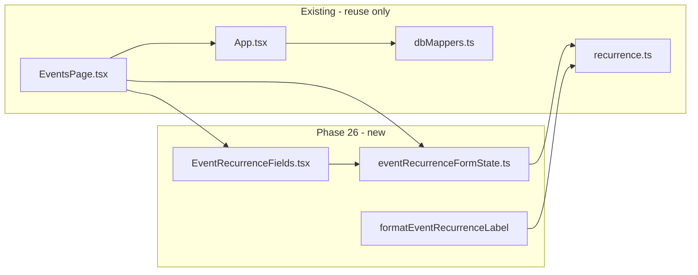

# Phase 26: Event Recurrence UI

## Context

The recurrence **engine and persistence layer already exist** (Phase 22A/22B):

- [`src/core/recurrence.ts`](src/core/recurrence.ts) — `RecurrenceRule`, `RecurrenceEnd`, `isValidRecurrenceRule`, `formatRecurrenceSummary`
- [`src/core/dbMappers.ts`](src/core/dbMappers.ts) — `parseRecurrenceRule`, `eventToRow` / `eventFromRow`
- [`src/core/events.ts`](src/core/events.ts) — `cleanupInvalidEventRecurrence` on load

**Gaps today:**

- [`src/pages/EventsPage.tsx`](src/pages/EventsPage.tsx) — form has no recurrence fields; `handleSubmit` omits `recurrence`
- [`src/App.tsx`](src/App.tsx) — `addEvent` never copies `recurrence`; `updateEvent` never explicitly sets/deletes it (recurrence survives edits only by accident via spread)



## Out of scope (explicit)

Do **not** modify: `calendar.ts`, `calendarView.ts`, `DashboardPage`, `WeeklyReview`, `DailyFocus`, People, Fitness, Skills. Do **not** implement: series splitting, edit-this-vs-series, exceptions UI, `seriesId` assignment, list expansion of recurring occurrences, drag/drop.

---

## 1. Export `normalizeRecurrenceRule` in core

User requirements reference `normalizeRecurrenceRule()` but it is **not exported** today (only internal `normalizeRule`).

Add to [`src/core/recurrence.ts`](src/core/recurrence.ts):

```typescript
export function normalizeRecurrenceRule(rule: RecurrenceRule): RecurrenceRule | undefined
```

- Returns `undefined` when invalid (mirrors `normalizeSkillScheduleSeries`)
- Maps normalized internal shape back to a lean `RecurrenceRule` (omit `frequency` when one-time; omit `interval` when 1; omit `end` when `never`; omit `dayOfMonth` when it matches anchor day)
- Add 2–3 unit tests in [`src/core/recurrence.test.ts`](src/core/recurrence.test.ts) for round-trip / invalid input

Form validation will use: friendly field checks → build candidate rule → `normalizeRecurrenceRule` / `isValidRecurrenceRule` as final gate.

---

## 2. Form state module

**Create** [`src/components/events/eventRecurrenceFormState.ts`](src/components/events/eventRecurrenceFormState.ts) mirroring [`src/components/skills/skillScheduleFormState.ts`](src/components/skills/skillScheduleFormState.ts).

### Types

```typescript
export type EventRecurrenceUiMode = "none" | "daily" | "weekly" | "monthly" | "yearly";
export type RecurrenceEndUiKind = "never" | "onDate" | "afterCount";

export type EventRecurrenceFormState = {
  mode: EventRecurrenceUiMode;
  byWeekdays: Weekday[];       // weekly only
  dayOfMonth: string;          // monthly only (1–31)
  endKind: RecurrenceEndUiKind;
  endDate: string;
  maxOccurrences: string;
};
```

Interval defaults to **1** in serialization (not exposed in UI this phase — matches user examples).

### Functions (mirror skill naming)

| Function | Purpose |
|---|---|
| `emptyEventRecurrenceFormState()` | Default: `mode: "none"`, empty strings, `byWeekdays: []` |
| `eventRecurrenceFormFromRule(anchorDate, rule?)` | Deserialize; invalid/missing/`!frequency` → `"none"`; weekly populates `byWeekdays`; monthly populates `dayOfMonth`; map `end` → `endKind` fields |
| `validateEventRecurrenceForm(anchorDate, form)` | Returns `string \| null`; required-field messages first, then `isValidRecurrenceRule` on built candidate |
| `eventRecurrenceRuleFromForm(anchorDate, form)` | `"none"` → `undefined`; else build `RecurrenceRule` with `anchorDate`, `frequency`, mode-specific fields, `end` mapped to `RecurrenceEnd` |
| `eventRecurrenceEqual(a?, b?)` | Normalized JSON compare via `normalizeRecurrenceRule` |
| `formatEventRecurrenceLabel(rule)` | Card-friendly labels per spec (distinct from `formatRecurrenceSummary`) |

### Label helper logic (`formatEventRecurrenceLabel`)

Target copy (requirement #6):

- No frequency → `"Does not repeat"`
- Daily → `"Repeats daily"`
- Weekly, 1 weekday → `"Repeats every Wednesday"` (use weekday name from anchor-aligned selection)
- Weekly, multiple weekdays → `"Repeats weekly"`
- Monthly → `"Repeats monthly"`
- Yearly → `"Repeats yearly"`

Optionally append end suffix for card clarity (e.g. `" until 2026-12-31"`, `" (10 times)"`) using the same `RecurrenceEnd` shapes — keep suffix logic simple and test it.

### Deserialization defaults

When switching to weekly with empty weekdays (e.g. fresh form), default `byWeekdays` to `[weekdayFromDateString(anchorDate)]` inside `eventRecurrenceRuleFromForm` / mode-change handler (not on deserialize of invalid data).

When monthly and `dayOfMonth` empty, default to anchor's day-of-month.

### Anchor sync

`anchorDate` always comes from the event **Date** field at serialize/validate time (`form.date` in EventsPage). Changing event date while editing updates the stored rule's `anchorDate` on save.

---

## 3. Presentational component

**Create** [`src/components/events/EventRecurrenceFields.tsx`](src/components/events/EventRecurrenceFields.tsx) mirroring [`SkillScheduleFields.tsx`](src/components/skills/SkillScheduleFields.tsx).

### Props

```typescript
export type EventRecurrenceFieldsProps = {
  state: EventRecurrenceFormState;
  radioGroupName: string;
  endRadioGroupName: string;
  onChange: (state: EventRecurrenceFormState) => void;
  onModeChange: (mode: EventRecurrenceUiMode) => void;
  onEndKindChange: (endKind: RecurrenceEndUiKind) => void;
  onFieldBlur: () => void;
  error: string | null;
  disabled?: boolean;
};
```

### UI structure

- `<fieldset>` legend: **Repeats**
- Radio modes: Does not repeat / Daily / Weekly / Monthly / Yearly
- **Weekly**: 7 weekday checkboxes (`mon`–`sun`, short labels Mon–Sun)
- **Monthly**: number input for day-of-month (1–31)
- **Yearly**: helper text only — "Repeats on the same month and day as the event date"
- **Ends** sub-fieldset (shown when mode ≠ `"none"`):
  - Never
  - On date (`type="date"`)
  - After N occurrences (`type="number"`, min 1)
- Inline error via `styles.errorInline`
- Presentational only — no persistence or validation inside component

---

## 4. Integrate into Events create/edit

**Update** [`src/pages/EventsPage.tsx`](src/pages/EventsPage.tsx) only (no new EventEditor file — form stays inline, matching current structure).

### State

Add alongside existing `form` state:

```typescript
const [recurrenceForm, setRecurrenceForm] = useState(emptyEventRecurrenceFormState);
const [recurrenceError, setRecurrenceError] = useState<string | null>(null);
const recurrenceFormRef = useRef(recurrenceForm);
```

Keep ref in sync (same pattern as [`SkillEditor.tsx`](src/components/skills/SkillEditor.tsx)).

### Form lifecycle

| Action | Recurrence state |
|---|---|
| `emptyFormState` / `openCreateForm` | Reset to `emptyEventRecurrenceFormState()` |
| `openEditForm(event)` | `eventRecurrenceFormFromRule(event.date, event.recurrence)` |
| `resetForm` | Clear recurrence state + error |

### Submit (`handleSubmit`)

After existing title/date/time validation:

1. `validateEventRecurrenceForm(form.date, recurrenceForm)` — block save on error
2. `const recurrence = eventRecurrenceRuleFromForm(form.date, recurrenceForm)`
3. Include `recurrence` in payload (undefined for one-time)
4. On edit: `onUpdate({ ...existing, ...payload, recurrence })` — explicitly pass `recurrence` so clearing works

### Mode change handler

When switching to `"none"`: clear `recurrenceError` immediately (like skill indefinite).

When switching to weekly: if `byWeekdays` empty, seed with anchor weekday.

### Render placement

Insert `<EventRecurrenceFields />` after the Date/Type row (recurrence anchor = event date). Use unique `radioGroupName`s for create vs edit (`event-recurrence-create` / `event-recurrence-edit`).

### Event cards (`EventRow`)

When `event.recurrence?.frequency` is set, show recurrence label below schedule line:

```typescript
formatEventRecurrenceLabel(event.recurrence)
```

Use subdued opacity (same as schedule line). One-time events show nothing extra (or only if we want explicit "Does not repeat" — **omit** on cards to reduce noise; label helper still returns it for tests/form preview if needed).

---

## 5. App.tsx persistence

**Update** [`src/App.tsx`](src/App.tsx) `addEvent` and `updateEvent` only.

### `addEvent`

After optional time fields:

```typescript
if (input.recurrence !== undefined) {
  newEvent.recurrence = input.recurrence;
}
// Do NOT set seriesId in this phase
```

### `updateEvent`

Mirror optional-field delete pattern used for `startTime`/`endTime`:

```typescript
if (updated.recurrence !== undefined) {
  nextEvent.recurrence = updated.recurrence;
} else {
  delete nextEvent.recurrence;
  delete nextEvent.seriesId; // orphan cleanup when user removes recurrence
}
```

No other App.tsx changes.

---

## 6. Tests

**Create** [`src/components/events/eventRecurrenceFormState.test.ts`](src/components/events/eventRecurrenceFormState.test.ts) mirroring [`skillScheduleFormState.test.ts`](src/components/skills/skillScheduleFormState.test.ts).

### Coverage matrix

| Area | Cases |
|---|---|
| Deserialize | none, daily, weekly (1 + multi weekday), monthly, yearly; omitted rule; invalid stored rule → none |
| Serialize | each mode → valid `RecurrenceRule`; none → `undefined` |
| Ends | never (omit `end`), onDate, afterCount |
| Validation | weekly with no weekdays; invalid dayOfMonth; missing end date; invalid maxOccurrences; end date before anchor |
| Round-trip | form → rule → form equality |
| Labels | all requirement #6 examples + end suffixes |
| Clearing | recurring → none → `undefined` |
| `eventRecurrenceEqual` | normalized compare |

Plus minimal `normalizeRecurrenceRule` tests in `recurrence.test.ts`.

---

## 7. Documentation

**Update** [`docs/architecture.md`](docs/architecture.md):

- Replace "Deferred UI (not in 22B)" bullet under Recurrence engine with **Phase 26 Event recurrence UI** subsection (parallel to Phase 25 Skills UI bullet)
- Document: form-state module, `EventRecurrenceFields`, `formatEventRecurrenceLabel`, validation via `normalizeRecurrenceRule` / `isValidRecurrenceRule`, persistence through `App.tsx`, relationship to `recurrence.ts`
- **Current limitations** (explicit NOT YET IMPLEMENTED list from user scope):
  - Series splitting
  - Edit single occurrence / edit future occurrences
  - Recurrence exceptions UI
  - Drag/drop recurrence editing
  - Events list still partitions by anchor `event.date` only (calendar expands occurrences)
  - No `seriesId` generation

---

## 8. Verification

Run before completion:

```bash
npm test -- eventRecurrenceFormState recurrence
npm run lint
npm run build
```

Manual smoke test on Events page:

- Create one-time event (unchanged behavior)
- Create weekly/monthly/yearly/daily recurring events; verify save/reload
- Edit recurrence on existing event; remove recurrence; confirm `recurrence` cleared
- Card shows human-readable label

---

## File change summary

| File | Action |
|---|---|
| `src/components/events/eventRecurrenceFormState.ts` | **Create** |
| `src/components/events/eventRecurrenceFormState.test.ts` | **Create** |
| `src/components/events/EventRecurrenceFields.tsx` | **Create** |
| `src/core/recurrence.ts` | Export `normalizeRecurrenceRule` |
| `src/core/recurrence.test.ts` | Add normalizer tests |
| `src/pages/EventsPage.tsx` | Wire form + cards |
| `src/App.tsx` | Persist/delete recurrence |
| `docs/architecture.md` | Document Phase 26 |

**Untouched:** calendar, dashboard, people, fitness, skills, schema/migrations.
