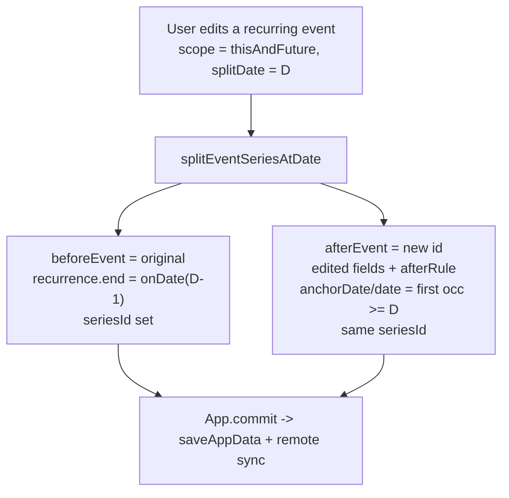

# Phase 33 - Series Editing (Events)

## Scope (confirmed)

- Two edit scopes: **Entire series** and **This and future** (split at a chosen date).
- Entry points: **Events page** edit form (scope selector) + **interactive calendar detail modal** (acts on the clicked occurrence's date).
- Deferred (NOT in this phase): single-occurrence content edit, skip/override occurrence, delete-this/delete-future, drag-and-drop. These remain Phase 34.
- No schema/migration, no new dependencies. `recurrence.exceptions`, `seriesId`, and truncated rules already persist via existing columns and `dbMappers.parseRecurrenceRule` ([src/core/dbMappers.ts](src/core/dbMappers.ts) lines 596-601).

## How "this and future" works

Uses the existing pure `splitRecurrenceSeriesAtDate` ([src/core/recurrence.ts](src/core/recurrence.ts) lines 513-539): the original event keeps its pattern but ends the day before the split date; a new event carries the edited fields + the continuing recurrence from the split date. Both share a `seriesId`.

Edge case: if `splitDate` is at/before the series' first occurrence, drop the original and keep only the edited `afterEvent` (equivalent to an entire-series edit).

## 1. Pure helper (tested first)

**Create** `src/core/eventSeries.ts` (mirrors `skillSeries.ts` / `workoutSeries.ts` naming; pure, no React/storage):

- `type EventSeriesEditScope = "entire" | "thisAndFuture"`.
- `splitEventSeriesAtDate({ original, splitDate, editedEvent, seriesId, nowIso }): { beforeEvent?: LifeEvent; afterEvent: LifeEvent }`
  - `beforeEvent`: clone of `original` with `recurrence.end = { kind: "onDate", endDate: D-1 }`, `seriesId`, `updatedAtIso`. Omitted when `splitDate <= first occurrence`.
  - `afterEvent`: `editedEvent` fields + new `id`, `date` = first occurrence `>= splitDate`, `recurrence` = `afterRule` (edited cadence; set `anchorDate`/`startDate` to that first occurrence per the helper's contract), `seriesId`, timestamps.
  - Delegates date math to `splitRecurrenceSeriesAtDate`; never mutates inputs; returns safe result when `original.recurrence?.frequency` is absent (treat as entire-series replace).
- Keep id/`seriesId` generation OUT of this module (caller passes them) so it stays deterministic and unit-testable.

**Create** `src/core/eventSeries.test.ts`: split truncates `before` to `onDate(D-1)`; `after` has edited fields + new id + shared `seriesId`; past occurrences preserved; weekly cadence change (e.g. Wed -> Fri from D) reflects in `after`; split before first occurrence drops `before`; idempotent/no-mutation checks.

## 2. App.tsx wiring

**Edit** [src/App.tsx](src/App.tsx):

- Add `updateEventSeries(scope, splitDate, updatedEvent)`:
  - `entire`: route through the existing `updateEvent` path (whole-event replace).
  - `thisAndFuture`: resolve original from `app.payload.events`, generate `seriesId` (reuse existing `seriesId` if present, else `id()`), call `splitEventSeriesAtDate`, then `commit` with events array = replace original by `beforeEvent` (or remove it) and append `afterEvent`.
- Add `seriesEditIntent` state `{ eventId, scope, splitDate } | null` (mirrors the existing `eventDraft` prefill pattern, lines ~88-90). Setting it navigates via `setPage("events")` and passes it to `EventsPage` as `initialSeriesEdit`.
- Pass `onUpdateEventSeries={updateEventSeries}` to `EventsPage`, and `onEditOccurrence={(eventId, scope, splitDate) => { setSeriesEditIntent(...); setPage("events"); }}` to `CalendarPage`.

## 3. Events page UI

**Edit** [src/pages/EventsPage.tsx](src/pages/EventsPage.tsx):

- New prop `onUpdateEventSeries(scope, splitDate, event)` and `initialSeriesEdit?`.
- When editing an event whose `recurrence?.frequency` is set, show a scope selector (radio): **Entire series** | **This and future**. For "this and future", show a date input (`splitDate`) defaulting to the carried occurrence date or today.
- `handleSubmit`: for recurring + scope chosen, call `onUpdateEventSeries(scope, splitDate, mergedEvent)`; otherwise keep current `onUpdate`/`onAdd`. Reuse existing recurrence form validation (`validateEventRecurrenceForm`, `eventRecurrenceRuleFromForm`).
- Non-recurring events: unchanged (no selector).

## 4. Interactive calendar detail modal

**Edit** [src/components/calendar/CalendarItemDetailModal.tsx](src/components/calendar/CalendarItemDetailModal.tsx):

- Add optional props `onEditEntireSeries?` and `onEditThisAndFuture?`.
- For items where `sourceType === "event"` and `sourceMeta.recurrenceDate` is set (recurring occurrence), render two buttons: **Edit entire series** and **Edit this and future** (passes `sourceMeta.eventId` + `recurrenceDate` as the split date). When callbacks are absent, the modal stays read-only (current behavior).

**Edit** [src/pages/CalendarPage.tsx](src/pages/CalendarPage.tsx):

- Thread a new `onEditOccurrence` prop into the modal, mapping to `onEditEntireSeries` / `onEditThisAndFuture`.
- `DashboardCalendarWidget` stays read-only (no callbacks) to keep scope contained; its "Open full calendar" button already routes users to `CalendarPage` for editing.

## 5. Persistence / sync

No changes. Two events sharing a `seriesId`, a truncated `recurrence.end`, and the new `afterRule` all validate and round-trip through existing `dbMappers` + `remoteStorage`. `normalizePayload` already preserves nested recurrence.

## 6. Tests / validation

- `eventSeries.test.ts` (above) is the core new coverage.
- Run `npm test`, `npm run lint`, `npm run build`.

## 7. Documentation

- [docs/architecture.md](docs/architecture.md): extend the "Recurrence engine" subsection (series split now wired for events via `eventSeries.ts`) and "Events page UI" (scope selector); note the calendar modal is now interactive for recurring occurrences (entire / this-and-future only).
- [docs/plans/roadmap.md](docs/plans/roadmap.md): mark Phase 33 status; update the "current next action" pointer. (Out of scope but worth a follow-up: the stale Phase 27-30 "upcoming" wording and the missing `phase_32` plan file.)

## Files summary

- Create: `src/core/eventSeries.ts`, `src/core/eventSeries.test.ts`
- Edit: `src/App.tsx`, `src/pages/EventsPage.tsx`, `src/components/calendar/CalendarItemDetailModal.tsx`, `src/pages/CalendarPage.tsx`
- Edit (docs): `docs/architecture.md`, `docs/plans/roadmap.md`