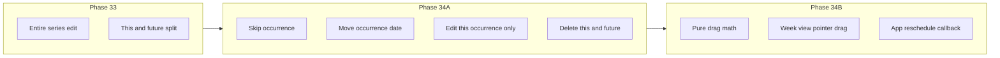

# Phase 34A + 34B — Occurrence Editing, Then Calendar Drag Foundations

## Context

[Phase 33](.cursor/plans/phase_33_series_editing_77300d68.plan.md) shipped **entire series** and **this and future** editing via [`eventSeries.ts`](src/core/eventSeries.ts). The engine already supports skip/override exceptions ([`recurrence.ts`](src/core/recurrence.ts) lines 29–35, 400–428) and calendar expansion already surfaces `recurrenceDate` / `originalDate` on [`CalendarItem.sourceMeta`](src/core/calendar.ts). What remains is wiring user actions to those primitives.

The [roadmap](docs/plans/roadmap.md) currently labels Phase 34 as drag-and-drop; we will **insert 34A** and treat **34B** as drag foundations, then renumber later roadmap items (gamification → 36, etc.) when 34A ships.



---

## Phase 34A — Recurrence Occurrence Editing

### Scope (in)

| Action | Mechanism | Schema |
|--------|-----------|--------|
| **Skip / delete this occurrence** | Append `{ kind: "skip", date }` to `event.recurrence.exceptions` (last-wins per date) | None |
| **Move this occurrence** | Append `{ kind: "override", date, overrideDate }` | None |
| **Delete this and future** | In-place truncate: set `recurrence.end = onDate(D-1)`; if D is first occurrence → delete whole event | None |
| **Edit this occurrence only** (title/time/notes) | Skip occurrence on parent + create new **one-time** `LifeEvent` on that date with edited fields | None |

### Scope (out — defer to 34B+)

- Drag-to-move recurring occurrences
- Exception list editor on Events form
- Workout/skill occurrence editing
- Events list expansion (still anchor-date partitioned; calendar remains source of truth for instances)
- Rich “content override” exception type (would require `RecurrenceException` schema extension)

### 1. Pure core module (test first)

**Create** [`src/core/eventOccurrences.ts`](src/core/eventOccurrences.ts) (+ [`eventOccurrences.test.ts`](src/core/eventOccurrences.test.ts)):

- `upsertRecurrenceException(rule, exception): RecurrenceRule` — merge by `exception.date`, last-wins (mirror [`applyRecurrenceExceptions`](src/core/recurrence.ts) semantics).
- `skipOccurrenceAtDate(event, occurrenceDate, nowIso): LifeEvent`
- `moveOccurrenceAtDate(event, occurrenceDate, overrideDate, nowIso): LifeEvent`
- `truncateRecurringEventBeforeDate(event, fromDate, nowIso): LifeEvent | null` — returns `null` when the entire series should be removed (split at/before first occurrence).
- `detachOccurrenceAsOneTimeEvent({ parent, occurrenceDate, editedFields, detachedId, nowIso }): { parentEvent: LifeEvent; detachedEvent: LifeEvent }` — parent gets skip; detached event has `recurrence: undefined`, `date: occurrenceDate`, copied/edited scalar fields.

Guardrails (same as `eventSeries.ts`):

- No React/storage/Supabase; never mutate inputs.
- Non-recurring events: skip/move are no-ops or safe passthrough; delete-future → delete event.
- Validate dates via existing recurrence date helpers; normalize rules with `normalizeRecurrenceRule`.

**Tests** (Vitest): skip removes instance from `expandRecurrenceInstances`; move reflects in expansion + `isException`; truncate preserves past keys; truncate at first occurrence → `null`; detach produces skip + one-time event; idempotent/no-mutation.

### 2. App.tsx orchestration

**Edit** [`src/App.tsx`](src/App.tsx) — add handlers that `find` event by id, call pure helpers, `commit`:

- `skipEventOccurrence(eventId, occurrenceDate)`
- `moveEventOccurrence(eventId, occurrenceDate, overrideDate)`
- `deleteEventOccurrencesFromDate(eventId, fromDate)` — uses truncate helper; `null` → `deleteEvent`
- `detachEventOccurrence(eventId, occurrenceDate, editedEvent)` — for “this occurrence only” saves
- Extend `EventSeriesEditScope` in [`eventSeries.ts`](src/core/eventSeries.ts) with `"thisOccurrenceOnly"` **or** keep scope in EventsPage only and route to `detachEventOccurrence` (prefer extending the type for consistency with Phase 33).

Extend `openSeriesEdit` / `seriesEditIntent` to carry `"thisOccurrenceOnly"` scope (same navigation prefill pattern as lines 485–488).

### 3. Events page UI

**Edit** [`src/pages/EventsPage.tsx`](src/pages/EventsPage.tsx):

- Add third radio: **This occurrence only** (visible when editing recurring event **and** `initialSeriesEdit.splitDate` is set).
- On submit with `thisOccurrenceOnly`: call `onDetachEventOccurrence` (or extended `onUpdateEventSeries`) instead of whole-event replace.
- Keep existing **Entire series** / **This and future** behavior unchanged.

### 4. Calendar detail modal (quick actions)

**Edit** [`src/components/calendar/CalendarItemDetailModal.tsx`](src/components/calendar/CalendarItemDetailModal.tsx):

For recurring occurrences (`sourceMeta.recurrenceDate`), add:

- **Skip this occurrence** — immediate `onSkipOccurrence` (confirm optional, lightweight).
- **Delete this and future** — `onDeleteFromDate` with confirm copy.
- **Edit this occurrence only** — reuses `openSeriesEdit(..., "thisOccurrenceOnly", occurrenceDate)`.
- **Move to another date** — small inline date input + **Move** button → `onMoveOccurrence` (optional stretch; skip if time-constrained).

**Edit** [`src/pages/CalendarPage.tsx`](src/pages/CalendarPage.tsx) to thread new callbacks from `App.tsx`. Dashboard widget stays read-only (same rule as Phase 33).

### 5. Docs / roadmap

- Update [`docs/architecture.md`](docs/architecture.md) Recurrence section: mark occurrence actions shipped; note “edit this occurrence only” = skip + one-time event (no content-override exception type).
- Update [`docs/plans/roadmap.md`](docs/plans/roadmap.md): Phase 34A ✅ when done; Phase 34B as next; bump gamification/notifications numbering.

### 34A files

| Action | Path |
|--------|------|
| Create | `src/core/eventOccurrences.ts`, `src/core/eventOccurrences.test.ts` |
| Edit | `src/App.tsx`, `src/pages/EventsPage.tsx`, `src/pages/CalendarPage.tsx`, `src/components/calendar/CalendarItemDetailModal.tsx`, `src/core/eventSeries.ts` (scope type only) |
| Edit docs | `docs/architecture.md`, `docs/plans/roadmap.md` |

---

## Phase 34B — Calendar Drag Foundations

### Scope (in)

- **Week view only**, **timed blocks only** ([`CalendarEventBlock`](src/components/calendar/CalendarEventBlock.tsx))
- **One-time life events only** (`sourceMeta.recurrenceDate` absent); recurring items remain click-to-edit (34A modal)
- **Move** (vertical drag within day column + horizontal drag across columns); **no resize handles** in 34B
- **No new npm dependencies** — native `pointerdown` / `pointermove` / `pointerup` with capture
- Mutations via new `App.tsx` callback → existing `updateEvent` path

### Scope (out — Phase 35+)

- Month-view drag, all-day pills, create-by-drag on empty grid
- Skill blocks, workout schedule blocks
- Recurring occurrence drag (route to 34A move/split flows)
- Resize handles, multi-select, undo

### 1. Pure drag math (test first)

**Create** [`src/core/calendarDrag.ts`](src/core/calendarDrag.ts) (+ test file):

- `snapMinutes(minutes, gridMinutes = 15): number`
- `minutesFromPointerDelta(deltaY, pixelsPerMinute): number`
- `computeRescheduleTarget({ item, originDateKey, originStartMinutes, deltaXColumns, deltaYMinutes, columnDateKeys }): { dateKey; startTime; endTime } | null`
- `canDragCalendarItem(item): boolean` — true for timed one-time `sourceType === "event"` life events
- Reuse [`computeTimedItemLayout`](src/core/calendarView.ts) for duration preservation

### 2. Drag hook + week view wiring

**Create** [`src/components/calendar/useCalendarItemDrag.ts`](src/components/calendar/useCalendarItemDrag.ts):

- Local state: `draggingItem`, ghost top/left, target column/date
- On pointer up: if target valid, call `onRescheduleItem(item, target)`; else revert
- Minimum movement threshold (~5px) so clicks still open detail modal

**Edit** [`CalendarEventBlock.tsx`](src/components/calendar/CalendarEventBlock.tsx): attach pointer handlers when `draggable` prop set; suppress `onClick` when drag occurred.

**Edit** [`WeekView.tsx`](src/components/calendar/WeekView.tsx): pass `onRescheduleItem`, enable drag on eligible blocks; optional ghost overlay layer.

**Edit** [`CalendarPage.tsx`](src/pages/CalendarPage.tsx) + [`useCalendarController.ts`](src/components/calendar/useCalendarController.ts): thread callback; month view unchanged.

### 3. App reschedule handler

**Edit** [`src/App.tsx`](src/App.tsx):

```typescript
function rescheduleLifeEvent(eventId: string, date: string, startTime: string, endTime?: string)
```

- Load event from payload; reject if recurring (`isRecurringLifeEvent`)
- Merge `date`, `startTime`, `endTime`, `updatedAtIso`; `commit`
- Calendar rebuilds via existing `buildCalendarItemsForRange` — no calendar.ts changes required

### 4. UX guardrails

- Cursor / `aria-grabbed` on draggable blocks; `aria-disabled` + tooltip on recurring blocks (“Use occurrence actions in detail view”)
- While dragging, dim original block; show ghost at snapped position
- Escape cancels drag (listener in hook)

### 5. Docs / roadmap

- Architecture: new “Calendar drag (Phase 34B)” subsection under Calendar layer — week view, one-time events, pointer-event approach.
- Roadmap: Phase 34B ✅; Phase 35 becomes full DnD expansion (resize, month, other source types) **or** gamification if you prefer product priority — call out explicitly when shipping 34B.

### 34B files

| Action | Path |
|--------|------|
| Create | `src/core/calendarDrag.ts`, `src/core/calendarDrag.test.ts`, `src/components/calendar/useCalendarItemDrag.ts` |
| Edit | `src/App.tsx`, `src/pages/CalendarPage.tsx`, `src/components/calendar/WeekView.tsx`, `src/components/calendar/CalendarEventBlock.tsx`, optionally `useCalendarController.ts` |
| Edit docs | `docs/architecture.md`, `docs/plans/roadmap.md` |

---

## Verification (both phases)

```bash
npm test
npm run lint
npm run build
```

**Manual 34A:** create weekly event → open calendar occurrence → skip one date (instance disappears) → move one instance → edit-this-occurrence-only changes title without affecting siblings → delete-from-date truncates future.

**Manual 34B:** one-time timed event in week view → drag to new time/day → persists after refresh/sync; recurring event does not drag.

---

## Sequencing recommendation

Ship **34A completely** (core tests green, modal + Events scope) before starting 34B. 34B depends on stable occurrence semantics so users aren’t confused when recurring items refuse drag.

After both ship, next major fork (your choice when updating roadmap):

- **Phase 35 — DnD expansion** (resize, month, skills/workouts), or
- **Phase 35 — Gamification / XP dashboard** (currently roadmap Phase 35)
