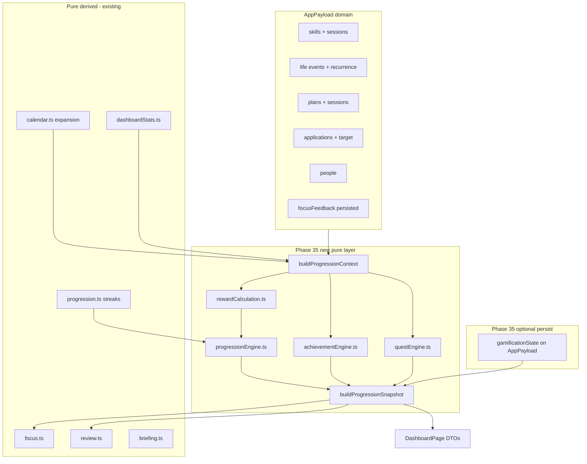
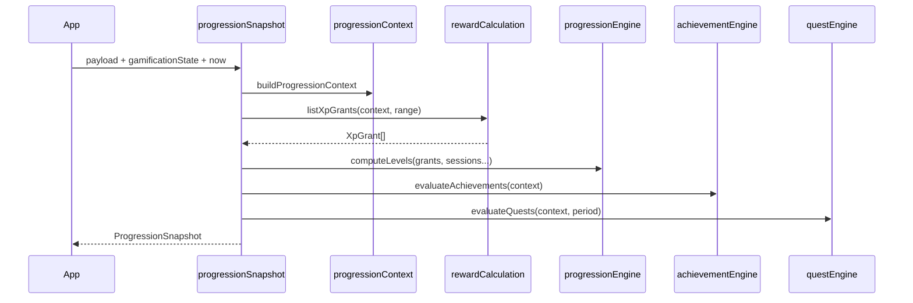

# Phase 35 — Gamification / XP Dashboard (design only)

## Phase numbering and scope

You requested **Phase 35 = Gamification**. The [living roadmap](docs/plans/roadmap.md) currently labels **Phase 35 = Drag-and-Drop Expansion** and **Phase 36 = Gamification**. When this ships, **renumber the roadmap** (gamification → 35, drag expansion → 36) or keep gamification as 36 if drag ships first—product already calls this a priority fork.

**This document is design-only:** no code, schema migrations, or UI implementation. Delivery should follow [PROJECT_RULES.md](PROJECT_RULES.md) and [architecture.md](docs/architecture.md): pure `src/core/*` + tests first, then persistence (if any), then presentational dashboard components.

---

## 1. Current state (baseline)

| Capability | Location | Persistence |
|------------|----------|-------------|
| Global + per-skill XP | [`src/core/progression.ts`](src/core/progression.ts) | **None** — 1 XP = 1 session minute |
| Level bands | `XP_PER_LEVEL_BAND = 60`, linear `levelFromTotalXp` | Derived |
| Streaks | `buildGlobalProgression` / `buildSkillProgressions` | Derived from sessions + `dailyGoalMinutes` |
| Dashboard shell | [`ProgressionHero`](src/components/dashboard/ProgressionHero.tsx) full-width above Phase 32 layout | Read-only DTO |
| Per-skill rows | [`SkillProgressSection`](src/components/dashboard/SkillProgressSection.tsx) | Uses same DTOs |
| Focus streak nudges | [`focus.ts`](src/core/focus.ts) imports `buildSkillProgressions` | Unchanged contract |

**Gaps today:** no progression axes (Mind/Body/Career/Social/Creative), no bonus XP, no achievements/quests, no event-attendance signal, no career-action XP, no level-up notification state, no persisted unlock history.

---

## 2. Integration with completed phases 31–34B



| Phase | Relevance for gamification |
|-------|---------------------------|
| **31** Calendar colors | Axis **display** can reuse calendar category labels (`skill` → Learning/Mind alias) but gamification axes are a **separate enum**—do not overload `categoryKey`. |
| **32** Dashboard layout | Replace/enhance top `ProgressionHero` with **ProgressionPanel**; optional compact **ActiveQuestsCard** in left rail or right rail; keep three-column structure. |
| **33–34** Event series/occurrences/drag | **No XP for drag/reschedule** (organizational action). Event XP uses **attendance/completion signals** (see §6.5)—recurring instances keyed by `eventId` + `recurrenceDate` from calendar `sourceMeta`. |
| **24–25** Skill `scheduleSeries` | Streak/quest “scheduled day” logic must use `isSkillActiveOnDate` / `plannedMinutesOnDate` (same as review). |
| **27–30** Workout schedules | Quests like “complete scheduled workout” use `isWorkoutOccurrenceComplete` from [`fitness.ts`](src/core/fitness.ts). |
| **16** Focus feedback | Pattern for **UI-only persisted state** (`focusFeedback` table)—mirror for `gamificationState` acks (§4.2). |
| **17** Weekly review | Read `ProgressionSnapshot` for wins (“3 achievements this week”)—**no new persistence** in review layer. |

**Explicit non-goals for Phase 35:** month-view drag, resize handles, exception list editor, AI summaries, new npm deps.

---

## 3. Architecture principles

1. **Domain truth stays in existing entities** — sessions, skills, events, workouts, applications. Gamification **never** becomes the source of truth for minutes or schedules.
2. **Pure engines, total functions** — same standards as `recurrence.ts`, `eventOccurrences.ts`, `calendarDrag.ts`: no throw, no input mutation, local `YYYY-MM-DD` keys via existing [`dayKeyFromIso`](src/core/progression.ts) / [`formatLocalDateKey`](src/core/timeline.ts).
3. **Split “ledger” vs “catalog”** — static achievement/quest definitions in versioned TS catalogs; runtime evaluation in engines.
4. **Hybrid persistence (recommended)** — see §4.2; aligns with architecture line: “XP not stored” **evolves** to “XP computed, unlock/ack state stored.”
5. **`progression.ts` remains the streak/level math library** — Phase 35 adds sibling modules; migrate callers gradually (`buildGlobalProgression` → snapshot.global).
6. **`App.tsx` orchestration-only** — load/sanitize `gamificationState`, pass snapshot + `onAckProgressionEvents` into pages; **no** gamification UI in App.

---

## 4. Data models (define first)

Add [`src/core/progressionModel.ts`](src/core/progressionModel.ts) (types only; no React). Re-export selected types through [`model.ts`](src/core/model.ts) when persisted fields land.

### 4.1 Progression axes and tracks

```ts
/** RPG-style axes (roadmap); map to domains, not calendar categoryKey. */
type ProgressionAxis = "mind" | "body" | "career" | "social" | "creative";

/** What is being leveled. */
type ProgressionTrackKind = "global" | "axis" | "skill";

type ProgressionTrackId =
  | "global"
  | `axis:${ProgressionAxis}`
  | `skill:${string}`; // skill.uuid
```

**Axis routing (v1 defaults, overridable later per skill):**

| Axis | Primary signals |
|------|-----------------|
| `mind` | Skill session minutes (default for all skills until tagged) |
| `body` | Workout session `durationMinutes` or fallback block minutes |
| `career` | Application status forward transitions, target milestones |
| `social` | People follow-up logged, social `LifeEvent` types (`hangout`, `birthday`) |
| `creative` | Skills with optional `progressionAxis: "creative"` (new optional field on `Skill`, default omit → `mind`) |

### 4.2 Persistence: `GamificationState` (minimal v1)

Add to `AppPayload` when implementation starts (single jsonb row / table mirroring `calendar_preferences`):

```ts
type GamificationState = {
  /** Last global level user has seen in UI (suppress repeat level-up toasts). */
  lastAcknowledgedGlobalLevel?: number;
  /** Achievement ids user has dismissed from "new" badge (optional). */
  dismissedAchievementIds?: string[];
  /** ISO timestamps for unlocks — only needed if achievements can be "lost" (they cannot in v1). */
  // achievementUnlocks?: { id: string; unlockedAtIso: string }[];
  updatedAtIso?: string;
};
```

**v1 evaluation rule:** achievements and quest completion are **fully derivable** from payload + `now`; `GamificationState` only stores **UX acks** (level-up toast, dismissed cards). Quest period keys are computed (`daily:2026-05-30:questId`), not stored.

**Defer to later:** badges, showcase order, manual quest opt-in, `LifeEvent.attendedAtIso`.

### 4.3 Reward and ledger types

```ts
type RewardSource =
  | "skill_minutes"
  | "skill_daily_goal"
  | "skill_weekly_goal"
  | "streak_day"
  | "streak_milestone"
  | "workout_completed"
  | "workout_scheduled_slot"
  | "event_attended"      // v1 proxy or future explicit flag
  | "career_status"
  | "career_application"
  | "people_follow_up"
  | "quest_completion"
  | "achievement_grant";

type XpGrant = {
  id: string;              // deterministic hash for dedupe in snapshot
  source: RewardSource;
  trackId: ProgressionTrackId;
  amount: number;          // integer >= 0
  dayKey?: string;
  meta?: Record<string, string | number | boolean>;
};

type LevelState = {
  trackId: ProgressionTrackId;
  totalXp: number;
  level: number;
  xpIntoLevel: number;
  xpToNextLevel: number;
  levelProgressPercent: number;
};

type StreakState = {
  trackId: ProgressionTrackId;
  current: number;
  longest: number;
  activeToday: boolean;
};
```

### 4.4 Achievements

```ts
type AchievementCategory =
  | "consistency"
  | "milestones"
  | "fitness"
  | "learning"
  | "social"
  | "career";

type AchievementTier = "bronze" | "silver" | "gold" | "platinum";

type AchievementDefinition = {
  id: string;                    // stable slug e.g. "streak_global_7"
  category: AchievementCategory;
  tier: AchievementTier;
  title: string;
  description: string;
  axis?: ProgressionAxis;        // for filtering showcase
  hiddenUntilUnlocked?: boolean;
  /** Pure predicate name + params — evaluated in achievementEngine */
  condition: AchievementCondition;
};

type AchievementUnlock = {
  definitionId: string;
  unlockedAtIso: string;         // first time condition became true (derived: min date from history scan)
  progress?: { current: number; target: number };
};

type AchievementCondition =
  | { kind: "global_streak_gte"; days: number }
  | { kind: "skill_streak_gte"; days: number }
  | { kind: "global_level_gte"; level: number }
  | { kind: "axis_level_gte"; axis: ProgressionAxis; level: number }
  | { kind: "total_skill_minutes_gte"; minutes: number }
  | { kind: "workouts_completed_gte"; count: number }
  | { kind: "weekly_goal_met_count"; count: number }
  | { kind: "career_applications_gte"; count: number }
  | { kind: "career_status_reached"; status: ApplicationStatus }
  | { kind: "people_follow_ups_gte"; count: number }
  | { kind: "events_social_attended_gte"; count: number }; // v1 proxy
```

Catalog file: [`src/core/achievementCatalog.ts`](src/core/achievementCatalog.ts) (static array, ~30–50 defs for v1).

### 4.5 Quests

```ts
type QuestPeriod = "daily" | "weekly" | "monthly";

type QuestCategory = QuestPeriod; // alias per your categories

type QuestDefinition = {
  id: string;
  period: QuestPeriod;
  title: string;
  description: string;
  axis?: ProgressionAxis;
  rewardXp: number;
  rewardTrackId?: ProgressionTrackId; // default global
  condition: QuestCondition;
};

type QuestCondition =
  | { kind: "log_skill_minutes"; minMinutes: number }
  | { kind: "meet_any_daily_goal" }
  | { kind: "complete_workout" }
  | { kind: "complete_scheduled_workout" }
  | { kind: "extend_global_streak" }
  | { kind: "career_action"; minCount: number }  // status forward or new application
  | { kind: "log_people_contact" };

type QuestInstance = {
  instanceId: string;   // `${period}:${periodStartKey}:${questId}`
  period: QuestPeriod;
  periodStartKey: string;
  periodEndKey: string;
  definition: QuestDefinition;
  progress: { current: number; target: number };
  completed: boolean;
  completedAtIso?: string;
};
```

Catalog: [`src/core/questCatalog.ts`](src/core/questCatalog.ts). Engine picks active instances for `now` via pure period math (reuse `startOfWeekLocal` from [`dashboardStats.ts`](src/core/dashboardStats.ts)).

### 4.6 Milestones (cross-cutting)

**Milestones** = threshold tables reused by rewards + achievements (not a fourth engine):

[`src/core/milestoneTables.ts`](src/core/milestoneTables.ts)

- Global level titles (e.g. L1–L5 names)
- Streak bonus XP at 3/7/14/30/60/90 days (global + per-skill)
- Lifetime minute trophies (100, 500, 1000…)
- Career pipeline milestones (first application, first interview stage, offer)

### 4.7 Snapshot DTO (UI + focus + review)

```ts
type ProgressionSnapshot = {
  generatedAtIso: string;
  todayKey: string;
  global: LevelState & { streak: StreakState };
  axes: Record<ProgressionAxis, LevelState>;
  skills: SkillProgressionView[]; // extends current SkillProgression + axis + bonusXp
  grantsToday: XpGrant[];
  pendingLevelUps: LevelUpNotification[];
  achievements: {
    unlocked: AchievementUnlock[];
    newlyUnlocked: AchievementUnlock[]; // vs last session or ack state
    inProgress: AchievementUnlock[];
  };
  quests: {
    daily: QuestInstance[];
    weekly: QuestInstance[];
    monthly: QuestInstance[];
  };
  milestones: MilestoneHighlight[];
};
```

Builder: `buildProgressionSnapshot(payload, gamificationState?, now?)` in [`src/core/progressionSnapshot.ts`](src/core/progressionSnapshot.ts).

---

## 5. Core modules (pure, before UI)

| Module | Responsibility |
|--------|----------------|
| [`progressionContext.ts`](src/core/progressionContext.ts) | Normalize inputs: sessions by day/skill, workout completions, career transitions, people contacts, expanded calendar events in range, skill active dates. |
| [`rewardCalculation.ts`](src/core/rewardCalculation.ts) | Emit `XpGrant[]` for a date range or single day; apply caps and dedupe keys. |
| [`progressionEngine.ts`](src/core/progressionEngine.ts) | Aggregate grants → `LevelState` per track; curve config; delegate streaks to existing `progression.ts` for skill/global streak rules. |
| [`achievementEngine.ts`](src/core/achievementEngine.ts) | Evaluate catalog vs context; produce unlocks + progress. |
| [`questEngine.ts`](src/core/questEngine.ts) | Instantiate period quests; update progress from same context. |
| [`progressionSnapshot.ts`](src/core/progressionSnapshot.ts) | Orchestrate engines; compute `pendingLevelUps` vs `gamificationState.lastAcknowledgedGlobalLevel`. |



**Level curve (v1):** keep linear bands for familiarity (`XP_PER_LEVEL_BAND` global); allow per-axis `bandSize` multiplier in config object. Document future soft exponential as config-only change.

**Backward compatibility:** if `gamificationState` missing, `normalizePayload` leaves undefined; snapshot behaves like today (minutes-only XP, no bonus grants).

---

## 6. XP award design

### 6.1 Base rules (preserve today)

| Action | Base XP | Track |
|--------|---------|-------|
| Log skill session minutes | 1 XP / minute | `skill:{id}` + axis split (default `mind`) |
| Global total | Sum of skill XP + bonuses | `global` |

### 6.2 Bonus rewards (new)

| Action | Bonus XP | Notes |
|--------|----------|-------|
| Hit skill **daily** goal | +15 | Once per skill per `dayKey`; uses `isStreakActiveDay` threshold |
| Hit skill **weekly** goal | +50 | Once per week per skill; align week with review |
| Global streak day | +5 | When any skill qualifies (existing global streak rule) |
| Streak milestone 7/30/90 | +25 / +100 / +300 | `streak_milestone`; once per threshold per track |
| Complete workout session | +20 | `completedAtIso` set (Fitness v1) |
| Complete **scheduled** workout slot | +10 extra | `isWorkoutOccurrenceComplete` same day |
| Career status forward | +30 | Compare ordered pipeline; detect transition on `updatedAtIso` in week |
| New job application saved | +15 | `status === "saved"` create |
| People follow-up | +20 | `lastContactDate` updated to today |
| Quest completion | `quest.rewardXp` | Grant source `quest_completion` |
| Achievement unlock | catalog `grantXp` optional | One-time |

**Caps (anti-farming):** max +200 bonus XP per `dayKey` global; per-source once-per-day flags in `rewardCalculation` via deterministic grant ids.

### 6.3 Streak rewards

- **Keep** existing streak semantics in [`progression.ts`](src/core/progression.ts) for UI continuity.
- **Add** milestone grants when `currentStreak` crosses 3, 7, 14, 30… (evaluated on snapshot build, deduped by `grantId`).

### 6.4 Goals

- Daily/weekly goals: read `Skill.dailyGoalMinutes` / `weeklyGoalMinutes` (already in model).
- “Completing goals” = bonus grants, not double-counting minutes.

### 6.5 Workout sessions

- Use [`WorkoutSession.completedAtIso`](src/core/model.ts) + `date` for day bucketing.
- Scheduled slot bonus uses plan `planId` + `date` matcher from fitness helpers.

### 6.6 Events (v1 proxy → v2 explicit)

**Problem:** `LifeEvent` has no `attended` / `completed` flag.

**Phase 35 v1 (no schema):** define `event_attended` proxy:

- Timed event: local `date` + `endTime` (or end of day) &lt; `now`
- All-day: `date` &lt; `todayKey`
- Exclude `type: "deadline"` from attendance XP (deadlines are obligations, not attendance)
- Recurring: one grant per `(eventId, recurrenceDate)` using calendar expansion for past instances only

**Phase 35.2+ (optional schema):** `attendedAtIso?: string` on `LifeEvent` for honest attendance; mapper + Events UI checkbox.

### 6.7 Future career actions

Hook `RewardSource` entries reserved:

- `career_interview_logged`, `career_offer_received`, `skill_gap_closed` (when skill linked to application requirement gets N minutes)

Evaluate from existing `JobApplication` fields only in v1.

---

## 7. Achievement categories (catalog sketch)

| Category | Example ids |
|----------|-------------|
| **consistency** | `global_streak_7`, `global_streak_30`, `skill_streak_14`, `week_perfect_schedule` |
| **milestones** | `lifetime_xp_500`, `global_level_10`, `first_session` |
| **fitness** | `workouts_10`, `scheduled_week_clean` |
| **learning** | `skill_minutes_1000`, `weekly_goal_4x` |
| **social** | `follow_up_5`, `social_events_10` |
| **career** | `first_application`, `status_onsite`, `pipeline_active_3` |

**Showcase:** dashboard section shows top N unlocked by tier + recent `newlyUnlocked`.

---

## 8. Quest categories

| Period | Example quests |
|--------|----------------|
| **daily** | Log 15 min any skill; extend streak; complete 1 workout |
| **weekly** | 120 total minutes; meet 3 daily goals; 2 scheduled workouts |
| **monthly** | 10h total; 4 weekly goals met; 1 career action |

Rotation: fixed catalog filtered by `now` period; no randomness (deterministic like briefing templates).

---

## 9. Dashboard integration (UI design only)

### 9.1 Components (new under `src/components/dashboard/`)

| Component | Replaces / adds | Data |
|-----------|-----------------|------|
| `ProgressionPanel` | Enhances `ProgressionHero` | `snapshot.global`, axes strip, today grants |
| `ProgressionAxisRow` | New | 5 axis mini-level bars |
| `ActiveQuestsCard` | New | `snapshot.quests.daily` + weekly subset |
| `AchievementShowcase` | New | unlocked + in-progress |
| `LevelUpToast` | New | `pendingLevelUps`; portal or inline banner |

### 9.2 Layout (Phase 32–compatible)

- **Top full-width:** `ProgressionPanel` (global level, streak, axis summary, link to full progression view if added later).
- **Left rail (optional):** `ActiveQuestsCard` below Daily Focus (max 2–3 quests).
- **Right rail (optional):** compact `AchievementShowcase` (3 cards) or fold into progression panel on mobile.
- **Details band:** keep `SkillProgressSection` but feed `SkillProgressionView` from snapshot (includes axis badge + bonus XP today).

### 9.3 Level-up notifications

- On snapshot: `global.level > (gamificationState.lastAcknowledgedGlobalLevel ?? 0)` → `pendingLevelUps`.
- `App.tsx`: `acknowledgeProgressionLevel(level)` updates `gamificationState` through `commit`.
- **No** toast logic inside App—pass `pendingLevelUps` + callback to `DashboardPage`.

### 9.4 [`DashboardPage.tsx`](src/pages/DashboardPage.tsx) changes (later)

- Replace `buildGlobalProgression` / `buildSkillProgressions` with single `useMemo(() => buildProgressionSnapshot(...))`.
- Pass snapshot slices to children; keep all layout CSS in `appStyles.ts`.

### 9.5 Other surfaces (deferred UI)

- **Review page:** add optional “Achievements this week” bullet from snapshot (read-only).
- **Focus:** optional low-priority item `quest_almost_done` (Phase 35.3).
- **Skills / Fitness pages:** small XP hint on session save (toast from App callback)—optional.

---

## 10. App.tsx contract (orchestration only)

New handlers (names illustrative):

- `acknowledgeGlobalLevel(level: number)` → merge `gamificationState.lastAcknowledgedGlobalLevel`
- `dismissAchievementNotification(id: string)` → append to `dismissedAchievementIds`

**On domain commits** (`addSession`, `addWorkoutSession`, `updateApplication`, etc.): **no XP math in App**—dashboard recomputes snapshot on next render.

**Load path:** `cleanupGamificationState` in `normalizePayload` (strip unknown achievement ids, clamp level ack).

**Sync:** when persisting, new table `gamification_state` (jsonb, one row per user) following `calendar_preferences` / `career_targets` pattern in [`dbMappers.ts`](src/core/dbMappers.ts).

---

## 11. Implementation sequence (when coding starts)

| Sub-phase | Deliverable |
|-----------|-------------|
| **35.0 Models** | `progressionModel.ts`, catalogs, milestone tables, tests for types/ids |
| **35.1 Core engines** | context, rewardCalculation, progressionEngine, achievementEngine, questEngine, snapshot + Vitest |
| **35.2 Persistence** | `GamificationState` on payload, mappers, migration, `normalizePayload` |
| **35.3 Dashboard UI** | ProgressionPanel, quests, achievements, level-up ack |
| **35.4 Cross-layer** | review/focus optional copy; deprecate direct `ProgressionHero` props |
| **35.5 Docs** | `architecture.md`, `roadmap.md`, plan file under `.cursor/plans/` |

**Tests first:** grant dedupe, level boundaries, quest period rollover (week/month edges), achievement unlock stability, proxy event attendance edge cases (recurring + skip exception from Phase 34A).

---

## 12. Future extensibility (hooks only)

- **Badges:** `BadgeDefinition` + `equippedBadgeIds` in `GamificationState`
- **Unlockables:** theme tokens tied to level/achievement (reuse calendar color prefs pattern)
- **Skill tags:** `Skill.progressionAxis` + `Skill.tags[]` for creative/social splits
- **Event attendance:** `attendedAtIso` column
- **Analytics phase 38:** chart XP grants over time from snapshot grants array

---

## 13. Risks and decisions to confirm at implementation time

1. **Renumber roadmap** gamification vs drag (§ opening).
2. **Event XP v1 proxy** may award XP for events user skipped mentally—acceptable for v1 or gate behind explicit attendance field.
3. **Bonus XP vs minutes** inflates levels faster—tune `XP_PER_LEVEL_BAND` or band multipliers after playtesting.
4. **Optional `Skill.progressionAxis`** — schema-touching; can default all to `mind` until user edits skill.

---

## 14. Documentation updates (on ship)

- [docs/architecture.md](docs/architecture.md): replace single `progression.ts` bullet with gamification subsection (engines, persistence, snapshot, dashboard).
- [docs/plans/roadmap.md](docs/plans/roadmap.md): mark Phase 35 Gamification shipped; move DnD expansion to next slot.
- Link this plan from roadmap phase plans list.

---

## 15. Out of scope (Phase 35)

- Drag-and-drop expansion (roadmap’s current Phase 35)
- New AI / LLM layers
- Leaderboards / social comparison
- Shop / spendable currency
- Full-page “Quest log” navigation tab (can be Phase 35.3+ if desired)
