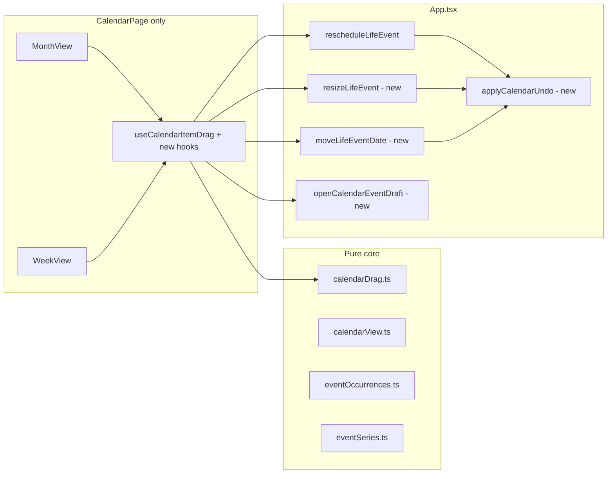
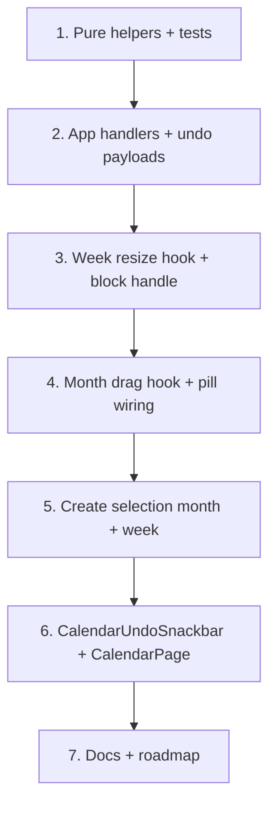

# Phase 36 — Drag-and-Drop Calendar Expansion

**Design only** — no code, migrations, or new npm dependencies. Follow [PROJECT_RULES.md](PROJECT_RULES.md), [SECURITY_RULES.md](SECURITY_RULES.md), [docs/architecture.md](docs/architecture.md), and [docs/plans/roadmap.md](docs/plans/roadmap.md).

**Baseline (Phase 34B):** [`calendarDrag.ts`](src/core/calendarDrag.ts) + [`calendarDrag.test.ts`](src/core/calendarDrag.test.ts); [`useCalendarItemDrag.ts`](src/components/calendar/useCalendarItemDrag.ts) in week view; [`rescheduleLifeEvent`](src/App.tsx) (rejects `isRecurringLifeEvent`); dashboard [`DashboardCalendarWidget`](src/components/dashboard/DashboardCalendarWidget.tsx) omits `onRescheduleItem` (read-only).



---

## Constraints (carry forward)

| Rule | Detail |
|------|--------|
| No new deps | Native `pointer*` events + `setPointerCapture` (same as 34B) |
| No schema | Reuse `LifeEvent.date` / `startTime` / `endTime` and `RecurrenceException` |
| App orchestration | Mutations + undo replay live in [`App.tsx`](src/App.tsx); pages/components get callbacks only |
| Dashboard read-only | Do **not** pass drag/resize/create/undo callbacks to [`DashboardCalendarWidget`](src/components/dashboard/DashboardCalendarWidget.tsx) |
| Eligibility | Default: **one-time life events** only; recurring/skills/workouts blocked or deferred (see §4–5) |
| Existing draft pattern | [`EventFormDraft`](src/pages/EventsPage.tsx) + `eventDraft` / `eventDraftKey` / `handleEventDraftConsumed` in App (same as [`openLinkedEventDraft`](src/App.tsx)) |

---

## Recommended delivery slice: **Option A**

Ship **month drag + week resize + create-from-calendar + undo + docs/tests** in Phase 36.

| Option | Includes | Defer |
|--------|----------|-------|
| **A (recommended)** | Sub-phases 1–3, 6–10 | Recurring drag scope picker (§4); skill/workout drag (§5) |
| B | A + recurring drag with scope modal | Higher risk of accidental series mutation |
| C | B + skill/workout schedule writes | Cross-domain, template corruption risk |

**Rationale:** Phase 34A already covers recurring **move/skip/detach** via [`CalendarItemDetailModal`](src/components/calendar/CalendarItemDetailModal.tsx) + [`moveEventOccurrence`](src/App.tsx). A mid-drag scope picker duplicates that surface and needs new pure orchestration (override vs split vs entire). Skill/workout blocks are **derived** from [`Skill.schedule`](src/core/model.ts) / [`WorkoutPlan`](src/core/model.ts) weekday templates—not movable 1:1 without editing the template ([`collectSkillItems`](src/core/calendar.ts), workout expansion).

Track deferred work as **Phase 36.1** (recurring drag) and **Phase 36.2** (schedule-template drag) in roadmap notes.

---

## Sub-phase 1 — Month-view drag (one-time events)

### Behavior

- Drag [`CalendarItemPill`](src/components/calendar/CalendarItemPill.tsx) between month day cells.
- On drop: change **`LifeEvent.date` only**; preserve `startTime` / `endTime` (and all-day vs timed shape).
- Ghost/preview: floating pill at target cell (reuse swatch colors; `pointer-events: none`, elevated shadow like [`CalendarDragGhostBlock`](src/components/calendar/CalendarEventBlock.tsx)).
- Click threshold (~5px) so pill click still opens detail modal.
- Escape cancels (document listener, same as week hook).

### Pure helpers ([`calendarDrag.ts`](src/core/calendarDrag.ts))

| Function | Purpose |
|----------|---------|
| `canDragCalendarItemInMonth(item)` | One-time `lifeEvent` (`recurrenceDate` absent); **timed and all-day** allowed (broader than week `canDragCalendarItem`, which requires timed) |
| `computeMonthDropTarget({ item, originDateKey, targetDateKey })` | Returns `{ dateKey } \| null`; null if same date or ineligible |
| Keep `canDragCalendarItem` | Week move + resize eligibility (timed one-time only) |

### App handler

Add `moveLifeEventDate(eventId, date)` — mirror `rescheduleLifeEvent` but only merge `date` + `updatedAtIso` (no time fields). Reject recurring parent events via `isRecurringLifeEvent`.

### UI wiring

| File | Change |
|------|--------|
| [`MonthView.tsx`](src/components/calendar/MonthView.tsx) | `data-calendar-month-cell` + `data-date-key` on day cells; optional empty-cell click target (§3); pass drag bindings to pills |
| **New** `useCalendarMonthItemDrag.ts` | Parallel to week hook; resolve cell via `elementFromPoint` + `[data-calendar-month-cell]`; ghost state |
| [`CalendarItemPill.tsx`](src/components/calendar/CalendarItemPill.tsx) | Optional `drag?:` bindings (opacity, `aria-grabbed`, pointer handlers, `onClickCapture`) — mirror `CalendarEventBlock` |
| [`CalendarPage.tsx`](src/pages/CalendarPage.tsx) | Thread `onMoveEventDate` from App |

**Explicitly out:** dragging recurring occurrence pills in month view (blocked by `canDragCalendarItemInMonth`; tooltip: “Use occurrence actions in the detail view”).

---

## Sub-phase 2 — Resize timed one-time events (week view)

### Behavior

- Bottom-edge handle on [`CalendarEventBlock`](src/components/calendar/CalendarEventBlock.tsx) (only when `canResizeCalendarItem(item)` === `canDragCalendarItem(item)`).
- Drag handle adjusts **endTime** only; `startTime` fixed.
- Snap end to 15-minute grid ([`snapMinutes`](src/core/calendarDrag.ts)).
- Validate `endMinutes > startMinutes` (minimum duration ≥ existing `MIN_TIMED_BLOCK_MINUTES` from [`computeTimedItemLayout`](src/core/calendarView.ts) — e.g. 30 min).
- Ghost block shows preview height during resize.
- No week **move** + **resize** on same pointer session (separate hit targets).

### Pure helpers

| Function | Purpose |
|----------|---------|
| `canResizeCalendarItem(item)` | Alias or thin wrapper of `canDragCalendarItem` |
| `computeResizeTarget({ item, originEndMinutes, deltaYMinutes })` | `{ endTime } \| null`; clamp to day end; invalid if end ≤ start |

### App handler

`resizeLifeEvent(eventId, endTime)` — load one-time event, merge `endTime`, `commit`. Reject recurring.

### UI wiring

| File | Change |
|------|--------|
| **New** `useCalendarItemResize.ts` | Pointer capture on resize handle; column `pixelsPerMinute` |
| [`WeekView.tsx`](src/components/calendar/WeekView.tsx) | Pass resize bindings + resize ghost (can share column layout with move ghost; z-index above grid) |
| [`CalendarEventBlock.tsx`](src/components/calendar/CalendarEventBlock.tsx) | Bottom handle `div` (`role="separator"`, `aria-label="Resize end time"`, `cursor: ns-resize`); stop propagation on handle `pointerdown` |

Extend [`calendarDrag.test.ts`](src/core/calendarDrag.test.ts): snap end, preserve start, reject end ≤ start, reject recurring.

---

## Sub-phase 3 — Create event from calendar (draft only)

### Behavior

| Gesture | Result |
|---------|--------|
| Click **empty** month day cell (not pill / not “+N more”) | `EventFormDraft` with `date` prefilled |
| Week: click-drag on **empty** timed column (not on block) | `date` + snapped `startTime` + `endTime` |
| On complete | `setPage("events")`, bump `eventDraftKey`, **no** `commit` / save |

### Pure helper

`buildEventDraftFromCalendarSelection(input: { dateKey: string; startMinutes?: number; endMinutes?: number }) → EventFormDraft`

- If only `dateKey`: draft `{ date: dateKey }` (Events form defaults type/title).
- If range: snap both ends to grid; enforce `end > start` and minimum duration (e.g. 30 min default span if drag &lt; threshold).
- Export `CALENDAR_CREATE_DRAG_THRESHOLD_PX` alongside `DRAG_MOVE_THRESHOLD_PX`.

### App

`openCalendarEventDraft(draft: EventFormDraft)` — same pattern as `openLinkedEventDraft` (lines 739–748 in App).

### UI

| File | Change |
|------|--------|
| [`MonthView.tsx`](src/components/calendar/MonthView.tsx) | `onCreateDraftFromDate?(dateKey)` on cell background click |
| [`WeekView.tsx`](src/components/calendar/WeekView.tsx) | **New** `useCalendarWeekCreateSelection` — pointer down on column background → selection band → `onCreateDraftFromRange` |
| [`CalendarPage.tsx`](src/pages/CalendarPage.tsx) | `onOpenEventDraft` callback |

**Conflict avoidance:** creation pointer handlers on column/cell **background** only; pills/blocks call `stopPropagation` on `pointerdown` where needed.

---

## Sub-phase 4 — Recurring event drag (design + defer)

### Problem

Calendar recurring rows carry `sourceMeta.recurrenceDate` ([`buildEventCalendarItem`](src/core/calendar.ts)). Dragging them is ambiguous:

| User intent | Correct mutation | Existing API |
|-------------|------------------|--------------|
| This occurrence only | `moveOccurrenceAtDate` (override exception) or detach + edit | 34A |
| This and future | `splitEventSeriesAtDate` + truncate + new series | 33 |
| Entire series | `updateEvent` on parent | 33 |

Week/month **time** change on one occurrence also needs override with times, not just date.

### Phase 36 decision: **defer implementation**

- Keep `canDragCalendarItem` / `canDragCalendarItemInMonth` **false** when `recurrenceDate` is set (already true for week).
- Optional UX: on `pointerdown` for recurring pills, **no drag**; reinforce tooltip (already in week hook).

### Phase 36.1 design (when built)

1. User starts drag on recurring pill → **cancel move** until scope chosen.
2. Show [`CalendarRecurrenceDragScopeModal`](src/components/calendar/) (new) with three options aligned to [`EventSeriesEditScope`](src/core/eventSeries.ts): `thisOccurrenceOnly`, `thisAndFuture`, `entire`.
3. After scope + drop target:
   - **This occurrence:** `moveEventOccurrence(eventId, scheduledDate, overrideDate)`; if week drag changed times, extend `RecurrenceException` override shape (may need pure helper `moveOccurrenceAtDateWithTimes` — evaluate in 36.1 plan, avoid schema).
   - **This and future:** `updateEventSeries("thisAndFuture", splitDate, { ...edited, date, startTime, endTime })`.
   - **Entire:** `updateEvent` on parent with new anchor/date/times (careful with `recurrence.anchorDate` / `startDate`).
4. **Guardrail:** require explicit scope confirmation before any `commit`; default selection none; destructive scopes use confirm copy.

**Do not** silently call `rescheduleLifeEvent` on recurring items (already guarded in App).

---

## Sub-phase 5 — Skills / workout drag (analysis + defer)

### What calendar shows

| `sourceMeta.kind` | Backing data | Drag implication |
|-------------------|--------------|------------------|
| `skillScheduleBlock` | `skill.schedule[weekday][]` block | Moving one instance implies changing **weekly template** or adding per-date overrides (no model today) |
| `workoutScheduleBlock` | `WorkoutPlan` weekday schedule | Same — template-level |
| `lifeEvent` (one-time) | `LifeEvent` row | Safe (Phase 34B/36) |

### Safe v1 (Phase 36): **block drag**

- `canDragCalendarItem` / month / resize: remain **false** for non-`lifeEvent`.
- Tooltip: “Edit schedule on Skills page” / “Edit plan on Fitness page”.
- Detail modal: optional link CTA to navigate (`setPage("skills")` / `"fitness"`) — **optional**, only if zero extra scope creep.

### Phase 36.2 (if ever)

- Treat drag as “open Skills/Fitness editor focused on this block” (navigation only), **not** silent template mutation.
- Any true reschedule requires explicit product design for per-date overrides (likely new domain fields — out of Phase 36).

---

## Sub-phase 6 — Undo support (ephemeral)

### Behavior

- After successful **move** (week/month), **resize**, show inline snackbar ~8s: “Event updated” + **Undo**.
- **One** pending undo at a time; new mutation replaces it.
- Undo calls App to replay **previous** `date` / `startTime` / `endTime` snapshot.
- No localStorage, no undo stack, no redo.

### Types (pure, in `calendarDrag.ts` or small `calendarUndo.ts`)

```typescript
type CalendarEventUndoPayload = {
  eventId: string;
  date: string;
  startTime?: string;
  endTime?: string;
};
```

### App

`applyCalendarEventUndo(payload: CalendarEventUndoPayload)` — load event, restore fields, `commit`. Re-validate one-time/non-recurring if needed.

### UI

| File | Role |
|------|------|
| **New** `CalendarUndoSnackbar.tsx` | Presentational; `role="status"`; Undo button |
| [`CalendarPage.tsx`](src/pages/CalendarPage.tsx) | Holds `pendingUndo` state; on mutation callback from App, App returns undo payload **or** CalendarPage captures snapshot **before** calling handler (prefer: handler returns undo payload from App after commit for single source of truth) |

**Recommended flow:** App handlers return `CalendarEventUndoPayload | null` to caller; CalendarPage sets snackbar state. Keeps snapshot construction next to mutation logic in App.

`App.tsx` stays thin: no snackbar JSX.

---

## Sub-phase 7 — Pure helper layer summary

Extend [`calendarDrag.ts`](src/core/calendarDrag.test.ts) (single module to avoid sprawl):

| Helper | Tests |
|--------|-------|
| `canDragCalendarItemInMonth` | recurring blocked; all-day one-time allowed |
| `computeMonthDropTarget` | date change; same-date null |
| `computeResizeTarget` | snap, min duration, invalid end |
| `buildEventDraftFromCalendarSelection` | date-only; week range; min span |
| `canResizeCalendarItem` | mirrors drag rules |
| Existing | regression for week `computeRescheduleTarget` |

Optional: `export type CalendarInteractionKind = 'weekMove' | 'monthMove' | 'resize' | 'create'` for telemetry-free UI only.

---

## Sub-phase 8 — UI component matrix

| Component | Phase 36 changes |
|-----------|------------------|
| [`MonthView.tsx`](src/components/calendar/MonthView.tsx) | Month drag hook; empty-day create click; cell data attributes |
| [`WeekView.tsx`](src/components/calendar/WeekView.tsx) | Resize hook; create-selection overlay; thread new callbacks |
| [`CalendarEventBlock.tsx`](src/components/calendar/CalendarEventBlock.tsx) | Resize handle + resize bindings |
| [`CalendarItemPill.tsx`](src/components/calendar/CalendarItemPill.tsx) | Month drag bindings |
| [`CalendarPage.tsx`](src/pages/CalendarPage.tsx) | Props: move date, resize, open draft, undo display; wire snackbar |
| [`useCalendarItemDrag.ts`](src/components/calendar/useCalendarItemDrag.ts) | Minor: return undo hint or unchanged |
| [`App.tsx`](src/App.tsx) | `moveLifeEventDate`, `resizeLifeEvent`, `openCalendarEventDraft`, undo apply; extend `rescheduleLifeEvent` to return undo payload |
| [`DashboardCalendarWidget`](src/components/dashboard/DashboardCalendarWidget.tsx) | **No changes** |
| **New** | `useCalendarMonthItemDrag.ts`, `useCalendarItemResize.ts`, `useCalendarWeekCreateSelection.ts`, `CalendarUndoSnackbar.tsx` |

[`useCalendarController.ts`](src/components/calendar/useCalendarController.ts): unchanged (no persistence).

---

## Sub-phase 9 — Tests

**Vitest** ([`calendarDrag.test.ts`](src/core/calendarDrag.test.ts)):

- Month: `computeMonthDropTarget` changes date; preserves times on item model; same date → null
- Month: recurring / skill / workout → `canDragCalendarItemInMonth` false
- Resize: snap end; start unchanged; end ≤ start → null
- Resize: recurring blocked
- Create: `buildEventDraftFromCalendarSelection` date-only and range
- Week move: existing tests stay green

**Manual checklist** (CalendarPage only):

1. Month: drag one-time pill to another day → times unchanged, sync survives refresh
2. Week: resize bottom edge → end snaps; cannot shrink below start
3. Week: drag move still works; click without move opens modal
4. Month empty cell → Events form with date; week range drag → start/end filled; cancel/back does not auto-save
5. Recurring pill does not drag (month + week)
6. Skill/workout block does not drag
7. Undo restores prior state once; second edit replaces undo offer
8. Dashboard calendar: no drag, no resize, no create shortcut

```bash
npm test
npm run lint
npm run build
```

---

## Sub-phase 10 — Documentation

Update on ship:

- [`docs/architecture.md`](docs/architecture.md) — expand “Calendar drag” to Phase 36: month date-only move, week resize, create draft gestures, undo snackbar, deferred recurring/skill/workout drag; dashboard still read-only
- [`docs/plans/roadmap.md`](docs/plans/roadmap.md) — Phase 36 ✅; Phase 36.1/36.2 backlog lines; “Current next action” → Phase 37 notifications
- New plan file: `.cursor/plans/phase_36_calendar_dnd.plan.md` (this plan)

---

## Implementation order



Ship vertically in one PR if possible; if splitting, **helpers + App + week resize** first, then month + create + undo.

---

## Security / quality notes

- Draft prefills are **local form state** only — no untrusted network input; date keys already `YYYY-MM-DD` from pure grid code
- Undo restores only the user’s last self-mutation (no history export)
- Do not log event titles in undo diagnostics
- Keyboard: resize handle focusable; Escape cancels active drag/resize (not undo)

---

## Final recommendation

**Ship Phase 36 as Option A:** month drag + week resize + create-from-calendar draft + lightweight undo.

Defer **Option B** (recurring drag scope picker) to Phase 36.1 — document the modal + mutation matrix now, implement after A is stable.

Defer **Option C** (skill/workout drag) indefinitely or limit to “navigate to editor” in a later phase — do not mutate `Skill.schedule` / `WorkoutPlan` from calendar drag in v1.
