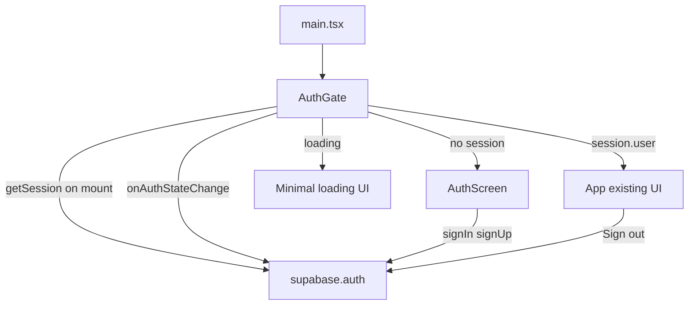

# Phase 3: Supabase Auth login gate

## Alignment

- [PROJECT_RULES.md](PROJECT_RULES.md): Small, reviewable diff; prefer explicit typed code; no speculative abstractions.
- [SECURITY_RULES.md](SECURITY_RULES.md): No secrets in source; do not log passwords, tokens, or raw auth payloads; surface safe, user-facing errors only.
- [docs/plans/vercel-supabase-auth-storage.md](docs/plans/vercel-supabase-auth-storage.md) Phase 3: email/password, gate on session, safe errors; Phase 4 (sync) explicitly **out of scope** here.

## Current baseline

- [src/main.tsx](src/main.tsx) mounts `App` directly.
- [src/App.tsx](src/App.tsx) owns all UI, `loadAppData` / `commit` / export-import ([src/core/storage.ts](src/core/storage.ts)); no auth today.
- [src/lib/supabaseClient.ts](src/lib/supabaseClient.ts) already initializes the client and throws if `VITE`_* env vars are missing.

## Architecture (auth state flow)

1. **Mount**: `supabase.auth.getSession()` resolves initial session (handles refresh token restore).
2. **Subscribe**: `supabase.auth.onAuthStateChange` updates React state on `SIGNED_IN`, `SIGNED_OUT`, `TOKEN_REFRESHED`, etc.
3. **Loading**: Until the first `getSession` completes, show a neutral loading state (no main app, no secrets).
4. **Gate**: If `session?.user` is absent after load, render **AuthScreen** only (main app not mounted, or mounted but hidden—prefer **not mounting** `App` until authenticated to avoid initializing local app state before gate; either is acceptable if `App` has no side effects beyond `useState(loadAppData)` on mount—skipping mount until login is slightly cleaner).
5. **Sign out**: Call `supabase.auth.signOut()`; listener clears session; gate shows auth screen again. **No** DB or localStorage wipe required for Phase 3 (same device local data remains unless you add optional clear later).

## Component structure

| Piece                                                | Responsibility                                                                                                                                                                                                                                                                                                                                                                                                                            |
| ---------------------------------------------------- | ----------------------------------------------------------------------------------------------------------------------------------------------------------------------------------------------------------------------------------------------------------------------------------------------------------------------------------------------------------------------------------------------------------------------------------------- |
| [src/auth/AuthGate.tsx](src/auth/AuthGate.tsx) (new) | Holds `session`, `user`, `authLoading`, `authError` (optional, for global sign-out errors only). Calls `getSession`, registers `onAuthStateChange`, cleanup on unmount. Renders loading / `AuthScreen` / `App`.                                                                                                                                                                                                                           |
| [src/auth/AuthScreen.tsx](src/auth/new) (new)        | Email + password fields; mode toggle **Sign in** vs **Sign up** (single screen, two actions); submit handlers calling `supabase.auth.signInWithPassword` and `signUp` (per [Supabase JS Auth](https://supabase.com/docs/reference/javascript/auth-signinwithpassword)). Displays **local** form error string from mapped `AuthError` / `Error`. Optional “check email” hint when sign-up returns no session (email confirmation enabled). |
| [src/App.tsx](src/App.tsx) (minimal edit)            | Add optional `onSignOut?: () => void` (or a small prop object) and a **Sign out** control in the existing header next to Save/Export/Import. **No** changes to `commit`, dashboard logic, or storage keys.                                                                                                                                                                                                                                |

**Optional** (only if it stays smaller than context): [src/auth/mapAuthError.ts](src/auth/mapAuthError.ts) — pure function `unknown -> string` for user-safe messages (no password echo, no token substring).

**Avoid** for this phase: React Context providers unless prop drilling becomes painful (one optional callback is enough).

## Files to add / change

| Action         | Path                                                                                                                  |
| -------------- | --------------------------------------------------------------------------------------------------------------------- |
| Add            | `src/auth/AuthGate.tsx`                                                                                               |
| Add            | `src/auth/AuthScreen.tsx`                                                                                             |
| Add (optional) | `src/auth/mapAuthError.ts`                                                                                            |
| Change         | [src/main.tsx](src/main.tsx) — render `<AuthGate />` instead of `<App />` (import `AuthGate` from `./auth/AuthGate`). |
| Change         | [src/App.tsx](src/App.tsx) — header sign-out + prop typing only.                                                      |

**Do not change** in Phase 3: [src/core/storage.ts](src/core/storage.ts), [src/core/model.ts](src/core/model.ts), migration SQL, [package.json](package.json) (dependency already present), `.env.example` unless you add a one-line doc pointer in [docs/setup.md](docs/setup.md) (optional, tiny).

## Error and loading states

- **Initial auth load**: `authLoading === true` → full-screen or centered “Loading…” (no form, no app).
- **AuthScreen submit**: `formLoading` boolean disables buttons and inputs during `signIn` / `signUp` await.
- **Auth errors**: Catch failures from `signInWithPassword` / `signUp`; pass through `mapAuthError` to set a single `formError: string` (e.g. invalid credentials, rate limit, generic fallback). Do **not** display `error.message` if it could contain sensitive details—prefer allowlisted `AuthError` codes from `@supabase/supabase-js` where stable.
- **Missing env**: Already throws at [src/lib/supabaseClient.ts](src/lib/supabaseClient.ts) import time; AuthGate importing `supabase` is sufficient—document that devs need `.env.local`.

## Security considerations

- **Client-only auth**: Session lives in Supabase client storage (browser); acceptable for SPA; always HTTPS in production (Vercel).
- **No service role** in client (unchanged).
- **Email confirmation**: If Supabase requires confirmed email, `signUp` may return `user` without `session`; treat as success + message “Check your email to confirm” instead of rendering main app.
- **Password handling**: Never log or persist password in app state beyond controlled inputs; clear sensitive fields optional on success (nice-to-have).
- **XSS**: Existing app uses React text; keep auth form the same (no `dangerouslySetInnerHTML`).
- **Subpath / redirects**: [vite.config.ts](vite.config.ts) `base` is non-root; ensure Supabase Dashboard **Site URL** and **Redirect URLs** include local dev and production origins with correct path—document in validation checklist (dashboard config, not code).

## Out of scope (explicit)

- Loading or mutating `skills` / `sessions` / `overrides` from Postgres.
- Merging remote data with localStorage, debounced sync, or RLS testing beyond sign-in/out smoke.
- Password reset, OAuth, magic link, 2FA, profile tables.

## Validation checklist

- With valid `.env.local`, cold load: loading then either auth screen or app depending on prior session.
- Sign up with new email (handle confirmation-required case per project settings).
- Sign in with correct password → main app appears; localStorage behavior unchanged (same keys, export/import still work).
- Sign out from header → auth screen; session cleared (verify in Application → Local Storage / Supabase session if needed).
- Wrong password → user-visible error, no stack trace or token in UI.
- `npm run build` and lint pass.
- Supabase Dashboard: Email provider on; redirect URLs include dev URL with Vite port and production URL including `base` if applicable.

