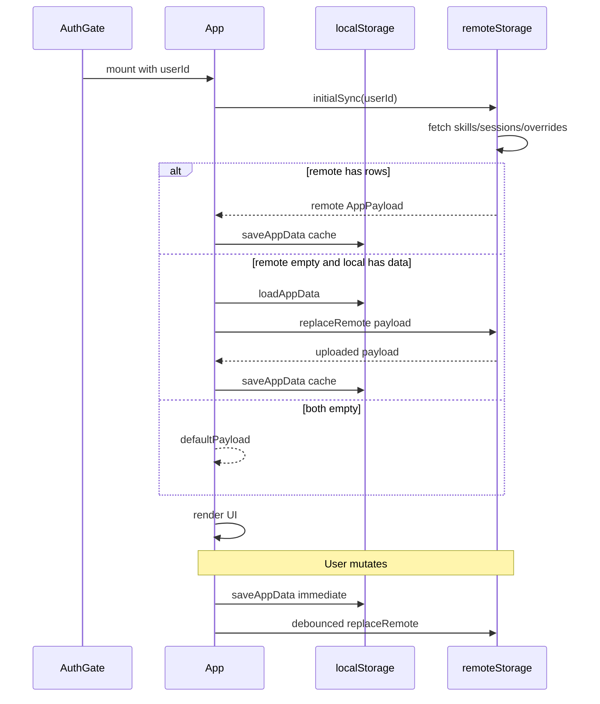

# Phase 4: localStorage to Supabase Sync

## Current baseline

| Layer | Status |
|-------|--------|
| Auth gate | Done — [`AuthGate.tsx`](src/auth/AuthGate.tsx) mounts [`App`](src/App.tsx) only when `session.user` exists |
| App data | localStorage only via [`loadAppData` / `saveAppData`](src/core/storage.ts) |
| Mutations | All CRUD flows through `commit()` → `saveAppData()` → `setApp()` in [`App.tsx`](src/App.tsx) |
| Remote CRUD | None — no mappers, no `supabase.from(...)` usage |
| Overrides | Placeholder in [`AppPayload`](src/core/model.ts); no UI mutations today |



---

## Sync policy (document in code + plan)

Phase 4 uses a **simple, explicit policy** with no merge/conflict UI:

1. **Initial load — remote wins when populated**: If Supabase returns any rows for the user, that payload becomes canonical and overwrites the local cache.
2. **Initial load — local migration when remote empty**: If Supabase has zero rows across all three tables **and** localStorage has skills/sessions/overrides, upload local payload to Supabase, then keep using that data.
3. **Both empty**: Use [`defaultPayload()`](src/core/state.ts).
4. **Both have data (edge case)**: Remote wins; local cache is replaced. No conflict resolution in Phase 4. Users can export before first cloud sync (already supported).
5. **Mutations**: Optimistic local write first; debounced full-state remote replace (not real-time, not incremental merge).

Optional rollback flag from [vercel-supabase-auth-storage.md](docs/plans/vercel-supabase-auth-storage.md): `VITE_ENABLE_REMOTE_SYNC=false` skips remote fetch/write and preserves current local-only behavior.

---

## Files to add

| File | Purpose |
|------|---------|
| [`src/core/dbMappers.ts`](src/core/dbMappers.ts) | Pure row ↔ domain mappers (no Supabase import) |
| [`src/core/remoteStorage.ts`](src/core/remoteStorage.ts) | `fetchRemotePayload`, `replaceRemotePayload`, `initialSync`, `isRemoteSyncEnabled` |
| [`src/core/dbMappers.test.ts`](src/core/dbMappers.test.ts) | Unit tests for mappers (no network; aligns with Phase 2 note in plan doc) |

## Files to change

| File | Change |
|------|--------|
| [`src/auth/AuthGate.tsx`](src/auth/AuthGate.tsx) | Pass `userId={session.user.id}` to `App` |
| [`src/App.tsx`](src/App.tsx) | Async initial sync on mount; extend `commit()` with debounced remote persist; loading/error/sync UI |
| [`src/core/storage.ts`](src/core/storage.ts) | User-scoped localStorage key helper; keep export/import/load/save APIs unchanged in shape |
| [`src/vite-env.d.ts`](src/vite-env.d.ts) | Declare optional `VITE_ENABLE_REMOTE_SYNC` |
| [`.env.example`](.env.example) | Add commented `VITE_ENABLE_REMOTE_SYNC=` name only (empty value) |
| [`docs/plans/vercel-supabase-auth-storage.md`](docs/plans/vercel-supabase-auth-storage.md) | Mark Phase 4 decisions (sync policy, namespaced cache key) |

**Out of scope for Phase 4** (per constraints): new SQL migrations, RPC functions, service role, real-time subscriptions, offline queue, React Context refactor.

---

## Data mapping: domain ↔ database

### `skills` ↔ `Skill`

| Domain ([`model.ts`](src/core/model.ts)) | DB column | Notes |
|----------------------------------------|-----------|-------|
| `id` | `id` | Preserve client UUIDs from [`crypto.randomUUID()`](src/App.tsx) |
| _(from session)_ | `user_id` | Always `session.user.id`; required on INSERT |
| `name` | `name` | |
| `priority` | `priority` | `undefined` → SQL `NULL` |
| `dailyGoalMinutes` | `daily_goal_minutes` | |
| `weeklyGoalMinutes` | `weekly_goal_minutes` | |
| `schedule` | `schedule` | `WeeklySchedule` stored as jsonb object |
| `createdAtIso` | `created_at` | ISO string ↔ timestamptz |
| `updatedAtIso` | `updated_at` | DB trigger also updates on UPDATE |

### `sessions` ↔ `Session`

| Domain | DB column | Notes |
|--------|-----------|-------|
| `id` | `id` | Client UUID |
| _(from session)_ | `user_id` | |
| `skillId` | `skill_id` | Must reference a skill in the same payload; RLS policy verifies ownership |
| `minutes` | `minutes` | Must be integer > 0 (matches app + CHECK constraint) |
| `startedAtIso` | `started_at` | |
| `createdAtIso` | `created_at` | |

### `overrides` ↔ `Array<unknown>`

Overrides are unused in UI today. Minimal mapping:

| Domain item | DB row | Notes |
|-------------|--------|-------|
| `item.id` (if object with string `id`) or generated UUID | `id` | Stable round-trip when possible |
| _(from session)_ | `user_id` | |
| `item.kind` (if string) else `null` | `kind` | |
| whole item (or `{ value: item }` for primitives) | `payload` | jsonb |
| n/a | `created_at` | Set from item timestamp if present, else `now()` on upload |

**From DB**: `overrides` array = each row's `payload` (attach row `id` if missing from payload for future use).

Mapper functions (suggested exports):

- `skillToRow(skill, userId)` / `skillFromRow(row)`
- `sessionToRow(session, userId)` / `sessionFromRow(row)`
- `overrideToRow(item, userId)` / `overrideFromRow(row)`
- `payloadFromRows(skills, sessions, overrides)` → `AppPayload`

Validate in mappers: UUID format for ids, priority 1–4, schedule is object, session minutes > 0, session `skillId` exists in skills list before upload.

---

## `remoteStorage.ts` API

```typescript
// Pseudocode — actual names should match repo style
isRemoteSyncEnabled(): boolean

fetchRemotePayload(userId: string): Promise<AppPayload>

replaceRemotePayload(userId: string, payload: AppPayload): Promise<void>

initialSync(userId: string, localLoader: () => AppData): Promise<AppData>
```

### `fetchRemotePayload`

Parallel SELECTs (authenticated JWT, RLS scoped):

```typescript
supabase.from('skills').select('*').eq('user_id', userId)
supabase.from('sessions').select('*').eq('user_id', userId)
supabase.from('overrides').select('*').eq('user_id', userId)
```

Map rows → `AppPayload` via mappers.

### `replaceRemotePayload` (full-state replace, ordered)

No Postgres transaction from client; use **safe ordering** to respect FK + RLS:

1. Validate payload (skill ids unique; every session references an existing skill; minutes > 0)
2. **Upsert** all skills (`onConflict: 'id'`)
3. **Upsert** all sessions
4. **Upsert** all overrides
5. **Delete** sessions whose `id` is not in payload (`.in('id', [...])` negated via fetch-then-delete or `.not('id', 'in', ...)`)
6. **Delete** skills not in payload (DB CASCADE removes dependent sessions already gone from payload)
7. **Delete** overrides not in payload

On partial failure: throw; local cache remains intact; surface retry-able error. Do not swallow errors ([PROJECT_RULES.md](PROJECT_RULES.md)).

### `initialSync`

```
if !isRemoteSyncEnabled() → return localLoader()

remote = await fetchRemotePayload(userId)
if remote has any skills/sessions/overrides → return { ...localLoader envelope, payload: remote, updatedAtIso: now }

local = localLoader()
if local.payload has any skills/sessions/overrides →
  await replaceRemotePayload(userId, local.payload)
  return saveAppData(local)  // refresh cache timestamp

return { version: 1, updatedAtIso: now, payload: defaultPayload() }
```

---

## localStorage cache changes

Keep [`exportBackup`](src/core/storage.ts) / [`importBackup`](src/core/storage.ts) operating on the same `AppData` envelope.

Add user-scoped key to prevent cross-account leakage on shared browsers:

- **New key pattern**: `pa.appData.v1.${userId}`
- **Migration on first sync**: If namespaced key is empty, fall back to legacy global key `pa.appData.v1` once, then write to namespaced key
- **Legacy key**: Leave in place (don't auto-delete) so pre-auth local data isn't destroyed silently; namespaced key becomes canonical after first login

`loadAppData(userId?)` and `saveAppData(data, userId?)` gain an optional userId parameter; when omitted, behavior stays compatible for export/import helpers that receive full `AppData` in memory.

---

## App integration

### AuthGate

```tsx
<App userId={session.user.id} onSignOut={...} />
```

### App startup (replace sync `useState` initializer)

```tsx
const [app, setApp] = useState<AppData | null>(null)
const [dataLoading, setDataLoading] = useState(true)
const [dataError, setDataError] = useState<string | null>(null)
const [syncError, setSyncError] = useState<string | null>(null)
const [syncPending, setSyncPending] = useState(false)

useEffect(() => {
  initialSync(userId, () => loadAppData(userId))
    .then(setApp)
    .catch(err => setDataError(safeMessage(err)))
    .finally(() => setDataLoading(false))
}, [userId])
```

While `dataLoading`: show full-viewport "Loading your data…" (match AuthGate pattern).

While `dataError`: show error banner + Retry button (re-run initial sync).

### `commit()` mutation flow

```tsx
function commit(next: AppData) {
  const saved = saveAppData(next, userId)  // local cache immediately
  setApp(saved)
  setSyncError(null)
  scheduleRemotePersist(saved.payload)     // debounced ~400ms
}

const scheduleRemotePersist = useMemo(
  () => debounce(async (payload) => {
    if (!isRemoteSyncEnabled()) return
    setSyncPending(true)
    try {
      await replaceRemotePayload(userId, payload)
    } catch (err) {
      setSyncError(safe cloud message)  // non-blocking; local data still valid
    } finally {
      setSyncPending(false)
    }
  }, 400),
  [userId]
)
```

Cleanup debounce on unmount.

### Export / Import (preserve behavior)

| Action | Behavior |
|--------|----------|
| **Export Backup** | Unchanged — exports in-memory `AppData` (already includes latest local save) |
| **Import Backup** | Unchanged validation via `importBackup()` → `commit(imported)` triggers local save + debounced remote replace |
| **Save Now** | Unchanged — `commit(app)`; optionally flush debounced persist immediately on Save Now only (nice-to-have, not required) |

### Header UX additions (minimal)

- `Last saved: …` — keep existing local timestamp
- Optional subtitle when `syncPending`: "Saving to cloud…"
- Non-blocking `syncError` banner: "Cloud save failed. Your changes are saved locally." + Retry (calls `replaceRemotePayload` with current payload)
- Do not log tokens, user ids, or raw Supabase errors to console in production paths

---

## Error and loading states

| State | When | UI | Data safety |
|-------|------|-----|-------------|
| `dataLoading` | Initial sync in flight | Block main app; centered message | No stale empty dashboard |
| `dataError` | Initial fetch/upload failed | Error + Retry; stay gated | Local cache untouched |
| `syncPending` | Debounced write in flight | Subtle header hint | Local already saved |
| `syncError` | Remote persist failed after mutation | Dismissible/warning banner + Retry | Local is source of truth until retry succeeds |
| Import error | Existing | Red `errorBox` | Unchanged |

Safe error messages: map Supabase errors to generic strings (same pattern as [`mapAuthError.ts`](src/auth/mapAuthError.ts)); never expose JWT, SQL, or stack traces.

---

## Security considerations

- **No service role key** — client uses anon key + authenticated session only ([SECURITY_RULES.md](SECURITY_RULES.md))
- **RLS is the authorization layer** — all queries run as authenticated user; `user_id` on INSERT must equal `session.user.id` (from AuthGate prop, not user input)
- **No secrets in client bundle** — only `VITE_SUPABASE_URL`, `VITE_SUPABASE_ANON_KEY`, optional `VITE_ENABLE_REMOTE_SYNC`
- **Input validation at boundaries** — mappers validate row shapes; `importBackup` validation unchanged; reject oversized imports (e.g. cap file size ~5MB before parse)
- **FK safety** — filter sessions with missing `skillId` before upload; upload skills before sessions
- **User-scoped localStorage** — prevents reading/writing another account's cache on shared devices
- **Logging** — no tokens, session IDs, passwords, or full payloads in logs
- **Sign out** — does not clear namespaced cache (user can sign back in); acceptable for Phase 4

---

## Validation checklist

**Auth and access**
- [ ] Unauthenticated users never reach synced `App` (existing gate)
- [ ] Two test accounts: A cannot SELECT/INSERT/UPDATE/DELETE B's rows (RLS)

**Initial sync**
- [ ] Fresh account + empty local → empty dashboard
- [ ] Fresh account + populated localStorage → data appears in Supabase and UI after login
- [ ] Account with existing Supabase data → UI matches remote; local cache updated
- [ ] Account with both remote and local data → remote wins (documented)
- [ ] Page refresh while logged in → session restored, data reloads from Supabase

**Mutations**
- [ ] Add/update/delete skill persists locally and appears in Supabase after debounce
- [ ] Add/delete session persists correctly; orphaned session rows removed on replace
- [ ] Rapid edits coalesce to fewer network calls (debounce)

**Backup**
- [ ] Export produces valid `AppData` JSON
- [ ] Import replaces in-memory state, local cache, and remote (after debounce)

**Failure modes**
- [ ] Simulated network error on initial load shows retry UI, not empty app
- [ ] Simulated network error on mutation shows sync warning; local edits retained
- [ ] `VITE_ENABLE_REMOTE_SYNC=false` → local-only behavior, no Supabase data calls

**Security / hygiene**
- [ ] No `SERVICE_ROLE` or service role key in source, `VITE_*`, or docs
- [ ] `.env.example` remains names-only
- [ ] `npm run build` and typecheck pass
- [ ] Mapper unit tests pass

---

## Implementation size estimate

Target ~300–450 lines net new/changed across 5–6 files. Avoid introducing debounce library if a tiny `useDebouncedCallback` or inline timeout in `App.tsx` suffices (no new dependency unless already present).
