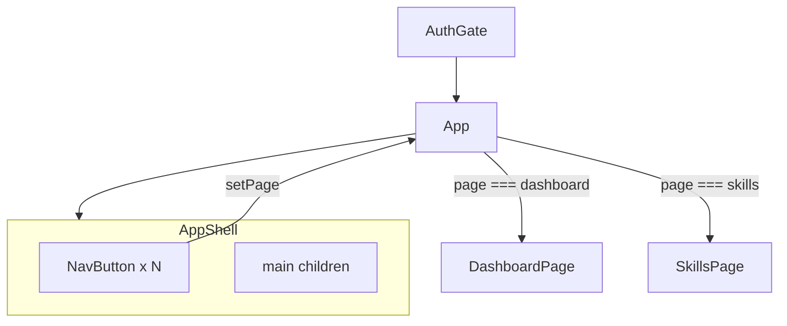
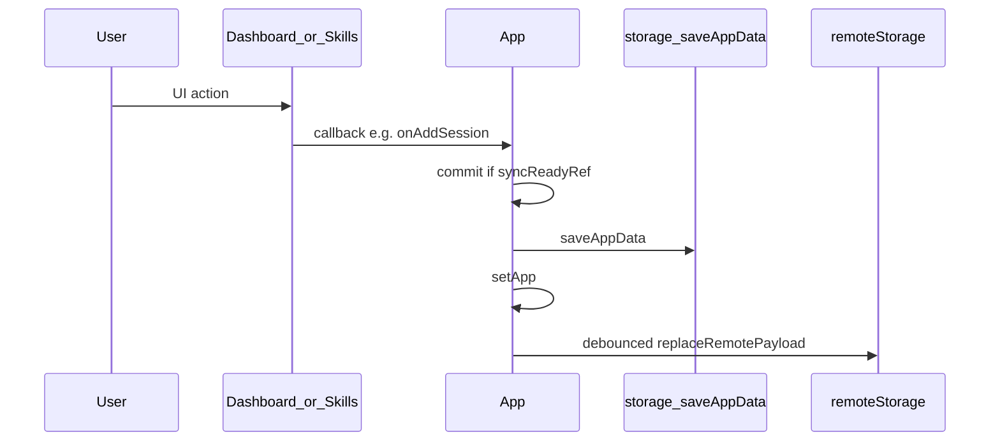

# Phase 5: Split App into pages and components

## Goals and constraints

- **Behavior unchanged**: same auth gate, initial sync, debounced cloud persist, backup import/export, dashboard/skills UX.
- **No new dependencies** (no React Router, no state library).
- **Navigation**: keep `useState<Page>` in [App.tsx](src/App.tsx)—only two pages today; URL routing is not justified until deep links, back button, or shareable URLs matter.
- **Sync/auth boundary**: [AuthGate.tsx](src/auth/AuthGate.tsx) stays the auth shell; App stays the **data + mutation shell**; pages stay **presentational** (props in, events out).
- Follow [PROJECT_RULES.md](PROJECT_RULES.md), [SECURITY_RULES.md](SECURITY_RULES.md), and [.cursor/rules](.cursor/rules): small PRs, no secrets in client, no logic changes to sync policy.

---

## Current shape (what we are splitting)

[App.tsx](src/App.tsx) (~1,244 lines) currently contains:

| Concern | Lines (approx.) | Keep in App? |
|---------|-----------------|--------------|
| Sync/load (`initialSync`, debounce, `commit`, refs) | 129–346 | **Yes** |
| Skills/sessions CRUD | 267–346 | **Yes** (or thin `src/app/mutations.ts` later—optional, not required for Phase 5) |
| Loading/error gates | 349–370 | **Yes** (shell) |
| Header, nav, error banners, page switch | 372–453 | **Move** layout pieces |
| `Dashboard`, `SkillsPage`, `SkillEditor`, `GoalInput`, `NavButton` | 456–1197 | **Move** |
| Schedule/time pure helpers | 68–118 | **Move** to `core/` |
| Format/priority helpers | 37–63 | **Move** to small util |
| `styles` object | 1199–1244 | **Move** shared styles |

Existing modules to **reuse**, not duplicate:

- [src/core/storage.ts](src/core/storage.ts) — local persist + backup
- [src/core/remoteStorage.ts](src/core/remoteStorage.ts) — `initialSync`, remote writes
- [src/core/sessions.ts](src/core/sessions.ts) — `minutesTodayForSkill` (optional adopt during extract; behavior must match current ISO-day filtering)
- [src/core/time.ts](src/core/time.ts) — `startOfTodayLocal`, `isSameLocalDay`
- [src/core/state.ts](src/core/state.ts) — `defaultWeeklySchedule`, `weekdayLabel`

Note: [docs/architecture.md](docs/architecture.md) describes a Next.js layout and is **stale**; update it in the last step to reflect Vite + `src/pages` + `src/components` (no CMS sections).

---

## Recommended folder structure

Match existing `src/auth`, `src/core`, `src/lib` patterns. Add UI layers only—no `app/` router folder.

```text
src/
  App.tsx                      # data shell + page routing
  main.tsx
  auth/                        # unchanged
  core/
    ...                        # existing
    schedule.ts                # NEW: pure schedule/time math (from App)
    syncErrors.ts              # NEW (optional): cloudSafeMessage, loadDataErrorMessage
  lib/                         # unchanged (supabase)
  pages/
    types.ts                   # Page union + future extension point
    DashboardPage.tsx
    SkillsPage.tsx
  components/
    layout/
      AppShell.tsx             # header, actions, banners, nav, <main>
      NavButton.tsx
    skills/
      SkillEditor.tsx
      GoalInput.tsx
  ui/
    format.ts                  # formatLocal, formatTimeOnly, priorityEmoji
    appStyles.ts               # shared styles object (export `styles`)
```

**Defer until needed** (avoid over-engineering now):

- `src/context/AppDataContext.tsx` — props are only 1–2 levels deep
- `src/hooks/useAppSync.ts` — extract only if App shell still feels too large after file split
- `src/app/mutations.ts` — only if CRUD block makes App hard to review
- Page registry / map-driven nav — wait until 4+ pages

---

## What stays in App.tsx

App remains the **only** place that:

1. Owns React state: `app`, `dataLoading`, `dataError`, `syncError`, `syncPending`, `page`, `error`, refs (`fileRef`, `syncReadyRef`, `debounceTimerRef`).
2. Runs **lifecycle**: `runInitialSync` + `useEffect` on `userId`, cleanup clearing debounce/`syncReadyRef`.
3. Implements **persistence pipeline**: `commit` → `saveAppData(app, userId)` → `setApp` → `scheduleRemotePersist`; guards with `syncReadyRef`.
4. Exposes **backup actions**: Save Now, Export, Import, Retry cloud save.
5. Defines **domain mutations** passed as callbacks: `addSkill`, `updateSkill`, `deleteSkill`, `addSession`, `deleteSession`.
6. Renders **gates** then shell:

```tsx
// Shape after refactor (conceptual)
if (dataLoading) return <LoadingGate message="Loading your data…" />;
if (dataError) return <DataErrorGate message={dataError} onRetry={runInitialSync} />;
if (!app) return null;

return (
  <AppShell
    lastSavedLabel={lastSavedLabel}
    syncPending={syncPending}
    error={error}
    syncError={syncError}
    page={page}
    onPageChange={setPage}
    onSignOut={onSignOut}
    onSaveNow={onSaveNow}
    onExport={onExport}
    onImportClick={() => fileRef.current?.click()}
    onRetryCloudSave={onRetryCloudSave}
    fileInputRef={fileRef}
    onPickImportFile={onPickImportFile}
  >
    {page === "dashboard" && (
      <DashboardPage
        skills={app.payload.skills}
        sessions={app.payload.sessions ?? []}
        onAddSession={addSession}
      />
    )}
    {page === "skills" && (
      <SkillsPage
        skills={app.payload.skills}
        sessions={app.payload.sessions ?? []}
        onAdd={addSkill}
        onUpdate={updateSkill}
        onDelete={deleteSkill}
        onAddSession={addSession}
        onDeleteSession={deleteSession}
      />
    )}
  </AppShell>
);
```

**Target size**: ~180–280 lines in App after extraction (sync + mutations + routing only).

---

## What moves out of App.tsx

### Pages (`src/pages/`)

| File | Exports | Props (same as today) |
|------|---------|-------------------------|
| [pages/types.ts](src/pages/types.ts) | `export type Page = "dashboard" \| "skills"` | — |
| [pages/DashboardPage.tsx](src/pages/DashboardPage.tsx) | default `DashboardPage` | `skills`, `sessions`, `onAddSession` |
| [pages/SkillsPage.tsx](src/pages/SkillsPage.tsx) | default `SkillsPage` | `skills`, `sessions`, `onAdd`, `onUpdate`, `onDelete`, `onAddSession`, `onDeleteSession` |

Rename `Dashboard` → `DashboardPage` for consistency (export name only; UI copy unchanged).

### Components (`src/components/`)

| File | Notes |
|------|--------|
| [components/layout/NavButton.tsx](src/components/layout/NavButton.tsx) | Presentational; imports `styles` from `ui/appStyles.ts` |
| [components/layout/AppShell.tsx](src/components/layout/AppShell.tsx) | Header, backup buttons, hidden file input, error/sync banners, nav, wraps `children` in `<main>` |
| [components/skills/SkillEditor.tsx](src/components/skills/SkillEditor.tsx) | Imports `weekdays` constant locally or from `core/state` |
| [components/skills/GoalInput.tsx](src/components/skills/GoalInput.tsx) | Unchanged behavior |

### Shared UI / core helpers

| File | Contents moved from App |
|------|-------------------------|
| [ui/appStyles.ts](src/ui/appStyles.ts) | `styles` record + `fullViewportCenter` (loading/error screens can import this) |
| [ui/format.ts](src/ui/format.ts) | `formatLocal`, `formatTimeOnly`, `priorityEmoji` |
| [core/schedule.ts](src/core/schedule.ts) | `weekdayFromDate`, `parseHHMMToMinutes`, `addMinutesToHHMM`, `minutesSinceMidnight`, `expectedMinutesByNow`; export types `CompletionStatus`, `BlockStatus` if used by Dashboard |
| [core/syncErrors.ts](src/core/syncErrors.ts) (optional) | `cloudSafeMessage`, `loadDataErrorMessage` |

Keep `const weekdays` next to Skills UI or add `WEEKDAYS_ORDER` to [state.ts](src/core/state.ts) if you want one source—either is fine; prefer **one** list to avoid drift.

`id()` helper: inline `crypto.randomUUID()` in App mutations (already used in SkillEditor for blocks) or tiny `src/core/id.ts`—only if it reduces noise.

---

## Page navigation (no router)



**Pattern for future sections** (workout, calories, etc.):

1. Add literal to `Page` in [pages/types.ts](src/pages/types.ts).
2. Add `<NavButton>` in [AppShell.tsx](src/components/layout/AppShell.tsx) (or pass `navItems` prop from App).
3. Add conditional branch in App’s `<main>` with props/callbacks only for that domain.
4. Keep mutations that touch `AppPayload` in App (or future `commit` wrapper)—pages never call `saveAppData` directly.

**Why not React Router yet**

- Vite `base` is subpath-deployed; router needs `basename` config and more testing.
- No deep-link requirement for current features.
- Auth is already gated outside App; internal tabs do not need URLs.

Revisit routing when you need bookmarkable pages or browser back/forward across sections.

---

## Preserving state, sync, and props



**Rules (do not break)**

- Pages/components **never** import `saveAppData`, `initialSync`, or `replaceRemotePayload`.
- All writes go through App’s `commit` (or explicit `onSaveNow` / import path).
- `syncReadyRef` stays in App; mutations no-op until initial sync completes (current behavior).
- Pass **stable callbacks** from App (`useCallback` only if you see unnecessary re-renders—optional, not required for parity).
- Continue passing **slices** of `app.payload` (`skills`, `sessions`), not the whole `AppData`, so pages stay decoupled from storage shape.
- `userId` stays on App only; pages do not receive it unless a future feature needs it (avoid for now).

---

## Step-by-step implementation order

Ship as **4–6 small commits/PRs** (easier review than one giant move). After each step: `npm run build` + quick manual smoke test.

### Step 1 — Pure extractions (zero UI change)

- Add [core/schedule.ts](src/core/schedule.ts) and [ui/format.ts](src/ui/format.ts).
- Optionally add [core/syncErrors.ts](src/core/syncErrors.ts).
- Update App imports; delete moved functions from App.
- **Validation**: build + existing `vitest` tests still pass.

### Step 2 — Shared styles

- Add [ui/appStyles.ts](src/ui/appStyles.ts); move `styles` + `fullViewportCenter`.
- App and soon-to-be-extracted components import from there.
- **Validation**: visual spot-check (spacing/colors unchanged).

### Step 3 — Layout components

- Add [pages/types.ts](src/pages/types.ts).
- Extract [NavButton.tsx](src/components/layout/NavButton.tsx) and [AppShell.tsx](src/components/layout/AppShell.tsx).
- App renders `AppShell` with same handlers/refs; inline page bodies temporarily OK.
- **Validation**: nav, sign out, save/export/import, error banners.

### Step 4 — Dashboard page

- Move `Dashboard` → [DashboardPage.tsx](src/pages/DashboardPage.tsx).
- Import schedule helpers from `core/schedule`, `styles` from `ui/appStyles`.
- **Validation**: overdue section, timeline, +15/+30 log buttons.

### Step 5 — Skills page + editors

- Move `SkillsPage`, `SkillEditor`, `GoalInput` under `pages/` and `components/skills/`.
- **Validation**: add/edit/delete skill, schedule blocks, goals, sessions today.

### Step 6 — Docs and agent hints (small)

- Update [docs/architecture.md](docs/architecture.md) to Vite/React structure (replace Next.js/CMS sections).
- Update [.github/copilot-instructions.md](.github/copilot-instructions.md): entry shell = App; features go in `src/pages` / `src/components`; persistence stays `src/core`.

---

## Risks and mitigations

| Risk | Mitigation |
|------|------------|
| Accidentally changing sync timing | Do not move `commit`, refs, or `useEffect` out of App in Phase 5 |
| Circular imports (pages → App) | Pages import only `core/`, `ui/`, `components/`—never App |
| Subtle date/session bugs when deduplicating | If adopting [sessions.ts](src/core/sessions.ts), compare “today” logic side-by-side; prefer extract-only first |
| Style drift across files | Single `appStyles.ts`; no new CSS framework |
| Large diff hard to review | Follow step order; avoid drive-by refactors |
| Future page explosion in App switch | `Page` union + nav in AppShell; consider registry at 5+ pages |

---

## Validation checklist

**Automated** (each PR):

- `npm run build`
- `npm run lint`
- `npm test`

**Manual** (deployed or `npm run dev`):

- Sign in / sign out
- Cold load: “Loading your data…”, then dashboard
- Dashboard: overdue, timeline, log minutes / +15 / +30
- Skills: add skill, edit schedule, goals, priority, delete skill
- Sessions: add/delete on skills page; counts update on dashboard
- Save Now, Export, Import backup (round-trip)
- Cloud: “Saving to cloud…”, forced error + Retry (if Supabase configured)
- Two-browser sanity: change on A, refresh B (sync still works)

**Non-goals for Phase 5** (explicitly out of scope):

- New product sections (workout, finances, etc.)
- React Router or URL tabs
- Context provider / global store
- New npm packages
- Visual redesign or CSS modules

---

## Future-friendly extension (after Phase 5)

When adding e.g. `workout`:

1. `Page = ... | "workout"` in [pages/types.ts](src/pages/types.ts).
2. `WorkoutPage.tsx` with props tailored to that domain.
3. Nav button in AppShell.
4. New payload fields + mappers in `core/` first; App wires new mutations through `commit`.

This keeps Phase 5 focused on **structure**, not product expansion.
