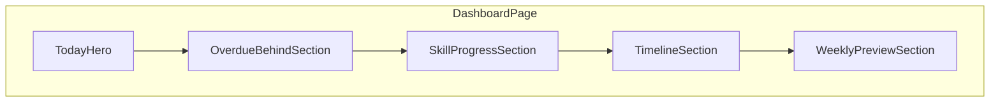
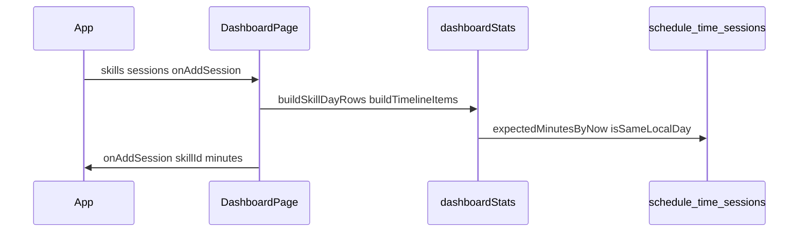

# Phase 6: Dashboard visual system

## Goals and constraints

- **In scope**: Visual layout and summaries on [DashboardPage.tsx](src/pages/DashboardPage.tsx) using existing `skills`, `sessions`, and weekly `schedule` blocks.
- **Out of scope**: Auth, [remoteStorage.ts](src/core/remoteStorage.ts), [storage.ts](src/core/storage.ts) sync policy, [App.tsx](src/App.tsx) mutation pipeline, new chart libraries, XP/reminders.
- **Boundaries** (per [docs/architecture.md](docs/architecture.md)): Pages stay presentational; pure math moves to `src/core/`; shared styling stays in [appStyles.ts](src/ui/appStyles.ts).
- **No new dependencies** unless a future step proves CSS-only visuals insufficient (not expected for Phase 6).
- Follow [PROJECT_RULES.md](PROJECT_RULES.md) and [SECURITY_RULES.md](SECURITY_RULES.md): semantic HTML, keyboard-accessible controls, no new env vars or client secrets.

---

## Current state (baseline)

[DashboardPage.tsx](src/pages/DashboardPage.tsx) (~358 lines) already computes:

| Derived data | Logic location | Used for |
|--------------|----------------|----------|
| Per-skill `todayMinutes`, `expectedByNow`, `status` (`idle` \| `onTrack` \| `overdue`) | `rows` useMemo | All skills list, overdue filter |
| `timelineItems` with `BlockStatus` | `timelineItems` useMemo | Today’s scheduled blocks |
| Quick log (`onAddSession`) | Local state + buttons | Overdue + timeline rows |

Placeholder copy still says “Dashboard (Phase 1)” and “Next we’ll add…”. Timeline is nested inside “All skills today” (structural smell).

Duplication note: today-minute filtering uses `startedAtIso >= startOfToday.toISOString()` in Dashboard and [SkillEditor.tsx](src/components/skills/SkillEditor.tsx), while [sessions.ts](src/core/sessions.ts) uses `isSameLocalDay` + `startOfTodayLocal()` (more correct across timezones). Phase 6 should **centralize** today/week session aggregation in core helpers and reuse them in the dashboard (SkillEditor alignment optional follow-up to keep diff small).

Existing primitives to reuse (do not reimplement):

- [schedule.ts](src/core/schedule.ts): `weekdayFromDate`, `expectedMinutesByNow`, `parseHHMMToMinutes`, `addMinutesToHHMM`, `BlockStatus`, `CompletionStatus`
- [sessions.ts](src/core/sessions.ts): `minutesTodayForSkill` pattern
- [time.ts](src/core/time.ts): `startOfTodayLocal`, `isSameLocalDay`
- [ui/format.ts](src/ui/format.ts): `priorityEmoji`
- [ui/appStyles.ts](src/ui/appStyles.ts): `statusPill`, `statusOnTrack`, `statusOverdue`, `listRow`, `smallBtn`

---

## Proposed dashboard sections (top → bottom)

Mobile-first: single column, `flexWrap` on rows, full-width progress bars, touch-friendly `+15` / `+30` (min ~44px tap targets via padding in new styles).



### 1. Today hero (`TodayHero`)

**Purpose**: Immediate “how is my day going?” scan.

**Content**:

- **Daily total**: sum of minutes logged today across all skills.
- **Status chips**: counts — e.g. `N on track`, `M overdue`, `K idle` (from existing `CompletionStatus`).
- **Optional mini bar**: total today vs **aggregate target** — sum of `dailyGoalMinutes` where set; if no goals, use sum of **planned minutes today** (all blocks for current weekday). Cap bar at 100% for display.

**Empty state**: unchanged guidance (“Go to Skills…”) when `skills.length === 0`.

### 2. Overdue / behind (`OverdueBehindSection`)

**Purpose**: Action-oriented block (keep current behavior).

**Content**:

- List skills with `status === "overdue"` (same rule as today: `todayMinutes < expectedMinutesByNow` when `expectedByNow > 0`).
- Per row: name, priority emoji, today vs expected, **quick log** (extracted component).
- Celebratory empty state when none overdue.

**Note**: Timeline rows use per-block `behind`; hero/overdue use skill-level overdue. Both stay; do not merge semantics.

### 3. Today progress by skill (`SkillProgressSection`)

**Purpose**: Visual per-skill progress (main new UI).

**Per skill row**:

- Name + priority + status pill (reuse existing pill styles).
- **Progress bar** (CSS `div` track + fill, no library):
  - **Numerator**: `todayMinutes`
  - **Denominator** (first match): `skill.dailyGoalMinutes` → else **planned minutes today** (sum of today’s blocks) → else hide bar and show text-only stats
  - **Label**: `45m / 60m` via new `formatMinutes` in [format.ts](src/ui/format.ts) (e.g. `90` → `1h 30m`, `45` → `45m`)
- Secondary line: `Expected by now: Xm` (schedule-aware) + goal if set.

Sort: same as today — priority 1→4, then name.

### 4. Scheduled timeline (`TimelineSection`)

**Purpose**: Time-ordered day plan (extract existing list, improve scanability).

**Content**:

- Move out of “All skills today” wrapper; own section card.
- Each item: time range, skill, block minutes, logged-so-far, status pill, `+15` / `+30`.
- **Light visual upgrade** (still no deps): left border color by `BlockStatus` (`done` green tint, `behind` red, `upcoming` neutral, `inProgress` green); optional “now” hint when `inProgress` exists (text only, no live clock interval).

Logic: keep existing `timelineItems` algorithm (cumulative planned vs `loggedSoFar`); only relocate to core.

### 5. Weekly preview (`WeeklyPreviewSection`) — simple

**Purpose**: Glance at week without charts.

**Scope (keep minimal)**:

- **Week window**: Monday 00:00 local → Sunday end (matches [state.ts](src/core/state.ts) weekday order).
- **Per skill** (only if `weeklyGoalMinutes` is set): `minutesThisWeek / weeklyGoalMinutes` + thin progress bar.
- **Optional aggregate row**: total minutes this week (all skills) as a single stat; skip per-weekday breakdown unless trivial after hero ships.

Hide section entirely when no skill has `weeklyGoalMinutes`.

---

## Data calculations needed

Add [src/core/dashboardStats.ts](src/core/dashboardStats.ts) (pure functions + exported types). Suggested API:

| Function / type | Inputs | Output |
|-----------------|--------|--------|
| `SkillDayRow` | — | `{ skill, todayMinutes, expectedByNow, plannedTodayMinutes, status, progressTargetMinutes, progressPercent }` |
| `buildSkillDayRows(skills, sessions, now?)` | skills, sessions | `SkillDayRow[]` |
| `totalMinutesToday(sessions, now?)` | sessions | number |
| `plannedMinutesForDay(skill, dayKey)` | skill, weekday | sum of block minutes |
| `aggregateProgressTarget(rows)` | rows | number (sum of per-row targets for hero bar) |
| `TimelineItem` | — | same fields as today’s `timelineItems` entries |
| `buildTimelineItems(skills, sessions, now?)` | skills, sessions | `TimelineItem[]` |
| `minutesThisWeekForSkill(sessions, skillId, now?)` | sessions, skillId | number |
| `startOfWeekLocal(date?)` | date | Date (Monday 00:00 local) |
| `isInLocalWeek(iso, weekStart)` | iso, weekStart | boolean |

**Status rules** (unchanged):

```ts
expectedByNow = expectedMinutesByNow(blocks, now)
status = expectedByNow === 0 ? "idle" : todayMinutes >= expectedByNow ? "onTrack" : "overdue"
```

**Progress percent** (display only):

```ts
target = dailyGoalMinutes ?? plannedTodayMinutes
percent = target > 0 ? Math.min(100, Math.round((todayMinutes / target) * 100)) : null
```

**Today minutes**: implement `minutesOnLocalDay(sessions, day: Date, skillId?: string)` using `isSameLocalDay` (fixes subtle UTC-midnight mismatch vs current `toISOString()` cutoff).

**Tests**: add `src/core/dashboardStats.test.ts` for row building, totals, week boundaries, and percent capping (fast unit tests; no React).

---

## Proposed component structure

```
src/
  core/
    dashboardStats.ts       # NEW — all dashboard derivations
    dashboardStats.test.ts  # NEW
  components/
    dashboard/
      TodayHero.tsx
      OverdueBehindSection.tsx
      SkillProgressSection.tsx
      SkillProgressRow.tsx
      TimelineSection.tsx
      TimelineRow.tsx
      WeeklyPreviewSection.tsx
      QuickLogControls.tsx    # input + Log +15 +30 (shared)
      ProgressBar.tsx         # presentational: value, max, label, aria
  pages/
    DashboardPage.tsx         # orchestrator: useMemo → stats, compose sections
  ui/
    appStyles.ts              # dashboard tokens: statCard, progressTrack, progressFill, section
    format.ts                 # formatMinutes()
```

**Responsibilities**:

- **DashboardPage**: call `buildSkillDayRows` / `buildTimelineItems` in `useMemo`; pass data + `onAddSession`; own `logBySkill` state OR delegate to `QuickLogControls` per row.
- **Section components**: props in, no `saveAppData` / no Supabase.
- **ProgressBar**: `role="progressbar"`, `aria-valuenow`, `aria-valuemin`, `aria-valuemax`, visible label.

**App.tsx**: **no changes** (same props: `skills`, `sessions`, `onAddSession`).

---

## Files to change

| File | Change |
|------|--------|
| [src/core/dashboardStats.ts](src/core/dashboardStats.ts) | **Create** — extract + extend calculations |
| [src/core/dashboardStats.test.ts](src/core/dashboardStats.test.ts) | **Create** — unit tests |
| [src/components/dashboard/*.tsx](src/components/dashboard/) | **Create** — 8–9 small components |
| [src/pages/DashboardPage.tsx](src/pages/DashboardPage.tsx) | **Refactor** — compose sections; remove Phase 1 placeholder |
| [src/ui/appStyles.ts](src/ui/appStyles.ts) | **Extend** — dashboard section + progress bar styles (keep existing keys) |
| [src/ui/format.ts](src/ui/format.ts) | **Extend** — `formatMinutes(n: number)` |
| [docs/architecture.md](docs/architecture.md) | **Update** — `components/dashboard/` in folder table |

**Explicitly do not touch**: `src/auth/*`, `src/core/remoteStorage.ts`, `src/core/storage.ts`, `src/lib/*`, `src/App.tsx` (unless a typo fix unrelated to phase).

---

## Step-by-step implementation order

1. **`core/dashboardStats.ts` + tests** — Move `rows` and `timelineItems` logic from DashboardPage; add `totalMinutesToday`, `plannedMinutesForDay`, week helpers, `formatMinutes` target fields. Green tests with `npm test`.
2. **`ui/format.ts` + `ui/appStyles.ts`** — `formatMinutes`; dashboard layout tokens (stat grid, progress track/fill, section spacing). Verify mobile at ~375px width mentally / devtools.
3. **`ProgressBar.tsx` + `QuickLogControls.tsx`** — Leaf components with a11y attributes; wire to existing commit pattern.
4. **`TodayHero.tsx`** — Consume aggregates from rows + `totalMinutesToday`.
5. **`OverdueBehindSection.tsx`** — Filter `status === "overdue"`; reuse QuickLogControls.
6. **`SkillProgressRow.tsx` + `SkillProgressSection.tsx`** — Bars + sorted list.
7. **`TimelineRow.tsx` + `TimelineSection.tsx`** — Port timeline UI; border accent by status.
8. **`WeeklyPreviewSection.tsx`** — Only if `weeklyGoalMinutes` present on any skill.
9. **`DashboardPage.tsx` recompose** — Remove nested timeline-in-all-skills; delete “Phase 1” copy; title e.g. “Today”.
10. **Docs** — Short architecture.md addition for dashboard components.
11. **Validate** — `npm run lint`, `npm test`, `npm run build`; manual smoke (checklist below).

Deliver in **1–2 PRs** if preferred: (1) core + tests + format/styles, (2) components + page recompose.

---

## Validation checklist

**Automated**

- [ ] `npm test` — `dashboardStats` cases pass
- [ ] `npm run lint`
- [ ] `npm run build`

**Functional (unchanged sync/storage)**

- [ ] Sign in → dashboard loads after initial sync (no App/auth changes)
- [ ] Log session from overdue row → minutes update; cloud save still debounces
- [ ] `+15` / `+30` on timeline still call `onAddSession` only
- [ ] Skills with no blocks today → `idle`, no false overdue
- [ ] Skill with blocks behind schedule → appears in overdue when `expectedByNow > todayMinutes`
- [ ] Timeline block statuses: upcoming / in progress / done / behind match pre-refactor behavior for same fixture data

**Visual / UX**

- [ ] Hero shows correct daily total and on-track/overdue counts
- [ ] Progress bars match goal, or planned minutes fallback, or hidden when no target
- [ ] Weekly section hidden when no weekly goals; correct ratio when goals exist
- [ ] Mobile (~375px): no horizontal scroll; buttons wrap; progress bars full width
- [ ] Keyboard: Tab through log inputs and buttons; progress bars not focus traps

**Regression guards**

- [ ] No edits to `remoteStorage.ts` / auth modules
- [ ] Export/import backup still works (unaffected code paths)
- [ ] Empty skills list still shows onboarding message

---

## Architecture diagram (data flow unchanged)



---

## Risk notes (low)

- **Timezone**: consolidating on `isSameLocalDay` may change edge-case counts vs ISO cutoff; tests should document local-day behavior; acceptable improvement.
- **Weekly goals vs schedule**: weekly preview uses **logged sessions only**, not planned blocks—document in UI subtitle (“Logged this week”) to avoid confusion.
- **Scope creep**: defer charts, “current time” live indicator, and SkillEditor deduplication unless a follow-up task is opened.
