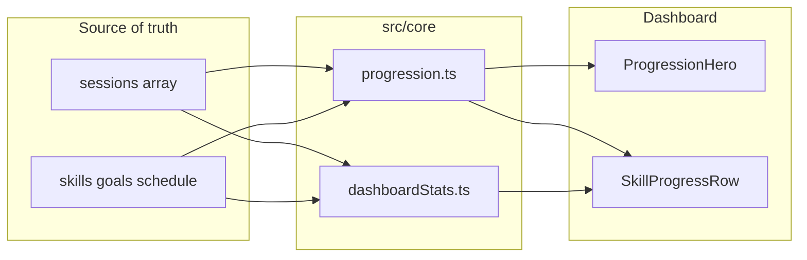
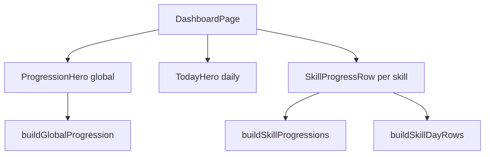
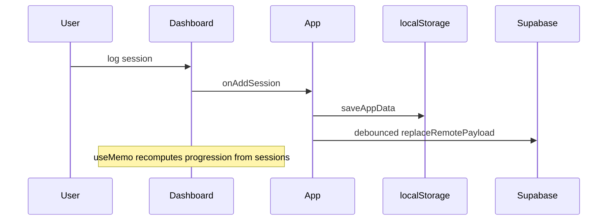

# Phase 7: XP, leveling, and streak system

## Goals and constraints

- **In scope**: Motivating game-like progression per skill; global consistency streak; dashboard visuals; pure core math + unit tests.
- **Out of scope**: DB migrations, new Supabase tables/columns, changes to [`remoteStorage.ts`](src/core/remoteStorage.ts) / [`storage.ts`](src/core/storage.ts) sync policy, [`App.tsx`](src/App.tsx) mutation pipeline, new chart libraries, XP bonuses/cheats, streak freeze/grace tokens.
- **Follow**: [PROJECT_RULES.md](PROJECT_RULES.md), [SECURITY_RULES.md](SECURITY_RULES.md), [docs/architecture.md](docs/architecture.md) — pages presentational; domain rules in `src/core/`; reuse [`ProgressBar`](src/components/dashboard/ProgressBar.tsx) and local-day helpers from [`dashboardStats.ts`](src/core/dashboardStats.ts) / [`time.ts`](src/core/time.ts).
- **User choices** (confirmed): **per-skill + global** streaks in the hero; streak active day = **meet `dailyGoalMinutes` when set, else any minutes > 0**.

---

## Recommendation: derived, not persisted

| Approach | Verdict |
|----------|---------|
| **Derived from `sessions`** | **Default for Phase 7** — single source of truth; deleting/editing sessions correctly adjusts XP/levels; no mapper/sync/version drift. |
| Persist XP/level/streak on `Skill` or new tables | **Defer** — requires migration, merge rules on sync, and backfill; conflicts with “avoid changing sync/storage architecture.” |
| Persist only “cosmetic” meta in `overrides` | **Defer** — use if you later add streak freezes or manual badges. |

**XP rule (v1)**: `totalXp = sum(session.minutes)` per skill (1 XP = 1 minute). Global XP = sum across all skills (optional hero stat).

Levels and streaks are **recomputed** on each dashboard render via `useMemo` (same pattern as [`DashboardPage.tsx`](src/pages/DashboardPage.tsx) today). Session count is expected to stay small; if it grows, add a memoized index by `skillId` + local day inside core (still no persistence).



---

## Data model changes

### No Supabase / `AppPayload` schema change (v1)

- [`model.ts`](src/core/model.ts): **unchanged** (`Skill`, `Session`, `AppPayload` stay as-is).
- [`dbMappers.ts`](src/core/dbMappers.ts) / migrations: **no changes**.
- Backup export/import: unchanged; imported sessions automatically affect derived XP.

### New core types only (not stored)

Add [`src/core/progression.ts`](src/core/progression.ts):

```ts
export type SkillProgression = {
  skill: Skill;
  totalXp: number;           // lifetime minutes
  level: number;             // 1-based display level
  xpIntoLevel: number;       // progress within current level
  xpToNextLevel: number;     // span of current level band
  levelProgressPercent: number; // 0–100 for bar
  currentStreak: number;
  longestStreak: number;     // derived for delight; no DB
  streakActiveToday: boolean; // met rule today
};

export type GlobalProgression = {
  totalXp: number;
  level: number;
  xpIntoLevel: number;
  xpToNextLevel: number;
  levelProgressPercent: number;
  currentStreak: number;
  longestStreak: number;
  streakActiveToday: boolean;
};
```

**Shared helpers** (export for tests):

- `totalXpForSkill(sessions, skillId)`
- `levelFromTotalXp(totalXp, curve)` / inverse thresholds
- `isStreakActiveDay(skill, sessionsOnDayMinutes, plannedMinutes?)` — implements daily-goal rule
- `activeLocalDayKeys(sessions, skillId?, predicate)` — `YYYY-MM-DD` in local TZ
- `computeCurrentStreak(activeDays, now)` — consecutive calendar days ending today or yesterday
- `computeLongestStreak(activeDays)`
- `buildSkillProgressions(skills, sessions, now?)`
- `buildGlobalProgression(skills, sessions, now?)`

Reuse [`minutesOnLocalDay`](src/core/dashboardStats.ts) pattern (or extract a tiny shared `sessionsByLocalDay` helper in `progression.ts` to avoid circular imports — prefer **duplicating the small filter** or moving `minutesOnLocalDay` to [`sessions.ts`](src/core/sessions.ts) in a tiny prereq PR if needed).

---

## Level formula options

Pick **one** curve in `progression.ts` as `LEVEL_CURVE` constants; unit-test threshold boundaries.

| Option | Formula (cumulative XP to reach level L) | Feel | Recommendation |
|--------|------------------------------------------|------|----------------|
| **A. Linear bands** | Level L starts at `(L-1) * B` XP; next level at `L * B` (e.g. `B = 60`) | ~1 hour per level; predictable | **Recommended v1** — easy to explain (“Level 5 ≈ 4h logged”) |
| **B. Triangular / escalating** | XP to go from L→L+1 = `B * L` (total to level L = `B * L*(L-1)/2`) | Slower high levels | Good if levels feel too easy after month 1 |
| **C. Lookup table** | Fixed array `[0, 60, 150, 300, …]` | Tunable by hand | Use if playtesting shows A/B wrong |

**Display**: Level **starts at 1** with `0` XP (not level 0). Bar shows `xpIntoLevel / xpToNextLevel` toward next level.

**Global level**: Same curve applied to **sum of all session minutes** (account XP), independent of per-skill levels.

---

## Streak calculation strategy

### Per-skill streak

1. For each skill, group sessions by **local calendar day** (`isSameLocalDay` / local midnight — same semantics as [`dashboardStats.ts`](src/core/dashboardStats.ts)).
2. Sum minutes per day for that skill.
3. **Active day** (your rule):
   - If `skill.dailyGoalMinutes` is set and `> 0`: day counts iff `dayMinutes >= dailyGoalMinutes`.
   - Else: day counts iff `dayMinutes > 0`.
4. Build sorted set of active day keys (`YYYY-MM-DD`).
5. **Current streak**: Walk backward from **anchor day**:
   - If today is active → anchor = today.
   - Else if yesterday is active → anchor = yesterday (streak still “alive” until end of today).
   - Else → `currentStreak = 0`.
   - Count consecutive active days backward from anchor.
6. **Longest streak**: Max run over full history (single pass over sorted active days).

### Global streak

- **Active day** if **any** skill satisfies the per-skill rule that day (OR across skills).
- Same anchor/backward walk on the union of global active days.
- Show in hero alongside per-skill highlights (e.g. “Global streak: 12 days”).

### UI copy (avoid confusion)

- Subtitle: “Streak days count when you hit your daily goal, or any practice if no goal is set.”
- If today not yet active: show streak count but pill “Log today to extend” (lenient, motivating).

### Edge cases (see Risks)

- Skill with no sessions ever → streak `0`, level `1`.
- Goal changed retroactively → streak history **recalculates** (derived); acceptable for v1; document in code comment.
- Deleted session → may break streak retroactively (correct for derived model).

---

## Dashboard integration

Placement (top → bottom) in [`DashboardPage.tsx`](src/pages/DashboardPage.tsx):

1. **`ProgressionHero`** (new) — global level, global XP bar, **global streak**, optional “total XP today” from existing `totalMinutesToday`.
2. Existing **`TodayHero`** — keep daily on-track/overdue (orthogonal metrics).
3. Rest unchanged order: Overdue → Timeline → Skill progress → Weekly.

**Per-skill** in [`SkillProgressRow.tsx`](src/components/dashboard/SkillProgressRow.tsx):

- Badge: `Lv 4` + streak flame/label `🔥 7` when `currentStreak > 0`.
- Second **ProgressBar** (level toward next) — reuse [`ProgressBar.tsx`](src/components/dashboard/ProgressBar.tsx) with `aria-label` like “SQL level 4 progress”.
- Keep existing today-goal bar (do not conflate “today minutes” with “lifetime XP”).

**Optional Phase 7.1** (small follow-up): compact level/streak line on [`SkillEditor.tsx`](src/components/skills/SkillEditor.tsx) — props-only, no new mutations.



**No `App.tsx` changes** — still passes `skills`, `sessions`, `onAddSession` only.

---

## New / modified files

| File | Action |
|------|--------|
| [`src/core/progression.ts`](src/core/progression.ts) | **Create** — XP, levels, streaks, builders |
| [`src/core/progression.test.ts`](src/core/progression.test.ts) | **Create** — deterministic `now` + `localIso` fixtures (mirror [`dashboardStats.test.ts`](src/core/dashboardStats.test.ts)) |
| [`src/components/dashboard/ProgressionHero.tsx`](src/components/dashboard/ProgressionHero.tsx) | **Create** — global level, XP bar, global streak |
| [`src/components/dashboard/SkillProgressRow.tsx`](src/components/dashboard/SkillProgressRow.tsx) | **Extend** — level badge, streak, level bar |
| [`src/pages/DashboardPage.tsx`](src/pages/DashboardPage.tsx) | **Wire** — `useMemo` → `buildGlobalProgression` / `buildSkillProgressions`; pass to hero/rows |
| [`src/ui/format.ts`](src/ui/format.ts) | **Extend** — `formatLevel(n)`, `formatXp(n)` (can alias `formatMinutes` or show raw “1,240 XP”) |
| [`src/ui/appStyles.ts`](src/ui/appStyles.ts) | **Extend** — tokens: `levelBadge`, `streakPill`, optional `progressFillXp` tint |
| [`docs/architecture.md`](docs/architecture.md) | **Update** — `progression.ts` + dashboard progression section |

**Do not touch**: `auth/*`, `remoteStorage.ts`, `storage.ts`, `lib/*`, Supabase migrations (unless you explicitly choose persisted meta later).

---

## Testing strategy

**Unit tests** (`progression.test.ts`) — fast, no React:

| Area | Cases |
|------|--------|
| XP | Sum minutes per skill; ignore other skills |
| Levels | Boundaries: 0 XP → L1; exactly at threshold → next level; max bar 100% |
| Streak rule | Goal set: 29/30 min does not count; 30/30 counts; no goal: 1 min counts |
| Current streak | Active today; active yesterday only; gap breaks; empty history |
| Global streak | Skill A active Mon, Skill B Tue → global continues |
| Longest streak | Multiple disjoint runs |
| Timezone | Session near local midnight (documented fixture TZ) |
| Goal change | Same sessions, stricter goal → fewer active days (document expected behavior) |

**Regression**: `npm test`, `npm run lint`, `npm run build`.

**Manual smoke** (post-implementation):

- Log session → XP bar and level update without refresh issues.
- Delete session → XP/streak decrease.
- Skill with daily goal: streak increments only when goal met.
- Global streak increments when any skill hits its rule.
- Sign-in / sync / export-import unchanged.

---

## Step-by-step implementation order

1. **`progression.ts` + tests** — XP sums, level curve (pick **Linear bands** unless playtest dictates otherwise), streak helpers, `buildSkillProgressions` / `buildGlobalProgression`. Green `npm test`.
2. **`ui/format.ts`** — `formatLevel`, `formatXp` (or reuse `formatMinutes` for XP labels).
3. **`appStyles.ts`** — progression tokens (badges, streak pill).
4. **`ProgressionHero.tsx`** — global level bar + global streak + short explainer line.
5. **`SkillProgressRow.tsx`** — per-skill level + streak + level `ProgressBar`.
6. **`DashboardPage.tsx`** — compose hero + pass progression into rows (map by `skill.id`).
7. **`docs/architecture.md`** — document derived progression and streak rules.
8. **Validate** — automated + manual checklist above.

Deliver in **1–2 PRs**: (1) core + tests + format/styles, (2) dashboard UI + docs.

---

## Risks and edge cases

| Risk | Mitigation |
|------|------------|
| **Retroactive goal changes** alter streak history | Document; derived model is intentional; optional v2 snapshot not in scope |
| **Session delete/edit** lowers level / breaks streak | Expected; show copy “based on logged history” |
| **Backdated `startedAtIso`** (client-trusted) | Same trust model as today; no new attack surface |
| **Performance** scanning all sessions | `useMemo` on dashboard; O(sessions) acceptable; index by day if needed later |
| **Conflating daily bar vs level bar** | Separate labels and `aria-label`s; hero keeps both “today” and “lifetime” |
| **Skill with goal but 0 minutes today** | Streak can still be non-zero from yesterday; pill nudges to log today |
| **No `dailyGoalMinutes`** | Falls back to any minutes — aligns with streak rule choice |
| **Weekly-only workers** | Streak is daily-goal based, not weekly; weekly section stays separate |
| **Import old backup** | Large XP jump is correct; no migration |
| **Circular imports** with `dashboardStats` | Keep progression independent; share only `time.ts` / small session filters |

---

## Architecture alignment (unchanged data flow)



Phase 7 adds a **read-only derivation path** parallel to [`dashboardStats.ts`](src/core/dashboardStats.ts); it does not change write paths.
