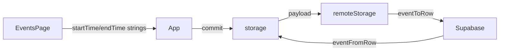

# Phase 8.1: Optional Event Times

## Current state

Phase 8 is complete. [`LifeEvent`](src/core/model.ts) stores `date: "YYYY-MM-DD"` only. [`EventsPage`](src/pages/EventsPage.tsx) sorts by `date` string compare. [`dbMappers.ts`](src/core/dbMappers.ts) already has `HHMM_RE` and `isIsoDate` used for schedule blocks and event dates. [`remoteStorage.ts`](src/core/remoteStorage.ts) needs no structural changes — it delegates to `eventToRow` / `eventFromRow`.



---

## SQL migration

**New file:** [`supabase/migrations/20260527100000_event_times.sql`](supabase/migrations/20260527100000_event_times.sql)

Additive `ALTER TABLE` only — do not edit the existing [`20260527000000_events.sql`](supabase/migrations/20260527000000_events.sql).

```sql
ALTER TABLE public.events
  ADD COLUMN start_time text NULL,
  ADD COLUMN end_time text NULL;

ALTER TABLE public.events
  ADD CONSTRAINT events_start_time_hhmm_chk
    CHECK (start_time IS NULL OR start_time ~ '^([01][0-9]|2[0-3]):[0-5][0-9]$'),
  ADD CONSTRAINT events_end_time_hhmm_chk
    CHECK (end_time IS NULL OR end_time ~ '^([01][0-9]|2[0-3]):[0-5][0-9]$'),
  ADD CONSTRAINT events_end_requires_start_chk
    CHECK (end_time IS NULL OR start_time IS NOT NULL),
  ADD CONSTRAINT events_end_after_start_chk
    CHECK (
      start_time IS NULL
      OR end_time IS NULL
      OR end_time >= start_time
    );
```

- Both columns nullable — existing rows stay valid with `NULL`
- Zero-padded `HH:MM` string compare is safe for same-day ordering in SQL
- No RLS/index changes required; existing `events_user_id_date_idx` remains sufficient

---

## Type / model changes

In [`src/core/model.ts`](src/core/model.ts), extend `LifeEvent`:

```typescript
export type LifeEvent = {
  // ...existing fields...
  startTime?: string; // "HH:MM", optional
  endTime?: string;   // "HH:MM", optional; requires startTime
};
```

No changes to `AppPayload`, `defaultPayload()`, or auth/sync flow.

---

## Mapper validation changes

### [`src/core/dbMappers.ts`](src/core/dbMappers.ts)

**`EventRow`** — add:
- `start_time: string | null`
- `end_time: string | null`

**New helper** (mirror `isIsoDate`):
- `isHhMm(value: string): boolean` — uses existing `HHMM_RE` plus hour/minute range check

**`assertValidEvent`** rules:
- `startTime` optional; if present must pass `isHhMm`
- `endTime` optional; if present `startTime` must also be present
- if both present, `endTime >= startTime` (compare via existing [`parseHHMMToMinutes`](src/core/schedule.ts) — no `Date` objects, storage stays string-based)
- reject `endTime` alone

**`eventToRow` / `eventFromRow`**:
- Map `startTime` ↔ `start_time`, `endTime` ↔ `end_time`
- Empty/whitespace → `null` in DB; `null` → omit optional field on domain object (same pattern as `personName`)

[`remoteStorage.ts`](src/core/remoteStorage.ts): no code changes (upsert passes through updated row shape automatically).

[`storage.ts`](src/core/storage.ts): no changes — old JSON events without time fields hydrate as date-only events.

---

## Sorting rules

Extract a small pure module [`src/core/events.ts`](src/core/events.ts) (reusable for future dashboard widget):

```typescript
export function compareLifeEventsWithinDay(a: LifeEvent, b: LifeEvent): number
export function sortUpcomingEvents(events: LifeEvent[]): LifeEvent[]
export function sortPastEvents(events: LifeEvent[]): LifeEvent[]
```

**Within-day comparator** (same for upcoming and past):
1. Timed events (`startTime` set) before untimed events
2. Among timed events: ascending `startTime` (`localeCompare` on zero-padded `HH:MM`)
3. Among untimed events: stable tiebreaker by `title`, then `id`

**Upcoming** (`date >= today`): ascending by `date`, then `compareLifeEventsWithinDay`

**Past** (`date < today`): descending by `date`, then `compareLifeEventsWithinDay` (within a day, morning still before afternoon)

[`EventsPage.tsx`](src/pages/EventsPage.tsx) replaces inline `[...events].sort(...)` with `sortUpcomingEvents` / `sortPastEvents`.

---

## EventsPage UI changes

In [`src/pages/EventsPage.tsx`](src/pages/EventsPage.tsx):

**Form state** — add optional `startTime: string` and `endTime: string` (empty string = no time).

**Form fields** — two optional `<input type="time">` inputs beside the date field, using existing `styles.timeInput` (same as [`SkillEditor`](src/components/skills/SkillEditor.tsx)).

**Form validation** (before `onAdd` / `onUpdate`):
- If `endTime` set without `startTime` → error
- If both set and `endTime < startTime` → error
- Trim empty time inputs to `undefined` (do not store `""`)

**List display** — update `EventRow`:
- Date line shows formatted date plus time when present, e.g. `Sat, Jun 15, 2026 · 14:00–16:00` or `Sat, Jun 15, 2026 · 09:00` (start only)
- Untimed events show date only (unchanged)

**[`App.tsx`](src/App.tsx)** — mirror optional-field handling in `addEvent` / `updateEvent`:
- Include `startTime` / `endTime` when non-empty
- `delete nextEvent.startTime` / `delete nextEvent.endTime` when cleared on update

---

## Backward compatibility

| Source | Behavior |
|--------|----------|
| Existing Supabase rows | `start_time` / `end_time` are `NULL`; mapper omits optional fields |
| Existing localStorage payloads | No `startTime`/`endTime` keys; events remain date-only |
| Export/import | `normalizePayload` passes through event objects unchanged |
| Sync architecture | Unchanged — same `commit` → debounced `replaceRemotePayload` flow |

---

## Files to change

| File | Change |
|------|--------|
| **New** `supabase/migrations/20260527100000_event_times.sql` | Add nullable time columns + CHECK constraints |
| [`src/core/model.ts`](src/core/model.ts) | Add optional `startTime`, `endTime` |
| [`src/core/dbMappers.ts`](src/core/dbMappers.ts) | Extend `EventRow`, validation, mappers |
| [`src/core/dbMappers.test.ts`](src/core/dbMappers.test.ts) | Round-trip, invalid time, end-without-start, end-before-start |
| **New** [`src/core/events.ts`](src/core/events.ts) | Sort/compare pure functions |
| **New** [`src/core/events.test.ts`](src/core/events.test.ts) | Sorting scenarios |
| [`src/pages/EventsPage.tsx`](src/pages/EventsPage.tsx) | Form inputs, validation, display, use sort helpers |
| [`src/App.tsx`](src/App.tsx) | Pass through / clear optional time fields |

---

## Implementation order

1. SQL migration — define DB contract first
2. `model.ts` — add optional time fields to `LifeEvent`
3. `dbMappers.ts` — `isHhMm`, `EventRow` columns, validation, mapper updates
4. `dbMappers.test.ts` — mapper tests
5. `events.ts` + `events.test.ts` — sorting logic with unit tests
6. `App.tsx` — optional field passthrough on add/update
7. `EventsPage.tsx` — form, validation, display, wired sorting
8. Run `npm test` and `npm run build`

---

## Validation checklist

- [ ] Migration is additive only (`ALTER TABLE ADD COLUMN`); safe on production with existing event rows
- [ ] `dbMappers.test.ts`: round-trip event with `startTime` + `endTime`
- [ ] `dbMappers.test.ts`: rejects `endTime` without `startTime`
- [ ] `dbMappers.test.ts`: rejects invalid `HH:MM` and `endTime < startTime`
- [ ] `events.test.ts`: same-day sort — timed ascending, untimed after timed
- [ ] `events.test.ts`: upcoming sorts by date asc; past by date desc
- [ ] Old events (no time fields) load, display, and sync without errors
- [ ] EventsPage clears times on edit-save when inputs emptied
- [ ] No `Date` objects used for storage — only string `date` + optional `HH:MM`
- [ ] `npm test` and `npm run build` pass
- [ ] Apply migration before testing remote sync: `supabase db push`
