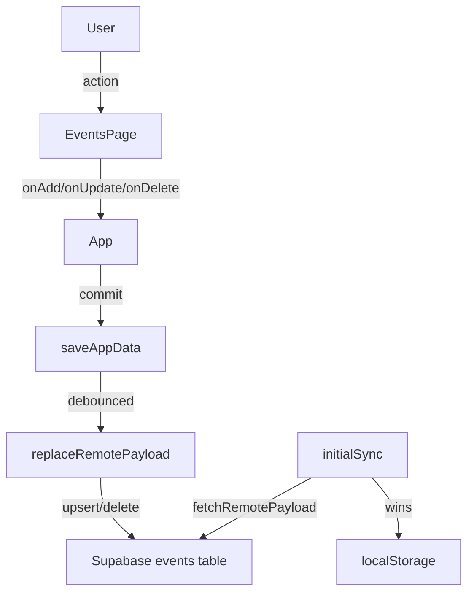

# Phase 8: Calendar & Life Events Page

## Architecture summary



Navigation is a `useState<Page>` switch in `App.tsx` — no router changes needed.

---

## Data model changes

### New domain type (`src/core/model.ts`)

```typescript
export type EventType =
  | "birthday"
  | "hangout"
  | "trip"
  | "holiday"
  | "deadline"
  | "other";

export type LifeEvent = {
  id: string;            // UUID
  title: string;
  date: string;          // ISO date "YYYY-MM-DD" (date only, no time)
  type: EventType;
  personName?: string;   // optional — e.g. friend's name for a birthday
  notes?: string;
  reminder: boolean;     // flag; reminder delivery is out of scope for now
  createdAtIso: string;
  updatedAtIso: string;
};
```

Extend `AppPayload`:
```typescript
export type AppPayload = {
  skills: Skill[];
  sessions: Session[];
  overrides: Array<unknown>;
  events: LifeEvent[];   // new field; default []
};
```

`defaultPayload()` in [`src/core/state.ts`](src/core/state.ts) needs `events: []` added.

---

## Supabase schema

New migration file: `supabase/migrations/20260527000000_events.sql`

- Table `public.events`:
  - `id uuid PRIMARY KEY DEFAULT gen_random_uuid()`
  - `user_id uuid NOT NULL REFERENCES auth.users ON DELETE CASCADE`
  - `title text NOT NULL CHECK (char_length(title) > 0)`
  - `date date NOT NULL` (Postgres `date` type)
  - `type text NOT NULL CHECK (type IN ('birthday','hangout','trip','holiday','deadline','other'))`
  - `person_name text`
  - `notes text`
  - `reminder boolean NOT NULL DEFAULT false`
  - `created_at timestamptz NOT NULL DEFAULT now()`
  - `updated_at timestamptz NOT NULL DEFAULT now()`
- RLS: mirror existing pattern — `SELECT/INSERT/UPDATE/DELETE` where `user_id = auth.uid()`
- Index: `events_user_id_date_idx` on `(user_id, date)`
- Trigger: auto-update `updated_at` on row update (mirror `skills_set_updated_at`)

---

## Mapper / storage changes

### `src/core/dbMappers.ts`

Add `EventRow` DB row type and four functions:
- `eventToRow(event, userId)` → `EventRow` (validates fields, maps camelCase → snake_case; `date` stays as ISO string, Postgres accepts `"YYYY-MM-DD"`)
- `eventFromRow(row)` → `LifeEvent` (maps snake_case → camelCase; validates with existing `assertUuid`, `assertIsoTimestamp` helpers; add `assertIsoDate` for `date`)
- Extend `payloadFromRows` to accept `eventRows` and include them in the returned `AppPayload`
- Extend `validatePayloadForUpload` to validate `events` array

### `src/core/remoteStorage.ts`

- `fetchRemotePayload`: add parallel `SELECT * FROM events WHERE user_id = $userId`; pass rows to `payloadFromRows`
- `replaceRemotePayload`: upsert `events` rows (same `onConflict: "id"` pattern); delete events with `id NOT IN (...)` — mirror the existing skills/sessions/overrides pattern

### `src/core/storage.ts`

`loadAppData` already reads the stored JSON blob; because `events` defaults to `[]` in `defaultPayload()`, old payloads with no `events` key will hydrate cleanly. No migration needed.

---

## CRUD in `App.tsx`

Add three handlers (mirror `addSkill`, `updateSkill`, `deleteSkill`):
- `addEvent(event: Omit<LifeEvent, "id" | "createdAtIso" | "updatedAtIso">)`
- `updateEvent(updated: LifeEvent)`
- `deleteEvent(id: string)`

Each calls `commit({ ...appData, payload: { ...payload, events: [...] } })`.

---

## Page type

[`src/pages/types.ts`](src/pages/types.ts):
```typescript
export type Page = "dashboard" | "skills" | "events";
```

---

## UI structure

### `src/pages/EventsPage.tsx`

Props: `events: LifeEvent[]`, `onAdd`, `onUpdate`, `onDelete`.

Layout (top to bottom, using existing `styles.*` tokens from [`src/ui/appStyles.ts`](src/ui/appStyles.ts)):
1. **Header** — "Events" title + "Add event" button
2. **Add/Edit form** (inline, toggled by state) — fields: title, date (`<input type="date">`), type (select), personName, notes, reminder (checkbox)
3. **Event list** — sorted by date ascending; group into "Upcoming" and "Past" with a simple date comparison against today; each row shows date, type badge, title, optional person name, reminder indicator, edit/delete actions

No new dependencies — use native `<input type="date">`, the existing style tokens, and standard React state.

### `src/components/layout/AppShell.tsx`

Add a third `<NavButton>` for "Events" (`page === "events"`).

### `src/App.tsx`

Add render block:
```tsx
{page === "events" && (
  <EventsPage
    events={appData.payload.events}
    onAdd={addEvent}
    onUpdate={updateEvent}
    onDelete={deleteEvent}
  />
)}
```

---

## Dashboard integration (deferred)

Upcoming events widget on the dashboard is intentionally deferred to keep this phase small. The data will be available after this phase; a follow-up phase can add an `UpcomingEventsSection` component to `DashboardPage` using the same `useMemo` + pure-function pattern used by the existing dashboard sections. No architectural changes will be needed at that point.

---

## Files to change / create

- **New**: `supabase/migrations/20260527000000_events.sql`
- **New**: `src/pages/EventsPage.tsx`
- **Modified**: `src/core/model.ts` — add `EventType`, `LifeEvent`, extend `AppPayload`
- **Modified**: `src/core/state.ts` — add `events: []` to `defaultPayload()`
- **Modified**: `src/core/dbMappers.ts` — add `EventRow`, mappers, extend `payloadFromRows` + `validatePayloadForUpload`
- **Modified**: `src/core/remoteStorage.ts` — extend fetch + replace to include events table
- **Modified**: `src/App.tsx` — add `addEvent`, `updateEvent`, `deleteEvent`; add events render block
- **Modified**: `src/pages/types.ts` — extend `Page` union
- **Modified**: `src/components/layout/AppShell.tsx` — add Events nav button

---

## Implementation order

1. SQL migration — define schema first so the contract is clear
2. `model.ts` — add types (`EventType`, `LifeEvent`, extend `AppPayload`)
3. `state.ts` — add `events: []` to `defaultPayload()`
4. `dbMappers.ts` — add `EventRow`, mappers, extend `payloadFromRows` + `validatePayloadForUpload`; write unit tests alongside (mirror `dbMappers.test.ts`)
5. `remoteStorage.ts` — extend fetch + replace
6. `App.tsx` — add handlers + render block (wire up but `EventsPage` stub renders "coming soon" initially)
7. `pages/types.ts` + `AppShell.tsx` — expose nav link
8. `EventsPage.tsx` — full UI implementation

---

## Risks & validation checklist

- **Backward compatibility**: old `AppPayload` blobs in localStorage have no `events` key — mitigate by defaulting to `[]` in `defaultPayload()` and a null-coalescing read in `payloadFromRows`
- **Date handling**: store as `"YYYY-MM-DD"` string; Postgres `date` type accepts this; avoid timezone shifting by never converting to a `Date` object in mappers
- **Payload size**: `replaceRemotePayload` does a full replace — already true for skills/sessions; same pattern is safe here
- **RLS correctness**: verify `user_id = auth.uid()` policy is applied to all 4 operations on `events` table
- **Validation checklist**:
  - [ ] `dbMappers.test.ts` — round-trip test for `eventToRow` / `eventFromRow`
  - [ ] `state.ts` — `defaultPayload()` includes `events: []`
  - [ ] Old local storage payload hydrates without errors (no `events` key)
  - [ ] `replaceRemotePayload` does not leave orphaned event rows after delete
  - [ ] `EventsPage` form validates required fields (title, date, type) before calling `onAdd`
  - [ ] Type safety: `AppPayload` change propagates cleanly through TypeScript (no `any` casts)
  - [ ] `Page` union updated and nav renders Events link
  - [ ] SQL migration reviewed before applying to production
