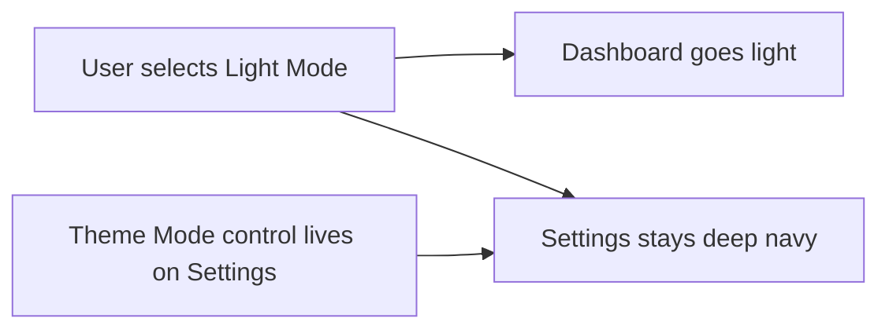

# Phase 37C.1 — Settings Theme Mode Participation

## Should Settings follow Theme Mode?

**Recommendation: Yes.** There is no strong ongoing UX rationale to keep Settings fixed dark after Phase 37C shipped.

### Why Settings is still dark today

The fixed deep-navy Settings surface is a **historical implementation choice**, not a product requirement:

| Origin | Rationale (then) | Still valid now? |
|--------|------------------|------------------|
| **Phase 37A** | Settings was built as a self-contained dark showcase while the rest of the app stayed light ([`settingsStyles.ts`](src/components/settings/settingsStyles.ts) comment: *"intentionally local to Settings so this phase does not restyle the rest of the app"*) | No — 37B/37C migrated the rest of the app |
| **Phase 37C scope control** | Settings was treated as the **Dark Mode reference** while `LIGHT_BASE` / `DARK_BASE` were defined; re-theming Settings was explicitly deferred to avoid scope creep | No — `DARK_BASE` in [`theme.ts`](src/core/theme.ts) is now the canonical dark reference and is applied app-wide via `--aether-*` |

### UX problem after 37C

- **Inconsistent experience**: Light Mode makes Dashboard/Calendar/domain pages light, but Settings remains deep navy — a visible break in the one place users configure appearance.
- **Undermines the Theme Mode control**: [`ThemeModeControl`](src/components/settings/ThemeModeControl.tsx) sits on Settings, yet the page chrome does not reflect the choice (only [`ThemePreviewCard`](src/components/settings/ThemePreviewCard.tsx) partially does via direct `tokens`).
- **Body vs Settings mismatch**: [`useAppearanceTheme`](src/ui/useAppearanceTheme.ts) mirrors light background/text onto `document.body`, but Settings' local `s.page` overrides with its own dark gradient — users see a light page backdrop framing a dark Settings card.

### Weak reasons that do NOT justify staying dark-only

- **"Live preview should always show dark Aether"** — preview already consumes resolved `tokens`; it can show light or dark without fixing the page chrome.
- **"Settings is the fantasy showcase"** — the fantasy layer is profile + intensity + effects; mode is a separate axis. Dark fantasy remains available when Dark Mode is selected.
- **"Avoid rework"** — valid for 37C delivery, not a user-facing rationale.

**Conclusion:** Treat fixed-dark Settings as technical debt from incremental rollout. A small follow-up completes the 37C deliverable mentally: *the app*, including Settings, respects Light / Dark / System.

---

## Phase 37C.1 — Scope (follow-up task)

**Goal:** Make the Settings page participate in Light / Dark / System using the same mode-aware Aether tokens as the rest of the application. Preserve accent/profile behavior; no layout redesign.

### 1. Pure token gap (optional, small)

[`resolveThemeTokens`](src/core/theme.ts) still sets **`panelBackground` as a static dark glass value** (`rgba(14, 26, 50, 0.55)`) regardless of mode. Settings relies on `--aether-panel-bg` heavily.

**Options (pick one in implementation):**

- **Preferred:** Make `panelBackground` mode-aware in `theme.ts` (light: semi-opaque white/light surface; dark: current glass navy) and expose via existing `--aether-panel-bg`. Add a short test in the Phase 37C block.
- **Alternative:** Stop using `--aether-panel-bg` in Settings and map panels to `--aether-surface` / `--aether-surface-raised` already shipped in 37C.

Also audit whether Settings-only hardcoded rgba insets (`rgba(8,16,34,0.5)`, `rgba(6,12,26,0.6)`, etc.) should become token aliases or new optional vars (e.g. `--aether-surface-glass`) — keep the diff minimal; prefer reusing `--aether-surface*` + `--aether-border` where possible.

### 2. Migrate [`settingsStyles.ts`](src/components/settings/settingsStyles.ts)

Replace dark-locked literals with mode-aware tokens (with light fallbacks matching [`LIGHT_BASE`](src/core/theme.ts)):

| Current | Target |
|---------|--------|
| `BG` → `--aether-bg` (dark fallback) | Keep var; fallbacks already flip via `:root` |
| `TEXT` / `TEXT_MUTED` | `--aether-text` / `--aether-text-muted` (update fallbacks to light values) |
| `PANEL_BG`, panel/card backgrounds | `--aether-panel-bg` or `--aether-surface-raised` (mode-aware) |
| Hardcoded `rgba(8,16,34,*)` / `rgba(6,12,26,*)` | `--aether-surface-sunken` or mode-aware glass token |
| Profile/effect/future card borders | `--aether-border` or `--aether-panel-border` (accent) as appropriate |
| Preview primary button text `#04101f` | Fixed dark-on-gradient is OK in both modes; verify contrast on light profiles (amber/obsidian) |

Update the file header comment (still says *"does not restyle the rest of the app"*).

**Preserve:** glassmorphism (`backdropFilter`) and accent glow — tune alpha for light mode so panels remain readable, not flat white boxes.

### 3. Settings components (minimal)

- [`ThemePreviewCard`](src/components/settings/ThemePreviewCard.tsx): already token-driven; verify light-mode preview surface/borders.
- [`SettingsPage`](src/pages/SettingsPage.tsx): local particle/rune effect layer uses `--aether-accent` — verify visibility on light background (may need lower opacity in light mode; defer to 37D if effects move global).
- No `App.tsx` changes expected (orchestration already via `appearance` controller).

### 4. Tests

- Extend [`theme.test.ts`](src/core/theme.test.ts): if `panelBackground` becomes mode-aware, assert light ≠ dark.
- Manual QA checklist: Settings in Light, Dark, System (OS dark/light); each with 2+ profiles (e.g. Azure + Amber); Theme Mode control + Live Preview match page chrome.

### 5. Documentation

Update shipped 37C notes in:

- [`docs/plans/roadmap.md`](docs/plans/roadmap.md) — add **37C.1** row under Aether track (or bullet under 37C shipped)
- [`docs/architecture.md`](docs/architecture.md) — remove "Settings stays dark reference" language; note 37C.1 completes Settings mode participation
- [`docs/plans/aether-theme-modes-and-effects.md`](docs/plans/aether-theme-modes-and-effects.md) — mark 37C.1 as the Settings follow-up; clarify 37D/37E unchanged

---

## Constraints (same as 37C)

- Pure helpers first (token gap in `theme.ts` if needed) → tests → UI
- No new dependencies
- Backward compatible (`normalizeAppearancePreferences` unchanged)
- No layout/UX redesign — color/token migration only
- Do **not** start 37D (global effects) or 37E (cloud sync)

---

## Suggested naming

**Phase 37C.1 — Settings Theme Mode Participation**

Alternative: fold into roadmap as *"37C follow-up"* without a new phase number; **37C.1** keeps the Aether track ordered and makes CI/docs grep easy.

---

## Validation

Run `npm test`, `npm run lint`, `npm run build` before marking shipped.
