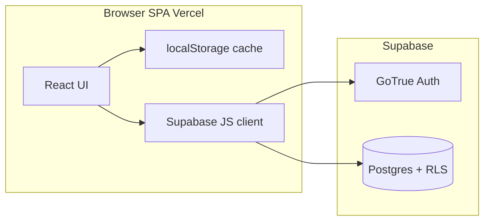

# Vercel + Supabase Auth + Postgres migration

## Alignment with repo rules

- **[PROJECT_RULES.md](PROJECT_RULES.md)**: Small reviewable phases, strong typing, minimal deps (add only `@supabase/supabase-js`), no speculative abstractions, update setup/architecture docs when behavior changes.
- **[SECURITY_RULES.md](SECURITY_RULES.md)** / **[.cursor/rules/10-security-rules.mdc](.cursor/rules/10-security-rules.mdc)**: No secrets in source; `.env.example` names only; **never** ship `SUPABASE_SERVICE_ROLE_KEY` (or any service role) to the browser or Vite client bundle; treat import/backup JSON as untrusted input; avoid logging tokens/session payloads.
- **Note**: [docs/architecture.md](docs/architecture.md) currently describes Next.js/Sanity; after implementation, update it (or add a Vite-specific section) so it matches the real stack.

---

## Recommended architecture

- **Hosting**: Vercel serves the static Vite build (SPA). No custom Node API is required for the first phase if all data access uses the Supabase client with the **anon** key and **RLS** enforces isolation (matches “simple” and avoids extra server secrets).
- **Auth**: Supabase Auth email/password only; session handled by `@supabase/supabase-js` (PKCE-friendly defaults for SPA). **2FA**: defer; can be toggled later in Supabase without schema changes.
- **Data**: Postgres tables owned per-user via `user_id uuid NOT NULL REFERENCES auth.users(id) ON DELETE CASCADE`. Application reads/writes only through Supabase client as the authenticated user.
- **Transition**: Treat **localStorage** as a **local cache + offline draft** and keep **export/import** as portable backup and migration path. When logged in, define a clear **sync policy** (see risks): e.g. “server wins after initial merge” or “newest `updated_at` wins per aggregate”—document the chosen rule in code comments and docs.

**Single dependency**: `@supabase/supabase-js` (justified; avoids hand-rolling auth and PostgREST).

---

## Minimal database schema

Two viable shapes—pick one for implementation consistency:

### Option A (recommended for speed and type parity): document row + satellite tables

- `**user_app_state`** (one row per user, optional): `user_id` PK, `payload_version` smallint, `payload` **jsonb** (full `AppPayload`-shaped document), `updated_at` timestamptz. RLS: `user_id = auth.uid()`.  
  - Pros: fastest migration from current [src/core/model.ts](src/core/model.ts) / [src/core/storage.ts](src/core/storage.ts); schedule stays nested as today.  
  - Cons: less granular SQL reporting on blocks.

### Option B (normalized “minimal” relational): matches your bullet list literally

Use **UUID** primary keys to align with client-generated `crypto.randomUUID()` today ([src/App.tsx](src/App.tsx)).

1. `**skills`**
  - `id` uuid PK, `user_id` uuid NOT NULL REFERENCES `auth.users(id)` ON DELETE CASCADE  
  - `name` text NOT NULL, `priority` smallint NULL (check 1–4), `daily_goal_minutes` int NULL, `weekly_goal_minutes` int NULL  
  - `created_at`, `updated_at` timestamptz  
  - `schedule` **jsonb** NOT NULL default `'{}'::jsonb` — stores [WeeklySchedule](src/core/model.ts) (weekday → `ScheduleBlock[]`) to avoid a large `schedule_blocks` explosion while still modeling “schedule blocks” in-app.
2. `**sessions`**
  - `id` uuid PK, `user_id` uuid NOT NULL, `skill_id` uuid NOT NULL REFERENCES `skills(id)` ON DELETE CASCADE  
  - `minutes` int NOT NULL CHECK (`minutes` > 0), `started_at` timestamptz NOT NULL, `created_at` timestamptz NOT NULL  
  - FK `skill_id` scoped by RLS so users cannot attach sessions to others’ skills.
3. `**overrides`** (future-proof placeholder)
  - `id` uuid PK, `user_id` uuid NOT NULL  
  - `kind` text NULL (freeform or constrained later), `payload` **jsonb** NOT NULL default `'{}'::jsonb`, `created_at` timestamptz  
  - Matches `overrides: Array<unknown>` until you define a schema.

**Indexes (minimal)**: `(user_id)` on all tables; optional `(user_id, started_at desc)` on `sessions` for dashboard queries.

**Optional stricter variant**: split `schedule` into `schedule_blocks(skill_id, weekday, sort_order, start_time, minutes)` if you need SQL-level reporting—adds complexity; defer unless needed.

---

## RLS policies (deny-by-default)

Enable RLS on **every** user table. Typical pattern per table `T`:

- `**SELECT`**: `user_id = auth.uid()`  
- `**INSERT`**: `user_id = auth.uid()` (and optionally `WITH CHECK` that referenced `skill_id` rows belong to same user—often enforced by FK + RLS on `skills`)  
- `**UPDATE`**: `user_id = auth.uid()` with `USING` + `WITH CHECK` both `user_id = auth.uid()`  
- `**DELETE**`: `user_id = auth.uid()`

For `**user_app_state**` (if used): same `user_id = auth.uid()` on all operations.

**Grants**: use Supabase defaults for `authenticated` role; avoid broad `PUBLIC` write access.

**Triggers**: `updated_at` maintenance on `skills` (and document row if Option A).

---

## Environment variables (Vercel + local dev)

Per [SECURITY_RULES.md](SECURITY_RULES.md), **only variable names** in [.env.example](.env.example); no real keys in docs or commits.

**Client (Vite) — safe to expose in bundle** (prefix `VITE_`):

| Variable                 | Purpose                    |
| ------------------------ | -------------------------- |
| `VITE_SUPABASE_URL`      | Project URL                |
| `VITE_SUPABASE_ANON_KEY` | Supabase anon (public) key |

**Never in client or `VITE_*`**:

| Variable                    | Purpose                                                                                               |
| --------------------------- | ----------------------------------------------------------------------------------------------------- |
| `SUPABASE_SERVICE_ROLE_KEY` | Breaks-glass admin; **server-only** if you later add Edge Functions / scripts; not for this SPA phase |

**Supabase Dashboard** (not in repo): Auth redirect URLs for production and preview (Vercel preview URLs if used), email templates, password requirements.

**Vite base path**: [vite.config.ts](vite.config.ts) sets `base: '/personal-assistant-zanarkand/'`. Ensure production Supabase redirect URLs and Vercel “production URL” match how the app is actually served (GitHub Pages vs Vercel root vs subpath)—misalignment breaks auth redirects.

---

## Files likely to change / add

| Area              | Paths                                                                                                                                                                                                          |
| ----------------- | -------------------------------------------------------------------------------------------------------------------------------------------------------------------------------------------------------------- |
| Deps              | [package.json](package.json), lockfile                                                                                                                                                                         |
| Env               | [.env.example](.env.example) (names only), Vercel project env UI                                                                                                                                               |
| Supabase client   | New e.g. `src/lib/supabaseClient.ts` (typed `createClient`, reads `import.meta.env.VITE_`*)                                                                                                                    |
| Auth UI / session | New `src/auth/`* or components + thin hook (sign up, sign in, sign out, `onAuthStateChange`)                                                                                                                   |
| Persistence       | [src/core/storage.ts](src/core/storage.ts) extended or wrapped; new `src/core/remoteRepository.ts` / `sync.ts` for Supabase CRUD                                                                               |
| App shell         | [src/App.tsx](src/App.tsx) (currently owns all state + `commit` → [saveAppData](src/core/storage.ts)); likely split **data provider** vs **pages** to keep diffs reviewable                                    |
| Types             | [src/core/model.ts](src/core/model.ts) — optional DB row types / mappers (DB snake_case ↔ TS camelCase)                                                                                                        |
| Migrations        | New `supabase/migrations/*.sql` (or documented SQL in repo)                                                                                                                                                    |
| Docs              | [docs/setup.md](docs/setup.md), [docs/architecture.md](docs/architecture.md) or new architecture note, **this plan**: [docs/plans/vercel-supabase-auth-storage.md](docs/plans/vercel-supabase-auth-storage.md) |
| CI                | Add typecheck/lint/test if you add tests for sync/auth guards                                                                                                                                                  |

---

## Phased implementation plan

**Phase 0 — Project setup**

- Create Supabase project; note project ref, URL, anon key in Vercel/local secrets store only.
- Decide **Option A vs B** (document in migration notes).

**Phase 1 — Schema + RLS**

- Write SQL migration: tables, constraints, indexes, RLS policies, grants.
- Verify in Supabase SQL editor with two test users: user A cannot `select/update` user B’s rows.

**Phase 2 — Client wiring (no UX change yet)**

- Add `@supabase/supabase-js`; create client module; fail fast with clear dev error if env vars missing.
- Add Vitest/unit tests for pure mappers (payload ↔ rows) if Option B.

**Phase 3 — Auth (email/password)**

- Sign up / sign in / sign out UI; handle Supabase errors without echoing sensitive internals.
- Gate main app on `session`; unauthenticated users see auth screen only (per “only authenticated users can access their data”).
- Configure Supabase Auth settings (site URL, redirect URLs, email confirmation behavior—see risks).

**Phase 4 — Dual mode: localStorage + remote**

- Keep [loadAppData](src/core/storage.ts) / [saveAppData](src/core/storage.ts) / [exportBackup](src/core/storage.ts) / [importBackup](src/core/storage.ts) working.
- On login: **load remote** → **merge/replace** per chosen policy → write to localStorage cache → render.
- On mutation: update React state → **save localStorage** (fast) → **debounced or explicit “Save to cloud”** remote upsert to reduce chatter (aligns with PROJECT_RULES performance).
- On logout: clear in-memory state; optional prompt to keep or clear local cache.

**Phase 5 — Hardening**

- Loading/error states; retry/backoff for network failures.
- Consider `storage` key namespacing per user id to avoid accidental cross-user cache on shared browsers (edge case).
- Update docs: setup, env, deployment URL, RLS rationale.

**Phase 6 — Vercel**

- Connect repo; set `VITE`_* env vars; confirm `base` and routing for SPA (fallback to `index.html`).
- Smoke-test production auth + RLS.

---

## Risks / edge cases

- **Conflict resolution**: two devices editing offline or concurrent tabs—define merge (timestamp/version vector) or “last write wins” per table/document.
- **Email confirmation**: if enabled, “signed up but cannot sign in” until confirm—document for solo use.
- **Subpath hosting + OAuth/PKCE**: redirects must include correct path; magic links same.
- **Imported JSON**: malicious or huge files—enforce size limits and schema validation before merge; never `dangerouslySetInnerHTML` on file contents.
- **Anon key exposure**: expected for Supabase SPA; security boundary is **RLS**, not hiding the anon key.
- **Rate limits / abuse**: rely on Supabase defaults; consider app-level throttling later.
- **PII**: emails live in Supabase Auth; minimize extra PII in your tables.

---

## Validation checklist

- New user sign-up; existing user sign-in; sign-out clears access to remote data in UI.
- RLS: second account cannot read/write first account’s rows (manual or automated SQL).
- Cold refresh while logged in restores session and loads correct data.
- localStorage still persists when feature flag / offline; export produces valid v1 JSON; import still works.
- Network failure: app remains usable with local cache (define minimum behavior).
- `pnpm build` / `tsc -b` passes; no service role in client bundle (grep CI check optional).
- Docs: env names only in `.env.example`; no secrets in repo.

---

## Rollback strategy

- **Feature flag** (env): e.g. `VITE_ENABLE_REMOTE_SYNC=false` forces localStorage-only path (no Supabase calls)—single switch to revert behavior without git revert.
- **Deploy rollback**: Vercel “Promote to Production” previous deployment if a bad build ships.
- **Database rollback**: forward-only migrations preferred; for emergencies restore from Supabase backup / PITR if enabled—document restore ownership.
- **Data safety**: before first mass sync, user exports JSON backup; keep export button prominent through transition.

---

## Delivering this document to disk

Plan mode prevents writing files. **After you approve this plan**, save the agreed markdown to **[docs/plans/vercel-supabase-auth-storage.md](docs/plans/vercel-supabase-auth-storage.md)** (create `docs/plans/` if needed) so it lives beside other docs per your request.