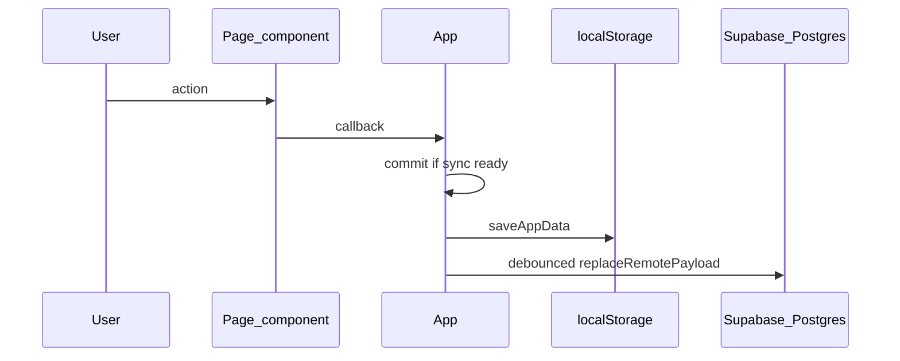

# Architecture

## Overview

Personal Assistant is a client-side React app with optional cloud sync:

- **Vite + React + TypeScript** — SPA build and dev server
- **Vercel** — production hosting (static build output)
- **Supabase Auth** — email/password sign-in; session gate before the app shell
- **Supabase Postgres** — per-user rows for skills, sessions, and overrides (RLS-scoped)
- **localStorage** — user-scoped cache (`pa.appData.v1.<userId>`) plus legacy key migration
- **Cloud sync** — `initialSync` on load; debounced `replaceRemotePayload` on mutations when remote sync is enabled

There is no Next.js app router, no CMS, and no custom backend API in this repo. The browser talks to Supabase directly with the public anon key (RLS enforces access).

## Entry and auth flow

```
main.tsx → AuthGate → (signed out) AuthScreen
                    → (signed in)  App(userId)
```

- [`src/auth/AuthGate.tsx`](../src/auth/AuthGate.tsx) — subscribes to Supabase session; renders sign-in or `App`
- [`src/auth/AuthScreen.tsx`](../src/auth/AuthScreen.tsx) — sign up / sign in UI
- [`src/App.tsx`](../src/App.tsx) — data shell (sync, mutations, page routing)

## Folder structure

```
src/
  main.tsx              # React root → AuthGate
  App.tsx               # Sync lifecycle, commit, CRUD, page state
  auth/                 # Auth gate and sign-in screen
  core/                 # Domain model, storage, sync, mappers, pure helpers
  lib/                  # Supabase client (VITE_* env only)
  pages/                # Route-like screens (Dashboard, Skills)
  components/
    layout/             # AppShell, NavButton
    skills/             # SkillEditor, GoalInput
  ui/                   # Shared styles and display helpers
```

| Path | Responsibility |
|------|----------------|
| `src/auth` | Authentication UI and session gate |
| `src/core` | Business logic, validation, `localStorage`, remote sync, DB mappers |
| `src/lib` | `createClient` for Supabase (public env vars only) |
| `src/pages` | Presentational pages; props in, callbacks out |
| `src/components/layout` | App chrome (header, nav, banners) |
| `src/components/skills` | Skills-specific UI building blocks |
| `src/ui` | `appStyles`, `format` helpers (no domain rules) |

## Architecture boundaries

### AuthGate

- Owns whether the user sees `AuthScreen` or `App`
- Passes `userId` and `onSignOut` into `App`
- Does not read or write app payload data

### App (`src/App.tsx`)

- Owns `AppData` state, loading/error/sync UI flags, and internal `page` state (`dashboard` \| `skills`)
- Runs `initialSync` on mount; guards mutations with `syncReadyRef`
- All writes go through `commit` → `saveAppData(userId)` → debounced remote persist
- Defines CRUD handlers passed to pages as callbacks
- Does not embed large page UIs (those live under `src/pages` and `src/components`)

### Pages (`src/pages`)

- Presentational: receive slices of `app.payload` and callbacks
- Must not call `saveAppData`, `initialSync`, or `replaceRemotePayload` directly
- Examples: `DashboardPage`, `SkillsPage`

### Components (`src/components`)

- Reusable UI composed by pages or `AppShell`
- Layout: `AppShell`, `NavButton`
- Skills: `SkillEditor`, `GoalInput`

### Core (`src/core`)

- Domain types ([`model.ts`](../src/core/model.ts)), defaults ([`state.ts`](../src/core/state.ts))
- Persistence and backup ([`storage.ts`](../src/core/storage.ts))
- Remote sync policy ([`remoteStorage.ts`](../src/core/remoteStorage.ts), [`syncErrors.ts`](../src/core/syncErrors.ts))
- Row ↔ payload mappers ([`dbMappers.ts`](../src/core/dbMappers.ts))
- Pure helpers: schedule math, duration parsing, sessions utilities

## Data flow



**Load path:** `AuthGate` → `App` → `initialSync(userId)` merges remote vs local → `saveAppData` → render pages.

**Backup:** Export/import JSON via `exportBackup` / `importBackup` in `storage.ts` (invoked from `AppShell` actions in `App`).

## Navigation

Internal tab state only (`useState<Page>` in `App`); no React Router yet. `AppShell` renders nav buttons; `App` switches page children inside `<main>`.

To add a section later: extend `Page` in [`src/pages/types.ts`](../src/pages/types.ts), add a page component, wire nav in `AppShell`, and add mutations in `App` that use `commit`.

## Environment variables

Client-only (Vite `import.meta.env`):

| Variable | Purpose |
|----------|---------|
| `VITE_SUPABASE_URL` | Supabase project URL |
| `VITE_SUPABASE_ANON_KEY` | Public anon key (RLS required) |
| `VITE_ENABLE_REMOTE_SYNC` | Optional; set to `"false"` to disable cloud writes |

Never commit real values. Use `.env.local` locally and Vercel project settings in production. Do not put service-role keys in client code.

## Deployment

- Build: `npm run build` → `dist/`
- Hosted on Vercel; configure the same `VITE_*` variables in the project
- [`vite.config.ts`](../vite.config.ts) `base` must match the deployed path if the app is not served from domain root

## Testing

- Unit tests live next to core modules (e.g. `dbMappers.test.ts`)
- Run `npm test`, `npm run lint`, and `npm run build` before merging structural changes
