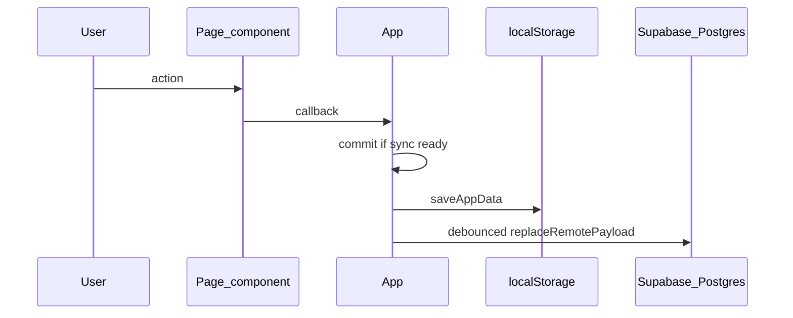

# Architecture

## Overview

Personal Assistant is a client-side React app with optional cloud sync:

- **Vite + React + TypeScript** — SPA build and dev server
- **Vercel** — production hosting (static build output)
- **Supabase Auth** — email/password sign-in; session gate before the app shell
- **Supabase Postgres** — per-user rows for skills, sessions, overrides, events, people, job applications, career targets, workout plans, workout sessions, and focus feedback (RLS-scoped)
- **localStorage** — user-scoped cache (`pa.appData.v1.<userId>`) plus legacy key migration
- **Cloud sync** — `initialSync` on load; debounced `replaceRemotePayload` on mutations when remote sync is enabled

There is no Next.js app router, no CMS, and no custom backend API in this repo. The browser talks to Supabase directly with the public anon key (RLS enforces access).

## Entry and auth flow

```
main.tsx → AuthGate → (signed out) AuthScreen
                    → (signed in)  App(userId)
```

- [`src/auth/AuthGate.tsx`](../src/auth/AuthGate.tsx) — subscribes to Supabase session; renders sign-in or `App`
- [`src/auth/AuthScreen.tsx`](../src/auth/AuthScreen.tsx) — sign up / sign in UI
- [`src/App.tsx`](../src/App.tsx) — data shell (sync, mutations, page routing)

## Folder structure

```
src/
  main.tsx              # React root → AuthGate
  App.tsx               # Sync lifecycle, commit, CRUD, page state
  auth/                 # Auth gate and sign-in screen
  core/                 # Domain model, storage, sync, mappers, pure helpers
    dashboardStats.ts   # Pure dashboard derivations (today/week/timeline)
    events.ts           # Event sorting, upcoming window helpers
    people.ts           # People birthdays, follow-ups, event label resolution
    career.ts           # Job applications pipeline, skill-gap helpers, search/sort
    fitness.ts          # Workout plans/sessions helpers, search/sort, summaries
    focus.ts            # Daily Focus Engine — ranked cross-domain recommendations
    focusFeedback.ts    # Focus dismiss/snooze suppression helpers
    briefing.ts         # Daily Briefing Engine — deterministic NL summaries
    review.ts           # Weekly Review Engine — cross-domain weekly summaries
    progression.ts      # Derived XP, levels, streaks (from sessions; not persisted)
    progressionModel.ts # Phase 35 gamification types + GamificationState (persisted acks)
    progressionContext.ts   # Phase 35 — normalize payload into engine inputs
    rewardCalculation.ts    # Phase 35 — XpGrant ledger (base + bonuses, dedupe, daily cap)
    progressionEngine.ts    # Phase 35 — grants → per-track totals + level states
    achievementEngine.ts    # Phase 35 — evaluate achievementCatalog vs context
    questEngine.ts          # Phase 35 — instantiate daily/weekly/monthly quests
    progressionSnapshot.ts  # Phase 35 — orchestrate engines → ProgressionSnapshot DTO
    achievementCatalog.ts   # Phase 35 — static achievement definitions
    questCatalog.ts         # Phase 35 — static quest definitions
    milestoneTables.ts      # Phase 35 — shared XP/streak/level thresholds
    timeline.ts         # Unified schedule + events timeline
    calendar.ts         # Unified calendar foundation — domain data → CalendarItem range
    calendarColors.ts   # Pure calendar color/category preference resolution (palette + precedence)
    calendarView.ts     # Pure calendar view math — month/week grids, ranges, filtering, layout, labels
    recurrence.ts       # Pure recurrence engine — rule expansion, exceptions, series split
    eventSeries.ts      # Life-event series split helpers (Phase 33)
    eventOccurrences.ts # Life-event occurrence skip/move/truncate/detach (Phase 34A)
    calendarDrag.ts     # Week-view drag snap/reschedule math (Phase 34B)
    skillSeries.ts      # Pure skill schedule-series bounds — active-date filtering
    theme.ts            # Aether Theme — profiles, tokens, normalization (Phase 37A); mode-aware LIGHT/DARK base palette + theme modes (Phase 37C)
    themeEffects.ts     # Pure global-effects resolver (Phase 37D) — accent-density/performance/mobile/reduced-motion decision logic
    appearanceStorage.ts # Aether appearance localStorage (Phase 37A; cloud sync Phase 37E)
  lib/                  # Supabase client (VITE_* env only)
  pages/                # Route-like screens (Dashboard, Calendar, Skills, Events, People, Career, Fitness, Review, Settings)
    DashboardPage.tsx   # Composes dashboard sections from props
    SettingsPage.tsx    # Settings foundation — Aether Profiles theme customization (local)
    CalendarPage.tsx    # Outlook-style month/week calendar (occurrence edits + week-view drag on CalendarPage)
    ReviewPage.tsx      # Full weekly review breakdown (read-only)
    EventsPage.tsx      # Life events CRUD
    PeoplePage.tsx      # Friends/contacts CRUD
    CareerPage.tsx      # Job applications + dream job target CRUD
    FitnessPage.tsx     # Workout plans + completed session CRUD
  components/
    layout/             # AppShell, NavButton
    calendar/           # Calendar views (month/week), toolbar, sidebar, pills/blocks, detail modal
    dashboard/          # Dashboard sections and shared widgets
    people/             # People page cards, toolbar, form
    career/             # Career page forms, cards, skill picker
    fitness/            # Fitness page forms, cards, exercise editor
    skills/             # SkillEditor, GoalInput
    settings/           # Settings UI — sidebar, Aether profile cards, preview, intensity, effects, styles
  ui/                   # Shared styles, theme hook, display helpers
    appStyles.ts        # Shared styles — Aether accent tokens (Phase 37B) + mode-aware surface/text/border tokens (Phase 37C)
    useAppearanceTheme.ts # Applies --aether-* CSS variables on :root
```

| Path | Responsibility |
|------|----------------|
| `src/auth` | Authentication UI and session gate |
| `src/core` | Business logic, validation, `localStorage`, remote sync, DB mappers |
| `src/lib` | `createClient` for Supabase (public env vars only) |
| `src/pages` | Presentational pages; props in, callbacks out |
| `src/components/layout` | App chrome (header, nav, banners) |
| `src/components/dashboard` | Presentational dashboard sections (`TodayHero`, timeline, progress, weekly preview, career pipeline) |
| `src/components/people` | People-specific UI building blocks |
| `src/components/career` | Career-specific UI building blocks |
| `src/components/fitness` | Fitness-specific UI building blocks |
| `src/components/skills` | Skills-specific UI building blocks |
| `src/components/settings` | Settings / Aether theme UI (theme-aware) |
| `src/components/effects` | Global visual-effects engine (Phase 37D) — `ThemeEffectsLayer`, particle/rune/trail layers, `GlobalEffectStyles`, `AnimatedBorderSystem`; mounted once in `App.tsx` |
| `src/ui` | `appStyles` (shared light base + Aether accent tokens), `useAppearanceTheme`, `format` helpers (no domain rules) |

## Architecture boundaries

### AuthGate

- Owns whether the user sees `AuthScreen` or `App`
- Passes `userId` and `onSignOut` into `App`
- Does not read or write app payload data

### App (`src/App.tsx`)

- Owns `AppData` state, loading/error/sync UI flags, and internal `page` state (`dashboard` \| `calendar` \| `skills` \| `events` \| `people` \| `career` \| `fitness` \| `review` \| `settings`)
- Calls [`useAppearanceTheme`](../src/ui/useAppearanceTheme.ts) once to apply global `--aether-*` CSS variables (Phase 37B accent adoption; Phase 37C mode-aware surfaces + `prefers-color-scheme`)
- Runs `initialSync` on mount; guards mutations with `syncReadyRef`
- All writes go through `commit` → `saveAppData(userId)` → debounced remote persist
- Defines CRUD handlers passed to pages as callbacks
- Does not embed large page UIs (those live under `src/pages` and `src/components`)

### Pages (`src/pages`)

- Presentational: receive slices of `app.payload` and callbacks
- Must not call `saveAppData`, `initialSync`, or `replaceRemotePayload` directly
- Examples: [`DashboardPage.tsx`](../src/pages/DashboardPage.tsx), [`ReviewPage.tsx`](../src/pages/ReviewPage.tsx), [`SkillsPage`](../src/pages/SkillsPage.tsx), [`EventsPage`](../src/pages/EventsPage.tsx), [`PeoplePage`](../src/pages/PeoplePage.tsx), [`CareerPage`](../src/pages/CareerPage.tsx), [`FitnessPage`](../src/pages/FitnessPage.tsx)
- [`DashboardPage`](../src/pages/DashboardPage.tsx) builds derived data via `core/dashboardStats`, `core/progression`, `core/focus`, `core/review`, and related helpers, then composes visual sections; it does not persist or call sync APIs.
- [`ReviewPage`](../src/pages/ReviewPage.tsx) runs `buildWeeklyReview` in a `useMemo` and renders read-only domain sections; no mutations.

### Components (`src/components`)

- Reusable UI composed by pages or `AppShell`
- Layout: `AppShell`, `NavButton`
- Dashboard ([`src/components/dashboard/`](../src/components/dashboard/)): presentational only — props in, events out; no `saveAppData` or Supabase
- Skills: `SkillEditor`, `GoalInput`

### Core (`src/core`)

- Domain types ([`model.ts`](../src/core/model.ts)), defaults ([`state.ts`](../src/core/state.ts))
- Persistence and backup ([`storage.ts`](../src/core/storage.ts))
- Remote sync policy ([`remoteStorage.ts`](../src/core/remoteStorage.ts), [`syncErrors.ts`](../src/core/syncErrors.ts))
- Row ↔ payload mappers ([`dbMappers.ts`](../src/core/dbMappers.ts))
- Pure helpers: schedule math ([`schedule.ts`](../src/core/schedule.ts)), events ([`events.ts`](../src/core/events.ts)), people ([`people.ts`](../src/core/people.ts)), career ([`career.ts`](../src/core/career.ts)), fitness ([`fitness.ts`](../src/core/fitness.ts)), unified timeline ([`timeline.ts`](../src/core/timeline.ts)), unified calendar ([`calendar.ts`](../src/core/calendar.ts)), daily focus ([`focus.ts`](../src/core/focus.ts)), daily briefing ([`briefing.ts`](../src/core/briefing.ts)), weekly review ([`review.ts`](../src/core/review.ts))
- Dashboard stats ([`dashboardStats.ts`](../src/core/dashboardStats.ts)): `buildSkillDayRows`, `buildTimelineItems`, `totalMinutesToday`, week helpers, progress targets — tested in [`dashboardStats.test.ts`](../src/core/dashboardStats.test.ts)
- Daily focus ([`focus.ts`](../src/core/focus.ts)): `buildDailyFocusSummary` aggregates skills, events, people, career, fitness, and timeline signals into ranked read-only `FocusItem` recommendations — tested in [`focus.test.ts`](../src/core/focus.test.ts). **Not persisted**; recomputed on each dashboard render. Recommendations only (no mutations, notifications, or auto-rescheduling).
  - **`FocusActionType`** — derived action hints (`log_skill_minutes`, `apply_to_job`, `resolve_conflict`, etc.) mapped in [`DailyFocusSection`](../src/components/dashboard/DailyFocusSection.tsx) to existing page navigation handlers.
  - **Derived metadata** on each `FocusItem`: `suggestedActionType`, `actionTargetId`, and `expiresAtIso` — never stored in `AppPayload` or synced to Supabase.
  - **Expiration semantics**: collectors assign per-signal expiry (event end, block end, end of day, +7 days for career, next day for follow-ups). `filterExpiredFocusItems` removes stale items before the dashboard cap is applied.
  - **Cleanup lifecycle**: collect → merge → score → rank → filter expired → slice top N.
- Focus feedback ([`focusFeedback.ts`](../src/core/focusFeedback.ts)): persisted `FocusFeedback` rows in `AppPayload.focusFeedback` and the `focus_feedback` Supabase table — tested in [`focusFeedback.test.ts`](../src/core/focusFeedback.test.ts). A lightweight visibility layer keyed by stable `FocusItem.id`; **never mutates** underlying domain entities (skills, events, people, career, fitness). Feedback history is **UI suppression state only**, not domain data.
  - **Suppression semantics**: `dismissed` hides an item for the rest of the local calendar day (based on `createdAtIso`); `snoozed` hides until `untilIso`. Newest entry per `focusItemId` wins. Expired entries are removed on app load via `cleanupExpiredFeedback`.
  - **Source snapshots**: optional `sourceSnapshot` on `FocusFeedback` stores human-readable focus card text (title + description) at dismiss/snooze time for the **hidden focus review drawer** and future personalization. **Not used** for suppression, matching, or ranking — keyed only by `focusItemId`.
  - **Hidden review drawer**: [`buildHiddenFocusFeedbackItems`](../src/core/focusFeedback.ts) returns derived `HiddenFocusFeedbackItem` DTOs with precomputed `displayLabel`, `actionLabel`, and `expiryLabel`. [`DailyFocusSection`](../src/components/dashboard/DailyFocusSection.tsx) consumes these DTOs only — raw `focusItemId` values are not shown in the UI; missing snapshots fall back to **"Hidden recommendation"**.
  - **Dashboard integration**: [`DashboardPage`](../src/pages/DashboardPage.tsx) filters suppressed items from the globally ranked pool **before** the top-5 slice and passes the visible summary to [`DailyFocusSection`](../src/components/dashboard/DailyFocusSection.tsx). Dismiss, snooze (3h / tomorrow), restore-one, restore-all, and **Review hidden** (inline drawer) commit feedback through `App.tsx`. `buildHiddenFocusFeedbackItems` scopes the drawer to today's ranked focus pool so hidden count and drawer entries stay aligned.
  - **Briefing intentionally ignores suppression**: [`buildDailyBriefing`](../src/core/briefing.ts) reads the unsuppressed `DailyFocusSummary` so narrative and risk flags still reflect underlying signals.
  - **No auto-rescheduling**: feedback only affects Today's Focus visibility; it does not reschedule blocks, events, or reminders.
  - **Future**: persisted dismiss/snooze history could feed AI personalization weights (deferred).
- Daily briefing ([`briefing.ts`](../src/core/briefing.ts)): `buildDailyBriefing` turns derived dashboard state (focus summary, unified timeline day, workload totals, domain slices) into deterministic natural-language summaries — tested in [`briefing.test.ts`](../src/core/briefing.test.ts). **Not persisted**; recomputed on each dashboard render. No AI APIs.
  - **Relationship to focus**: briefing **reads** `DailyFocusSummary` plus timeline/workload inputs. Focus remains the actionable ranked list with CTAs; briefing adds narrative paragraphs, secondary suggestion strings (overflow focus items not shown in Today's Focus), and risk flags.
  - **`DailyBriefing` output**: `greeting`, `summary`, `workloadSummary`, `focusSummary`, `recommendations[]` (max 5), `riskFlags[]`, `tone`, `generatedAtIso`.
  - **`tone`**: derived read-only mood for UI styling — `warning` when risk flags exist or workload is heavy; `encouraging` when caught up (no visible focus items and no risk flags); otherwise `neutral`.
  - **Deterministic template variation**: `selectDeterministicTemplate(templates, seed)` picks phrasing from fixed template arrays using a hash of `todayKey`, workload level, and context counts — no randomness, no AI. Used for workload summaries, clear-day copy, on-track focus copy, and recommendation fallbacks.
- Weekly review ([`review.ts`](../src/core/review.ts)): `buildWeeklyReview` aggregates skills, fitness, career, people, events, and focus feedback for the **local calendar week containing today** (Monday–Sunday) — tested in [`review.test.ts`](../src/core/review.test.ts). **Not persisted**; recomputed on dashboard and review page renders. No AI APIs, no mutations, no notifications.
  - **Week boundaries**: reuse `startOfWeekLocal` / `isInLocalWeek` from [`dashboardStats.ts`](../src/core/dashboardStats.ts); date-key fields filtered with the same Monday 00:00 → next Monday exclusive window.
  - **`WeeklyReview` output**: `week` (includes stable `weekKey`, e.g. `2026-W21`), `greeting`, `headline`, `summary`, `wins[]`, `risks[]`, domain sections (`skills` rows include `completionRate`), `tone`, `generatedAtIso`. Section visibility helpers (`isSkillsSectionVisible`, etc.) live in `review.ts` for UI reuse.
  - **Focus feedback analytics**: weekly dismiss/snooze counts grouped by `focusItemId` from persisted `FocusFeedback` rows (`createdAtIso` in week); labels from `sourceSnapshot`. Daily ranked focus history is **not** stored — only feedback history.
  - **UI surfaces**: compact [`WeeklyReviewSection`](../src/components/dashboard/WeeklyReviewSection.tsx) on the dashboard (after daily briefing); full breakdown on [`ReviewPage`](../src/pages/ReviewPage.tsx) via nav tab **Review**.
  - **Future**: `WeeklyReviewContext` for AI “explain my week”, prior-week deltas, persisted reflection notes (deferred).
- Progression ([`progression.ts`](../src/core/progression.ts)): lifetime XP (1 XP = 1 logged minute), linear level bands (`XP_PER_LEVEL_BAND`), per-skill and global streaks — tested in [`progression.test.ts`](../src/core/progression.test.ts). **Not stored** in Postgres or `AppPayload`; recomputed from `sessions` on each render. Streak rule: meet `dailyGoalMinutes` when set, else any minutes > 0; global streak counts a day if **any** skill qualifies. Remains the streak/level math library that the Phase 35 engines build on.
- Gamification (Phase 35): an RPG-style progression framework layered on top of the existing domain data. The principle evolves from "XP not stored" to **"XP computed, unlock/ack state stored"** — XP, levels, achievements, and quests are still recomputed on demand; only UX acknowledgements persist.
  - **Pure engines (recomputed, never persisted)**: [`progressionContext.ts`](../src/core/progressionContext.ts) normalizes the payload (minutes by skill/day, goal completions, workout/scheduled completions, career transitions, people contacts, event-attendance proxy) into engine inputs. [`rewardCalculation.ts`](../src/core/rewardCalculation.ts) emits a deterministic `XpGrant[]` (base minutes + bonuses) with stable ids for dedupe and a per-day bonus cap (`MAX_BONUS_XP_PER_DAY`). [`progressionEngine.ts`](../src/core/progressionEngine.ts) aggregates grants into per-track totals (global, five axes `mind/body/career/social/creative`, per skill) and level states via the linear band. [`achievementEngine.ts`](../src/core/achievementEngine.ts) and [`questEngine.ts`](../src/core/questEngine.ts) evaluate the static [`achievementCatalog.ts`](../src/core/achievementCatalog.ts) / [`questCatalog.ts`](../src/core/questCatalog.ts) against the context (deterministic daily/weekly/monthly quest instances keyed by period start). [`progressionSnapshot.ts`](../src/core/progressionSnapshot.ts) orchestrates them into a single `ProgressionSnapshot` DTO (global/axis/skill levels, today's grants, pending level-ups, achievement unlock/in-progress lists, quests, milestone highlights). Shared thresholds live in [`milestoneTables.ts`](../src/core/milestoneTables.ts). Tested in `progressionEngine.test.ts`, `rewardCalculation.test.ts`, `questEngine.test.ts`, `achievementEngine.test.ts`, and `progressionSnapshot.test.ts`.
  - **Event-attendance proxy (v1)**: `LifeEvent` has no `attended` flag, so v1 credits only one-time, non-deadline events already in the past (bounded by event count; recurring attendance + an explicit `attendedAtIso` column are deferred). Quest-completion XP is scoped to the current period instance, so per-period rewards are an in-period motivator rather than a permanent total.
  - **Persisted singleton**: `GamificationState` (`lastAcknowledgedGlobalLevel`, `dismissedAchievementIds`) is re-exported from [`progressionModel.ts`](../src/core/progressionModel.ts) onto `AppPayload.gamificationState`. It is optional and `undefined` by default — `defaultPayload()` leaves it unset and [`normalizePayload`](../src/core/storage.ts) preserves a valid object via `normalizeGamificationState` or drops to `undefined`, so older payloads/backups load unchanged. It is backed by the dedicated `gamification_state` Supabase table (one row per user keyed by `user_id` PK, `state jsonb NOT NULL` with an object CHECK, `updated_at` trigger, RLS owner policies — mirroring `calendar_preferences`). [`dbMappers.ts`](../src/core/dbMappers.ts) adds `GamificationStateRow`, `gamificationStateToRow` / `gamificationStateFromRow`, and `parseGamificationState` (allowlisted keys, integer level ≥ 1, dismissed ids restricted to known achievements). `App.tsx` stays orchestration-only: it loads `gamificationState`, passes the snapshot inputs to `DashboardPage`, and exposes `acknowledgeGlobalLevel` / `dismissAchievementNotification` callbacks (no XP math in `App`; the dashboard recomputes the snapshot on the next render). Dashboard surfaces: `ProgressionPanel` (replaces `ProgressionHero`), `ProgressionAxisRow`, `ActiveQuestsCard`, `AchievementShowcase`, and `LevelUpToast`.

### Unified calendar foundation

- Calendar foundation ([`calendar.ts`](../src/core/calendar.ts)): `buildCalendarItemsForRange` converts skills, life events, people birthdays, and optional fitness history into common `CalendarItem` rows for an inclusive `YYYY-MM-DD` date range — tested in [`calendar.test.ts`](../src/core/calendar.test.ts). **Not persisted**; pure derivation with no side effects, recomputed on demand. Built for future Outlook-like week/month dashboard views; no UI in this layer.
  - **`CalendarItem`**: stable `id`, `sourceType` (`skill` \| `event` \| `people` \| `fitness` \| `career`), `sourceId`, `title`, `date`, optional `startTime`/`endTime`, derived `isTimed`/`allDay`/`isMultiDay`, theming hooks (`categoryKey`, optional `subcategoryKey`/`colorKey`/`iconKey`), optional `description`, and a discriminated `sourceMeta` carrying original domain fields.
  - **Source mapping**: skill weekly blocks expand per date in range; life events convert directly (timed range, start-only marker, or all-day); people birthdays expand `birthdayMonthDay` per intersecting year (Feb 29 → Feb 28 in non-leap years, matching [`people.ts`](../src/core/people.ts)); workout sessions with `completedAtIso` become opt-in historical timed items (`includeFitnessHistory`); schedulable workout plans expand into `workoutScheduleBlock` items when `includeWorkoutSchedules` is true (Phase 27–30).
  - **Birthday dedupe**: a person birthday is skipped when a matching `birthday` life event exists on the same date (linked by `personId` or name), so the explicit event wins.
  - **Sorting**: mirrors [`compareUnifiedTimelineItems`](../src/core/timeline.ts) — date, then time tier (timed range → start-only → all-day), then start/end time, then source order (`skill` → `event` → `people` → `fitness`), then title, then `id`. `groupCalendarItemsByDate` buckets sorted items per day for UI.
  - **Relationship to timeline**: [`timeline.ts`](../src/core/timeline.ts) remains the today-focused merge with conflict/workload detection; `calendar.ts` is the broader multi-day DTO. `career` is reserved in the union but emits nothing yet — career interviews/deadlines flow through `sourceType` `event`.
  - **Recurring events**: life events with `event.recurrence` expand via the recurrence engine into one item per occurrence before sorting (see the Recurrence engine subsection); skill weekly blocks expand by weekday template, gated by optional `scheduleSeries` active dates (Phase 24).
  - **Scheduled workouts**: [`workoutSeries.ts`](../src/core/workoutSeries.ts) + [`fitness.ts`](../src/core/fitness.ts) expand plan weekday blocks into virtual `workoutScheduleBlock` calendar rows (`subcategoryKey: scheduled`); completed sessions remain separate history items. Workout/skill drag and in-calendar edit remain future work (Phase 36.2+); life-event week-view drag shipped in Phase 34B and month drag/week resize in Phase 36.

### Calendar UI (`CalendarPage` + `components/calendar`)

- [`CalendarPage`](../src/pages/CalendarPage.tsx) is an Outlook-style calendar with local-only UI state (no persistence): `viewMode` (`month` default \| `week`), the current anchor date, a `hiddenCategories` set, and the selected item for the detail modal. It builds items via `buildCalendarItemsForRange` (with `includeFitnessHistory: true` and `includeWorkoutSchedules: true`) for the active range, filters by hidden categories, then groups with `groupCalendarItemsByDate`. Recurring-event occurrence actions and week-view drag reschedule are wired on `CalendarPage` only; the dashboard calendar widget stays read-only.
- **Shared controller** (Phase 32): the calendar state + item derivation is extracted into the headless hook [`useCalendarController`](../src/components/calendar/useCalendarController.ts), consumed by both `CalendarPage` and the dashboard calendar widget so the calendar wiring is not duplicated. All date math stays in the pure `calendarView.ts` / `calendar.ts` modules; the hook only binds React state to them. It accepts an optional `viewModePersistenceKey` — when set (dashboard only), the month/week view mode is persisted to `localStorage` (UI-only, **not** part of the synced `AppPayload`). `CalendarPage` omits the key and stays session-only.
- View math is isolated in the pure, tested [`calendarView.ts`](../src/core/calendarView.ts): `computeMonthVisibleRange` / `computeWeekRange`, `buildMonthGrid` (6×7, Sunday→Saturday, `inCurrentMonth`/`isToday` flags), `buildWeekGrid` (7 columns), `shiftMonth` / `shiftWeek` / `monthAnchorFromKey`, `filterItemsByHiddenCategories`, `splitDayItems`, `limitDayItems` (month "+N more"), `computeTimedItemLayout` (week block vertical placement, minimum height for start-only items), `computeTimedOverlapLayouts` (week-view timed overlap lanes — overlapping items in a day column are grouped, assigned to the first free lane, and laid out side-by-side with `leftPercent`/`widthPercent`/`zIndex`; back-to-back items do not overlap), and label helpers (`formatMonthTitle`, `formatWeekRangeTitle`, `formatHourLabel`, `formatItemTimeLabel`, `formatSourceTypeLabel`). Tested in [`calendarView.test.ts`](../src/core/calendarView.test.ts).
- Components ([`components/calendar/`](../src/components/calendar/)): `CalendarToolbar` (prev/next/today + month↔week toggle), `CalendarCategorySidebar` (per-`CalendarCategoryKey` show/hide toggles with swatches; hidden categories dimmed; render-only), `MonthView` (compact `CalendarItemPill`s + "+N more" → jump to week), `WeekView` (all-day row + 24h timeline with absolutely-positioned `CalendarEventBlock`s, optional pointer drag for one-time timed events, and a current-time line), `CalendarItemDetailModal` (detail + recurring occurrence actions on `CalendarPage`; Escape + overlay-close, `role="dialog"`), and `CalendarSettingsSection` (collapsible color/alias editor). All colors come from `resolveCalendarItemColor` using the optional persisted `calendarPreferences`.
- **Calendar drag** (Phase 34B): [`calendarDrag.ts`](../src/core/calendarDrag.ts) provides pure snap/reschedule math (`snapMinutes`, `computeRescheduleTarget`, `canDragCalendarItem`). [`useCalendarItemDrag`](../src/components/calendar/useCalendarItemDrag.ts) handles native pointer events in week view (no new dependencies). Only **one-time timed life events** are draggable; recurring occurrences use Phase 34A modal actions instead. [`App.tsx`](../src/App.tsx) exposes `rescheduleLifeEvent` → `updateEvent`/`commit`.
- **Calendar drag expansion** (Phase 36): builds on 34B with month-view date drag, week-view resize, calendar-to-Events draft creation, and an ephemeral undo snackbar — all on [`CalendarPage`](../src/pages/CalendarPage.tsx) only; the dashboard widget stays read-only (it never receives the new callbacks), and [`App.tsx`](../src/App.tsx) stays orchestration-only (no snackbar JSX). No schema or dependency changes.
  - **Pure helpers** ([`calendarDrag.ts`](../src/core/calendarDrag.ts), tested in [`calendarDrag.test.ts`](../src/core/calendarDrag.test.ts)): `canDragCalendarItemInMonth` (one-time life events, **timed or all-day**), `computeMonthDropTarget` (date-only move, null on same date or ineligible), `canResizeCalendarItem` / `computeResizeTarget` (end-edge only; snaps to the 15-min grid; null when the new end is not strictly after the start by the minimum duration), `originEndMinutesForItem`, and `buildEventDraftFromCalendarSelection` (date-only seed for a day click, or a snapped/validated time range for future week create). `CalendarEventUndoPayload` captures the pre-mutation `date`/`startTime`/`endTime`; `CalendarEventDraftSeed` is a plain shape so the pure module stays decoupled from the page-level `EventFormDraft`.
  - **Month drag**: [`useCalendarMonthItemDrag`](../src/components/calendar/useCalendarMonthItemDrag.ts) resolves the target day via `data-calendar-month-cell` / `data-date-key` on [`MonthView`](../src/components/calendar/MonthView.tsx) cells, dims the source pill, and renders a floating ghost pill. [`CalendarItemPill`](../src/components/calendar/CalendarItemPill.tsx) accepts optional drag bindings (drag is disabled when no `onMoveItem` is passed). Recurring/skill/workout pills are not draggable (tooltip: "Use occurrence actions in the detail view"). Moves change `LifeEvent.date` only (`moveLifeEventDate` in `App.tsx`).
  - **Week resize**: [`useCalendarItemResize`](../src/components/calendar/useCalendarItemResize.ts) attaches to a bottom-edge handle on [`CalendarEventBlock`](../src/components/calendar/CalendarEventBlock.tsx) (`role="separator"`, `cursor: ns-resize`, pointerdown `stopPropagation` so it does not start a move or open the modal); a resize ghost previews the new height. Changes `endTime` only (`resizeLifeEvent`).
  - **Create from calendar**: clicking an empty month day cell (or its day number) builds a date-only draft seed and routes to the Events page via `openCalendarEventDraft` (same `eventDraft`/`eventDraftKey` pattern as `openLinkedEventDraft`); nothing is saved automatically. Week click-drag create-selection bands are deferred (Phase 36.1).
  - **Undo**: [`CalendarUndoSnackbar`](../src/components/calendar/CalendarUndoSnackbar.tsx) is shown by `CalendarPage` after a successful move/resize. App handlers return a `CalendarEventUndoPayload | null`; the page holds one pending undo (auto-dismiss ~8s, replaced by the next edit) and calls `applyCalendarEventUndo` to restore the prior fields. No persistence, no undo history, no redo.
  - **Deferred** (Phase 36.1+): recurring-occurrence drag with a scope picker (this occurrence / this and future / entire series), week click-drag create-selection, and skill/workout schedule drag (these are derived from weekday templates — dragging is blocked in v1 to avoid template corruption).
- **Calendar settings** (Phase 31): [`CalendarSettingsSection`](../src/components/calendar/CalendarSettingsSection.tsx) lives inside [`CalendarPage`](../src/pages/CalendarPage.tsx) (collapsed by default). Users edit category colors, category display aliases, and event/fitness subcategory colors via [`CalendarColorSwatchPicker`](../src/components/calendar/CalendarColorSwatchPicker.tsx) (fixed palette + preview swatch + live “Used by” labels from `describeColorUsage`). Form state in [`calendarPreferencesFormState.ts`](../src/components/calendar/calendarPreferencesFormState.ts) produces sparse overrides; saves commit through `App.tsx` `setCalendarPreferences` → standard `commit` path. Category visibility toggles in the sidebar remain session-only.
- **Dashboard preview**: [`CalendarPreviewSection`](../src/components/dashboard/CalendarPreviewSection.tsx) shows the next 7 days grouped with an "Open Calendar" button (navigates via `onOpenCalendar`). It is **additive** — existing dashboard sections are unchanged.
- **Constraints**: no schema/persistence changes beyond existing event fields and no new npm dependencies. As of Phase 36, month-view date drag, week-view resize, and click-to-create-draft are supported on `CalendarPage`; week click-drag create-selection, recurring-occurrence drag, and skill/workout drag remain deferred (see "Calendar drag expansion" above).

### Calendar color preferences

- Calendar colors ([`calendarColors.ts`](../src/core/calendarColors.ts)): pure, dependency-free resolution of a display color (and category display label) for a calendar item — tested in [`calendarColors.test.ts`](../src/core/calendarColors.test.ts). No React, storage, or Supabase in this module; total functions that never throw and never mutate inputs. Consumed by calendar views and the settings UI on demand.
  - **Palette**: a fixed `CALENDAR_PALETTE` of swatches built from ~13 base hues × `soft` / `base` / `strong` variants (the "hue variants", not a free color picker). Each `CalendarColorSwatch` carries `token` (`"<hue>.<variant>"`, e.g. `"red.base"`), `background`, an accessibility-aware `foreground` (chosen by WCAG contrast), `border`, and `label`. `CALENDAR_PALETTE_BY_TOKEN` indexes them; `FALLBACK_COLOR_TOKEN` (`slate.base`) covers unknown keys.
  - **Resolution precedence** (`resolveCalendarItemColorToken` / `resolveCalendarItemColor`): **item override** (`CalendarItem.colorKey` when a valid token) → **subcategory** (pref or default for `"category:subcategory"`, e.g. `event:birthday → amber.base`) → **category** (pref or built-in default: `skill` indigo, `event` red, `people` pink, `fitness` green, `career` violet) → **fallback**. Invalid/unknown tokens at any step are ignored and fall through. Input is a structural subset (`categoryKey` / `subcategoryKey?` / `colorKey?`), so the module stays decoupled from `calendar.ts`; `CalendarItem` is assignable to it. `CalendarItem` is **unchanged** — `colorKey` is the per-item override hook.
  - **Display aliases**: `resolveCategoryLabel` returns a sanitized per-category alias (e.g. `skill → "Growth"`) or the built-in default label. `sanitizeCategoryAlias` trims, collapses whitespace, strips control characters, and caps length (untrusted free-text validated per `SECURITY_RULES`; React escapes on render). Aliases affect calendar display only — they never change `categoryKey` or the navigation tab names in [`pages/types.ts`](../src/pages/types.ts).
  - **"Color already used by"**: `buildColorUsageIndex` maps each token to the categories/subcategories assigned to it (defaults merged with overrides); `describeColorUsage` renders a readable summary (e.g. `"Skills, Events"`). Reuse is allowed and never blocked — shared colors are simply labeled.
  - **Persisted singleton**: a per-user `CalendarColorPreferences` (`categories`, `subcategories`, `aliases`) lives on `AppPayload.calendarPreferences` (re-exported from [`calendarColors.ts`](../src/core/calendarColors.ts) so `model.ts` references it without depending on the pure module's logic). It is optional and `undefined` by default — `defaultPayload()` leaves it unset and [`normalizePayload`](../src/core/storage.ts) preserves a valid object or drops to `undefined`, so older localStorage payloads and backups missing the field load unchanged. It is backed by the dedicated `calendar_preferences` Supabase table (one row per user keyed by `user_id` PK, `preferences jsonb NOT NULL` with an object CHECK, `updated_at` trigger, RLS owner policies, revoke public/anon, grant authenticated — mirroring `career_targets` / the focus-feedback migration). [`dbMappers.ts`](../src/core/dbMappers.ts) adds `CalendarPreferencesRow`, `calendarPreferencesToRow` / `calendarPreferencesFromRow`, and `parseCalendarColorPreferences` (untrusted-input validation: category/subcategory keys allowlisted, color tokens must exist in `CALENDAR_PALETTE_BY_TOKEN`, aliases sanitized via `sanitizeCategoryAlias` with empties dropped, unknown top-level fields rejected — which rejects the reserved icon fields until that phase); it is wired into `payloadFromRows` and `validatePayloadForUpload`. [`remoteStorage.ts`](../src/core/remoteStorage.ts) fetches the row, and applies singleton semantics on write: upsert (`onConflict: "user_id"`) when defined, delete the user's row when `undefined`; `payloadHasData` counts it. `calendarColors.ts` itself is **unchanged and still pure** — color/label resolution is unaffected by persistence.
  - **Settings UI** (Phase 31): collapsible section on [`CalendarPage`](../src/pages/CalendarPage.tsx) — swatch pickers per category/subcategory, alias inputs, preview swatch, and live “Used by” labels. `App.tsx` exposes `setCalendarPreferences`, committing through the standard `commit` → `saveAppData` + debounced remote path. Tested form-state helpers in [`calendarPreferencesFormState.test.ts`](../src/components/calendar/calendarPreferencesFormState.test.ts).
  - **Future icons**: `CalendarItem.iconKey` is the per-item icon override hook; `CalendarColorPreferences` reserves `categoryIcons` / `subcategoryIcons` for a symmetric `resolveCalendarIconKey` (same precedence) to be added in the icon phase.

### Recurrence engine

- Recurrence ([`recurrence.ts`](../src/core/recurrence.ts)): a pure, dependency-free engine that expands a `RecurrenceRule` into concrete occurrences for a query range — tested in [`recurrence.test.ts`](../src/core/recurrence.test.ts). No React, storage, schema, or Supabase; total functions that never throw and never mutate inputs (invalid input yields empty results). Dates are local `YYYY-MM-DD` keys compared lexicographically; **no timezone/DST handling** (date-only). **Consumed by life events** ([`calendar.ts`](../src/core/calendar.ts) expansion + [`dbMappers.ts`](../src/core/dbMappers.ts) persistence, see below); still standalone for skills/fitness, which can adopt it later.
  - **Types**: `RecurrenceFrequency` (`daily` \| `weekly` \| `monthly` \| `yearly`); `RecurrenceRule` (`anchorDate`, optional `frequency`, `interval`, `byWeekdays`, `dayOfMonth`, `startDate`, `end`, `exceptions`); `RecurrenceEnd` (`never` \| `onDate` \| `afterCount`); `RecurrenceException` (`skip` \| `override` with `overrideDate`); `RecurrenceInstance` (`date`, optional `originalDate`, `occurrenceIndex`, `isException`). A rule with `frequency` omitted is the **one-time** equivalent (a single occurrence on `anchorDate`).
  - **Helpers**: `expandRecurrenceInstances(rule, rangeStart, rangeEnd)` (main expansion), `getRecurrenceDateKeys` (date keys only), `isDateInRecurrenceRange`, `applyRecurrenceExceptions` (exported for tests/UI preview), `splitRecurrenceSeriesAtDate` (pure before/after fork for edit flows), `formatRecurrenceSummary` (human-readable label), `isValidRecurrenceRule`, and `normalizeRecurrenceRule` (canonical lean rule for persistence).
  - **Expansion pipeline**: normalize/validate → generate candidates from the effective series start (`max(anchorDate, startDate)`) → cap by `onDate` / `afterCount` → apply exceptions → clip to the inclusive query range → sort by date, then original date, then occurrence index. Generation may walk before `rangeStart` so `maxOccurrences` counting and overrides that move dates into range stay correct; a fixed candidate cap guards against runaway input.
  - **Counting / boundaries**: `maxOccurrences` counts **scheduled candidates** (a skipped date still consumes a slot; overrides move rather than add). Monthly clamps to the last day of shorter months (Jan 31 → Feb 28/29); yearly maps Feb 29 → Feb 28 in non-leap years (same rule as `calendar.ts` birthdays); weekly `interval` buckets weeks from the anchor.
  - **Series split**: `splitRecurrenceSeriesAtDate` returns a `beforeRule` (original pattern ending the day before `splitDate`) and a caller-supplied `afterRule` (started on `splitDate`), with the original exceptions partitioned by the split date. This supports changing, e.g., a recurring Wednesday event to Friday from a future date **without altering past occurrences**.
  - **Event recurrence persistence** (Phase 22B): `LifeEvent` carries optional `recurrence?: RecurrenceRule` and `seriesId?: string` (re-exported from [`recurrence.ts`](../src/core/recurrence.ts) through [`model.ts`](../src/core/model.ts)). Backed by nullable `recurrence jsonb` (object-shape CHECK) and `series_id uuid` columns on `events` (migration `20260528000000_event_recurrence.sql`; RLS/policies/grants unchanged, existing rows preserved as one-time). [`dbMappers.ts`](../src/core/dbMappers.ts) adds a strict `parseRecurrenceRule` (allowlisted top-level keys, ISO date strings, allowlisted frequency/weekday/end/exception shapes) that cross-checks the engine's `isValidRecurrenceRule`, wired through `assertValidEvent` / `eventToRow` / `eventFromRow` / `validatePayloadForUpload`. Remote sync needs no change (`select("*")` + existing `eventToRow` routing). [`storage.ts`](../src/core/storage.ts) `normalizePayload` preserves the nested fields as-is, so old localStorage payloads and backups without recurrence load unchanged.
  - **Calendar expansion** (Phase 22B): [`collectEventItems`](../src/core/calendar.ts) calls `expandRecurrenceInstances(event.recurrence, startDate, endDate)` for recurring events and emits one `CalendarItem` per instance (`date = instance.date`, preserving `title`/`type`/`startTime`/`endTime`/`personName`/`notes`), with recurrence metadata on `sourceMeta` (`recurrenceDate`, `originalDate`, `occurrenceIndex`, `isRecurrenceException`). Recurring instances use stable id `event:${eventId}:${instance.date}`; one-time events keep `event:${eventId}` exactly. Views and [`calendarView.ts`](../src/core/calendarView.ts) consume `CalendarItem[]` unchanged. People-birthday dedupe stays keyed on the one-time `event.date`; recurring birthday-type events are not de-duplicated against people birthdays (birthdays remain a people-domain yearly concern).
  - **Deferred UI**: exception list editor on Events form; recurring-occurrence drag and drag for skills/workouts (Phase 36.1+). Series editing (Phase 33), occurrence actions (Phase 34A), week-view drag for one-time timed events (Phase 34B), and month drag / week resize / create-from-calendar draft (Phase 36) are shipped.
  - **Events page UI** (Phase 26): [`EventsPage`](../src/pages/EventsPage.tsx) create/edit form exposes **Repeats** via [`EventRecurrenceFields`](../src/components/events/EventRecurrenceFields.tsx) and [`eventRecurrenceFormState.ts`](../src/components/events/eventRecurrenceFormState.ts). Supported UI modes: **Does not repeat**, **Daily**, **Weekly** (pill-style weekday buttons), **Monthly** (day-of-month), **Yearly** (anchor month/day). End options: **Never ends**, **Ends on date**, **Ends after N occurrences** — mapped to `RecurrenceEnd`. Does not repeat persists as **omitted** `recurrence` (`undefined`). Switching to does not repeat clears `recurrence` and `seriesId` on save (`updateEvent` in [`App.tsx`](../src/App.tsx)). Form validation uses friendly messages then **`normalizeRecurrenceRule`** / **`isValidRecurrenceRule`** as the final gate. Cards show `formatEventRecurrenceLabel(event.recurrence)` (e.g. "Every Wednesday", "Every weekday", "Monthly on the 15th", "Every week until Dec 31, 2026"). Relationship: UI form state serializes to `RecurrenceRule`; expansion remains in `recurrence.ts` / `calendar.ts` only.
  - **Series editing** (Phase 33): [`eventSeries.ts`](../src/core/eventSeries.ts) orchestrates life-event splits via `splitEventSeriesAtDate` (delegates rule math to `splitRecurrenceSeriesAtDate`). Two scopes: **entire series** (whole-event replace through `updateEvent`) and **this and future** (truncate original + append new event; shared `seriesId`). [`EventsPage`](../src/pages/EventsPage.tsx) shows an **Edit scope** selector when editing a recurring event. [`CalendarItemDetailModal`](../src/components/calendar/CalendarItemDetailModal.tsx) on [`CalendarPage`](../src/pages/CalendarPage.tsx) offers **Edit entire series** / **Edit this and future** for recurring occurrences (`sourceMeta.recurrenceDate`); dashboard calendar widget stays read-only for series edits. [`App.tsx`](../src/App.tsx) exposes `updateEventSeries` and `openSeriesEdit` (navigates to Events with prefilled scope/split date). No schema changes — `seriesId` and truncated rules persist through existing columns.
  - **Occurrence editing** (Phase 34A): [`eventOccurrences.ts`](../src/core/eventOccurrences.ts) applies skip/override/truncate/detach helpers on persisted `RecurrenceException` arrays. **Skip** and **move** use the scheduled occurrence date (`originalDate ?? recurrenceDate`). **Delete this and future** truncates `recurrence.end` to the day before the chosen date (or deletes the event when truncating at the first occurrence). **Edit this occurrence only** skips the scheduled date and creates a standalone one-time `LifeEvent` with edited fields. Calendar modal quick actions and Events **This occurrence only** scope when opened from an occurrence; [`App.tsx`](../src/App.tsx) wires `skipEventOccurrence`, `moveEventOccurrence`, `deleteEventOccurrencesFromDate`, and `detachEventOccurrence`.
  - **NOT YET IMPLEMENTED**: exception list editor on Events form; recurring-occurrence drag; Events list still partitions by anchor `event.date` only (calendar expands occurrences).
  - **Future integration** (deferred): people birthdays may switch to `frequency: "yearly"`; fitness schedules can adopt rules later.

### Skill schedule series

- Skill series ([`skillSeries.ts`](../src/core/skillSeries.ts)): pure, dependency-free helpers for optional schedule bounds on [`Skill`](../src/core/model.ts) — tested in [`skillSeries.test.ts`](../src/core/skillSeries.test.ts). No React, UI, or calendar expansion in this phase; total functions that never throw and never mutate inputs. Dates are local `YYYY-MM-DD` keys compared lexicographically (no timezone/DST handling).
  - **Types**: `SkillRecurrenceMode` (`indefinite` \| `date_range` \| `single_day`); `SkillScheduleSeries` — single object shape `{ mode, startDate?, endDate?, singleDate? }` (easier to extend later with `seriesId`, exceptions, `archivedAt`, etc.). Optional `scheduleSeries?: SkillScheduleSeries` on `Skill`. Omitted = always active (legacy).
  - **Two layers**: `WeeklySchedule` still defines *which weekdays* have blocks; `scheduleSeries` defines *when* that template applies. Orthogonal to [`recurrence.ts`](../src/core/recurrence.ts) (life events use full RRULE-style rules; skills use weekday template + optional date window).
  - **Validation** (`isValidSkillScheduleSeries`, `normalizeSkillScheduleSeries`): `indefinite` — optional valid `startDate` (active from that date onward); `date_range` — required `startDate`/`endDate`, inclusive, `endDate >= startDate`; `single_day` — required `singleDate`. Unknown mode, invalid dates, wrong field combinations, and unknown keys → invalid.
  - **Fail-closed invalid behavior**: invalid `scheduleSeries` is **not** treated as indefinite. `normalizeSkillScheduleSeries` returns `undefined`; `isSkillActiveOnDate` returns `false` if invalid series is still in memory; `cleanupInvalidSkillScheduleSeries` strips invalid series on load/import (via [`sanitizeSkillReferences`](../src/core/sessions.ts)).
  - **Active-date helpers**: `isSkillActiveOnDate(skill, dateKey)`; `buildActiveSkillsForDate(skills, dateKey)` (preserves order); `getSkillSeriesDateRange(skill)` for calendar range pre-filter (`unbounded` vs `bounded`).
  - **Persistence** (Phase 23): nullable `schedule_series jsonb` on `skills` (migration `20260528100000_skill_schedule_series.sql`; object-shape CHECK only). [`dbMappers.ts`](../src/core/dbMappers.ts) adds `parseSkillScheduleSeries` (allowlisted keys, cross-checks `normalizeSkillScheduleSeries`), wired through `assertValidSkill` / `skillToRow` / `skillFromRow` / `validatePayloadForUpload`. Remote sync unchanged (`select("*")`). Old skills without `scheduleSeries` round-trip as `NULL` / omitted field.
  - **Derived integration** (Phase 24): [`calendar.ts`](../src/core/calendar.ts) `collectSkillItems` filters with `isSkillActiveOnDate` per date and pre-filters skills via `getSkillSeriesDateRange` range intersection. [`timeline.ts`](../src/core/timeline.ts) `generateScheduleItems` skips inactive skills. [`dashboardStats.ts`](../src/core/dashboardStats.ts) `plannedMinutesOnDate` returns 0 when inactive; `buildSkillDayRows` and `buildTimelineItems` omit inactive skills for today. [`review.ts`](../src/core/review.ts) uses `plannedMinutesOnDate` for scheduled/missed days; `scheduledDays === 0` suppresses missed/overdue schedule flags (logged minutes still count). Undefined `scheduleSeries` remains legacy indefinite (always active). [`focus.ts`](../src/core/focus.ts) and [`briefing.ts`](../src/core/briefing.ts) inherit filtered rows via `buildSkillDayRows` — no direct changes.
  - **Skills page UI** (Phase 25): [`SkillsPage`](../src/pages/SkillsPage.tsx) create form and [`SkillEditor`](../src/components/skills/SkillEditor.tsx) edit form expose **Schedule Availability** via [`SkillScheduleFields`](../src/components/skills/SkillScheduleFields.tsx) and [`skillScheduleFormState.ts`](../src/components/skills/skillScheduleFormState.ts). Supported UI modes: **Indefinite**, **Date Range** (native `type="date"` start/end), **Single Day** (one date). Indefinite persists as **omitted** `scheduleSeries` (`undefined`), not `{ mode: "indefinite" }`. Switching from date range or single day back to indefinite clears the property (`updateSkill` deletes the field). Form validation uses friendly messages then **`normalizeSkillScheduleSeries`** as the final gate; invalid payloads are not saved. Date commits on blur (same pattern as [`GoalInput`](../src/components/skills/GoalInput.tsx)); mode switch to indefinite commits immediately. Cards show `formatSkillScheduleSeriesLabel(skill)` (e.g. “Available indefinitely”, “Available Jan 1, 2026 – Jun 30, 2026”, “Available only on May 10, 2026”). The UI does not edit `indefinite` + `startDate` (advanced shape); loading that series shows Indefinite in the form with an accurate “Available from …” label until the user saves Indefinite (migrates to legacy omit). No recurrence editor, `seriesId`, or calendar UI in this phase.

### Dashboard (`DashboardPage` + `components/dashboard`)

[`DashboardPage`](../src/pages/DashboardPage.tsx) receives `skills`, `sessions`, `events`, `people`, `jobApplications`, `careerTarget`, `workoutPlans`, `workoutSessions`, `focusFeedback`, `calendarPreferences`, `gamificationState`, focus feedback callbacks, page-navigation callbacks, the `onAcknowledgeGlobalLevel` / `onDismissAchievement` gamification callbacks, and `onAddSession` from `App`, runs pure calculations in [`dashboardStats.ts`](../src/core/dashboardStats.ts), [`progression.ts`](../src/core/progression.ts), [`progressionSnapshot.ts`](../src/core/progressionSnapshot.ts), [`focus.ts`](../src/core/focus.ts), [`focusFeedback.ts`](../src/core/focusFeedback.ts), [`briefing.ts`](../src/core/briefing.ts), [`review.ts`](../src/core/review.ts), [`events.ts`](../src/core/events.ts), [`people.ts`](../src/core/people.ts), [`career.ts`](../src/core/career.ts), and [`fitness.ts`](../src/core/fitness.ts). The Phase 35 gamification panel reuses the calendar/domain inputs already passed; only the `gamificationState` prop and the two ack callbacks were added.

**Calendar-centerpiece layout** (Phase 32): the dashboard is a motivation-ordered, desktop-first **three-column** layout that falls back to a stacked single column on narrow viewports (switched by [`useIsDesktopViewport`](../src/ui/useMediaQuery.ts), ≥1024px; inline styles cannot express media queries). `ProgressionHero` (XP/level/streak) stays at the top, full-width, **unchanged** pending a dedicated gamification phase.

- **Left rail (do-now):** `DailyFocusSection` → calendar **category filters** (`CalendarCategorySidebar`, session-only show/hide) → `DashboardQuickActions` (deep-link nav buttons).
- **Center:** `TodayHero` strip → **`DashboardCalendarWidget`** — the read-only month/week calendar centerpiece. It reuses [`useCalendarController`](../src/components/calendar/useCalendarController.ts) (shared with `CalendarPage`), `CalendarToolbar` (month/week toggle + Today + prev/next), `MonthView`/`WeekView`, and `CalendarItemDetailModal`. The week view's current-time line is fed by [`useNowMinutes`](../src/ui/useNowMinutes.ts) (a 60s tick **scoped to the widget** so the dashboard's heavier `useMemo`s do not recompute each minute). View mode persists per-browser via the controller's `viewModePersistenceKey` (`localStorage`, not synced). Colors come from `calendarPreferences` (read-only here; editing stays on `CalendarPage`).
- **Right rail (briefing/context):** `DailyBriefingSection` → `UpcomingEventsSection` → `WeeklyReviewSection` → `CareerActionsSection` → `FitnessSummarySection` → `PeopleRemindersSection` (the domain alerts auto-hide when empty).
- **Details band (full-width, below):** `UnifiedTimelineSection`, the **deprecated** `CalendarPreviewSection` (next-7-days quick scan, kept for now, planned for later removal), then per-skill detail (`OverdueBehindSection`, `SkillProgressSection`, `WeeklyPreviewSection`) or the empty-skills hint.

Shared widgets in the same folder: `ProgressBar`, `QuickLogControls`, `SkillProgressRow`, `TimelineRow`, `UnifiedTimelineRow`, `ProgressionHero`, `DashboardCalendarWidget`, `DashboardQuickActions`. Display formatting uses [`ui/format.ts`](../src/ui/format.ts) (`formatMinutes`, `formatLevel`, `formatXp`, `priorityEmoji`); layout tokens (`dashboardLayout`, `dashboardLeftRail`, `dashboardCenter`, `dashboardRightRail`, `dashboardStack`, `dashboardDetails`, `dashboardCalendarCard`) live in [`ui/appStyles.ts`](../src/ui/appStyles.ts).

### People domain

- **`Person`** records store name, optional birthday (`birthdayMonthDay`), preferences (likes/dislikes), gift ideas, notes, and relationship maintenance fields (`lastContactDate`, `contactCadenceDays`).
- **`LifeEvent.personId`** optionally links events to a person; legacy **`personName`** strings remain supported for older events and backup readability.
- Display uses `resolveEventPersonLabel` in [`people.ts`](../src/core/people.ts): linked person name wins, then `personName`.
- Future AI extension points (not implemented): `PersonContext` bundle for prompts, message drafting, gift suggestions, proactive nudges, CSV/vCard import — see header comment in `people.ts`.

### Career domain

- **`JobApplication`** records store company, role title, pipeline status, salary range (USD), location, remote policy, applied date, posting URL, notes, and required skills (`requiredSkillIds` linked to `Skill.id`, plus optional `requiredSkillsText` for untracked requirements).
- **`CareerTarget`** is an optional singleton dream-job target (role, company, notes, required skills) stored in `AppPayload.careerTarget` and synced to the `career_targets` table (one row per user).
- Skill-gap display uses pure helpers in [`career.ts`](../src/core/career.ts): linked skills resolve to tracker names; free-text requirements show as “not yet in tracker”; `buildSkillGapPriorityList` orders focus items for the Career page.
- Follow-up awareness uses `appliedDate` and `updatedAtIso` (no extra fields): `buildApplicationsNeedingAttention` flags saved bookmarks, stale applied roles (≥14 days), and stuck interview stages (≥21 days); quick status transitions call existing `onUpdateApplication`.
- Deleting a skill strips its id from application and target `requiredSkillIds` in the same `commit` (mirrors person unlink on events).
- Future AI extension points (not implemented): `CareerContext` bundle, job-posting parse, cover-letter draft, learning-plan nudges — see header comment in `career.ts`.

### Fitness domain

- **`WorkoutPlan`** records store a reusable template: name, optional focus (`push`, `pull`, `legs`, `full_body`, `cardio`, `mobility`), notes, embedded **`ExerciseEntry[]`**, optional **`WeeklySchedule`** (weekday blocks — empty = template-only, not schedulable), optional **`scheduleSeries`** (same bounds shape as skills: indefinite omission, `date_range`, `single_day`), and optional **`seriesId`** for future split flows.
- **`WorkoutSession`** records store a completed workout: date (`YYYY-MM-DD`), optional focus, optional `planId` link, optional `durationMinutes` (positive integer), optional `completedAtIso` (set automatically when logging a new session), notes, and embedded exercise entries (copied from a plan or entered manually).
- Exercises are embedded in plans/sessions as jsonb arrays (no separate exercise catalog table in v1).
- Pure helpers in [`fitness.ts`](../src/core/fitness.ts): focus labels, search/sort, week summary (including optional duration totals), plan→session copy (`createSessionDraftFromPlan`), occurrence expansion/completion matchers, recent exercise name collection for form autocomplete.
- Workout schedule series ([`workoutSeries.ts`](../src/core/workoutSeries.ts)): delegates bounds validation to [`skillSeries.ts`](../src/core/skillSeries.ts); `cleanupInvalidWorkoutScheduleSeries` on load via [`sanitizeFitnessReferences`](../src/core/sessions.ts). Labels on Fitness plan cards use `formatWorkoutScheduleSeriesLabel`.
- **Completion rule (v1):** a scheduled occurrence is satisfied when a session has matching `planId` and `date` (calendar day only; no time tolerance). Multiple sessions same day: first match completes the slot.
- **Persistence:** `workout_plans.schedule` / `schedule_series` / `series_id` (migration `20260529100000_workout_plan_schedule.sql`); parsed in [`dbMappers.ts`](../src/core/dbMappers.ts).
- **UI:** [`WorkoutPlanForm`](../src/components/fitness/WorkoutPlanForm.tsx) + [`WorkoutPlanScheduleSection`](../src/components/fitness/WorkoutPlanScheduleSection.tsx) edit weekly blocks and schedule bounds (indefinite persists as omitted `scheduleSeries`).
- **Consumers:** calendar (`includeWorkoutSchedules`), daily focus (`fitness_workout_scheduled_today` / missed yesterday), briefing focus paragraph, weekly review adherence metrics, dashboard fitness summary “Scheduled today”.
- Deleting a plan clears `planId` on linked sessions in the same `commit` (mirrors person unlink on events).
- Future phases (not implemented): calorie tracker, supplement tracker, biweekly/monthly `RecurrenceRule` on plans, series exception UI, PR analytics.

### Aether Theme System

First-class visual layer for the fantasy-futuristic / holographic art direction. **Canonical roadmap and token contract:** [docs/plans/aether-theme-system.md](plans/aether-theme-system.md). **Living summary:** [roadmap §4](plans/roadmap.md#4-aether-theme-system-roadmap).

#### Phase 37A — shipped (foundation)

The Settings page is the foundation for future settings categories and ships **local theme customization only** — no Supabase schema, no AI/notification/account behavior. It introduces the dark Aether aesthetic as a **self-contained** Settings surface; **most of the app still uses hardcoded light colors** in [`appStyles.ts`](../src/ui/appStyles.ts) until Phase 37B.

- **Pure theme tokens** ([`theme.ts`](../src/core/theme.ts), tested in [`theme.test.ts`](../src/core/theme.test.ts)): dependency-free, total functions that never throw or mutate. Defines `AetherProfileId` (six profiles: `azure` default, `emerald`, `violet`, `crimson`, `amber`, `obsidian`), `AccentIntensity` (`soft` | `balanced` | `vibrant`), `InterfaceEffectKey` (`ambientParticles`, `animatedBorders`, `energyTrails`, `floatingRunes`), and `AppearancePreferences`. `normalizeAppearancePreferences` coerces untrusted/legacy input back to a valid shape. `resolveThemeTokens` derives `ThemeTokens` (accent, secondary, soft fill, shared navy background, panel border/glow, button glow, progress gradient, text colors). `themeTokensToCssVars` maps tokens to `--aether-*` CSS custom properties.
- **Persistence** ([`appearanceStorage.ts`](../src/core/appearanceStorage.ts)): per-device **`localStorage`** under `pa.appearance.v1` — **not** in synced `AppPayload`. **Phase 37E** will add Supabase `appearance_preferences` cloud sync with local fallback.
- **React glue** ([`useAppearanceTheme.ts`](../src/ui/useAppearanceTheme.ts)): loads preferences, resolves tokens, applies **global CSS variables on `:root`** plus `data-aether-profile` / `data-aether-intensity`. Called once in [`App.tsx`](../src/App.tsx); passed to `SettingsPage`.
- **Settings UI** ([`SettingsPage.tsx`](../src/pages/SettingsPage.tsx) + [`components/settings/`](../src/components/settings/)): Appearance active; other categories **Coming Soon**. Aether profile grid, live preview, accent intensity, interface effects, future-systems cards. **Only Settings components consume `var(--aether-*)` today.**

#### Adoption status (what is theme-aware today)

| Surface | Theme-aware? | Notes |
|---------|--------------|-------|
| Settings page + live preview | Yes | `settingsStyles.ts` — participates in Theme Mode (37C.1); accent + mode via `--aether-*` |
| Global `:root` CSS variables | Set on every load | Available to all pages; consumed by `appStyles.ts` (Phase 37B accent + Phase 37C surface/text/border) |
| Light / Dark / System mode | Yes (Phase 37C) | Base palette (background, surfaces, text, neutral borders) flips by resolved mode; `system` follows `prefers-color-scheme`; accent stays profile-derived |
| `appStyles.ts` shared chrome/widgets | Yes (Phase 37B + 37C) | Accent-derived tokens (37B) + mode-aware surface/text/border tokens (37C) applied centrally — propagates to nav, buttons, progress bars, borders, badges, today highlights, and page/card surfaces across every page that consumes `styles.*` |
| Domain page accents (Skills/Events/People/Career/Fitness/Review) | Yes (Phase 37B) | Inherit themed borders, inputs, list rows, status-pill chrome from `appStyles.ts` |
| Calendar chrome (today highlight, toggle, panel borders, palette selection ring) | Yes (Phase 37B) | Tinted with Aether accent tokens; **calendar item/category colors unchanged** |
| Calendar item colors | Separate system | [`calendarColors.ts`](../src/core/calendarColors.ts) + user `calendarPreferences`; not replaced by Aether profiles |
| Semantic status (error/overdue red, on-track green, streak/level-up gold, current-time line) | Intentionally not tinted | Semantic colors preserved per the documented exceptions |

#### Phase 37B — shipped (Theme Adoption Layer)

Migrated shared chrome and domain UI from hardcoded colors to `var(--aether-*, <literal-fallback>)` **without redesigns or layout changes**, done **centrally in [`appStyles.ts`](../src/ui/appStyles.ts)** (the single style registry consumed by `AppShell`, `NavButton`, `ProgressBar`, `TodayHero`, `ProgressionPanel`, dashboard sections/cards, calendar chrome, and every domain page) plus a few inline section borders in dashboard/skills/events components.

- **Strategy:** the deep-navy base background and primary text are **shared across all six profiles** (`BASE` in [`theme.ts`](../src/core/theme.ts)), so they were left as the legible light base; the migration adopts the **accent-derived tokens** that actually differ per profile (`--aether-accent`, `--aether-accent-soft`, `--aether-panel-border`, `--aether-progress-gradient`). This keeps contrast safe (no dark-on-dark) while ensuring switching profiles (Azure / Emerald / Violet / Crimson / Amber / Obsidian) visibly recolors nav active state, buttons, progress/XP bars, panel & section borders, level badges, calendar today highlights, and form-field/list borders app-wide.
- **Tokens applied:** active nav (`navBtnActive` accent border + soft fill), buttons (`smallBtn`, `dashboardQuickActionBtn`, calendar toggle active), progress bars (`progressFill` → accent, `progressFillXp` → progress gradient), borders (`dashboardSection`, `statCard`, `dashboardCalendarCard`, `listRow`, `dayRow`, `timelineRow`, `blockChip`, `input`/`select`/`timeInput`/`minInput`, `statusPill`, calendar sidebar/toggle/settings), `levelBadge` (accent-soft fill), and calendar today chrome (`calendarDayCellToday` border + soft fill, `calendarWeekColHeaderToday` / `calendarWeekDayColumnToday` soft fill, `calendarPaletteSwatchSelected` accent ring). The solid `calendarDayNumberToday` badge and the week-header label text keep a fixed high-contrast blue so white-on-fill / text-on-fill contrast holds for the lighter profiles (amber/obsidian) — the today *cell* still carries the profile accent.
- **Fallbacks:** every token keeps its original literal as the `var()` fallback so the app stays usable if CSS variables are unset (pre-hydration / SSR).
- **Tests:** [`theme.test.ts`](../src/core/theme.test.ts) adds a "Phase 37B adoption token contract" block asserting each profile yields distinct accent / progress-gradient / panel-border / accent-soft CSS variables and that the shared base background stays stable.
- **Documented exceptions (not tinted):** semantic error/danger surfaces (`errorBox`, `errorInline`), on-track green (`statusOnTrack`), overdue red (`statusOverdue`), the celebratory level-up gold toast and streak pill, the calendar current-time red line, and the user-controlled calendar category palette. Native unstyled header action buttons (Save / Export / Import) have no `appStyles` entry and remain browser-default.

#### Phase 37C — shipped (Theme Modes: Light / Dark / System)

Completes the Aether system into a **true theming system** before cloud sync. Full plan: [aether-theme-modes-and-effects.md](plans/aether-theme-modes-and-effects.md).

- **Mode axis orthogonal to profiles**: `ThemeMode = "light" | "dark" | "system"` and optional `themeMode` on `AppearancePreferences` (default `system`; `normalizeAppearancePreferences` coerces missing/invalid values, so older `pa.appearance.v1` blobs and backups load unchanged). Aether Profiles keep controlling **accent**, independent of mode, so `Azure + Light`, `Azure + Dark`, `Emerald + Light`, … are all valid (accent is identical across modes for a given profile).
- **Mode-aware base palette** in [`theme.ts`](../src/core/theme.ts): the single `BASE` constant split into `LIGHT_BASE` / `DARK_BASE`. `DARK_BASE` is the deep-navy aesthetic (the reference Dark Mode); `LIGHT_BASE` mirrors the app's pre-37C light look. Pure `resolveEffectiveThemeMode(mode, systemPrefersDark)` keeps `matchMedia` out of the pure module (`system` → light when the OS preference is unknown); `resolveThemeTokens(prefs, resolvedMode?)` selects the base (the second arg is optional and defaults to deriving from `prefs.themeMode`, so existing single-arg callers keep working).
- **New mode-driven CSS vars**: `--aether-surface`, `--aether-surface-raised`, `--aether-surface-sunken`, `--aether-border`, and (now mode-dependent) `--aether-bg` / `--aether-text` / `--aether-text-muted`. Accent vars (`--aether-accent*`, `--aether-panel-border`, glows, progress gradient) stay profile-derived and mode-independent.
- **Surface migration** in [`appStyles.ts`](../src/ui/appStyles.ts): hardcoded white/`#f6f6f6`/`#fafafa`/text/neutral-border values moved to the new vars with literal `var()` fallbacks (same discipline as Phase 37B; no layout redesign). A few inline dashboard/skills/events surfaces were tokenized too; semantic **light-fill** chips (briefing/review tone panels, focus urgency pill, status/streak/level-up) were given a **fixed dark text color** so the conventional green/red/gold stays legible in both modes (documented contrast-fix exception).
- **React glue** [`useAppearanceTheme`](../src/ui/useAppearanceTheme.ts): subscribes to `prefers-color-scheme` via [`useMediaQuery`](../src/ui/useMediaQuery.ts), resolves the effective mode, applies the expanded `--aether-*` vars on `:root`, **mirrors the base background + text onto `document.body`** (so the page backdrop and default text flip with the mode), sets `data-aether-mode`, and exposes `resolvedMode` + `setThemeMode` on the controller. `App.tsx` stays orchestration-only.
- **Settings UI**: a Light/Dark/System segmented control ([`ThemeModeControl`](../src/components/settings/ThemeModeControl.tsx), `role="radiogroup"`) in the Appearance section. Calendar item palette + semantic meanings unchanged.
- **Tests**: `theme.test.ts` Phase 37C block — mode resolution, mode/accent orthogonality, per-mode surface/text/background flips, `themeMode` normalization, and light/dark contrast sanity.

#### Phase 37C.1 — shipped (Settings Theme Mode Participation)

Settings now follows Light / Dark / System like the rest of the app (fixes the inconsistency where Theme Mode is configured on Settings but the page stayed deep navy). Full plan: [aether-theme-modes-and-effects.md](plans/aether-theme-modes-and-effects.md).

- **`panelBackground` mode-aware** in [`theme.ts`](../src/core/theme.ts): light mode uses translucent white glass (`rgba(255, 255, 255, 0.78)`); dark mode keeps the existing navy glass (`rgba(14, 26, 50, 0.55)`). Exposed as `--aether-panel-bg`.
- **[`settingsStyles.ts`](../src/components/settings/settingsStyles.ts)** migrated from fixed dark rgba literals to mode-aware `--aether-bg`, `--aether-surface-*`, `--aether-border`, `--aether-panel-bg`, `--aether-text*`, and accent tokens. Glassmorphism (`backdropFilter`) and accent glow preserved. Profile badge and preview primary button use fixed on-accent text (`#04101f`) for contrast on bright accent fills.
- **[`ThemePreviewCard`](../src/components/settings/ThemePreviewCard.tsx)** preview inset reads resolved `tokens.surfaceSunken` / `tokens.border` so the live preview matches the active mode.
- **Tests**: `theme.test.ts` Phase 37C.1 block — `panelBackground` flips by mode and maps to `--aether-panel-bg`.

#### Phase 37C.2 — shipped (Text Token Adoption: Dark Mode Readability)

Fixes dark-mode text readability without one-off patches. Full detail in roadmap Phase 37C.2 section.

- **Text hierarchy** in [`theme.ts`](../../src/core/theme.ts): `--aether-text-primary`, `--aether-text-secondary`, `--aether-text-muted`, `--aether-text-disabled`, `--aether-text-on-accent`; `--aether-text` remains a backward-compatible alias for primary.
- **Mode-aware semantic chips**: `--aether-chip-success/danger/warning/info/marker/neutral-{text,bg,border}` flip tints between light and dark so status/event/category pills stay readable.
- **Centralized adoption** in [`appStyles.ts`](../../src/ui/appStyles.ts): shared `textPrimary`/`textSecondary`/`textMuted`/`textDisabled`/`ghostBtn`/`metaText`/`sectionLead` styles; status chips read chip CSS vars; opacity-based text dimming removed from the shared registry.
- **App-wide migration**: ~50 component/page files migrated from `opacity: 0.X` text dimming to semantic tokens; [`GlobalEffectStyles`](../../src/components/effects/GlobalEffectStyles.tsx) adds `button { color: inherit }` so unstyled buttons inherit themed ancestor color.
- **Tests**: `theme.test.ts` Phase 37C.2 block — text hierarchy CSS mapping, light/dark flips, chip token mode-awareness.
- **Documented exceptions (unchanged)**: semantic error/danger surfaces (`errorBox`), auth screen, native header action buttons.

#### Phase 37D — shipped (Global Visual Effects)

Promotes the four effects from **Settings-local** code (formerly inline keyframes + particle/rune arrays in `SettingsPage.tsx`) into a **single centralized engine**. Full plan: [phase-37d-global-visual-effects.md](plans/phase-37d-global-visual-effects.md).

- **Pure resolver** [`themeEffects.ts`](../src/core/themeEffects.ts) — `resolveEffectSettings(prefs, env)` is the single source of truth for which effects render and at what density given reduced-motion / mobile / touch / performance tier; `resolveReducedMotion(setting, systemPrefersReduced)` resolves the explicit-or-system reduced-motion preference. New **optional** `AppearancePreferences` fields `effectPerformance` (`low`/`medium`/`high`, default `medium`) and `reducedMotion` (`system`/`on`/`off`, default `system`), coerced by `normalizeAppearancePreferences` so older `pa.appearance.v1` blobs stay valid.
- **Density rules**: ambient particle density is driven by **Accent Intensity** (`soft < balanced < vibrant`) then scaled by performance tier and mobile; floating runes scale by tier (static under reduced motion); the cursor energy trail is desktop + precise-pointer only (disabled on touch/mobile/low/reduced-motion); animated borders render static (no animation) under reduced motion or the `low` tier.
- **Centralized renderer** [`src/components/effects/`](../src/components/effects/): `GlobalEffectStyles` (drift/float/pulse/border keyframes, the reusable `.aether-animated-border` class, and the `prefers-reduced-motion` kill-switch — injected once); `ThemeEffectsLayer` (a single `aria-hidden`, `pointer-events:none` overlay mounted once in `App.tsx`) composing `AmbientParticlesLayer` + `FloatingRunesLayer` (behind content, `z-index:-1`), `EnergyTrailLayer` (above content; a fixed-size DOM-node pool followed via one throttled `requestAnimationFrame`), and `AnimatedBorderSystem` (sets the root `data-aether-borders` flag — `on`/`static`/absent). Effects read only `--aether-*` variables, so they follow the active mode + profile + intensity.
- **Settings**: new `EffectPerformanceControl` + `ReducedMotionControl` segmented controls; `SettingsPage` no longer paints its own particles/runes (single implementation). `App.tsx` stays orchestration-only; no new dependencies, schema, or layout redesign.
- **Tests**: `themeEffects.test.ts` (reduced-motion off-switch, mobile/touch degradation, performance tiers, accent-intensity particle density, per-toggle gating) + `theme.test.ts` Phase 37D normalization block.

#### Phase 37E — planned (Appearance Cloud Sync)

`appearance_preferences` Supabase singleton (mirror `calendar_preferences` / `gamification_state`); sync profile, intensity, **theme mode**, **effects**, and **performance**; strict `parseAppearancePreferences` in [`dbMappers.ts`](../src/core/dbMappers.ts); preserve `pa.appearance.v1` localStorage fallback and backward compatibility. Renumbered from the earlier "Phase 37C" so the synced preference shape is finalized after modes + effects.

#### UI development rule (mandatory for new work)

> Any new UI component introduced after Phase 37A must consume Aether theme tokens (`var(--aether-*)` or values from `resolveThemeTokens`) instead of introducing new hardcoded colors, unless there is a **documented exception** in [aether-theme-system.md](plans/aether-theme-system.md).

Documented exceptions include calendar palette swatches (user-controlled) and semantic status colors not yet tokenized.

#### Settings page details (Phase 37A)
- **Mobile**: the sidebar becomes a horizontal scroll strip below the desktop breakpoint (`useIsDesktopViewport`, ≥1024px); panels stack. The existing dashboard mobile behavior is untouched.
- **Accessibility**: profile/intensity use `role="radiogroup"`/`radio` with `aria-checked`; effects use `role="switch"`; the selected profile shows a non-color ✓ badge + “Active” label; disabled categories use `aria-disabled`; effect animations respect `prefers-reduced-motion: reduce`.
- **Constraints honored**: no new dependencies, no Supabase schema change, no change to calendar preferences or unrelated pages, and no AI/notification/account behavior.

## Data flow



**Load path:** `AuthGate` → `App` → `initialSync(userId)` merges remote vs local → `saveAppData` → render pages.

**Backup:** Export/import JSON via `exportBackup` / `importBackup` in `storage.ts` (invoked from `AppShell` actions in `App`).

## Navigation

Internal tab state only (`useState<Page>` in `App`); no React Router yet. `AppShell` renders nav buttons (Dashboard, Calendar, Skills, Events, People, Career, Fitness, Review, Settings); `App` switches page children inside `<main>`.

To add a section later: extend `Page` in [`src/pages/types.ts`](../src/pages/types.ts), add a page component, wire nav in `AppShell`, and add mutations in `App` that use `commit`.

## Environment variables

Client-only (Vite `import.meta.env`):

| Variable | Purpose |
|----------|---------|
| `VITE_SUPABASE_URL` | Supabase project URL |
| `VITE_SUPABASE_ANON_KEY` | Public anon key (RLS required) |
| `VITE_ENABLE_REMOTE_SYNC` | Optional; set to `"false"` to disable cloud writes |

Never commit real values. Use `.env.local` locally and Vercel project settings in production. Do not put service-role keys in client code.

## Bundle and modularization notes

The production build currently emits a single main JS chunk (~590 KB minified; Vite warns when chunks exceed 500 KB). **This warning is non-blocking** — the app builds and runs correctly today.

Likely future code-split points (not implemented yet):

- [`CareerPage`](../src/pages/CareerPage.tsx) — forms, cards, skill picker
- [`FitnessPage`](../src/pages/FitnessPage.tsx) — workout editor and session history
- [`PeoplePage`](../src/pages/PeoplePage.tsx) — contact cards and follow-up tooling
- [`EventsPage`](../src/pages/EventsPage.tsx) — life events CRUD
- Dashboard heavy derived widgets — focus/briefing engines are pure and cheap; page-level lazy loading of domain screens is the higher-yield split

No Vite config or `React.lazy` changes in the current phase; revisit when adding routes or new large dependencies.

## Deployment

- Build: `npm run build` → `dist/`
- Hosted on Vercel; configure the same `VITE_*` variables in the project
- [`vite.config.ts`](../vite.config.ts) `base` must match the deployed path if the app is not served from domain root

## Testing

- Unit tests live next to core modules (e.g. `dbMappers.test.ts`, `career.test.ts`, `fitness.test.ts`, `focus.test.ts`, `briefing.test.ts`, `review.test.ts`, `dashboardStats.test.ts`, `progression.test.ts`, `recurrence.test.ts`, `skillSeries.test.ts`, `theme.test.ts`)
- Run `npm test`, `npm run lint`, and `npm run build` before merging structural changes
