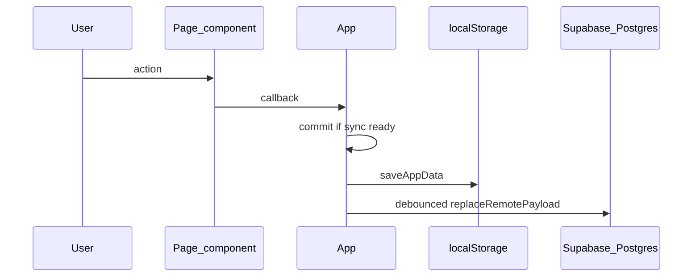

# Architecture

## Overview

Personal Assistant is a client-side React app with optional cloud sync:

- **Vite + React + TypeScript** — SPA build and dev server
- **Vercel** — production hosting (static build output)
- **Supabase Auth** — email/password sign-in; session gate before the app shell
- **Supabase Postgres** — per-user rows for skills, sessions, overrides, events, people, job applications, career targets, workout plans, workout sessions, and focus feedback (RLS-scoped)
- **localStorage** — user-scoped cache (`pa.appData.v1.<userId>`) plus legacy key migration
- **Cloud sync** — `initialSync` on load; debounced `replaceRemotePayload` on mutations when remote sync is enabled

There is no Next.js app router, no CMS, and no custom backend API in this repo. The browser talks to Supabase directly with the public anon key (RLS enforces access).

## Entry and auth flow

```
main.tsx → AuthGate → (signed out) AuthScreen
                    → (signed in)  App(userId)
```

- [`src/auth/AuthGate.tsx`](../src/auth/AuthGate.tsx) — subscribes to Supabase session; renders sign-in or `App`
- [`src/auth/AuthScreen.tsx`](../src/auth/AuthScreen.tsx) — sign up / sign in UI
- [`src/App.tsx`](../src/App.tsx) — data shell (sync, mutations, page routing)

## Folder structure

```
src/
  main.tsx              # React root → AuthGate
  App.tsx               # Sync lifecycle, commit, CRUD, page state
  auth/                 # Auth gate and sign-in screen
  core/                 # Domain model, storage, sync, mappers, pure helpers
    dashboardStats.ts   # Pure dashboard derivations (today/week/timeline)
    events.ts           # Event sorting, upcoming window helpers
    people.ts           # People birthdays, follow-ups, event label resolution
    career.ts           # Job applications pipeline, skill-gap helpers, search/sort
    fitness.ts          # Workout plans/sessions helpers, search/sort, summaries
    focus.ts            # Daily Focus Engine — ranked cross-domain recommendations
    focusFeedback.ts    # Focus dismiss/snooze suppression helpers
    briefing.ts         # Daily Briefing Engine — deterministic NL summaries
    review.ts           # Weekly Review Engine — cross-domain weekly summaries
    progression.ts      # Derived XP, levels, streaks (from sessions; not persisted)
    timeline.ts         # Unified schedule + events timeline
    calendar.ts         # Unified calendar foundation — domain data → CalendarItem range
  lib/                  # Supabase client (VITE_* env only)
  pages/                # Route-like screens (Dashboard, Skills, Events, People, Career, Fitness, Review)
    DashboardPage.tsx   # Composes dashboard sections from props
    ReviewPage.tsx      # Full weekly review breakdown (read-only)
    EventsPage.tsx      # Life events CRUD
    PeoplePage.tsx      # Friends/contacts CRUD
    CareerPage.tsx      # Job applications + dream job target CRUD
    FitnessPage.tsx     # Workout plans + completed session CRUD
  components/
    layout/             # AppShell, NavButton
    dashboard/          # Dashboard sections and shared widgets
    people/             # People page cards, toolbar, form
    career/             # Career page forms, cards, skill picker
    fitness/            # Fitness page forms, cards, exercise editor
    skills/             # SkillEditor, GoalInput
  ui/                   # Shared styles and display helpers
```

| Path | Responsibility |
|------|----------------|
| `src/auth` | Authentication UI and session gate |
| `src/core` | Business logic, validation, `localStorage`, remote sync, DB mappers |
| `src/lib` | `createClient` for Supabase (public env vars only) |
| `src/pages` | Presentational pages; props in, callbacks out |
| `src/components/layout` | App chrome (header, nav, banners) |
| `src/components/dashboard` | Presentational dashboard sections (`TodayHero`, timeline, progress, weekly preview, career pipeline) |
| `src/components/people` | People-specific UI building blocks |
| `src/components/career` | Career-specific UI building blocks |
| `src/components/fitness` | Fitness-specific UI building blocks |
| `src/components/skills` | Skills-specific UI building blocks |
| `src/ui` | `appStyles`, `format` helpers (no domain rules) |

## Architecture boundaries

### AuthGate

- Owns whether the user sees `AuthScreen` or `App`
- Passes `userId` and `onSignOut` into `App`
- Does not read or write app payload data

### App (`src/App.tsx`)

- Owns `AppData` state, loading/error/sync UI flags, and internal `page` state (`dashboard` \| `skills` \| `events` \| `people` \| `career` \| `fitness` \| `review`)
- Runs `initialSync` on mount; guards mutations with `syncReadyRef`
- All writes go through `commit` → `saveAppData(userId)` → debounced remote persist
- Defines CRUD handlers passed to pages as callbacks
- Does not embed large page UIs (those live under `src/pages` and `src/components`)

### Pages (`src/pages`)

- Presentational: receive slices of `app.payload` and callbacks
- Must not call `saveAppData`, `initialSync`, or `replaceRemotePayload` directly
- Examples: [`DashboardPage.tsx`](../src/pages/DashboardPage.tsx), [`ReviewPage.tsx`](../src/pages/ReviewPage.tsx), [`SkillsPage`](../src/pages/SkillsPage.tsx), [`EventsPage`](../src/pages/EventsPage.tsx), [`PeoplePage`](../src/pages/PeoplePage.tsx), [`CareerPage`](../src/pages/CareerPage.tsx), [`FitnessPage`](../src/pages/FitnessPage.tsx)
- [`DashboardPage`](../src/pages/DashboardPage.tsx) builds derived data via `core/dashboardStats`, `core/progression`, `core/focus`, `core/review`, and related helpers, then composes visual sections; it does not persist or call sync APIs.
- [`ReviewPage`](../src/pages/ReviewPage.tsx) runs `buildWeeklyReview` in a `useMemo` and renders read-only domain sections; no mutations.

### Components (`src/components`)

- Reusable UI composed by pages or `AppShell`
- Layout: `AppShell`, `NavButton`
- Dashboard ([`src/components/dashboard/`](../src/components/dashboard/)): presentational only — props in, events out; no `saveAppData` or Supabase
- Skills: `SkillEditor`, `GoalInput`

### Core (`src/core`)

- Domain types ([`model.ts`](../src/core/model.ts)), defaults ([`state.ts`](../src/core/state.ts))
- Persistence and backup ([`storage.ts`](../src/core/storage.ts))
- Remote sync policy ([`remoteStorage.ts`](../src/core/remoteStorage.ts), [`syncErrors.ts`](../src/core/syncErrors.ts))
- Row ↔ payload mappers ([`dbMappers.ts`](../src/core/dbMappers.ts))
- Pure helpers: schedule math ([`schedule.ts`](../src/core/schedule.ts)), events ([`events.ts`](../src/core/events.ts)), people ([`people.ts`](../src/core/people.ts)), career ([`career.ts`](../src/core/career.ts)), fitness ([`fitness.ts`](../src/core/fitness.ts)), unified timeline ([`timeline.ts`](../src/core/timeline.ts)), unified calendar ([`calendar.ts`](../src/core/calendar.ts)), daily focus ([`focus.ts`](../src/core/focus.ts)), daily briefing ([`briefing.ts`](../src/core/briefing.ts)), weekly review ([`review.ts`](../src/core/review.ts))
- Dashboard stats ([`dashboardStats.ts`](../src/core/dashboardStats.ts)): `buildSkillDayRows`, `buildTimelineItems`, `totalMinutesToday`, week helpers, progress targets — tested in [`dashboardStats.test.ts`](../src/core/dashboardStats.test.ts)
- Daily focus ([`focus.ts`](../src/core/focus.ts)): `buildDailyFocusSummary` aggregates skills, events, people, career, fitness, and timeline signals into ranked read-only `FocusItem` recommendations — tested in [`focus.test.ts`](../src/core/focus.test.ts). **Not persisted**; recomputed on each dashboard render. Recommendations only (no mutations, notifications, or auto-rescheduling).
  - **`FocusActionType`** — derived action hints (`log_skill_minutes`, `apply_to_job`, `resolve_conflict`, etc.) mapped in [`DailyFocusSection`](../src/components/dashboard/DailyFocusSection.tsx) to existing page navigation handlers.
  - **Derived metadata** on each `FocusItem`: `suggestedActionType`, `actionTargetId`, and `expiresAtIso` — never stored in `AppPayload` or synced to Supabase.
  - **Expiration semantics**: collectors assign per-signal expiry (event end, block end, end of day, +7 days for career, next day for follow-ups). `filterExpiredFocusItems` removes stale items before the dashboard cap is applied.
  - **Cleanup lifecycle**: collect → merge → score → rank → filter expired → slice top N.
- Focus feedback ([`focusFeedback.ts`](../src/core/focusFeedback.ts)): persisted `FocusFeedback` rows in `AppPayload.focusFeedback` and the `focus_feedback` Supabase table — tested in [`focusFeedback.test.ts`](../src/core/focusFeedback.test.ts). A lightweight visibility layer keyed by stable `FocusItem.id`; **never mutates** underlying domain entities (skills, events, people, career, fitness). Feedback history is **UI suppression state only**, not domain data.
  - **Suppression semantics**: `dismissed` hides an item for the rest of the local calendar day (based on `createdAtIso`); `snoozed` hides until `untilIso`. Newest entry per `focusItemId` wins. Expired entries are removed on app load via `cleanupExpiredFeedback`.
  - **Source snapshots**: optional `sourceSnapshot` on `FocusFeedback` stores human-readable focus card text (title + description) at dismiss/snooze time for the **hidden focus review drawer** and future personalization. **Not used** for suppression, matching, or ranking — keyed only by `focusItemId`.
  - **Hidden review drawer**: [`buildHiddenFocusFeedbackItems`](../src/core/focusFeedback.ts) returns derived `HiddenFocusFeedbackItem` DTOs with precomputed `displayLabel`, `actionLabel`, and `expiryLabel`. [`DailyFocusSection`](../src/components/dashboard/DailyFocusSection.tsx) consumes these DTOs only — raw `focusItemId` values are not shown in the UI; missing snapshots fall back to **"Hidden recommendation"**.
  - **Dashboard integration**: [`DashboardPage`](../src/pages/DashboardPage.tsx) filters suppressed items from the globally ranked pool **before** the top-5 slice and passes the visible summary to [`DailyFocusSection`](../src/components/dashboard/DailyFocusSection.tsx). Dismiss, snooze (3h / tomorrow), restore-one, restore-all, and **Review hidden** (inline drawer) commit feedback through `App.tsx`. `buildHiddenFocusFeedbackItems` scopes the drawer to today's ranked focus pool so hidden count and drawer entries stay aligned.
  - **Briefing intentionally ignores suppression**: [`buildDailyBriefing`](../src/core/briefing.ts) reads the unsuppressed `DailyFocusSummary` so narrative and risk flags still reflect underlying signals.
  - **No auto-rescheduling**: feedback only affects Today's Focus visibility; it does not reschedule blocks, events, or reminders.
  - **Future**: persisted dismiss/snooze history could feed AI personalization weights (deferred).
- Daily briefing ([`briefing.ts`](../src/core/briefing.ts)): `buildDailyBriefing` turns derived dashboard state (focus summary, unified timeline day, workload totals, domain slices) into deterministic natural-language summaries — tested in [`briefing.test.ts`](../src/core/briefing.test.ts). **Not persisted**; recomputed on each dashboard render. No AI APIs.
  - **Relationship to focus**: briefing **reads** `DailyFocusSummary` plus timeline/workload inputs. Focus remains the actionable ranked list with CTAs; briefing adds narrative paragraphs, secondary suggestion strings (overflow focus items not shown in Today's Focus), and risk flags.
  - **`DailyBriefing` output**: `greeting`, `summary`, `workloadSummary`, `focusSummary`, `recommendations[]` (max 5), `riskFlags[]`, `tone`, `generatedAtIso`.
  - **`tone`**: derived read-only mood for UI styling — `warning` when risk flags exist or workload is heavy; `encouraging` when caught up (no visible focus items and no risk flags); otherwise `neutral`.
  - **Deterministic template variation**: `selectDeterministicTemplate(templates, seed)` picks phrasing from fixed template arrays using a hash of `todayKey`, workload level, and context counts — no randomness, no AI. Used for workload summaries, clear-day copy, on-track focus copy, and recommendation fallbacks.
- Weekly review ([`review.ts`](../src/core/review.ts)): `buildWeeklyReview` aggregates skills, fitness, career, people, events, and focus feedback for the **local calendar week containing today** (Monday–Sunday) — tested in [`review.test.ts`](../src/core/review.test.ts). **Not persisted**; recomputed on dashboard and review page renders. No AI APIs, no mutations, no notifications.
  - **Week boundaries**: reuse `startOfWeekLocal` / `isInLocalWeek` from [`dashboardStats.ts`](../src/core/dashboardStats.ts); date-key fields filtered with the same Monday 00:00 → next Monday exclusive window.
  - **`WeeklyReview` output**: `week` (includes stable `weekKey`, e.g. `2026-W21`), `greeting`, `headline`, `summary`, `wins[]`, `risks[]`, domain sections (`skills` rows include `completionRate`), `tone`, `generatedAtIso`. Section visibility helpers (`isSkillsSectionVisible`, etc.) live in `review.ts` for UI reuse.
  - **Focus feedback analytics**: weekly dismiss/snooze counts grouped by `focusItemId` from persisted `FocusFeedback` rows (`createdAtIso` in week); labels from `sourceSnapshot`. Daily ranked focus history is **not** stored — only feedback history.
  - **UI surfaces**: compact [`WeeklyReviewSection`](../src/components/dashboard/WeeklyReviewSection.tsx) on the dashboard (after daily briefing); full breakdown on [`ReviewPage`](../src/pages/ReviewPage.tsx) via nav tab **Review**.
  - **Future**: `WeeklyReviewContext` for AI “explain my week”, prior-week deltas, persisted reflection notes (deferred).
- Progression ([`progression.ts`](../src/core/progression.ts)): lifetime XP (1 XP = 1 logged minute), linear level bands (`XP_PER_LEVEL_BAND`), per-skill and global streaks — tested in [`progression.test.ts`](../src/core/progression.test.ts). **Not stored** in Postgres or `AppPayload`; recomputed from `sessions` on each render. Streak rule: meet `dailyGoalMinutes` when set, else any minutes > 0; global streak counts a day if **any** skill qualifies.

### Unified calendar foundation

- Calendar foundation ([`calendar.ts`](../src/core/calendar.ts)): `buildCalendarItemsForRange` converts skills, life events, people birthdays, and optional fitness history into common `CalendarItem` rows for an inclusive `YYYY-MM-DD` date range — tested in [`calendar.test.ts`](../src/core/calendar.test.ts). **Not persisted**; pure derivation with no side effects, recomputed on demand. Built for future Outlook-like week/month dashboard views; no UI in this layer.
  - **`CalendarItem`**: stable `id`, `sourceType` (`skill` \| `event` \| `people` \| `fitness` \| `career`), `sourceId`, `title`, `date`, optional `startTime`/`endTime`, derived `isTimed`/`allDay`/`isMultiDay`, theming hooks (`categoryKey`, optional `subcategoryKey`/`colorKey`/`iconKey`), optional `description`, and a discriminated `sourceMeta` carrying original domain fields.
  - **Source mapping**: skill weekly blocks expand per date in range; life events convert directly (timed range, start-only marker, or all-day); people birthdays expand `birthdayMonthDay` per intersecting year (Feb 29 → Feb 28 in non-leap years, matching [`people.ts`](../src/core/people.ts)); workout sessions with `completedAtIso` become opt-in historical timed items.
  - **Birthday dedupe**: a person birthday is skipped when a matching `birthday` life event exists on the same date (linked by `personId` or name), so the explicit event wins.
  - **Sorting**: mirrors [`compareUnifiedTimelineItems`](../src/core/timeline.ts) — date, then time tier (timed range → start-only → all-day), then start/end time, then source order (`skill` → `event` → `people` → `fitness`), then title, then `id`. `groupCalendarItemsByDate` buckets sorted items per day for UI.
  - **Relationship to timeline**: [`timeline.ts`](../src/core/timeline.ts) remains the today-focused merge with conflict/workload detection; `calendar.ts` is the broader multi-day DTO. `career` is reserved in the union but emits nothing yet — career interviews/deadlines flow through `sourceType` `event`.
  - **Future**: scheduled fitness workouts, recurrence expansion before sorting, persisted category/color preferences, and dashboard week/month views — see Phase 18 plan deferred items.

### Dashboard (`DashboardPage` + `components/dashboard`)

[`DashboardPage`](../src/pages/DashboardPage.tsx) receives `skills`, `sessions`, `events`, `people`, `jobApplications`, `careerTarget`, `workoutPlans`, `workoutSessions`, `focusFeedback`, focus feedback callbacks, and `onAddSession` from `App`, runs pure calculations in [`dashboardStats.ts`](../src/core/dashboardStats.ts), [`progression.ts`](../src/core/progression.ts), [`focus.ts`](../src/core/focus.ts), [`focusFeedback.ts`](../src/core/focusFeedback.ts), [`briefing.ts`](../src/core/briefing.ts), [`review.ts`](../src/core/review.ts), [`events.ts`](../src/core/events.ts), [`people.ts`](../src/core/people.ts), [`career.ts`](../src/core/career.ts), and [`fitness.ts`](../src/core/fitness.ts), then composes visual sections top to bottom:

1. **ProgressionHero** — account level, lifetime XP, global streak, level progress bar (hidden when no skills)
2. **TodayHero** — daily total, on-track / overdue / idle counts, aggregate progress bar
3. **DailyBriefingSection** — deterministic assistant-style greeting, day summary paragraphs (tone-aware styling), secondary suggestions, and risk flags (no CTAs)
4. **WeeklyReviewSection** — weekly greeting, summary, top wins/risks, and “View weekly review” navigation (tone-aware styling)
5. **DailyFocusSection** — top 5 ranked cross-domain focus items (after suppression filter) with urgency labels, contextual CTAs from `FocusActionType`, dismiss/snooze controls, hidden-count footer with **Review hidden** inline drawer (restore individual suppressed items), restore-all, skill quick-log, and deep-links to domain pages
6. **UpcomingEventsSection** — next 14 days of life events (up to 10 items)
7. **PeopleRemindersSection** — upcoming birthdays and contacts needing follow-up (hidden when empty)
8. **CareerActionsSection** — saved-to-apply count, needs-attention items, interview pipeline, recent applications, and “View career” navigation (hidden when empty)
9. **FitnessSummarySection** — sessions logged this week, last workout summary, recent session lines, and “View fitness” navigation (hidden when empty)
10. **UnifiedTimelineSection** — today’s merged schedule blocks and timed/untimed events
11. **OverdueBehindSection** — skills behind schedule with quick log
12. **SkillProgressSection** — per-skill level, streak, lifetime XP bar, and today goal progress
13. **WeeklyPreviewSection** — weekly goal progress (hidden when no skill has `weeklyGoalMinutes`)

Shared widgets in the same folder: `ProgressBar`, `QuickLogControls`, `SkillProgressRow`, `TimelineRow`, `UnifiedTimelineRow`, `ProgressionHero`. Display formatting uses [`ui/format.ts`](../src/ui/format.ts) (`formatMinutes`, `formatLevel`, `formatXp`, `priorityEmoji`); layout tokens live in [`ui/appStyles.ts`](../src/ui/appStyles.ts).

### People domain

- **`Person`** records store name, optional birthday (`birthdayMonthDay`), preferences (likes/dislikes), gift ideas, notes, and relationship maintenance fields (`lastContactDate`, `contactCadenceDays`).
- **`LifeEvent.personId`** optionally links events to a person; legacy **`personName`** strings remain supported for older events and backup readability.
- Display uses `resolveEventPersonLabel` in [`people.ts`](../src/core/people.ts): linked person name wins, then `personName`.
- Future AI extension points (not implemented): `PersonContext` bundle for prompts, message drafting, gift suggestions, proactive nudges, CSV/vCard import — see header comment in `people.ts`.

### Career domain

- **`JobApplication`** records store company, role title, pipeline status, salary range (USD), location, remote policy, applied date, posting URL, notes, and required skills (`requiredSkillIds` linked to `Skill.id`, plus optional `requiredSkillsText` for untracked requirements).
- **`CareerTarget`** is an optional singleton dream-job target (role, company, notes, required skills) stored in `AppPayload.careerTarget` and synced to the `career_targets` table (one row per user).
- Skill-gap display uses pure helpers in [`career.ts`](../src/core/career.ts): linked skills resolve to tracker names; free-text requirements show as “not yet in tracker”; `buildSkillGapPriorityList` orders focus items for the Career page.
- Follow-up awareness uses `appliedDate` and `updatedAtIso` (no extra fields): `buildApplicationsNeedingAttention` flags saved bookmarks, stale applied roles (≥14 days), and stuck interview stages (≥21 days); quick status transitions call existing `onUpdateApplication`.
- Deleting a skill strips its id from application and target `requiredSkillIds` in the same `commit` (mirrors person unlink on events).
- Future AI extension points (not implemented): `CareerContext` bundle, job-posting parse, cover-letter draft, learning-plan nudges — see header comment in `career.ts`.

### Fitness domain

- **`WorkoutPlan`** records store a reusable template: name, optional focus (`push`, `pull`, `legs`, `full_body`, `cardio`, `mobility`), notes, and embedded **`ExerciseEntry[]`** (name, sets, reps, weight, notes).
- **`WorkoutSession`** records store a completed workout: date (`YYYY-MM-DD`), optional focus, optional `planId` link, optional `durationMinutes` (positive integer), optional `completedAtIso` (set automatically when logging a new session), notes, and embedded exercise entries (copied from a plan or entered manually).
- Exercises are embedded in plans/sessions as jsonb arrays (no separate exercise catalog table in v1).
- Pure helpers in [`fitness.ts`](../src/core/fitness.ts): focus labels, search/sort, week summary (including optional duration totals), plan→session copy (`createSessionDraftFromPlan`), recent exercise name collection for form autocomplete.
- Deleting a plan clears `planId` on linked sessions in the same `commit` (mirrors person unlink on events).
- Future phases (not implemented): calorie tracker, supplement tracker, plan scheduling, PR analytics — see Phase 13 plan deferred items.

## Data flow



**Load path:** `AuthGate` → `App` → `initialSync(userId)` merges remote vs local → `saveAppData` → render pages.

**Backup:** Export/import JSON via `exportBackup` / `importBackup` in `storage.ts` (invoked from `AppShell` actions in `App`).

## Navigation

Internal tab state only (`useState<Page>` in `App`); no React Router yet. `AppShell` renders nav buttons; `App` switches page children inside `<main>`.

To add a section later: extend `Page` in [`src/pages/types.ts`](../src/pages/types.ts), add a page component, wire nav in `AppShell`, and add mutations in `App` that use `commit`.

## Environment variables

Client-only (Vite `import.meta.env`):

| Variable | Purpose |
|----------|---------|
| `VITE_SUPABASE_URL` | Supabase project URL |
| `VITE_SUPABASE_ANON_KEY` | Public anon key (RLS required) |
| `VITE_ENABLE_REMOTE_SYNC` | Optional; set to `"false"` to disable cloud writes |

Never commit real values. Use `.env.local` locally and Vercel project settings in production. Do not put service-role keys in client code.

## Bundle and modularization notes

The production build currently emits a single main JS chunk (~590 KB minified; Vite warns when chunks exceed 500 KB). **This warning is non-blocking** — the app builds and runs correctly today.

Likely future code-split points (not implemented yet):

- [`CareerPage`](../src/pages/CareerPage.tsx) — forms, cards, skill picker
- [`FitnessPage`](../src/pages/FitnessPage.tsx) — workout editor and session history
- [`PeoplePage`](../src/pages/PeoplePage.tsx) — contact cards and follow-up tooling
- [`EventsPage`](../src/pages/EventsPage.tsx) — life events CRUD
- Dashboard heavy derived widgets — focus/briefing engines are pure and cheap; page-level lazy loading of domain screens is the higher-yield split

No Vite config or `React.lazy` changes in the current phase; revisit when adding routes or new large dependencies.

## Deployment

- Build: `npm run build` → `dist/`
- Hosted on Vercel; configure the same `VITE_*` variables in the project
- [`vite.config.ts`](../vite.config.ts) `base` must match the deployed path if the app is not served from domain root

## Testing

- Unit tests live next to core modules (e.g. `dbMappers.test.ts`, `career.test.ts`, `fitness.test.ts`, `focus.test.ts`, `briefing.test.ts`, `review.test.ts`, `dashboardStats.test.ts`, `progression.test.ts`)
- Run `npm test`, `npm run lint`, and `npm run build` before merging structural changes
