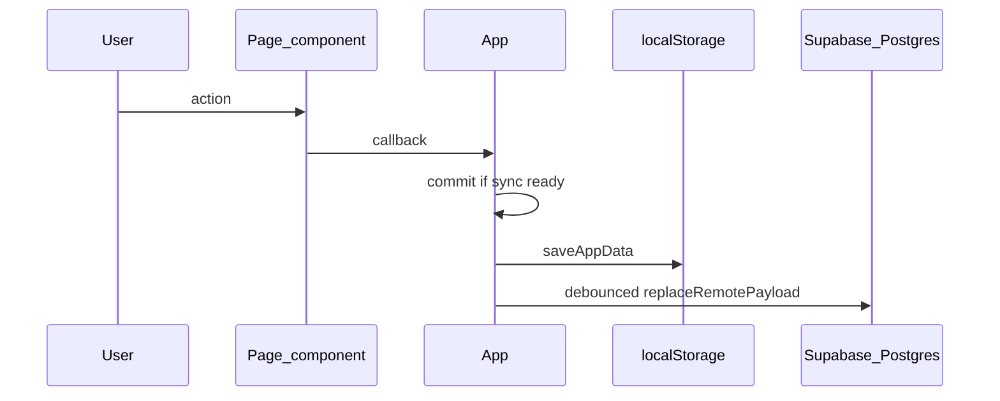

# Architecture

## Overview

Personal Assistant is a client-side React app with optional cloud sync:

- **Vite + React + TypeScript** — SPA build and dev server
- **Vercel** — production hosting (static build output)
- **Supabase Auth** — email/password sign-in; session gate before the app shell
- **Supabase Postgres** — per-user rows for skills, sessions, overrides, events, people, job applications, and career targets (RLS-scoped)
- **localStorage** — user-scoped cache (`pa.appData.v1.<userId>`) plus legacy key migration
- **Cloud sync** — `initialSync` on load; debounced `replaceRemotePayload` on mutations when remote sync is enabled

There is no Next.js app router, no CMS, and no custom backend API in this repo. The browser talks to Supabase directly with the public anon key (RLS enforces access).

## Entry and auth flow

```
main.tsx → AuthGate → (signed out) AuthScreen
                    → (signed in)  App(userId)
```

- [`src/auth/AuthGate.tsx`](../src/auth/AuthGate.tsx) — subscribes to Supabase session; renders sign-in or `App`
- [`src/auth/AuthScreen.tsx`](../src/auth/AuthScreen.tsx) — sign up / sign in UI
- [`src/App.tsx`](../src/App.tsx) — data shell (sync, mutations, page routing)

## Folder structure

```
src/
  main.tsx              # React root → AuthGate
  App.tsx               # Sync lifecycle, commit, CRUD, page state
  auth/                 # Auth gate and sign-in screen
  core/                 # Domain model, storage, sync, mappers, pure helpers
    dashboardStats.ts   # Pure dashboard derivations (today/week/timeline)
    events.ts           # Event sorting, upcoming window helpers
    people.ts           # People birthdays, follow-ups, event label resolution
    career.ts           # Job applications pipeline, skill-gap helpers, search/sort
    progression.ts      # Derived XP, levels, streaks (from sessions; not persisted)
    timeline.ts         # Unified schedule + events timeline
  lib/                  # Supabase client (VITE_* env only)
  pages/                # Route-like screens (Dashboard, Skills, Events, People, Career)
    DashboardPage.tsx   # Composes dashboard sections from props
    EventsPage.tsx      # Life events CRUD
    PeoplePage.tsx      # Friends/contacts CRUD
    CareerPage.tsx      # Job applications + dream job target CRUD
  components/
    layout/             # AppShell, NavButton
    dashboard/          # Dashboard sections and shared widgets
    people/             # People page cards, toolbar, form
    career/             # Career page forms, cards, skill picker
    skills/             # SkillEditor, GoalInput
  ui/                   # Shared styles and display helpers
```

| Path | Responsibility |
|------|----------------|
| `src/auth` | Authentication UI and session gate |
| `src/core` | Business logic, validation, `localStorage`, remote sync, DB mappers |
| `src/lib` | `createClient` for Supabase (public env vars only) |
| `src/pages` | Presentational pages; props in, callbacks out |
| `src/components/layout` | App chrome (header, nav, banners) |
| `src/components/dashboard` | Presentational dashboard sections (`TodayHero`, timeline, progress, weekly preview, career pipeline) |
| `src/components/people` | People-specific UI building blocks |
| `src/components/career` | Career-specific UI building blocks |
| `src/components/skills` | Skills-specific UI building blocks |
| `src/ui` | `appStyles`, `format` helpers (no domain rules) |

## Architecture boundaries

### AuthGate

- Owns whether the user sees `AuthScreen` or `App`
- Passes `userId` and `onSignOut` into `App`
- Does not read or write app payload data

### App (`src/App.tsx`)

- Owns `AppData` state, loading/error/sync UI flags, and internal `page` state (`dashboard` \| `skills` \| `events` \| `people` \| `career`)
- Runs `initialSync` on mount; guards mutations with `syncReadyRef`
- All writes go through `commit` → `saveAppData(userId)` → debounced remote persist
- Defines CRUD handlers passed to pages as callbacks
- Does not embed large page UIs (those live under `src/pages` and `src/components`)

### Pages (`src/pages`)

- Presentational: receive slices of `app.payload` and callbacks
- Must not call `saveAppData`, `initialSync`, or `replaceRemotePayload` directly
- Examples: [`DashboardPage.tsx`](../src/pages/DashboardPage.tsx), [`SkillsPage`](../src/pages/SkillsPage.tsx), [`EventsPage`](../src/pages/EventsPage.tsx), [`PeoplePage`](../src/pages/PeoplePage.tsx), [`CareerPage`](../src/pages/CareerPage.tsx)
- [`DashboardPage`](../src/pages/DashboardPage.tsx) builds derived data via `core/dashboardStats` and `core/progression`, then composes visual sections; it does not persist or call sync APIs.

### Components (`src/components`)

- Reusable UI composed by pages or `AppShell`
- Layout: `AppShell`, `NavButton`
- Dashboard ([`src/components/dashboard/`](../src/components/dashboard/)): presentational only — props in, events out; no `saveAppData` or Supabase
- Skills: `SkillEditor`, `GoalInput`

### Core (`src/core`)

- Domain types ([`model.ts`](../src/core/model.ts)), defaults ([`state.ts`](../src/core/state.ts))
- Persistence and backup ([`storage.ts`](../src/core/storage.ts))
- Remote sync policy ([`remoteStorage.ts`](../src/core/remoteStorage.ts), [`syncErrors.ts`](../src/core/syncErrors.ts))
- Row ↔ payload mappers ([`dbMappers.ts`](../src/core/dbMappers.ts))
- Pure helpers: schedule math ([`schedule.ts`](../src/core/schedule.ts)), events ([`events.ts`](../src/core/events.ts)), people ([`people.ts`](../src/core/people.ts)), career ([`career.ts`](../src/core/career.ts)), unified timeline ([`timeline.ts`](../src/core/timeline.ts))
- Dashboard stats ([`dashboardStats.ts`](../src/core/dashboardStats.ts)): `buildSkillDayRows`, `buildTimelineItems`, `totalMinutesToday`, week helpers, progress targets — tested in [`dashboardStats.test.ts`](../src/core/dashboardStats.test.ts)
- Progression ([`progression.ts`](../src/core/progression.ts)): lifetime XP (1 XP = 1 logged minute), linear level bands (`XP_PER_LEVEL_BAND`), per-skill and global streaks — tested in [`progression.test.ts`](../src/core/progression.test.ts). **Not stored** in Postgres or `AppPayload`; recomputed from `sessions` on each render. Streak rule: meet `dailyGoalMinutes` when set, else any minutes > 0; global streak counts a day if **any** skill qualifies.

### Dashboard (`DashboardPage` + `components/dashboard`)

[`DashboardPage`](../src/pages/DashboardPage.tsx) receives `skills`, `sessions`, `events`, `people`, `jobApplications`, and `onAddSession` from `App`, runs pure calculations in [`dashboardStats.ts`](../src/core/dashboardStats.ts), [`progression.ts`](../src/core/progression.ts), [`events.ts`](../src/core/events.ts), [`people.ts`](../src/core/people.ts), and [`career.ts`](../src/core/career.ts), then composes visual sections top to bottom:

1. **ProgressionHero** — account level, lifetime XP, global streak, level progress bar (hidden when no skills)
2. **TodayHero** — daily total, on-track / overdue / idle counts, aggregate progress bar
3. **UpcomingEventsSection** — next 14 days of life events (up to 10 items)
4. **PeopleRemindersSection** — upcoming birthdays and contacts needing follow-up (hidden when empty)
5. **CareerActionsSection** — saved-to-apply count, needs-attention items, interview pipeline, recent applications, and “View career” navigation (hidden when empty)
6. **UnifiedTimelineSection** — today’s merged schedule blocks and timed/untimed events
7. **OverdueBehindSection** — skills behind schedule with quick log
8. **SkillProgressSection** — per-skill level, streak, lifetime XP bar, and today goal progress
9. **WeeklyPreviewSection** — weekly goal progress (hidden when no skill has `weeklyGoalMinutes`)

Shared widgets in the same folder: `ProgressBar`, `QuickLogControls`, `SkillProgressRow`, `TimelineRow`, `UnifiedTimelineRow`, `ProgressionHero`. Display formatting uses [`ui/format.ts`](../src/ui/format.ts) (`formatMinutes`, `formatLevel`, `formatXp`, `priorityEmoji`); layout tokens live in [`ui/appStyles.ts`](../src/ui/appStyles.ts).

### People domain

- **`Person`** records store name, optional birthday (`birthdayMonthDay`), preferences (likes/dislikes), gift ideas, notes, and relationship maintenance fields (`lastContactDate`, `contactCadenceDays`).
- **`LifeEvent.personId`** optionally links events to a person; legacy **`personName`** strings remain supported for older events and backup readability.
- Display uses `resolveEventPersonLabel` in [`people.ts`](../src/core/people.ts): linked person name wins, then `personName`.
- Future AI extension points (not implemented): `PersonContext` bundle for prompts, message drafting, gift suggestions, proactive nudges, CSV/vCard import — see header comment in `people.ts`.

### Career domain

- **`JobApplication`** records store company, role title, pipeline status, salary range (USD), location, remote policy, applied date, posting URL, notes, and required skills (`requiredSkillIds` linked to `Skill.id`, plus optional `requiredSkillsText` for untracked requirements).
- **`CareerTarget`** is an optional singleton dream-job target (role, company, notes, required skills) stored in `AppPayload.careerTarget` and synced to the `career_targets` table (one row per user).
- Skill-gap display uses pure helpers in [`career.ts`](../src/core/career.ts): linked skills resolve to tracker names; free-text requirements show as “not yet in tracker”; `buildSkillGapPriorityList` orders focus items for the Career page.
- Follow-up awareness uses `appliedDate` and `updatedAtIso` (no extra fields): `buildApplicationsNeedingAttention` flags saved bookmarks, stale applied roles (≥14 days), and stuck interview stages (≥21 days); quick status transitions call existing `onUpdateApplication`.
- Deleting a skill strips its id from application and target `requiredSkillIds` in the same `commit` (mirrors person unlink on events).
- Future AI extension points (not implemented): `CareerContext` bundle, job-posting parse, cover-letter draft, learning-plan nudges — see header comment in `career.ts`.

## Data flow



**Load path:** `AuthGate` → `App` → `initialSync(userId)` merges remote vs local → `saveAppData` → render pages.

**Backup:** Export/import JSON via `exportBackup` / `importBackup` in `storage.ts` (invoked from `AppShell` actions in `App`).

## Navigation

Internal tab state only (`useState<Page>` in `App`); no React Router yet. `AppShell` renders nav buttons; `App` switches page children inside `<main>`.

To add a section later: extend `Page` in [`src/pages/types.ts`](../src/pages/types.ts), add a page component, wire nav in `AppShell`, and add mutations in `App` that use `commit`.

## Environment variables

Client-only (Vite `import.meta.env`):

| Variable | Purpose |
|----------|---------|
| `VITE_SUPABASE_URL` | Supabase project URL |
| `VITE_SUPABASE_ANON_KEY` | Public anon key (RLS required) |
| `VITE_ENABLE_REMOTE_SYNC` | Optional; set to `"false"` to disable cloud writes |

Never commit real values. Use `.env.local` locally and Vercel project settings in production. Do not put service-role keys in client code.

## Deployment

- Build: `npm run build` → `dist/`
- Hosted on Vercel; configure the same `VITE_*` variables in the project
- [`vite.config.ts`](../vite.config.ts) `base` must match the deployed path if the app is not served from domain root

## Testing

- Unit tests live next to core modules (e.g. `dbMappers.test.ts`, `career.test.ts`, `dashboardStats.test.ts`, `progression.test.ts`)
- Run `npm test`, `npm run lint`, and `npm run build` before merging structural changes
