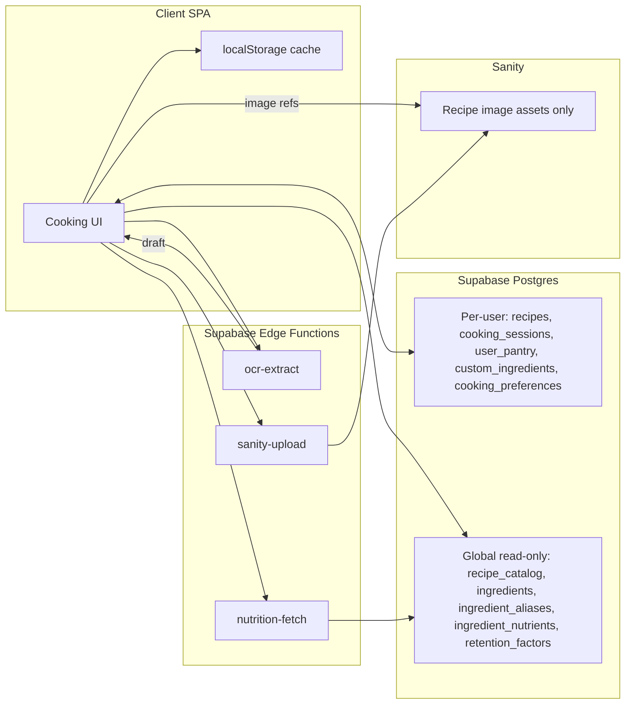
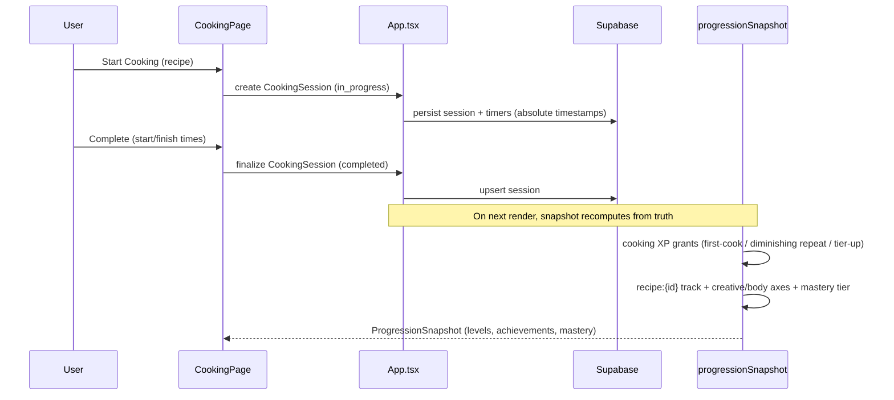

# Cooking Architecture Document

This document describes the end-to-end architecture for the Cooking domain and how it maps onto the existing Personal Assistant codebase.

## 1. Existing app context (what we build on)

- **Stack**: React 19 + TypeScript, Vite 7 SPA. Hosted on Vercel (static output).
- **No router**: navigation is a `Page` string union in [`src/pages/types.ts`](../../src/pages/types.ts) + `useState` in [`src/App.tsx`](../../src/App.tsx); nav items in [`src/components/layout/AppShell.tsx`](../../src/components/layout/AppShell.tsx).
- **State**: centralized in `App.tsx`. No Redux/Zustand/react-query. Pages receive data + callbacks as props.
- **Persistence**: Supabase Postgres (per-user rows, RLS) + localStorage cache (`pa.appData.v1.<userId>`). All queries centralized in [`src/core/remoteStorage.ts`](../../src/core/remoteStorage.ts); row↔model mapping in [`src/core/dbMappers.ts`](../../src/core/dbMappers.ts).
- **Styling**: inline style objects in [`src/ui/appStyles.ts`](../../src/ui/appStyles.ts) + CSS variables. No Tailwind/CSS modules.
- **Gamification**: derived (never persisted) via [`src/core/progressionSnapshot.ts`](../../src/core/progressionSnapshot.ts). Only UX acknowledgements persist in `gamification_state`.
- **Tests**: Vitest, co-located `src/**/*.test.ts`, run with `npm test`.
- **No backend API, no CMS, no service worker today.** Sanity is referenced in [`docs/decisions.md`](../decisions.md) but is not wired up.

## 2. Data store strategy

Cooking spans three stores. The split is a locked decision (see README):



### Supabase (source of truth for all text/structured data)

- **Per-user tables** (RLS, `user_id`): `recipes`, `cooking_sessions`, `user_pantry`, `custom_ingredients`, `cooking_preferences` (singleton).
- **Global tables** (no `user_id`; RLS allows SELECT to all authenticated, writes restricted to seed/service role): `recipe_catalog`, `ingredients`, `ingredient_aliases`, `ingredient_nutrients`, `retention_factors`.

See [`04-supabase-schema.md`](04-supabase-schema.md) for full DDL.

### Sanity (media assets only)

Sanity is the image CDN/transform layer. It stores recipe image **assets only** (hero, gallery, step photos) for both curated and user recipes. Supabase rows hold Sanity asset references (asset `_ref` or CDN URL). No recipe text, ingredients, steps, or logs live in Sanity.

See [`05-sanity-schema.md`](05-sanity-schema.md).

### Reconciliation note (important)

The two answers given during planning had a deliberate tension: "curated catalog in Sanity" + "Sanity = images only". The reconciliation is:

- **Sanity holds images only** (strict).
- **Curated catalog text content lives in Supabase** `recipe_catalog` (global, read-all-authenticated), with image fields referencing Sanity assets.
- Curated catalog "authoring" happens via seed migrations / an admin process, not Sanity Studio.
- Future option (not in scope): if editorial authoring of the curated catalog is later desired, promote curated recipe *content* into Sanity documents. This would be a new decision record.

## 3. New backend infrastructure: Supabase Edge Functions

Three operations require server-side secrets and must not run in the browser:

| Edge Function | Purpose | Secret | Phase |
| --- | --- | --- | --- |
| `ocr-extract` | OCR image + LLM structured recipe extraction | OpenAI API key | 9 |
| `nutrition-fetch` | Fetch + cache USDA / Open Food Facts data | USDA / OFF keys | 8 |
| `sanity-upload` | Proxy image uploads to Sanity with a scoped write token | Sanity write token | 3 |

Edge Functions are the only new infrastructure. They are isolated to Phases 3, 8, 9 so the core domain (Phases 1-2, 4-6) ships without them.

## 4. Module map (mirrors the Fitness domain)

```
src/
  core/
    model.ts                # + Recipe, RecipeStep, RecipeIngredientLine, CookingSession, CookingTimer, etc.; AppPayload extended
    cooking.ts              # Pure helpers: filter/sort recipes, mastery tiers, availability
    cookingSession.ts       # Pure reducers: guided session + timer state machine
    cookingRewards.ts       # XP grant logic for cooking (or extend rewardCalculation.ts)
    ingredients.ts          # Normalization + matching + confidence (pure)
    nutrition.ts            # Gram conversion, aggregation, retention, confidence (pure)
    recipeImport.ts         # Draft validation/mapping for assisted import (pure)
    dbMappers.ts            # + recipe/session/pantry/etc. Row<->model mappers
    remoteStorage.ts        # + cooking tables in fetch/replace + AppTable union
    calendar.ts             # + cooking collectors (planned + historical)
    calendarColors.ts       # + "cooking" category color + subcategory labels
    focus.ts                # + cooking focus category/reason codes/collector
    review.ts               # + CookingWeekSection
    progressionModel.ts     # + recipe track kind, cooking achievement category/conditions
    achievementCatalog.ts   # + cooking achievements
    questCatalog.ts         # + cooking quests
  pages/
    CookingPage.tsx         # Gallery + detail + create/edit + guided mode entry
    types.ts                # + "cooking" Page
  components/
    cooking/                # RecipeCard, RecipeDetail, RecipeForm, GuidedCookingMode, TimerPanel, ImportWizard, etc.
    dashboard/
      CookingSummarySection.tsx
    layout/AppShell.tsx     # + Cooking nav item
  lib/
    sanityClient.ts         # Sanity client + image-url builder (Phase 3)
supabase/
  migrations/               # New cooking migrations
  functions/                # ocr-extract, nutrition-fetch, sanity-upload (Edge Functions)
```

## 5. Domain data flow (cook → reward)



XP is never written to a totals column. It is recomputed each render from `cooking_sessions`, exactly like Skills/Fitness. See [`03-progression-design.md`](03-progression-design.md).

## 6. Guided cooking + timers (architecture summary)

- An active `CookingSession` (`status: in_progress`) holds `currentStepIndex` and a `timers[]` array.
- Timers use **absolute timestamps** (`endsAtIso`), never countdown counters, so remaining time is correct across refresh and devices.
- State is persisted to Supabase (cross-device source of truth) and localStorage (instant/offline), rehydrated on load.
- Pure reducers in `src/core/cookingSession.ts` make it fully testable.

Full detail: [`09-guided-cooking-architecture.md`](09-guided-cooking-architecture.md).

## 7. Ingredient + nutrition (architecture summary)

- Normalized global `ingredients` + `ingredient_aliases`; matching via Postgres `pg_trgm` with confidence scores.
- `user_pantry` drives "can make now / partial / missing".
- Nutrition computed from `ingredient_nutrients` (USDA per-100g cache) × gram-converted quantities, with retention factors and aggregate confidence.

Full detail: [`07-nutrition-architecture.md`](07-nutrition-architecture.md).

## 8. Cross-cutting integration

Cooking integrates with every major system. Exact files/functions are enumerated in [`11-integration-points.md`](11-integration-points.md):

- **Progression/XP**: `creative` + `body` axes, `recipe:{id}` track.
- **Calendar**: new `cooking` `CalendarCategoryKey`.
- **Dashboard**: `CookingSummarySection` + quick action.
- **Notifications**: Daily Focus items first; Web Push later.
- **Achievements/Quests**: new `cooking` category + conditions.
- **Analytics**: `CookingWeekSection` in the Weekly Review.

## 9. Non-functional considerations

- **Offline-first**: localStorage cache; full payload replace sync (matches `replaceRemotePayload`).
- **Performance**: gallery uses Sanity image transforms for thumbnails; nutrition computed lazily and cached.
- **Security**: secrets only in Edge Functions; RLS on all per-user tables; global tables read-only to clients.
- **Testability**: every derivation is a pure function with co-located Vitest tests.
