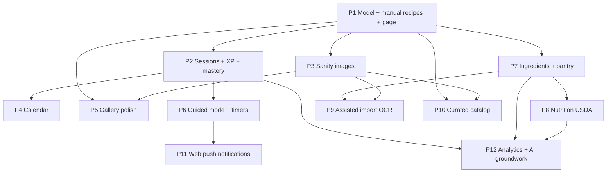

# Cooking Roadmap

Twelve small, independently shippable phases. Each phase: **Goal**, **Scope**, **Acceptance criteria**, **Tests**, **Dependencies**. Phases 1-6 deliver a fully usable cooking domain; Phases 7-12 layer on intelligence and polish.

> Execution rule: ship one phase fully (code + tests + green `npm test`) before starting the next. Do not bundle phases. Keep migrations additive.

## Dependency graph

## Milestones

- **M1 — Usable library (P1-P3)**: create, view, and image recipes; cook and earn XP.
- **M2 — Lived-in domain (P4-P6)**: cooking on the calendar, polished gallery, reliable guided cooking with timers.
- **M3 — Intelligent kitchen (P7-P9)**: ingredient awareness, nutrition, assisted import.
- **M4 — Ecosystem (P10-P12)**: curated catalog, real notifications, analytics + AI groundwork.

---

## Phase 1 — Recipe data model + manual recipes + Cooking page shell

- **Goal**: Establish the `Recipe` model, per-user `recipes` table, manual create/edit/delete, recipe gallery list, recipe detail view, and the `cooking` nav page. No images, no XP yet.
- **Scope**:
  - `Recipe` type + `AppPayload.recipes`; `defaultPayload()` update.
  - Supabase migration: `recipes` table + RLS (copy `skills`/`workout_plans` pattern). Ingredients/steps/equipment as jsonb.
  - `dbMappers.ts`: `recipeToRow`/`recipeFromRow` + validation; `remoteStorage.ts` fetch/replace + `AppTable`.
  - `App.tsx` CRUD handlers; `CookingPage` with gallery (cards) + detail view + manual `RecipeForm`.
  - Nav wiring: `pages/types.ts`, `AppShell.tsx`.
- **Acceptance criteria**:
  - User can create/edit/delete a recipe with title, category, difficulty, experience level, cook time, servings, ingredients (raw text), steps, equipment, notes.
  - Data round-trips through Supabase and survives reload.
  - Gallery renders cards; clicking opens detail; Edit works; Start Cooking button present (no-op stub OK).
- **Tests**: `cooking.test.ts` (filter/label helpers), dbMappers round-trip test, recipe form-state test.
- **Dependencies**: none.

## Phase 2 — Cooking sessions, completion flow, XP + mastery

- **Goal**: Logging a cook grants XP and builds mastery.
- **Scope**:
  - `CookingSession` type + `cooking_sessions` table + mappers/sync.
  - Completion prompt: "Did you cook this? start/finish times" defaulting to estimated duration.
  - XP grants: `creative` (primary) + `body` (secondary) axes; `recipe:{id}` track; first-cook bonus, diminishing repeat, tier-up bonus (see [`03-progression-design.md`](03-progression-design.md)).
  - Count-based mastery tiers + badges + recent-cook streak.
  - `CookingSummarySection` dashboard widget (recent cooks, mastery highlights).
  - Cooking achievements (basic): recipes cooked, distinct recipes.
- **Acceptance criteria**:
  - Completing a session grants XP per the curve; adding a recipe grants 0 XP.
  - Mastery badge/count/streak render and update; tier-up grants one-time bonus.
  - Dashboard shows recent cooking activity.
- **Tests**: reward curve (first vs repeat vs floor vs tier-up), mastery tier derivation, progression snapshot integration, achievement evaluation.
- **Dependencies**: P1.

## Phase 3 — Sanity media infrastructure + recipe images

- **Goal**: Recipes have images.
- **Scope**:
  - Add `@sanity/client` + `@sanity/image-url`; `src/lib/sanityClient.ts`; env vars.
  - `sanity-upload` Edge Function (scoped write token).
  - Hero image + gallery on recipes; thumbnails in gallery; graceful no-image fallback.
- **Acceptance criteria**:
  - User uploads an image; it is stored in Sanity and referenced from the Supabase recipe.
  - Thumbnails and hero render with transforms; absent Sanity env degrades gracefully.
- **Tests**: asset-reference mapper, image-url builder unit tests, upload-function contract test (mocked).
- **Dependencies**: P1.

## Phase 4 — Calendar integration

- **Goal**: Cooking appears on the calendar.
- **Scope**:
  - New `cooking` `CalendarCategoryKey`; color default + sidebar filter + subcategory labels.
  - Planned cooking events (reference recipe, estimated duration, ingredients) + completed sessions as historical items.
  - Collectors in `buildCalendarItemsForRange`; timeline integration.
- **Acceptance criteria**:
  - Planned and completed cooks appear with correct color and a working filter toggle.
  - Completing a cook creates a historical calendar item.
- **Tests**: calendar collector unit tests (planned vs historical), color resolution.
- **Dependencies**: P1, P2.

## Phase 5 — Recipe gallery polish (filter/sort/categories)

- **Goal**: Rich, fast browsing.
- **Scope**: filter + sort by category (Breakfast/Lunch/Dinner/Dessert/Snack/Beverage/Meal Prep), difficulty, experience level, cook time, mastery; richer cards; empty/loading states.
- **Acceptance criteria**: filters/sorts compose correctly and are covered by pure-function tests.
- **Tests**: filter/sort pure functions; combination cases.
- **Dependencies**: P1, P3.

## Phase 6 — Guided cooking mode + multi-timer engine

- **Goal**: Reliable step-by-step cooking with persistent timers.
- **Scope**:
  - Step workflow model (`blocking | parallel | wait | timer`) in the recipe editor.
  - Guided mode: next/back, progress bar; multiple concurrent timers with pause/resume/restart.
  - Persistence across refresh + device via absolute timestamps + Supabase active session; localStorage mirror.
  - Pure reducers in `cookingSession.ts`.
- **Acceptance criteria**:
  - Timers survive refresh and resume correctly on another device.
  - Parallel/wait steps do not block advancing; timer-done raises an in-app alert.
- **Tests**: reducer tests (start/advance/pause/resume/restart/rehydrate/cross-device merge), remaining-time math.
- **Dependencies**: P1, P2.

## Phase 7 — Ingredient normalization + pantry ("can make now")

- **Goal**: Ingredient awareness.
- **Scope**:
  - Global `ingredients` + `ingredient_aliases`; `pg_trgm` extension; matching with confidence.
  - `user_pantry`; availability computation (can make / partial / missing).
  - Recipe ingredient lines store raw text + resolved `ingredient_id` + confidence.
- **Acceptance criteria**:
  - Known aliases/misspellings resolve with sensible confidence (e.g. "tortilla"→"flour tortilla", "bell pepper" variants).
  - Recipe availability computed against pantry.
- **Tests**: normalization + matching + confidence tests; availability computation tests.
- **Dependencies**: P1.

## Phase 8 — Nutrition system (USDA)

- **Goal**: Per-recipe and per-serving nutrition.
- **Scope**:
  - `fdc_id` on ingredients; `ingredient_nutrients` cache; gram conversion + density; retention factors; confidence scoring; `custom_ingredients`; optional Open Food Facts source.
  - `nutrition-fetch` Edge Function (USDA/OFF, cache-on-demand, no full-DB import).
- **Acceptance criteria**:
  - A recipe with resolved ingredients shows per-serving macros with a confidence indicator.
  - Custom ingredients supported; USDA results cached.
- **Tests**: gram conversion, nutrient aggregation, retention application, confidence scoring; cache function contract (mocked).
- **Dependencies**: P7.

## Phase 9 — Assisted import (OCR / paste / vision extraction)

- **Goal**: Draft recipes from photos or pasted text.
- **Scope**:
  - `ocr-extract` Edge Function: OCR (image) + LLM structured extraction → `{title, ingredients[], steps[], cookTime, servings, equipment, notes}`.
  - Ingredient matching on extracted lines; per-field confidence; mandatory review/edit before save.
  - Import wizard UI (camera/upload/paste → review).
- **Acceptance criteria**:
  - Importing a photo/text drafts a structured recipe; low-confidence fields flagged; nothing saves without user confirmation.
- **Tests**: extraction-output validation/parsing, draft mapping, confidence flagging (LLM call mocked).
- **Dependencies**: P1, P7, P3.

## Phase 10 — Curated global catalog

- **Goal**: Starter recipes everyone can browse and clone.
- **Scope**:
  - Global `recipe_catalog` (read-all-authenticated) seeded with starter recipes (images in Sanity).
  - Browse + clone-to-personal (copies content + image refs into `recipes`).
- **Acceptance criteria**:
  - Users browse curated recipes and clone into their private library; clones are independently editable.
- **Tests**: clone mapper, catalog read-access (RLS) test.
- **Dependencies**: P1, P3.

## Phase 11 — Real notifications (timers + scheduled cooks)

- **Goal**: Notifications that work when the tab is backgrounded.
- **Scope**: service worker + Web Notifications for timer-done and "time to start cooking"; permission flow; fallback to in-app focus items.
- **Acceptance criteria**: a finished timer notifies even when backgrounded (where supported); graceful fallback otherwise.
- **Tests**: scheduling logic unit tests; permission-state handling.
- **Dependencies**: P6.

## Phase 12 — Analytics, weekly review, AI groundwork

- **Goal**: Cooking shows up in analytics and lays groundwork for AI.
- **Scope**:
  - `CookingWeekSection` in `review.ts`; cooking quests + remaining achievements.
  - AI groundwork doc execution: data shapes for suggestions/meal planning (see [`13-future-ai.md`](13-future-ai.md)).
- **Acceptance criteria**: weekly review surfaces cooking wins/risks; cooking achievements unlock; AI opportunities documented with dependencies.
- **Tests**: week-section builder, achievement condition evaluation.
- **Dependencies**: P2, P7, P8.

---

## Sequencing guidance

- **Critical path to value**: P1 → P2 → (P3, P4, P6 in any order).
- **Defer infra**: P8/P9 (Edge Functions for USDA/OpenAI) only after the core domain is stable.
- **P7 is a prerequisite** for both nutrition (P8) and high-quality import matching (P9); do it before either.
- **P11 and P12** are enhancements; safe to schedule last.
