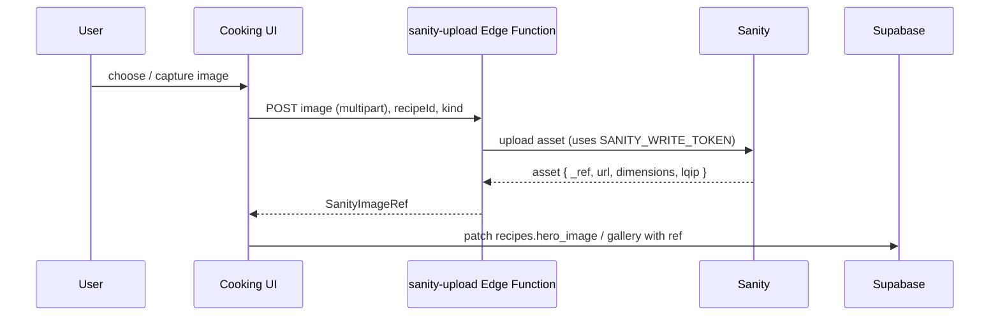

# Cooking Sanity Schema Proposal

Sanity is introduced as the **media/asset store only** for recipe images. This is a locked decision (see [`README.md`](README.md) and [`01-architecture.md`](01-architecture.md)). Recipe text, ingredients, steps, logs, and nutrition all live in Supabase.

> Sanity is currently **not wired up** in this repo — it appears only as a historical entry in [`docs/decisions.md`](../decisions.md). Phase 3 introduces it as new infrastructure.

## 1. Why Sanity for images (and not recipe content)

- Sanity provides a strong **image pipeline**: CDN delivery, on-the-fly transforms (resize/crop/format/quality), hotspot/crop, and LQIP placeholders — ideal for a thumbnail-heavy gallery.
- Keeping **only images** in Sanity avoids the hard problems of per-user UGC in a CMS: Sanity has no per-user row-level security, and client-side document writes require broad tokens. By contrast, Supabase RLS already secures per-user recipe data.
- Recipes are created in-app (manual, OCR, paste). Their structured content belongs in Supabase where it is validated, queried, and synced. Images are large binaries best served from a CDN.

## 2. What Sanity stores

A single lightweight document type wrapping an image asset, used by both user recipes and the curated catalog. In practice you may not even need a custom document type — Sanity assets (`sanity.imageAsset`) can be uploaded directly and referenced. The optional `recipeImage` document adds metadata (alt text, attribution, step linkage).

```ts
// sanity/schemas/recipeImage.ts (Phase 3) — optional wrapper; assets alone may suffice
import { defineType, defineField } from 'sanity'

export const recipeImage = defineType({
  name: 'recipeImage',
  title: 'Recipe Image',
  type: 'document',
  fields: [
    defineField({
      name: 'image',
      title: 'Image',
      type: 'image',
      options: { hotspot: true },          // enables crop/hotspot transforms
    }),
    defineField({ name: 'alt', title: 'Alt text', type: 'string' }),
    defineField({
      name: 'kind',
      title: 'Kind',
      type: 'string',
      options: { list: ['hero', 'gallery', 'step'] },
    }),
    // Soft linkage back to Supabase (Sanity does not own recipe content):
    defineField({ name: 'supabaseRecipeId', title: 'Supabase Recipe ID', type: 'string' }),
    defineField({ name: 'stepId', title: 'Step ID (for step images)', type: 'string' }),
    defineField({ name: 'attribution', title: 'Attribution', type: 'string' }),
  ],
})
```

> Recommended minimal approach: upload bare image assets and store the resulting asset reference + CDN URL in Supabase. Use the `recipeImage` document only if you want searchable image metadata in Sanity Studio. Either way, **the recipe is owned by Supabase**.

## 3. How Supabase references Sanity images

Supabase `recipes.hero_image` / `recipes.gallery[]` (and `recipe_catalog` equivalents) store a small JSON ref:

```ts
export type SanityImageRef = {
  assetRef: string;     // Sanity asset _ref, e.g. "image-abc123-1200x800-jpg"
  url: string;          // canonical CDN url (fallback if image-url builder unused)
  lqip?: string;        // low-quality placeholder data URL (optional)
  width?: number;
  height?: number;
  alt?: string;
};
```

The client renders via `@sanity/image-url` to request sized/cropped variants (thumbnails for the gallery, large for hero).

## 4. Client setup (Phase 3)

```ts
// src/lib/sanityClient.ts
import { createClient } from '@sanity/client'
import imageUrlBuilder from '@sanity/image-url'

const projectId = import.meta.env.VITE_SANITY_PROJECT_ID
const dataset = import.meta.env.VITE_SANITY_DATASET ?? 'production'

export const sanity = createClient({
  projectId,
  dataset,
  apiVersion: '2026-01-01',
  useCdn: true,                 // read-only, CDN-cached
  // NO token in the browser — reads are public CDN; writes go through Edge Function
})

const builder = imageUrlBuilder({ projectId, dataset })
export function imageUrlFor(ref: { assetRef: string }) {
  return builder.image(ref.assetRef)
}
```

Env vars (add to `.env` / Vercel): `VITE_SANITY_PROJECT_ID`, `VITE_SANITY_DATASET`. Server-only write token (`SANITY_WRITE_TOKEN`) lives in the Edge Function environment, never in `VITE_*`.

## 5. Upload flow (write path via Edge Function)

Browsers must not hold a Sanity write token. Uploads go through the `sanity-upload` Edge Function:



The Edge Function authenticates the caller via the Supabase JWT (verify `user_id`) and may enforce per-user upload quotas.

## 6. Graceful degradation

- If `VITE_SANITY_PROJECT_ID` is unset, the gallery and detail views render text-only cards with a placeholder; image upload UI is hidden.
- This keeps Phases 1-2 fully functional before Sanity exists, and keeps local/dev environments working without Sanity credentials.

## 7. Dataset / Studio

- Use a single `production` dataset. A `recipe-images` Studio (optional) lets an admin curate catalog imagery and manage `recipeImage` metadata.
- The curated catalog text content lives in Supabase `recipe_catalog`; its images live here in Sanity, referenced by `hero_image`/`gallery`.

## 8. Cost / limits

- Sanity free tier covers asset storage + CDN bandwidth for a personal app. Monitor bandwidth as the gallery grows; rely on transforms (small thumbnails) to keep transfer low.
- Only images are stored; no document-count pressure from recipe content.

## 9. Testing (Phase 3)

- `imageUrlFor` builds expected transform URLs from an `assetRef`.
- Supabase mapper round-trips `SanityImageRef` (hero + gallery arrays).
- `sanity-upload` contract test (mocked Sanity client): returns a well-formed `SanityImageRef`; rejects unauthenticated callers.
- Degradation: with Sanity env unset, gallery renders placeholders and upload UI is hidden.

## 10. Future option (out of scope)

If editorial authoring of the curated catalog is later desired, the catalog's **content** could be promoted into Sanity documents (a `recipe` document type), with the app reading curated recipes via GROQ and per-user recipes from Supabase. That would be a new decision record and would relax the "images only" rule for curated content specifically.
