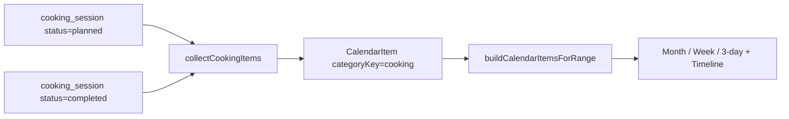

# Cooking Calendar Integration Proposal

How Cooking appears on the calendar and timeline. Implemented in Phase 4.

## 1. Existing calendar model (recap)

- The unified calendar derives `CalendarItem` rows from multiple domains in [`src/core/calendar.ts`](../../src/core/calendar.ts) via `buildCalendarItemsForRange`, using per-domain collectors (`collectEventItems`, `collectSkillItems`, `collectWorkoutScheduleItems`, `collectFitnessItems`, `collectCareerInterviewItems`).
- Top-level categories are `CalendarCategoryKey` in [`src/core/calendarColors.ts`](../../src/core/calendarColors.ts): currently `skill | event | people | fitness | career`.
- Colors resolve by precedence: item override → subcategory → category → fallback. Defaults in `DEFAULT_CATEGORY_COLOR_TOKENS` / `DEFAULT_SUBCATEGORY_COLOR_TOKENS`; labels in `DEFAULT_SUBCATEGORY_LABELS`.
- Sidebar filters use the category list + per-category subcategory toggles.
- Past vs upcoming is **date-only** (no status flag on `LifeEvent`). Fitness distinguishes planned (`WorkoutPlan` schedule) vs historical (`WorkoutSession.completedAtIso`) at the collector level.

## 2. Decision: Cooking is a new calendar category, not a new event type

Add `"cooking"` to `CalendarCategoryKey`. This mirrors how Fitness and Career are top-level categories rather than `event` subtypes. Cooking does **not** add a value to the `EventType` union and does **not** create `LifeEvent` rows.

```ts
// src/core/calendarColors.ts
export type CalendarCategoryKey =
  | "skill"
  | "event"
  | "people"
  | "fitness"
  | "career"
  | "cooking"; // new
```

## 3. Planned vs historical cooks (mirrors Fitness)

Following the Fitness pattern of planned-vs-logged:

- **Planned cook** = a `cooking_session` with `status: 'planned'` (see [`04-supabase-schema.md`](04-supabase-schema.md) Phase 4 Option A) and a future/`cook_date`. It references a recipe, an estimated duration, and (optionally) the ingredients required.
- **Historical cook** = a `cooking_session` with `status: 'completed'`, rendered on its `cook_date`.

Both become `CalendarItem`s via a new collector.



## 4. Collector design

Add to `buildCalendarItemsForRange` a `collectCookingItems(sessions, recipes, range, options)`:

- For each planned session in range: emit a `CalendarItem` with `sourceType: "cooking"`, `categoryKey: "cooking"`, `subcategoryKey: "planned"`, timed if a start time is present (else all-day), `title` = recipe title, duration from `estimated_minutes`.
- For each completed session in range: emit a `CalendarItem` with `categoryKey: "cooking"`, `subcategoryKey: "completed"` (or the recipe `category` as subcategory for finer color control), placed on `cook_date`.
- Gate with options consistent with existing flags, e.g. `includeCookingPlanned` and `includeCookingHistory` (default true), matching `includeWorkoutSchedules` / `includeFitnessHistory`.

`CalendarItemSourceMeta` gains a `kind: "cooking"` variant carrying `sessionId`, `recipeId`, `status`.

## 5. Colors & labels

```ts
// DEFAULT_CATEGORY_COLOR_TOKENS
cooking: "orange.base", // pick an unused palette token (e.g. orange/amber family)

// DEFAULT_SUBCATEGORY_COLOR_TOKENS (optional finer tones)
"cooking:planned": "orange.soft",
"cooking:completed": "orange.base",

// DEFAULT_SUBCATEGORY_LABELS
"cooking:planned": "Planned cooks",
"cooking:completed": "Cooked meals",
```

Confirm the chosen token exists in the palette in `calendarColors.ts`; if not, reuse an existing token (the category must map to a valid `CalendarColorToken`).

## 6. Sidebar filter

Add `cooking` to the category list in the calendar sidebar (`CalendarCategorySidebar`) and to `CALENDAR_*` filter constants in [`src/core/calendarView.ts`](../../src/core/calendarView.ts) so users can toggle planned/completed cooks. User overrides persist in `AppPayload.calendarPreferences` (Supabase `calendar_preferences`), which already supports arbitrary category/subcategory keys.

## 7. Creating a planned cook

Two entry points:

1. From a recipe detail view: "Schedule this cook" → creates a `planned` `cooking_session` with `cook_date` + optional start time + `estimated_minutes` copied from the recipe.
2. From the calendar: a "+ Cook" action opens a recipe picker → creates a planned session.

On completion (guided mode or quick-log), the planned session transitions to `completed`, so it naturally moves from "planned" to "historical" on the same calendar item id (stable id keyed on session id).

## 8. Completion → calendar + analytics

Per the vision, cooking completion can generate a historical cooking event and analytics data. Because XP/mastery/analytics are derived from `cooking_sessions`, completing a session automatically:

- Produces a historical `CalendarItem` (via the collector).
- Feeds XP/mastery (see [`03-progression-design.md`](03-progression-design.md)).
- Feeds the Weekly Review `CookingWeekSection` (see [`11-integration-points.md`](11-integration-points.md)).

## 9. Dashboard timeline

The unified dashboard timeline ([`src/core/timeline.ts`](../../src/core/timeline.ts)) can include planned cooks for "today" so they appear alongside skills/events. Add a cooking item kind to the timeline builder if same-day planned cooks should show in the today strip (optional; calendar coverage may be sufficient for v1).

## 10. Tests (Phase 4)

- `collectCookingItems`: planned future session → planned item; completed session → historical item; range filtering; all-day vs timed.
- Color resolution for `cooking` category and subcategories.
- Sidebar filter toggling hides/shows cooking items.
- Planned → completed transition keeps a stable calendar item id.
