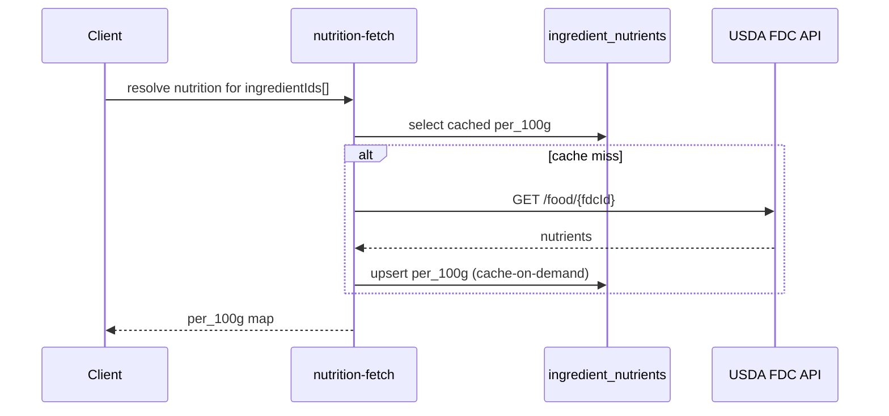

# Cooking Nutrition Architecture Proposal

Nutrition is a major future feature (Phase 8), built on a normalized ingredient system (Phase 7). USDA FoodData Central (FDC) is the authoritative source. This document covers ingredient normalization, gram conversion, per-recipe/serving nutrition, retention factors, confidence scoring, custom ingredients, and the optional Open Food Facts (OFF) secondary source.

## 1. Principles

- **USDA FDC is authoritative.** Store `fdc_id` on canonical ingredients.
- **Do not copy the USDA database into the frontend.** Fetch on demand and cache only used ingredients (`ingredient_nutrients`).
- **Normalize ingredients once, reuse everywhere.** Curated global `ingredients` + `ingredient_aliases`.
- **Everything derived is pure + tested.** Conversions, aggregation, retention, and confidence are pure functions in `src/core/nutrition.ts`.
- **Secrets stay server-side.** USDA/OFF fetching runs in the `nutrition-fetch` Edge Function.

## 2. Two-phase build

- **Phase 7 — ingredient normalization + matching** (no nutrition yet): canonical ingredients, aliases, fuzzy matching, confidence, pantry. Recipe lines resolve to `ingredientId` + `matchConfidence`.
- **Phase 8 — nutrition** on top of resolved ingredients: nutrient cache, conversions, retention, per-recipe/serving totals.

## 3. Ingredient normalization & matching (Phase 7)

### Data (see [`04-supabase-schema.md`](04-supabase-schema.md))

- `ingredients`: `canonical_name`, `category`, `default_unit`, `density_g_per_ml`, `grams_per_piece`, `fdc_id`.
- `ingredient_aliases`: `ingredient_id`, `alias`, `alias_normalized`.
- `pg_trgm` extension + GIN trigram indexes for fuzzy search.

### Matching pipeline (`src/core/ingredients.ts`)

```mermaid
flowchart TD
  Raw[raw line: "2 green bell peppers, diced"] --> Parse[parse: qty=2, unit=piece, name="green bell pepper"]
  Parse --> Norm[normalize: lowercase, strip punctuation/descriptors, singularize]
  Norm --> Exact{exact alias match?}
  Exact -->|yes| High[ingredientId, confidence ~0.99]
  Exact -->|no| Fuzzy[pg_trgm similarity on aliases + canonical names]
  Fuzzy --> Score{best score >= threshold?}
  Score -->|yes| Med[ingredientId, confidence = similarity]
  Score -->|no| None[unresolved, confidence 0, flagged for review]
```

Handled cases:

- "tortilla" → "flour tortilla" (alias).
- "bell pepper" / "green bell pepper" / "yellow bell pepper" — aliases pointing to a shared canonical or distinct canonicals (curatorial choice; recommend distinct canonicals for color-specific nutrition, with "bell pepper" as a generic fallback alias).
- Misspellings ("tomatoe", "brocoli") → trigram fuzzy match.
- Descriptor stripping ("diced", "fresh", "organic", "to taste") before matching.

### Confidence score (0..1)

- Exact alias/canonical match: ~0.95-1.0.
- Trigram fuzzy: equal to the similarity score (e.g. 0.6-0.9), surfaced in UI; below threshold (e.g. 0.45) = unresolved.
- Confidence is stored per recipe ingredient line (`matchConfidence`) and aggregated into recipe-level nutrition confidence.

### Quantity parsing

Parse `quantity` + `unit` from the raw line. Support fractions ("1/2"), ranges ("2-3", take midpoint), and unit words (cup, tbsp, tsp, g, oz, ml, clove, piece, pinch). Unrecognized units → unit `null`, lower confidence.

## 4. Gram conversion (Phase 8)

All nutrition math operates in grams. `src/core/nutrition.ts` converts a parsed quantity to grams:

```
toGrams(quantity, unit, ingredient):
  mass units (g, kg, oz, lb)            -> direct conversion
  volume units (ml, l, cup, tbsp, tsp)  -> ml * ingredient.density_g_per_ml
  count units (piece, clove, slice)     -> count * ingredient.grams_per_piece
  unknown                               -> null (contributes 0, lowers confidence)
```

Maintain a static unit table (ml per cup/tbsp/tsp, grams per oz/lb) in code. Density and per-piece weights come from the `ingredients` record (curated; can be enriched from USDA portion data).

## 5. Nutrition data (Phase 8)

### Source priority

1. **USDA FDC** (authoritative). Store `fdc_id` on `ingredients`; cache per-100g nutrients in `ingredient_nutrients` (`source: 'usda'`).
2. **Open Food Facts** (optional secondary) for branded/barcode items not in FDC (`source: 'off'`).
3. **Custom ingredients** (`custom_ingredients`, per-user) with user-entered per-100g values (`source: 'custom'`).

### Fetch + cache (Edge Function `nutrition-fetch`)



Only ingredients actually used by a user's recipes are ever fetched/cached. No bulk import.

### Per-100g shape (`per_100g` jsonb)

```ts
type Per100g = {
  kcal: number;
  protein_g: number;
  fat_g: number;
  carb_g: number;
  fiber_g?: number;
  sugar_g?: number;
  sodium_mg?: number;
  // extensible; macros are the v1 priority
};
```

## 6. Retention factors (Phase 8)

Cooking changes nutrient content (e.g. vitamin loss when boiling). USDA publishes retention factor tables. Stored in `retention_factors` (`cooking_method`, `nutrient_key`, `factor` 0..1).

- Macros (kcal/protein/fat/carb) typically use factor ~1.0; micronutrients (vitamins) use method-specific factors.
- A recipe (or step) carries a `cooking_method`; applied per nutrient: `adjusted = raw * factor`.
- v1 can ship with macro-only nutrition and `factor = 1.0` defaults, adding micronutrient retention later.

## 7. Per-recipe and per-serving computation (`src/core/nutrition.ts`)

```
computeRecipeNutrition(recipe, ingredientsIndex, nutrientsIndex, retentionIndex):
  total = zero()
  for line in recipe.ingredients:
    ing = resolve(line.ingredientId)            // skip/flag if unresolved
    grams = toGrams(line.quantity, line.unit, ing)
    if grams is null: mark lowConfidence; continue
    per100 = nutrientsIndex[ing.id]             // skip/flag if missing
    contribution = scale(per100, grams / 100)
    contribution = applyRetention(contribution, recipe.cookingMethod, retentionIndex)
    total += contribution
  perServing = total / max(1, recipe.servings)
  confidence = aggregateConfidence(lines)        // see below
  return { total, perServing, confidence, unresolvedLines }
```

### Aggregate confidence

A recipe's nutrition confidence reflects how much of it is backed by good data:

```
confidence = weightedMean(
  per-line matchConfidence,
  weighted by gram contribution,
  penalized for unresolved lines and missing nutrient data
)
```

Surface as a label (High / Medium / Low) + a tooltip listing unresolved/low-confidence ingredients the user can fix.

## 8. Custom ingredients (Phase 8)

- `custom_ingredients` (per-user) lets users define ingredients FDC lacks, with optional manual per-100g values and density/per-piece.
- Recipe lines can resolve to a custom ingredient (via `custom_ingredient_id` rather than `ingredient_id`).
- Custom-ingredient nutrition counts as `source: 'custom'`, contributing to the recipe total with full confidence if the user supplied complete data.

## 9. UI surfaces

- **Recipe detail**: nutrition summary (per-serving macros) + confidence badge + "improve accuracy" prompt for unresolved lines.
- **Recipe form**: inline ingredient resolution status (resolved / fuzzy / unresolved) as the user types or after import.
- **Pantry** (Phase 7): "can make now / partial / missing" computed from `user_pantry` vs recipe ingredient lines.

## 10. Licensing & rate limits

- USDA FDC API requires an API key (free); respect rate limits — cache aggressively, batch requests.
- Open Food Facts is open data (attribution required); use only as a secondary source.
- Store only the per-ingredient records actually used; never redistribute the full datasets.

## 11. Tests

- Quantity parsing (fractions, ranges, unit words, unknown units).
- `toGrams` for mass/volume/count + unknown.
- Matching: exact alias, fuzzy threshold, misspelling, descriptor stripping, bell-pepper variants.
- `computeRecipeNutrition`: scaling, per-serving division, retention application, unresolved-line handling.
- Confidence aggregation (weighting + penalties).
- `nutrition-fetch` contract (mocked USDA): cache hit vs miss, OFF fallback, custom-ingredient path.
