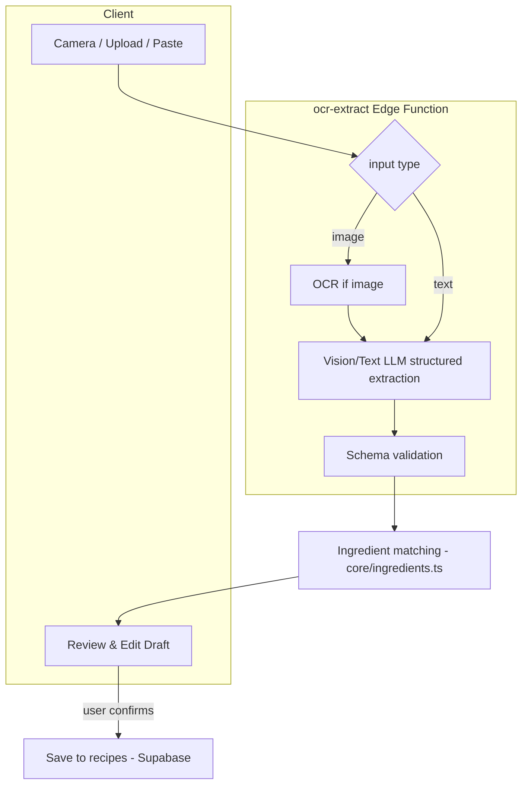

# Cooking Assisted Import (OCR) Architecture Proposal

Method 1 of recipe creation: assisted import via camera OCR, image upload, or pasted text. Implemented in Phase 9. **Import only ever produces a draft; the user must review and edit before saving.**

## 1. Goals

Extract structured recipe data from messy input (a photo of a cookbook page, a screenshot, or pasted text):

- title
- ingredients (with quantities/units)
- steps
- cook time
- servings
- equipment
- notes

Then resolve ingredients (Phase 7 matching), attach confidence scores, and hand a draft to the user for review.

## 2. Architecture overview



## 3. Recommended extraction approach

Use a **multimodal LLM with structured output** as the primary extractor:

- **Image input**: send the image to a vision-capable model (e.g. OpenAI GPT-4o-class) and request a JSON object conforming to a strict schema (structured outputs / JSON schema mode). The model performs OCR + structure in one pass, which handles cookbook layouts, columns, and handwriting better than raw OCR + regex.
- **Text input** (paste): skip OCR; send the text to the same model with the same schema.
- **Optional dedicated OCR fallback**: for very large/low-quality images or cost control, run OCR first (cloud OCR or Tesseract) and feed text to the model. Not required for v1.

### Why LLM structured extraction over rule-based parsing

- Recipes have wildly inconsistent formats; rule-based parsing is brittle.
- Structured outputs guarantee a parseable shape, reducing post-processing.
- One pass handles both image and text inputs.

## 4. The `ocr-extract` Edge Function

Runs server-side (Supabase Edge Function) so the OpenAI key is never exposed.

Responsibilities:

1. Authenticate the caller via Supabase JWT.
2. Accept `{ kind: 'image' | 'text', payload }` (image as base64/multipart or a Sanity/temporary URL; text as string).
3. Call the LLM with a strict JSON schema (below) and a system prompt instructing faithful extraction (no inventing data; leave fields null when absent).
4. Validate the response against the schema (server-side); reject/repair malformed output (one retry).
5. Return the raw structured draft + per-field model confidence (if available) to the client.

> Ingredient matching (Phase 7) can run either in the Edge Function or on the client after extraction. Recommend running it client-side using the already-loaded `ingredients` cache to keep the function stateless and fast.

## 5. Extraction JSON schema (LLM structured output)

```ts
type ExtractedRecipe = {
  title: string | null;
  servings: number | null;
  cookTimeMinutes: number | null;
  ingredients: Array<{
    rawText: string;          // verbatim line
    quantity: number | null;
    unit: string | null;
    name: string | null;      // best-guess ingredient name
  }>;
  steps: Array<{ order: number; text: string }>;
  equipment: string[];
  notes: string | null;
};
```

After extraction, the client maps `ExtractedRecipe` → a draft `Recipe` and runs ingredient matching to attach `ingredientId` + `matchConfidence` per line (see [`07-nutrition-architecture.md`](07-nutrition-architecture.md) section 3).

## 6. Confidence model

Two layers of confidence are surfaced in the review UI:

1. **Extraction confidence** (per field): whether the model was sure it found the field. Low-confidence or null fields are highlighted for user attention.
2. **Ingredient match confidence** (per line): from Phase 7 matching. Fuzzy/unresolved lines are flagged with a picker so the user can correct the canonical ingredient.

A draft cannot be saved while required fields (title, at least one ingredient, at least one step) are empty.

## 7. Review & edit flow (mandatory)

The Import Wizard (`components/cooking/ImportWizard.tsx`) walks the user through:

1. **Capture**: camera / file upload / paste text.
2. **Extracting…**: progress while the Edge Function runs.
3. **Review draft**: editable form pre-filled with extracted data; low-confidence fields highlighted; unresolved ingredients show a match picker; the original image/text is shown side-by-side for verification.
4. **Save**: writes a `recipes` row with `source: 'import'`. Images (if any) upload via the `sanity-upload` function (Phase 3).

The user can edit every field. Nothing is persisted until they explicitly save.

## 8. Validation layer

- Server-side: JSON-schema validation of the LLM output (reject + single retry on failure).
- Client-side: a `recipeImport.ts` pure module maps + validates `ExtractedRecipe` → draft `Recipe`, normalizes units, parses fractions/ranges, and computes initial match confidence. Fully unit-tested with fixture inputs (no live LLM).

## 9. Cost, privacy, and limits

- LLM vision calls cost money and add latency; gate behind explicit user action, show progress, and cache nothing sensitive.
- Images may contain copyrighted cookbook content; the extracted recipe is for the user's private library only (consistent with personal use). Do not publish imported recipes to the curated catalog.
- Rate-limit per user in the Edge Function to control cost/abuse.
- Provide a graceful failure path: if extraction fails, fall back to manual entry pre-filled with any OCR text.

## 10. Tests (Phase 9)

- `recipeImport.ts`: map `ExtractedRecipe` fixtures → draft `Recipe`; unit/fraction/range parsing; confidence flagging; required-field gating.
- Edge Function contract (mocked LLM): valid extraction, malformed-output retry, auth rejection, text vs image routing.
- Ingredient matching integration on extracted lines (reuses Phase 7 tests).

## 11. Dependencies

- Phase 1 (recipes model/CRUD) — draft target.
- Phase 7 (ingredient matching) — for resolving extracted ingredient lines with confidence.
- Phase 3 (image handling) — for attaching the source/hero image.
- New: OpenAI API key in the `ocr-extract` Edge Function environment.
