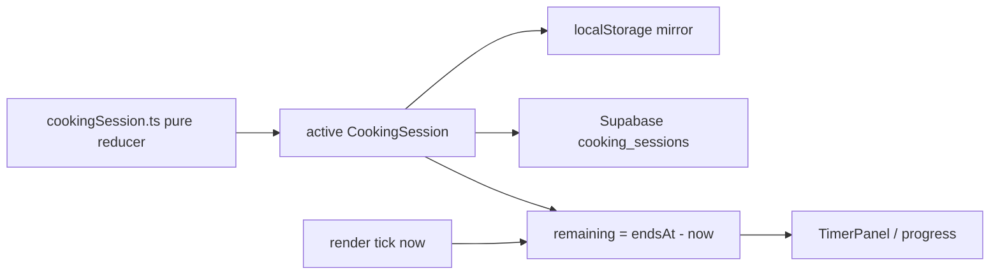
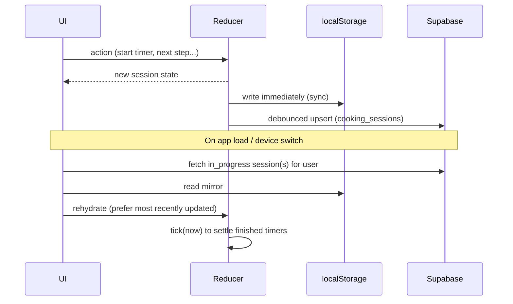

# Guided Cooking Mode Architecture Proposal

The "Start Cooking" execution mode (Phase 6): step-by-step workflow, progress bar, multiple persistent timers, and a step model that distinguishes blocking vs parallel work. The central requirement is **reliable timer persistence across refresh and device changes**.

## 1. Requirements (from the vision)

- Step-by-step workflow with Next / Back and a progress bar.
- Multiple concurrent timers; each can pause / resume / restart.
- Timers persist across in-app navigation, page refresh, and device changes.
- Cooking session state survives refresh.
- Some steps block progress; others can run in parallel (e.g. boil pasta while preparing sauce).

## 2. Core principle: absolute time, persisted state

Two design decisions make everything else work:

1. **Timers are absolute, not counters.** A running timer stores `endsAtIso` (wall-clock end time). Remaining time = `endsAtIso - now`, computed on every render. This is inherently correct across refresh, sleep, and device changes — there is no in-memory countdown to lose.
2. **Session state is persisted, not ephemeral.** The active `CookingSession` (step index + timers) is written to Supabase (cross-device source of truth) and mirrored to localStorage (instant, offline). On load, the app rehydrates the active session.



## 3. Step workflow model

Each recipe step carries a `kind` plus flags. This is stored in `recipes.steps` (jsonb) and edited in the recipe form.

```ts
export type RecipeStepKind = "blocking" | "parallel" | "wait" | "timer";

export type RecipeStep = {
  id: string;
  order: number;
  text: string;
  kind: RecipeStepKind;
  blocksProgress: boolean;     // if true, user shouldn't advance until done
  timerSeconds?: number;       // present for timer/wait steps
  timerLabel?: string;
  canRunInBackground?: boolean; // wait/parallel steps whose timer keeps running while user moves on
};
```

Semantics:

- **blocking**: active hands-on work; advancing is discouraged until complete (e.g. "knead dough 5 min").
- **parallel**: hands-on work that can overlap another step's running timer (e.g. "prepare sauce" while pasta boils).
- **wait**: passive waiting with a timer; the user can start the timer and advance to parallel steps (`canRunInBackground: true`).
- **timer**: a step that is primarily a timer (e.g. "bake 25 min").

> Design choice: v1 uses ordered steps + per-step timer + `canRunInBackground`, NOT a full dependency DAG. A DAG (steps depending on arbitrary other steps) is over-engineering for typical recipes and complicates the UI. If a future recipe needs true branching, revisit with a `dependsOn` field — the model leaves room for it.

### Example: boil pasta + make sauce

1. Step A `wait`/`timer` "Boil pasta 10 min", `canRunInBackground: true`. User starts its timer (sets `endsAtIso = now + 10m`).
2. The timer runs in the background; the UI lets the user advance to Step B.
3. Step B `parallel` "Prepare sauce". User works on it while Pasta timer counts down.
4. When Pasta timer hits zero, an alert fires (in-app; Web Notification in Phase 11). The Pasta timer remains in the timers panel as "done".

## 4. Timer model

```ts
export type CookingTimerStatus = "idle" | "running" | "paused" | "done";

export type CookingTimer = {
  id: string;
  stepId?: string;             // step this timer belongs to (if any)
  label: string;
  durationSeconds: number;     // original duration (for restart)
  status: CookingTimerStatus;
  endsAtIso?: string;          // set when running; remaining = endsAt - now
  remainingSecondsAtPause?: number; // set when paused
  startedAtIso?: string;
};
```

Reducer operations (pure, in `src/core/cookingSession.ts`):

- `startTimer(timer)` → status `running`, `endsAtIso = now + remaining`.
- `pauseTimer(timer)` → status `paused`, `remainingSecondsAtPause = endsAtIso - now`, clear `endsAtIso`.
- `resumeTimer(timer)` → status `running`, `endsAtIso = now + remainingSecondsAtPause`.
- `restartTimer(timer)` → status `running`, `endsAtIso = now + durationSeconds`.
- `tick(now)` → for each running timer, if `now >= endsAtIso`, mark `done` (idempotent).

`remainingSeconds(timer, now)` is a pure selector: running → `max(0, endsAt - now)`; paused → `remainingSecondsAtPause`; done → 0; idle → `durationSeconds`.

## 5. Session state machine

```ts
export type CookingSessionStatus = "planned" | "in_progress" | "completed" | "abandoned";

export type CookingSession = {
  id: string;
  recipeId: string | null;
  recipeTitle: string;          // snapshot
  status: CookingSessionStatus;
  cookDate: string;             // local YYYY-MM-DD
  startedAtIso?: string;
  finishedAtIso?: string;
  currentStepIndex: number;
  timers: CookingTimer[];
  // ... servingsMade, notes, durationMinutes
};
```

Transitions:

- Start Cooking → create `in_progress` session (or transition a `planned` one), `currentStepIndex = 0`.
- Next/Back → adjust `currentStepIndex` (clamped).
- Start/pause/resume/restart timer → timer reducers above.
- Complete → completion prompt → `completed` with start/finish times (defaults from estimated duration) → triggers XP/mastery (derived) and calendar history.
- Abandon → `abandoned` (no XP).

## 6. Persistence & rehydration



- **Refresh**: localStorage mirror rehydrates instantly; `tick(now)` settles timers that finished while away.
- **Device change**: Supabase holds the authoritative `in_progress` session; on the new device, fetch + rehydrate. Because timers are absolute timestamps, remaining time is correct without any client-side clock carryover.
- **Conflict**: at most one `in_progress` session per user (enforced in app; optional partial unique index). On conflict, prefer the most recently `updated_at` row and reconcile.

## 7. Notifications for timer completion

- **Phase 6 (in-app)**: when a timer reaches `done`, raise an in-app alert (toast + a Daily Focus item like `cooking_timer_done`) and optionally an audible cue while the app is open.
- **Phase 11 (background)**: a service worker + Web Notifications fire even when the tab is backgrounded. Schedule a notification at `endsAtIso`; reconcile on focus. Falls back to in-app alerts where unsupported.

## 8. UI components (`components/cooking/`)

- `GuidedCookingMode.tsx`: orchestrates step navigation + progress bar; reads/writes session via reducer + persistence hook.
- `TimerPanel.tsx`: list of timers with controls (start/pause/resume/restart) and live remaining time (re-renders on a 1s interval using the pure selector).
- `StepView.tsx`: current step text + kind affordances (e.g. "start timer", "you can prep the next step while this runs").
- `CookingCompletionDialog.tsx`: the "Did you cook this? start/finish times" prompt.
- `useCookingSession.ts` (hook): wires the pure reducer to localStorage + Supabase + a `setInterval` tick.

## 9. Edge cases

- Clock skew between devices: rely on server `updated_at` for conflict resolution; remaining time uses local `now` (acceptable for cooking-scale durations).
- Long sleep/standby: `tick(now)` on resume marks overdue timers `done` immediately.
- Multiple tabs: localStorage `storage` events can sync within a browser; Supabase reconciles across browsers/devices.
- Abandoned sessions: a stale `in_progress` session older than a threshold can be auto-prompted ("Still cooking?") and abandoned.

## 10. Tests (Phase 6)

- Reducer: start/pause/resume/restart/tick for single and multiple timers; idempotent `done`.
- `remainingSeconds` selector across statuses.
- Step navigation clamping; parallel/wait steps don't block advancing.
- Rehydration: localStorage + Supabase merge prefers most-recent; `tick` settles finished timers after a simulated gap.
- Completion transition produces a `completed` session with correct cookDate/times.
