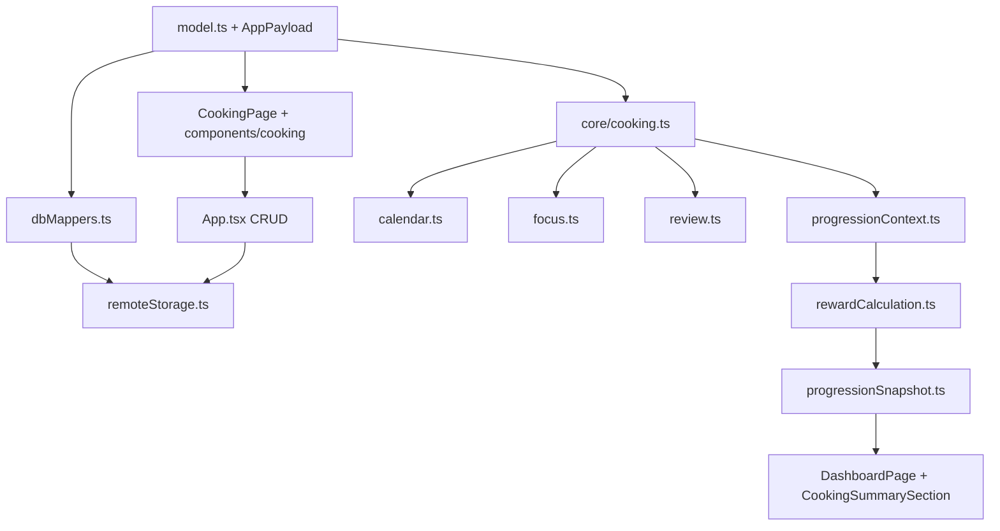

# Cooking Integration Points

Exact files and functions to touch when wiring Cooking into each existing system. Use this as the implementation checklist; it complements the per-phase roadmap.

## 1. Navigation & app shell

- [`src/pages/types.ts`](../../src/pages/types.ts): add `"cooking"` to the `Page` union.
- [`src/components/layout/AppShell.tsx`](../../src/components/layout/AppShell.tsx): add `{ id: "cooking", label: "Cooking" }` to `navItems`.
- [`src/App.tsx`](../../src/App.tsx): add `{page === "cooking" && <CookingPage ... />}` render block; pass cooking data + CRUD callbacks.

## 2. Data model & persistence

- [`src/core/model.ts`](../../src/core/model.ts): add the types from [`10-data-models.md`](10-data-models.md); extend `AppPayload` with `recipes`, `cookingSessions`, `pantry`, `customIngredients`, `cookingPreferences`.
- `defaultPayload()` (in `state.ts`/wherever the default lives): initialize new arrays to `[]`.
- [`src/core/dbMappers.ts`](../../src/core/dbMappers.ts): add `*Row` types + `recipeToRow`/`recipeFromRow`, `cookingSessionToRow`/`FromRow`, `pantryItemToRow`/`FromRow`, `customIngredientToRow`/`FromRow`, plus jsonb parsers (`parseRecipeSteps`, `parseRecipeIngredients`, `parseCookingTimers`, `parseSanityImageRef`). Extend `validatePayloadForUpload`.
- [`src/core/remoteStorage.ts`](../../src/core/remoteStorage.ts): add new per-user tables to the `AppTable` union, to `fetchRemotePayload` (parallel selects) and `replaceRemotePayload` (upsert + orphan delete). Add singleton handling for `cooking_preferences` (mirrors `calendar_preferences`).
- Global read-only data (`ingredients`, `ingredient_aliases`, `ingredient_nutrients`, `retention_factors`, `recipe_catalog`): fetched via a separate cached loader (e.g. `src/core/cookingReferenceData.ts`), NOT part of the payload replace cycle.
- Load-time sanitation: add `sanitizeCookingReferences` (mirrors `sanitizeSkillReferences`) to drop `cooking_sessions.recipeId` pointers to deleted recipes (kept as history via `recipeTitle`).

## 3. Progression / XP

- [`src/core/progressionModel.ts`](../../src/core/progressionModel.ts): add `"recipe"` to `ProgressionTrackKind`; add `recipe:${string}` to `ProgressionTrackId`; add `"cooking"` to `AchievementCategory`; add new `AchievementCondition` kinds.
- [`src/core/progressionContext.ts`](../../src/core/progressionContext.ts): in `buildProgressionContext`, normalize cooking data — completed sessions per recipe, per-recipe completion counts/ordering (for first vs repeat), distinct recipes cooked, home-cooked week streak. Route `recipe:{id}` tracks to the `creative` axis (extend the axis routing map; this is the same hook noted at the existing `axisBySkillId` TODO).
- [`src/core/milestoneTables.ts`](../../src/core/milestoneTables.ts): add `COOKING_XP` constants (see [`03-progression-design.md`](03-progression-design.md)).
- [`src/core/rewardCalculation.ts`](../../src/core/rewardCalculation.ts): add `RewardSource` values `cooking_first_cook | cooking_repeat | cooking_home_meal | cooking_mastery_tier_up`; emit grants in `listXpGrants` from cooking context (recipe track + creative; flat `body` grant; tier-up). Respect the daily bonus cap.
- [`src/core/progressionEngine.ts`](../../src/core/progressionEngine.ts): ensure `computeTrackTotals` handles `recipe:{id}` parsing (add `parseRecipeId`) and routes to `creative` axis; `bandSizeFor("recipe")` (reuse skill band or add multiplier in `LEVEL_BAND_MULTIPLIERS`).
- [`src/core/achievementEngine.ts`](../../src/core/achievementEngine.ts): evaluate the new cooking conditions from context metrics.
- [`src/core/achievementCatalog.ts`](../../src/core/achievementCatalog.ts): add cooking achievements.
- [`src/core/questCatalog.ts`](../../src/core/questCatalog.ts): add cooking quests (axis `creative`).
- [`src/core/cooking.ts`](../../src/core/cooking.ts) (new): mastery tier derivation, recipe mastery views, completion ordering helpers.

## 4. Calendar

- [`src/core/calendarColors.ts`](../../src/core/calendarColors.ts): add `"cooking"` to `CalendarCategoryKey`; add default category color + subcategory tokens/labels (`cooking:planned`, `cooking:completed`).
- [`src/core/calendar.ts`](../../src/core/calendar.ts): add `collectCookingItems` and call it from `buildCalendarItemsForRange`; add a `kind: "cooking"` `CalendarItemSourceMeta` variant; add `includeCookingPlanned`/`includeCookingHistory` options.
- [`src/core/calendarView.ts`](../../src/core/calendarView.ts): add cooking to the category/subcategory filter constants.
- `CalendarCategorySidebar` (component): add the cooking category toggle.
- See [`06-calendar-integration.md`](06-calendar-integration.md) for full detail.

## 5. Dashboard

- New `src/components/dashboard/CookingSummarySection.tsx`: recent cooks, active session/timers, mastery highlights, scheduled cooks. Returns `null` when empty (mirrors `FitnessSummarySection`).
- [`src/pages/DashboardPage.tsx`](../../src/pages/DashboardPage.tsx): build cooking summary via a `useMemo`, mount in the right rail (desktop) / stack (mobile), and pass `onOpenCooking={() => setPage("cooking")}`.
- `DashboardQuickActions.tsx`: add a Cooking shortcut button.

## 6. Notifications / Daily Focus

- [`src/core/focus.ts`](../../src/core/focus.ts): add `"cooking"` to `FocusCategory`; add `FocusReasonCode`s (`cooking_timer_done`, `cooking_planned_today`, `cooking_active_session`); add `"open_cooking"` to `FocusActionType`; add `collectCookingFocusItems(...)` and call it from `buildDailyFocusSummary`.
- `DailyFocusSection` component: handle the `open_cooking` action.
- Phase 11: add service worker + Web Notifications infra (new files under `public/` + a notifications module). See [`02-roadmap.md`](02-roadmap.md) Phase 11.

## 7. Analytics / Weekly Review / Briefing

- [`src/core/review.ts`](../../src/core/review.ts): add `CookingWeekSection` type + `buildCookingWeekSection`; wire into `buildWeeklyReview` (`WeeklyReview.cooking`), and contribute to `wins`/`risks`/`headline` when thresholds are met (mirror `buildFitnessWeekSection`).
- `WeeklyReviewSection` + `ReviewPage`: render the cooking section.
- [`src/core/briefing.ts`](../../src/core/briefing.ts): reference cooking in on-track/risk templates (optional).

## 8. Pages & components (new)

- `src/pages/CookingPage.tsx`: gallery + detail + create/edit + guided-mode entry (switch internal view state, like other pages keep create form + cards).
- `src/components/cooking/`: `RecipeCard`, `RecipeGallery`, `RecipeDetail`, `RecipeForm` (+ `recipeFormState.ts`), `GuidedCookingMode`, `StepView`, `TimerPanel`, `CookingCompletionDialog`, `ImportWizard` (Phase 9), `PantryPanel` (Phase 7), `NutritionSummary` (Phase 8), `MasteryBadge`.
- `src/lib/sanityClient.ts` (Phase 3).
- `supabase/functions/{sanity-upload,nutrition-fetch,ocr-extract}` (Phases 3/8/9).

## 9. Styling

- [`src/ui/appStyles.ts`](../../src/ui/appStyles.ts): add cooking-specific style objects (gallery grid, recipe card, timer panel) consistent with existing inline-style conventions and `--aether-*` CSS variables.

## 10. Tests (co-located, Vitest)

- `src/core/cooking.test.ts` — mastery tiers, filters, availability.
- `src/core/cookingSession.test.ts` — reducers + timer math (Phase 6).
- `src/core/ingredients.test.ts` — normalization/matching/confidence (Phase 7).
- `src/core/nutrition.test.ts` — conversions/aggregation/retention/confidence (Phase 8).
- `src/core/recipeImport.test.ts` — extraction mapping (Phase 9).
- `src/core/rewardCalculation.test.ts` — extend with cooking grants.
- `src/core/dbMappers` round-trip tests for new tables.
- Form-state tests co-located with components (e.g. `recipeFormState.test.ts`).

## 11. Cross-cutting wiring summary

